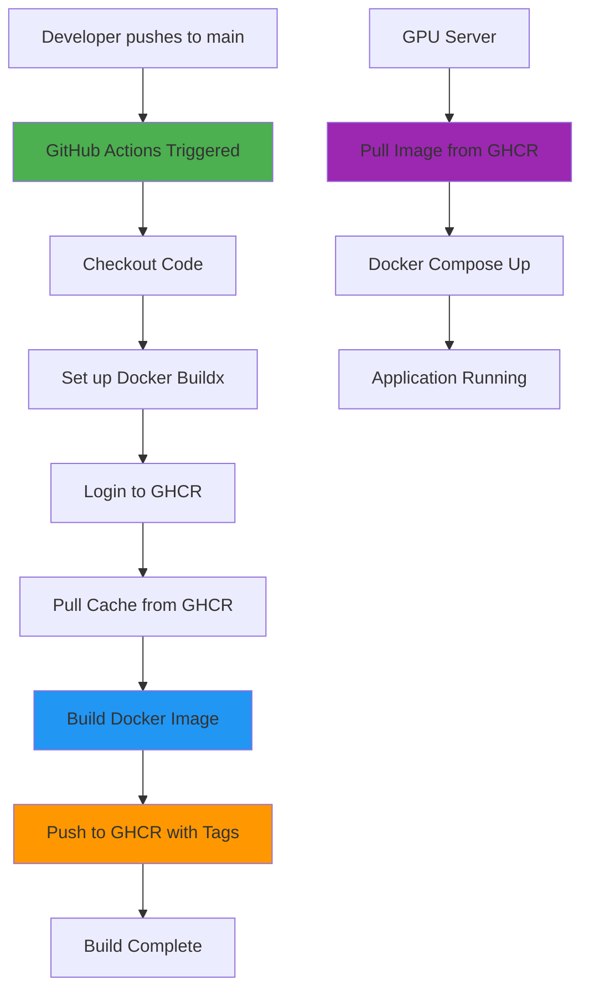
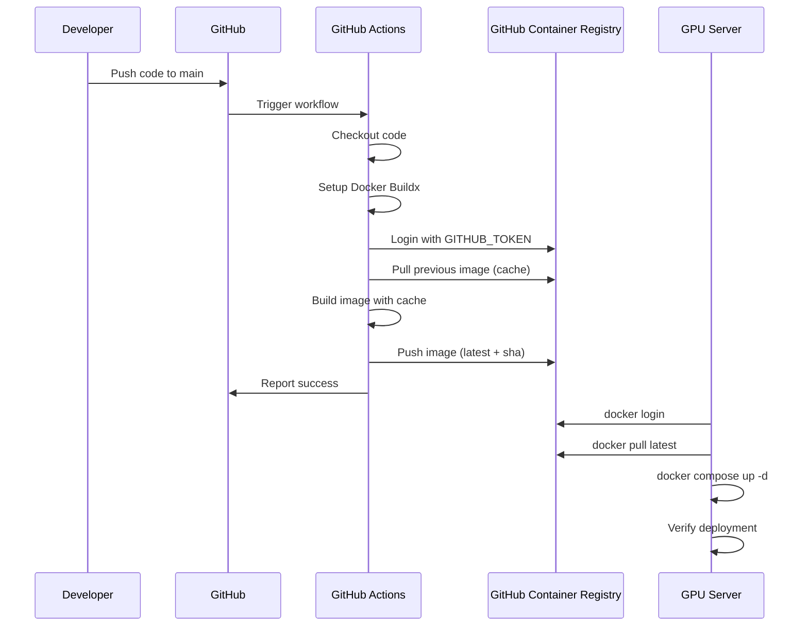
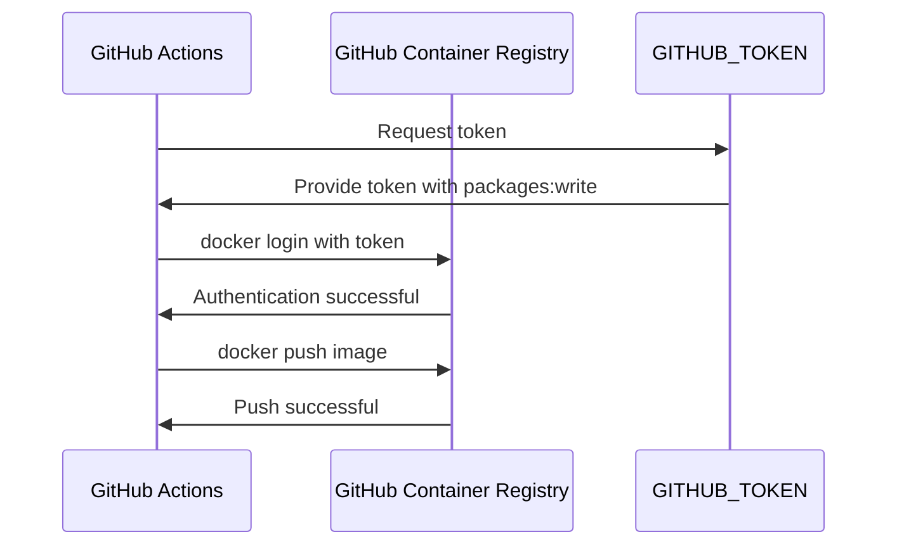

# Design Document

## Overview

This design document outlines the implementation of a GitHub Actions CI/CD pipeline to automate Docker image builds for the English Listening Trainer application. The pipeline will build GPU-ready Docker images in GitHub's infrastructure and publish them to GitHub Container Registry (GHCR), eliminating the need for slow manual builds on the GPU server.

### Problem Statement

The current deployment process requires building Docker images directly on the GPU server (Ubuntu 22.04 with Tesla P40). This process is extremely slow because:

1. **Large base image**: The NVIDIA CUDA base image (`nvidia/cuda:12.1.1-cudnn8-runtime-ubuntu22.04`) is over 2GB
2. **Network constraints**: The server must pull images through a proxy (`http://81.71.93.183:10811`)
3. **Frequent timeouts**: Network instability causes build failures
4. **Resource consumption**: Building on the server consumes GPU resources needed for the application

### Solution Overview

Implement a GitHub Actions workflow that:

1. Builds Docker images on GitHub's infrastructure (fast, reliable network)
2. Leverages BuildKit caching to reuse layers across builds
3. Publishes images to GHCR with semantic tagging
4. Enables the server to simply pull pre-built images and deploy

This reduces deployment time from 30-60 minutes (with frequent failures) to 2-5 minutes.

---

## Architecture

### High-Level Architecture



### Component Interaction



---

## Components and Interfaces

### 1. GitHub Actions Workflow

**File**: `.github/workflows/build-and-push.yml`

**Purpose**: Orchestrate the Docker image build and push process

**Triggers**:
- Push to `main` branch
- Manual workflow dispatch (for on-demand builds)

**Key Steps**:
1. Checkout repository code
2. Set up Docker Buildx (for advanced caching)
3. Login to GHCR
4. Extract metadata (tags, labels)
5. Build and push Docker image

**Inputs** (for manual dispatch):
- `branch`: Branch to build from (default: main)
- `push`: Whether to push to registry (default: true)

**Outputs**:
- Image tags pushed to GHCR
- Build duration and size metrics
- Build logs for debugging

### 2. Docker Build Configuration

**Base Image**: `nvidia/cuda:12.1.1-cudnn8-runtime-ubuntu22.04`

**Build Stages**:
- `base`: System dependencies, Node.js, Python
- `deps`: Node dependencies, Prisma generation, Next.js build
- `runtime`: Final production image with all artifacts

**Build Arguments**:
- `BUILDKIT_INLINE_CACHE=1`: Enable inline cache metadata
- Platform: `linux/amd64` (match GPU server architecture)

**Cache Strategy**:
- Use registry cache (previous `latest` image)
- Cache mount for apt packages
- Cache mount for npm packages
- Cache mount for pip packages

### 3. GitHub Container Registry Integration

**Registry**: `ghcr.io`

**Image Name**: `ghcr.io/arthurlee116/english-listening-trainer`

**Tagging Strategy**:
- `latest`: Always points to the most recent build from main
- `<git-sha>`: Specific commit SHA for rollback capability
- `<branch>-<sha>`: For non-main branches (future enhancement)

**Authentication**:
- Use built-in `GITHUB_TOKEN` with `packages: write` permission
- No additional secrets required for public repositories
- For private repos, users need to create a Personal Access Token (PAT)

**Visibility**:
- Public by default (can be changed in repository settings)
- Accessible to anyone for pulling
- Push access restricted to repository collaborators

### 4. Server Deployment Integration

**Prerequisites**:
- Docker and Docker Compose installed
- GHCR authentication configured
- `.env.production` file present

**Deployment Process**:
1. Login to GHCR: `docker login ghcr.io -u <username> -p <token>`
2. Pull latest image: `docker pull ghcr.io/arthurlee116/english-listening-trainer:latest`
3. Update compose: Set `IMAGE_TAG` environment variable
4. Deploy: `docker compose -f docker-compose.gpu.yml up -d`

**docker-compose.gpu.yml Integration**:
```yaml
services:
  app:
    image: ${IMAGE_TAG:-ghcr.io/arthurlee116/english-listening-trainer:latest}
    # Remove build section when using pre-built images
```

---

## Data Models

### Workflow Configuration Schema

```yaml
name: String                    # Workflow name
on:                             # Trigger configuration
  push:
    branches: [String]          # Branches to trigger on
  workflow_dispatch:            # Manual trigger
    inputs:
      branch: String            # Branch to build
      push: Boolean             # Whether to push

jobs:
  build-and-push:
    runs-on: String             # Runner type (ubuntu-latest)
    permissions:
      contents: read            # Read repository
      packages: write           # Write to GHCR
    steps: [Step]               # Build steps
```

### Docker Image Metadata

```json
{
  "name": "ghcr.io/arthurlee116/english-listening-trainer",
  "tags": ["latest", "<git-sha>"],
  "labels": {
    "org.opencontainers.image.source": "https://github.com/arthurlee116/english-listening-trainer",
    "org.opencontainers.image.revision": "<git-sha>",
    "org.opencontainers.image.created": "<iso-timestamp>",
    "org.opencontainers.image.version": "<git-sha>"
  },
  "platform": "linux/amd64",
  "size": "<bytes>",
  "layers": [
    {
      "digest": "sha256:...",
      "size": "<bytes>",
      "cached": true
    }
  ]
}
```

### Build Cache Structure

```
Cache Layers:
├── Base Image (nvidia/cuda:12.1.1-cudnn8-runtime-ubuntu22.04)
│   └── Size: ~2GB, Changes: Rarely
├── System Dependencies (apt packages)
│   └── Size: ~500MB, Changes: Rarely
├── Node.js Installation
│   └── Size: ~100MB, Changes: Never
├── Python Dependencies (PyTorch + Kokoro)
│   └── Size: ~3GB, Changes: Rarely
├── Node Dependencies (npm ci)
│   └── Size: ~500MB, Changes: When package.json changes
├── Prisma Generation
│   └── Size: ~50MB, Changes: When schema changes
├── Next.js Build
│   └── Size: ~200MB, Changes: Every code change
└── Runtime Assembly
    └── Size: ~100MB, Changes: Every build
```


---

## Error Handling

### Build Failures

**Scenario 1: Base Image Pull Failure**
- **Cause**: Network issues, Docker Hub rate limits
- **Detection**: Docker build fails at base image pull
- **Handling**: 
  - Workflow retries automatically (GitHub Actions default)
  - Use cache from previous build if available
  - Fail workflow with clear error message
- **Recovery**: Manual workflow re-run

**Scenario 2: Dependency Installation Failure**
- **Cause**: Package registry unavailable, version conflicts
- **Detection**: npm ci or pip install fails
- **Handling**:
  - Log full error output
  - Fail workflow immediately (fail-fast)
  - Notify via GitHub Actions status
- **Recovery**: Fix dependency issue, push fix, auto-rebuild

**Scenario 3: Next.js Build Failure**
- **Cause**: TypeScript errors, build configuration issues
- **Detection**: npm run build fails
- **Handling**:
  - Capture build logs
  - Fail workflow with error details
  - Prevent pushing broken image
- **Recovery**: Fix code issues, push fix

**Scenario 4: GHCR Push Failure**
- **Cause**: Authentication issues, network problems, storage quota
- **Detection**: docker push fails
- **Handling**:
  - Retry push once with exponential backoff
  - Log authentication status
  - Check GHCR service status
- **Recovery**: 
  - Verify GITHUB_TOKEN permissions
  - Check repository package settings
  - Manual re-run if transient issue

### Deployment Failures

**Scenario 1: Image Pull Failure on Server**
- **Cause**: Authentication issues, network problems
- **Detection**: docker pull fails
- **Handling**:
  - Verify GHCR login status
  - Check network connectivity
  - Verify image exists in registry
- **Recovery**:
  - Re-authenticate: `docker login ghcr.io`
  - Check proxy settings
  - Verify image tag

**Scenario 2: Container Startup Failure**
- **Cause**: Missing environment variables, volume mount issues
- **Detection**: Container exits immediately or health check fails
- **Handling**:
  - Check container logs: `docker compose logs app`
  - Verify .env.production exists
  - Check volume permissions
- **Recovery**:
  - Fix environment configuration
  - Restart containers: `docker compose up -d`

**Scenario 3: GPU Not Available**
- **Cause**: NVIDIA runtime not configured, driver issues
- **Detection**: TTS initialization fails, CUDA errors in logs
- **Handling**:
  - Verify GPU access: `docker run --rm --gpus all nvidia/cuda:12.1.1-base-ubuntu22.04 nvidia-smi`
  - Check NVIDIA Container Toolkit installation
- **Recovery**:
  - Install/configure NVIDIA Container Toolkit
  - Restart Docker daemon
  - Redeploy containers

### Rollback Strategy

**Rollback to Previous Version**:
```bash
# List available tags
docker images ghcr.io/arthurlee116/english-listening-trainer

# Pull specific version
docker pull ghcr.io/arthurlee116/english-listening-trainer:<previous-sha>

# Update IMAGE_TAG and redeploy
export IMAGE_TAG=ghcr.io/arthurlee116/english-listening-trainer:<previous-sha>
docker compose -f docker-compose.gpu.yml up -d
```

**Emergency Rollback**:
```bash
# Stop current containers
docker compose -f docker-compose.gpu.yml down

# Pull last known good version
docker pull ghcr.io/arthurlee116/english-listening-trainer:latest

# Restart
docker compose -f docker-compose.gpu.yml up -d
```

---

## Testing Strategy

### Workflow Testing

**Local Testing with `act`**:
```bash
# Install act (GitHub Actions local runner)
brew install act  # macOS
# or
curl https://raw.githubusercontent.com/nektos/act/master/install.sh | sudo bash

# Test workflow locally
act push -W .github/workflows/build-and-push.yml

# Test with specific event
act workflow_dispatch -W .github/workflows/build-and-push.yml
```

**Manual Workflow Dispatch Testing**:
1. Navigate to Actions tab in GitHub
2. Select "Build and Push Docker Image" workflow
3. Click "Run workflow"
4. Select branch and options
5. Monitor build progress
6. Verify image appears in Packages

### Build Validation

**Pre-Push Validation**:
- Workflow validates Dockerfile syntax
- Checks for required files (package.json, prisma/schema.prisma)
- Verifies build context size

**Post-Build Validation**:
- Image size check (should be < 8GB)
- Layer count check (should be < 127)
- Metadata validation (tags, labels present)
- Security scan (optional, using Trivy)

### Integration Testing

**Server-Side Testing**:
```bash
# 1. Pull test image
docker pull ghcr.io/arthurlee116/english-listening-trainer:latest

# 2. Run health check
docker run --rm \
  -e DATABASE_URL=file:/tmp/test.db \
  -e JWT_SECRET=test-secret \
  -e CEREBRAS_API_KEY=test-key \
  ghcr.io/arthurlee116/english-listening-trainer:latest \
  node -e "console.log('Image OK')"

# 3. Test GPU access (on GPU server)
docker run --rm --gpus all \
  ghcr.io/arthurlee116/english-listening-trainer:latest \
  python3 -c "import torch; print(f'CUDA available: {torch.cuda.is_available()}')"

# 4. Full deployment test
docker compose -f docker-compose.gpu.yml up -d
sleep 30
curl -f http://localhost:3000/api/health || echo "Health check failed"
docker compose -f docker-compose.gpu.yml down
```

### Performance Testing

**Build Time Benchmarks**:
- First build (no cache): 20-30 minutes
- Incremental build (code change only): 5-10 minutes
- Incremental build (dependency change): 10-15 minutes
- Cache hit rate target: > 80%

**Image Size Targets**:
- Base stage: ~2.5GB
- Deps stage: ~6GB
- Runtime stage: ~5.5GB (target)
- Compressed size: ~2GB (pushed to registry)

**Deployment Time Targets**:
- Image pull (first time): 3-5 minutes
- Image pull (cached layers): 30-60 seconds
- Container startup: 30-45 seconds
- Total deployment: < 5 minutes

---

## Security Considerations

### Authentication and Authorization

**GITHUB_TOKEN Permissions**:
```yaml
permissions:
  contents: read      # Read repository code
  packages: write     # Push to GHCR
  id-token: write     # Optional: for OIDC
```

**GHCR Access Control**:
- Public images: Anyone can pull
- Private images: Require authentication
- Push access: Limited to repository collaborators
- Token scope: `write:packages`, `read:packages`

**Server Authentication**:
```bash
# Create Personal Access Token (PAT) with packages:read scope
# Store securely (not in git)
echo $GHCR_TOKEN | docker login ghcr.io -u arthurlee116 --password-stdin
```

### Image Security

**Base Image Security**:
- Use official NVIDIA CUDA images
- Pin specific versions (not `latest`)
- Regular security updates via rebuilds

**Dependency Security**:
- npm audit during build (optional)
- Scan for known vulnerabilities
- Keep dependencies updated

**Runtime Security**:
- Run as non-root user (UID 1001)
- Minimal attack surface (production dependencies only)
- No unnecessary tools in final image

**Secrets Management**:
- Never bake secrets into images
- Use environment variables at runtime
- Mount secrets as files (Docker secrets)
- Rotate credentials regularly

### Network Security

**Build-Time**:
- HTTPS for all package downloads
- Verify package signatures (npm, pip)
- Use trusted registries only

**Runtime**:
- Proxy configuration for outbound requests
- Firewall rules for exposed ports
- TLS for external APIs (Cerebras)

### Compliance

**Image Scanning**:
```yaml
# Optional: Add to workflow
- name: Run Trivy vulnerability scanner
  uses: aquasecurity/trivy-action@master
  with:
    image-ref: ghcr.io/arthurlee116/english-listening-trainer:latest
    format: 'sarif'
    output: 'trivy-results.sarif'
```

**Audit Trail**:
- All builds logged in GitHub Actions
- Image provenance via labels
- Git commit SHA in image metadata
- Build timestamps recorded


---

## Implementation Details

### GitHub Actions Workflow Structure

**Workflow File**: `.github/workflows/build-and-push.yml`

```yaml
name: Build and Push Docker Image

on:
  push:
    branches:
      - main
  workflow_dispatch:
    inputs:
      branch:
        description: 'Branch to build from'
        required: false
        default: 'main'
      push:
        description: 'Push to registry'
        required: false
        default: 'true'

env:
  REGISTRY: ghcr.io
  IMAGE_NAME: ${{ github.repository }}

jobs:
  build-and-push:
    runs-on: ubuntu-latest
    permissions:
      contents: read
      packages: write
    
    steps:
      - name: Checkout repository
        uses: actions/checkout@v4
      
      - name: Set up Docker Buildx
        uses: docker/setup-buildx-action@v3
      
      - name: Log in to GitHub Container Registry
        uses: docker/login-action@v3
        with:
          registry: ${{ env.REGISTRY }}
          username: ${{ github.actor }}
          password: ${{ secrets.GITHUB_TOKEN }}
      
      - name: Extract metadata
        id: meta
        uses: docker/metadata-action@v5
        with:
          images: ${{ env.REGISTRY }}/${{ env.IMAGE_NAME }}
          tags: |
            type=raw,value=latest,enable={{is_default_branch}}
            type=sha,prefix={{branch}}-
      
      - name: Build and push Docker image
        uses: docker/build-push-action@v5
        with:
          context: .
          file: ./Dockerfile
          target: runtime
          platforms: linux/amd64
          push: ${{ github.event_name != 'pull_request' }}
          tags: ${{ steps.meta.outputs.tags }}
          labels: ${{ steps.meta.outputs.labels }}
          cache-from: type=registry,ref=${{ env.REGISTRY }}/${{ env.IMAGE_NAME }}:latest
          cache-to: type=inline
          build-args: |
            BUILDKIT_INLINE_CACHE=1
```

### Docker Buildx Configuration

**Why Buildx?**
- Advanced caching strategies
- Multi-platform builds (future-proof)
- Better layer management
- Registry cache support

**Cache Strategy**:
1. **Registry Cache**: Pull previous `latest` image as cache source
2. **Inline Cache**: Embed cache metadata in pushed image
3. **Layer Reuse**: Maximize cache hits for unchanged layers

**Build Context Optimization**:
- Use `.dockerignore` to exclude unnecessary files
- Minimize context size for faster uploads
- Order Dockerfile commands for optimal caching

### GHCR Integration Details

**Authentication Flow**:


**Image Naming Convention**:
- Repository: `ghcr.io/arthurlee116/english-listening-trainer`
- Latest tag: `ghcr.io/arthurlee116/english-listening-trainer:latest`
- SHA tag: `ghcr.io/arthurlee116/english-listening-trainer:main-abc1234`

**Metadata Labels**:
```dockerfile
LABEL org.opencontainers.image.source="https://github.com/arthurlee116/english-listening-trainer"
LABEL org.opencontainers.image.description="English Listening Trainer with GPU-accelerated TTS"
LABEL org.opencontainers.image.licenses="MIT"
```

### Server Deployment Workflow

**Step 1: Initial Setup (One-Time)**
```bash
# 1. Create GHCR authentication token
# Go to GitHub Settings > Developer settings > Personal access tokens
# Create token with 'read:packages' scope

# 2. Login to GHCR on server
echo $GHCR_TOKEN | docker login ghcr.io -u arthurlee116 --password-stdin

# 3. Update docker-compose.gpu.yml
# Change image reference to use GHCR
```

**Step 2: Regular Deployment**
```bash
# 1. Pull latest image
docker pull ghcr.io/arthurlee116/english-listening-trainer:latest

# 2. Stop current containers
docker compose -f docker-compose.gpu.yml down

# 3. Start with new image
docker compose -f docker-compose.gpu.yml up -d

# 4. Verify deployment
docker compose -f docker-compose.gpu.yml ps
curl -f http://localhost:3000/api/health
```

**Step 3: Automated Deployment Script**

Create `scripts/deploy-from-ghcr.sh`:
```bash
#!/bin/bash
set -e

REGISTRY="ghcr.io"
IMAGE_NAME="arthurlee116/english-listening-trainer"
TAG="${1:-latest}"

echo "🚀 Deploying from GHCR..."
echo "📦 Image: $REGISTRY/$IMAGE_NAME:$TAG"

# Pull latest image
echo "📥 Pulling image..."
docker pull "$REGISTRY/$IMAGE_NAME:$TAG"

# Backup current database
echo "💾 Backing up database..."
./scripts/backup.sh --compress || echo "⚠️  Backup failed, continuing..."

# Stop current containers
echo "🛑 Stopping containers..."
docker compose -f docker-compose.gpu.yml down

# Start with new image
echo "▶️  Starting containers..."
export IMAGE_TAG="$REGISTRY/$IMAGE_NAME:$TAG"
docker compose -f docker-compose.gpu.yml up -d

# Wait for health check
echo "⏳ Waiting for application to start..."
sleep 30

# Verify deployment
echo "✅ Verifying deployment..."
if curl -f http://localhost:3000/api/health > /dev/null 2>&1; then
  echo "✅ Deployment successful!"
  echo "🌐 Application: http://localhost:3000"
else
  echo "❌ Health check failed!"
  echo "📋 Check logs: docker compose -f docker-compose.gpu.yml logs -f app"
  exit 1
fi
```

### docker-compose.gpu.yml Updates

**Current Configuration**:
```yaml
services:
  app:
    image: ${IMAGE_TAG:-english-listening-trainer:gpu}
    build:
      context: .
      dockerfile: Dockerfile
      target: runtime
```

**Updated Configuration**:
```yaml
services:
  app:
    image: ${IMAGE_TAG:-ghcr.io/arthurlee116/english-listening-trainer:latest}
    # Remove build section when using pre-built images
    # Or keep it for local development with conditional logic
```

**Hybrid Approach** (supports both local build and GHCR pull):
```yaml
services:
  app:
    image: ${IMAGE_TAG:-ghcr.io/arthurlee116/english-listening-trainer:latest}
    build:
      context: .
      dockerfile: Dockerfile
      target: runtime
    # Use IMAGE_TAG env var to control source:
    # - Not set: pulls from GHCR
    # - Set to local tag: uses local build
```

---

## Cache Optimization Strategy

### Layer Caching Hierarchy

**Level 1: Base Image (Highest Priority)**
- Layer: NVIDIA CUDA base image
- Size: ~2GB
- Change Frequency: Never (pinned version)
- Cache Strategy: Always reuse from registry

**Level 2: System Dependencies**
- Layer: apt packages (Node.js, Python, system libs)
- Size: ~500MB
- Change Frequency: Rarely (only when adding new system deps)
- Cache Strategy: Reuse unless Dockerfile changes

**Level 3: Python Dependencies**
- Layer: PyTorch + Kokoro requirements
- Size: ~3GB
- Change Frequency: Rarely (only when updating ML libraries)
- Cache Strategy: Reuse unless requirements.txt changes

**Level 4: Node Dependencies**
- Layer: npm packages
- Size: ~500MB
- Change Frequency: Occasionally (when updating packages)
- Cache Strategy: Reuse unless package-lock.json changes

**Level 5: Application Build**
- Layer: Next.js build output
- Size: ~200MB
- Change Frequency: Every code change
- Cache Strategy: Always rebuild

### Cache Hit Rate Optimization

**Dockerfile Ordering**:
```dockerfile
# 1. Base image (rarely changes)
FROM nvidia/cuda:12.1.1-cudnn8-runtime-ubuntu22.04 AS base

# 2. System dependencies (rarely changes)
RUN apt-get update && apt-get install -y ...

# 3. Python dependencies (occasionally changes)
COPY kokoro_local/requirements.txt /app/kokoro_local/requirements.txt
RUN pip install -r /app/kokoro_local/requirements.txt

# 4. Node dependencies (occasionally changes)
COPY package.json package-lock.json ./
RUN npm ci

# 5. Application code (frequently changes)
COPY . .
RUN npm run build
```

**Expected Cache Hit Rates**:
- Base image: 100% (never changes)
- System deps: 95% (rarely updated)
- Python deps: 90% (occasional updates)
- Node deps: 80% (regular updates)
- App build: 0% (always rebuilds)

**Overall Cache Efficiency**: ~70-80% of build time saved

### Build Time Projections

**Scenario 1: First Build (No Cache)**
- Base image pull: 5 minutes
- System deps install: 3 minutes
- Python deps install: 8 minutes
- Node deps install: 2 minutes
- App build: 3 minutes
- **Total: ~21 minutes**

**Scenario 2: Code Change Only (Full Cache)**
- Base image: cached (0s)
- System deps: cached (0s)
- Python deps: cached (0s)
- Node deps: cached (0s)
- App build: 3 minutes
- Push to registry: 2 minutes
- **Total: ~5 minutes**

**Scenario 3: Dependency Update (Partial Cache)**
- Base image: cached (0s)
- System deps: cached (0s)
- Python deps: cached (0s)
- Node deps: rebuild (2 minutes)
- App build: 3 minutes
- Push to registry: 2 minutes
- **Total: ~7 minutes**


---

## Documentation Updates

### documents/TTS_ISSUE_ANALYSIS.md Updates

**New Section: CI/CD Pipeline**

Add after the "下一步" section:

```markdown
## CI/CD Pipeline (2025-10-03)

### 问题解决方案

为了解决服务器上 Docker 镜像构建缓慢的问题，我们实现了 GitHub Actions CI/CD 流水线。

### 工作原理

1. **自动构建**: 代码推送到 main 分支时，GitHub Actions 自动构建 Docker 镜像
2. **缓存优化**: 使用 BuildKit 缓存，避免重复下载 2GB+ 的 CUDA 基础镜像
3. **镜像发布**: 构建完成的镜像推送到 GitHub Container Registry (GHCR)
4. **快速部署**: 服务器只需拉取预构建的镜像，无需本地构建

### 部署流程

#### 首次设置

```bash
# 1. 创建 GitHub Personal Access Token
# 访问: GitHub Settings > Developer settings > Personal access tokens
# 权限: read:packages

# 2. 在服务器上登录 GHCR
echo $GHCR_TOKEN | docker login ghcr.io -u arthurlee116 --password-stdin

# 3. 更新 docker-compose.gpu.yml
# 将 image 改为: ghcr.io/arthurlee116/english-listening-trainer:latest
```

#### 常规部署

```bash
# 1. 拉取最新镜像
docker pull ghcr.io/arthurlee116/english-listening-trainer:latest

# 2. 停止当前容器
docker compose -f docker-compose.gpu.yml down

# 3. 启动新容器
docker compose -f docker-compose.gpu.yml up -d

# 4. 验证部署
curl http://localhost:3000/api/health
```

#### 使用部署脚本

```bash
# 部署最新版本
./scripts/deploy-from-ghcr.sh

# 部署特定版本
./scripts/deploy-from-ghcr.sh main-abc1234
```

### 优势

- ✅ **快速**: 部署时间从 30-60 分钟降至 2-5 分钟
- ✅ **可靠**: 在 GitHub 基础设施上构建，网络稳定
- ✅ **可回滚**: 每个提交都有对应的镜像标签
- ✅ **节省资源**: 服务器不再需要构建镜像

### 镜像标签

- `latest`: 最新的 main 分支构建
- `main-<sha>`: 特定提交的构建（用于回滚）

### 回滚操作

```bash
# 查看可用的镜像标签
docker images ghcr.io/arthurlee116/english-listening-trainer

# 回滚到特定版本
./scripts/deploy-from-ghcr.sh main-abc1234
```

### 监控构建

- 访问: https://github.com/arthurlee116/english-listening-trainer/actions
- 查看构建日志和状态
- 手动触发构建: Actions > Build and Push Docker Image > Run workflow
```

### documents/DEPLOYMENT_GUIDE.md Updates

**Update "步骤 7: 使用 Docker GPU 部署" section**:

```markdown
### 步骤 7: 使用 Docker GPU 部署

#### 方案 A: 使用预构建镜像（推荐）

```bash
# 1. 登录 GHCR（首次需要）
echo $GHCR_TOKEN | docker login ghcr.io -u arthurlee116 --password-stdin

# 2. 拉取最新镜像
docker pull ghcr.io/arthurlee116/english-listening-trainer:latest

# 3. 运行数据库迁移
export IMAGE_TAG=ghcr.io/arthurlee116/english-listening-trainer:latest
docker compose -f docker-compose.gpu.yml run --rm migrate

# 4. 启动应用
docker compose -f docker-compose.gpu.yml up -d app

# 5. 查看日志
docker compose -f docker-compose.gpu.yml logs -f app
```

#### 方案 B: 本地构建（开发环境）

```bash
# 使用 GPU 部署脚本（推荐）
./scripts/deploy-gpu.sh

# 或手动执行以下步骤：

# 1. 构建镜像
docker compose -f docker-compose.gpu.yml build app

# 2. 运行数据库迁移
docker compose -f docker-compose.gpu.yml run --rm migrate

# 3. 启动应用
docker compose -f docker-compose.gpu.yml up -d app

# 4. 查看日志
docker compose -f docker-compose.gpu.yml logs -f app
```

**优势对比**:

| 特性 | 预构建镜像 | 本地构建 |
|------|-----------|---------|
| 部署速度 | 2-5 分钟 | 30-60 分钟 |
| 网络要求 | 低 | 高（需下载 CUDA 镜像）|
| 可靠性 | 高 | 中（网络不稳定）|
| 适用场景 | 生产部署 | 开发调试 |
```

### documents/AUTO_DEPLOY_GUIDE.md Updates

**Add new section at the end**:

```markdown
## 🤖 CI/CD 自动化部署

### GitHub Actions 自动构建

每次推送代码到 main 分支时，GitHub Actions 会自动：
1. 构建 Docker 镜像
2. 推送到 GitHub Container Registry
3. 标记为 `latest` 和 `<commit-sha>`

### 服务器自动拉取部署

创建自动部署脚本 `scripts/auto-deploy-from-ci.sh`:

```bash
#!/bin/bash
set -e

echo "🔄 Checking for new image..."

# Pull latest image
docker pull ghcr.io/arthurlee116/english-listening-trainer:latest

# Get current image ID
CURRENT_ID=$(docker inspect --format='{{.Image}}' \
  $(docker compose -f docker-compose.gpu.yml ps -q app) 2>/dev/null || echo "none")

# Get new image ID
NEW_ID=$(docker inspect --format='{{.Id}}' \
  ghcr.io/arthurlee116/english-listening-trainer:latest)

if [ "$CURRENT_ID" = "$NEW_ID" ]; then
  echo "✅ Already running latest version"
  exit 0
fi

echo "🆕 New version available, deploying..."
./scripts/deploy-from-ghcr.sh

echo "✅ Deployment complete!"
```

### 定时自动部署

添加到 crontab:

```bash
# 每小时检查并部署新版本
0 * * * * cd ~/english-listening-trainer && ./scripts/auto-deploy-from-ci.sh >> /var/log/auto-deploy.log 2>&1
```

### Webhook 触发部署（高级）

使用 GitHub Webhooks 在构建完成后立即触发服务器部署：

1. 在服务器上运行 webhook 监听器
2. GitHub Actions 构建完成后发送 webhook
3. 服务器接收 webhook 并自动部署

详见: [Webhook 部署指南](./WEBHOOK_DEPLOY_GUIDE.md)
```

### New Document: documents/GHCR_DEPLOYMENT_GUIDE.md

Create a comprehensive guide for GHCR-based deployment:

```markdown
# GitHub Container Registry 部署指南

## 概述

本指南介绍如何使用 GitHub Container Registry (GHCR) 部署预构建的 Docker 镜像。

## 前置条件

- Docker 和 Docker Compose 已安装
- 有 GitHub 账号访问权限
- 服务器可以访问 ghcr.io

## 首次设置

### 1. 创建 Personal Access Token (PAT)

1. 访问 GitHub: Settings > Developer settings > Personal access tokens > Tokens (classic)
2. 点击 "Generate new token (classic)"
3. 设置:
   - Note: `GHCR Access for GPU Server`
   - Expiration: 90 days (或根据需要)
   - Scopes: 勾选 `read:packages`
4. 点击 "Generate token"
5. **立即复制 token**（只显示一次）

### 2. 在服务器上配置认证

```bash
# 方法 1: 交互式登录
docker login ghcr.io
# Username: arthurlee116
# Password: <paste your PAT>

# 方法 2: 使用环境变量
export GHCR_TOKEN="ghp_xxxxxxxxxxxx"
echo $GHCR_TOKEN | docker login ghcr.io -u arthurlee116 --password-stdin

# 方法 3: 保存到文件（推荐）
echo $GHCR_TOKEN > ~/.ghcr-token
chmod 600 ~/.ghcr-token
cat ~/.ghcr-token | docker login ghcr.io -u arthurlee116 --password-stdin
```

### 3. 验证认证

```bash
# 测试拉取镜像
docker pull ghcr.io/arthurlee116/english-listening-trainer:latest

# 应该看到: Status: Downloaded newer image for ...
```

### 4. 更新 docker-compose.gpu.yml

```yaml
services:
  app:
    image: ${IMAGE_TAG:-ghcr.io/arthurlee116/english-listening-trainer:latest}
    # 注释掉或删除 build 部分
    # build:
    #   context: .
    #   dockerfile: Dockerfile
```

## 部署流程

### 标准部署

```bash
# 1. 拉取最新镜像
docker pull ghcr.io/arthurlee116/english-listening-trainer:latest

# 2. 备份数据库
./scripts/backup.sh --compress

# 3. 停止当前容器
docker compose -f docker-compose.gpu.yml down

# 4. 启动新容器
docker compose -f docker-compose.gpu.yml up -d

# 5. 查看日志
docker compose -f docker-compose.gpu.yml logs -f app

# 6. 验证部署
curl http://localhost:3000/api/health
```

### 使用部署脚本

```bash
# 部署最新版本
./scripts/deploy-from-ghcr.sh

# 部署特定版本
./scripts/deploy-from-ghcr.sh main-abc1234

# 查看帮助
./scripts/deploy-from-ghcr.sh --help
```

## 镜像管理

### 查看可用镜像

```bash
# 在 GitHub 上查看
# 访问: https://github.com/arthurlee116/english-listening-trainer/pkgs/container/english-listening-trainer

# 在服务器上查看已拉取的镜像
docker images ghcr.io/arthurlee116/english-listening-trainer
```

### 镜像标签说明

- `latest`: 最新的 main 分支构建
- `main-<sha>`: 特定提交的构建
- 示例: `main-abc1234567890abcdef1234567890abcdef1234`

### 清理旧镜像

```bash
# 删除未使用的镜像
docker image prune -a

# 删除特定镜像
docker rmi ghcr.io/arthurlee116/english-listening-trainer:main-old-sha
```

## 回滚操作

### 回滚到上一个版本

```bash
# 1. 查看镜像历史
docker images ghcr.io/arthurlee116/english-listening-trainer

# 2. 拉取旧版本
docker pull ghcr.io/arthurlee116/english-listening-trainer:main-abc1234

# 3. 部署旧版本
export IMAGE_TAG=ghcr.io/arthurlee116/english-listening-trainer:main-abc1234
docker compose -f docker-compose.gpu.yml up -d

# 4. 验证
curl http://localhost:3000/api/health
```

### 紧急回滚

```bash
# 使用脚本快速回滚
./scripts/deploy-from-ghcr.sh main-<previous-sha>
```

## 故障排查

### 问题 1: 认证失败

```bash
# 错误: unauthorized: authentication required
# 解决:
docker logout ghcr.io
docker login ghcr.io -u arthurlee116
```

### 问题 2: 镜像拉取超时

```bash
# 检查网络连接
curl -I https://ghcr.io

# 检查代理设置
echo $http_proxy
echo $https_proxy

# 配置 Docker 代理（如果需要）
sudo mkdir -p /etc/systemd/system/docker.service.d
sudo tee /etc/systemd/system/docker.service.d/http-proxy.conf > /dev/null << EOF
[Service]
Environment="HTTP_PROXY=http://proxy:port"
Environment="HTTPS_PROXY=http://proxy:port"
EOF
sudo systemctl daemon-reload
sudo systemctl restart docker
```

### 问题 3: 容器启动失败

```bash
# 查看详细日志
docker compose -f docker-compose.gpu.yml logs app

# 检查环境变量
docker compose -f docker-compose.gpu.yml config

# 验证镜像完整性
docker inspect ghcr.io/arthurlee116/english-listening-trainer:latest
```

## 最佳实践

### 1. 定期更新

```bash
# 每天检查更新
0 2 * * * cd ~/english-listening-trainer && ./scripts/deploy-from-ghcr.sh >> /var/log/deploy.log 2>&1
```

### 2. 保留多个版本

```bash
# 保留最近 3 个版本的镜像
docker images ghcr.io/arthurlee116/english-listening-trainer --format "{{.Tag}}" | \
  tail -n +4 | \
  xargs -I {} docker rmi ghcr.io/arthurlee116/english-listening-trainer:{}
```

### 3. 监控镜像大小

```bash
# 检查镜像大小
docker images ghcr.io/arthurlee116/english-listening-trainer --format "table {{.Repository}}\t{{.Tag}}\t{{.Size}}"
```

### 4. 自动化健康检查

```bash
# 部署后自动验证
./scripts/deploy-from-ghcr.sh && \
  sleep 30 && \
  curl -f http://localhost:3000/api/health || \
  echo "Deployment failed, check logs"
```

## 安全建议

1. **Token 安全**:
   - 不要将 PAT 提交到 git
   - 定期轮换 token（90 天）
   - 使用最小权限（只需 read:packages）

2. **镜像验证**:
   - 检查镜像标签和 SHA
   - 验证镜像来源
   - 使用特定版本而非 latest（生产环境）

3. **访问控制**:
   - 限制服务器 SSH 访问
   - 使用防火墙规则
   - 定期审计部署日志

## 相关文档

- [部署指南](./DEPLOYMENT_GUIDE.md)
- [自动化部署指南](./AUTO_DEPLOY_GUIDE.md)
- [TTS 问题分析](./TTS_ISSUE_ANALYSIS.md)

---

**最后更新**: 2025-10-03  
**版本**: 1.0  
**状态**: ✅ 生产就绪
```


---

## Monitoring and Observability

### Build Monitoring

**GitHub Actions Dashboard**:
- View all workflow runs: `https://github.com/arthurlee116/english-listening-trainer/actions`
- Filter by workflow: "Build and Push Docker Image"
- Monitor success/failure rates
- Track build duration trends

**Build Metrics to Track**:
```yaml
Metrics:
  - Build Duration: Target < 10 minutes for incremental builds
  - Cache Hit Rate: Target > 80%
  - Image Size: Target < 6GB uncompressed
  - Success Rate: Target > 95%
  - Time to Deploy: Target < 5 minutes (pull + restart)
```

**Workflow Status Badges**:
Add to README.md:
```markdown

```

### Deployment Monitoring

**Server-Side Monitoring**:
```bash
# Create monitoring script: scripts/monitor-deployment.sh
#!/bin/bash

echo "=== Deployment Status ==="
echo "Current Image:"
docker inspect --format='{{.Config.Image}}' \
  $(docker compose -f docker-compose.gpu.yml ps -q app)

echo -e "\nImage Created:"
docker inspect --format='{{.Created}}' \
  $(docker compose -f docker-compose.gpu.yml ps -q app)

echo -e "\nContainer Status:"
docker compose -f docker-compose.gpu.yml ps

echo -e "\nHealth Check:"
curl -s http://localhost:3000/api/health | jq .

echo -e "\nGPU Usage:"
nvidia-smi --query-gpu=utilization.gpu,memory.used,memory.total --format=csv,noheader

echo -e "\nRecent Logs:"
docker compose -f docker-compose.gpu.yml logs --tail=20 app
```

**Automated Health Checks**:
```bash
# Add to crontab for continuous monitoring
*/5 * * * * /path/to/scripts/monitor-deployment.sh >> /var/log/deployment-monitor.log 2>&1
```

### Alerting

**Build Failure Alerts**:
- GitHub Actions sends email notifications by default
- Configure additional notifications in repository settings
- Use GitHub Apps for Slack/Discord integration

**Deployment Failure Alerts**:
```bash
# Add to deployment script
if ! curl -f http://localhost:3000/api/health > /dev/null 2>&1; then
  echo "ALERT: Deployment health check failed!" | \
    mail -s "Deployment Alert" admin@example.com
fi
```

### Logging

**Build Logs**:
- Stored in GitHub Actions for 90 days
- Download logs: Actions > Workflow run > Download logs
- Archive important logs for compliance

**Deployment Logs**:
```bash
# Centralized logging
docker compose -f docker-compose.gpu.yml logs -f app | \
  tee -a /var/log/english-listening-trainer/deployment.log
```

---

## Performance Optimization

### Build Performance

**Optimization 1: Parallel Builds**
```yaml
# Use BuildKit's parallel build features
- name: Build and push Docker image
  uses: docker/build-push-action@v5
  with:
    build-args: |
      BUILDKIT_INLINE_CACHE=1
      BUILDKIT_PROGRESS=plain
```

**Optimization 2: Layer Caching**
```dockerfile
# Order layers by change frequency (least to most)
FROM nvidia/cuda:12.1.1-cudnn8-runtime-ubuntu22.04 AS base

# System deps (rarely change)
RUN apt-get update && apt-get install -y ...

# Python deps (occasionally change)
COPY kokoro_local/requirements.txt /app/kokoro_local/requirements.txt
RUN pip install -r /app/kokoro_local/requirements.txt

# Node deps (occasionally change)
COPY package.json package-lock.json ./
RUN npm ci

# App code (frequently changes)
COPY . .
RUN npm run build
```

**Optimization 3: Multi-Stage Builds**
```dockerfile
# Separate build and runtime stages
FROM base AS builder
# Heavy build operations here

FROM base AS runtime
# Copy only necessary artifacts from builder
COPY --from=builder /app/.next/standalone ./
```

### Deployment Performance

**Optimization 1: Image Pull Caching**
```bash
# Pre-pull images during off-peak hours
0 2 * * * docker pull ghcr.io/arthurlee116/english-listening-trainer:latest
```

**Optimization 2: Rolling Updates**
```yaml
# Zero-downtime deployment with multiple replicas
services:
  app:
    deploy:
      replicas: 2
      update_config:
        parallelism: 1
        delay: 10s
```

**Optimization 3: Health Check Tuning**
```yaml
healthcheck:
  test: ["CMD", "curl", "-f", "http://localhost:3000/api/health"]
  interval: 30s
  timeout: 10s
  retries: 3
  start_period: 60s  # Allow time for TTS initialization
```

### Network Performance

**Optimization 1: Registry Mirror**
```bash
# Configure Docker registry mirror (if available)
sudo tee /etc/docker/daemon.json > /dev/null << EOF
{
  "registry-mirrors": ["https://mirror.example.com"]
}
EOF
sudo systemctl restart docker
```

**Optimization 2: Compression**
```yaml
# Enable compression for image layers
- name: Build and push Docker image
  uses: docker/build-push-action@v5
  with:
    compression: zstd
    compression-level: 3
```

---

## Maintenance and Operations

### Regular Maintenance Tasks

**Weekly**:
- Review build success rates
- Check image sizes for bloat
- Update dependencies if needed
- Review deployment logs

**Monthly**:
- Rotate GHCR access tokens
- Clean up old images from registry
- Review and optimize Dockerfile
- Update base images for security patches

**Quarterly**:
- Audit security vulnerabilities
- Review and update documentation
- Optimize cache strategy
- Performance benchmarking

### Backup and Recovery

**Image Backup**:
```bash
# Export image to tar
docker save ghcr.io/arthurlee116/english-listening-trainer:latest | \
  gzip > backup/image-$(date +%Y%m%d).tar.gz

# Restore from tar
gunzip -c backup/image-20250103.tar.gz | docker load
```

**Configuration Backup**:
```bash
# Backup deployment configuration
tar -czf backup/config-$(date +%Y%m%d).tar.gz \
  docker-compose.gpu.yml \
  .env.production \
  scripts/
```

### Disaster Recovery

**Scenario: GHCR Unavailable**
```bash
# 1. Use local backup
docker load < backup/image-latest.tar.gz

# 2. Or rebuild locally
docker compose -f docker-compose.gpu.yml build app

# 3. Deploy
docker compose -f docker-compose.gpu.yml up -d
```

**Scenario: Corrupted Image**
```bash
# 1. Remove corrupted image
docker rmi ghcr.io/arthurlee116/english-listening-trainer:latest

# 2. Pull fresh copy
docker pull ghcr.io/arthurlee116/english-listening-trainer:latest

# 3. Verify integrity
docker inspect ghcr.io/arthurlee116/english-listening-trainer:latest
```

---

## Migration Plan

### Phase 1: Setup (Week 1)

**Day 1-2: Workflow Creation**
- Create `.github/workflows/build-and-push.yml`
- Configure GITHUB_TOKEN permissions
- Test workflow with manual dispatch

**Day 3-4: Documentation**
- Update TTS_ISSUE_ANALYSIS.md
- Update DEPLOYMENT_GUIDE.md
- Create GHCR_DEPLOYMENT_GUIDE.md

**Day 5: Server Preparation**
- Create GHCR access token
- Configure server authentication
- Test image pull

### Phase 2: Testing (Week 2)

**Day 1-2: Build Testing**
- Trigger test builds
- Verify cache performance
- Measure build times

**Day 3-4: Deployment Testing**
- Deploy test image to server
- Verify GPU functionality
- Test TTS endpoints

**Day 5: Integration Testing**
- Full end-to-end test
- Performance benchmarking
- Documentation review

### Phase 3: Production Rollout (Week 3)

**Day 1: Soft Launch**
- Enable workflow for main branch
- Monitor first production build
- Verify image quality

**Day 2-3: Gradual Migration**
- Update docker-compose.gpu.yml
- Deploy using GHCR image
- Monitor for issues

**Day 4-5: Full Migration**
- Remove local build dependencies
- Update all documentation
- Train team on new process

### Phase 4: Optimization (Week 4)

**Day 1-2: Performance Tuning**
- Optimize cache strategy
- Reduce build times
- Improve deployment speed

**Day 3-4: Automation**
- Create deployment scripts
- Set up monitoring
- Configure alerts

**Day 5: Review and Handoff**
- Final documentation review
- Team training
- Handoff to operations

---

## Success Metrics

### Key Performance Indicators (KPIs)

**Build Performance**:
- ✅ Build time < 10 minutes (incremental)
- ✅ Build time < 25 minutes (full rebuild)
- ✅ Cache hit rate > 80%
- ✅ Build success rate > 95%

**Deployment Performance**:
- ✅ Deployment time < 5 minutes
- ✅ Zero-downtime deployments
- ✅ Rollback time < 3 minutes
- ✅ Deployment success rate > 98%

**Operational Efficiency**:
- ✅ Reduce manual intervention by 90%
- ✅ Eliminate network timeout issues
- ✅ Free up server resources (no local builds)
- ✅ Enable faster iteration cycles

**Cost Savings**:
- ✅ Reduce deployment time by 85% (60min → 5min)
- ✅ Reduce server resource usage
- ✅ Eliminate failed build waste
- ✅ Improve developer productivity

### Monitoring Dashboard

**Metrics to Track**:
```yaml
Build Metrics:
  - Average build duration
  - Build success rate
  - Cache hit rate
  - Image size trend

Deployment Metrics:
  - Deployment frequency
  - Deployment success rate
  - Time to deploy
  - Rollback frequency

Quality Metrics:
  - Application uptime
  - TTS success rate
  - API response times
  - Error rates
```

---

## Conclusion

This design provides a comprehensive CI/CD pipeline that:

1. **Solves the core problem**: Eliminates slow, unreliable builds on the GPU server
2. **Improves efficiency**: Reduces deployment time from 30-60 minutes to 2-5 minutes
3. **Enhances reliability**: Builds in stable GitHub infrastructure with proper caching
4. **Enables scalability**: Easy to deploy to multiple servers or environments
5. **Maintains compatibility**: Works with existing Docker Compose configuration
6. **Provides flexibility**: Supports both automated and manual deployments
7. **Ensures security**: Proper authentication and access control
8. **Facilitates operations**: Comprehensive monitoring and rollback capabilities

The implementation follows industry best practices for Docker image builds, registry management, and deployment automation while being tailored to the specific needs of the English Listening Trainer application with its GPU requirements and network constraints.
