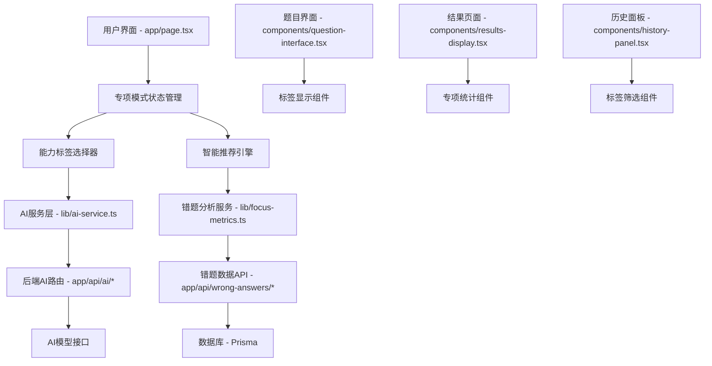

# Design Document - 专项能力练习模式

## Overview

专项能力练习模式是对现有英语听力练习系统的重要扩展，允许用户根据特定的听力能力标签进行定制化练习。该功能深度整合现有的AI生成、错题分析和历史记录系统，通过智能推荐和数据分析为用户提供个性化的学习路径。

### 核心设计原则

1. **无侵入性集成**：在不破坏现有功能的前提下，通过可选模式的方式集成专项练习功能
2. **渐进式增强**：用户可以选择使用专项模式，也可以继续使用原有的普通练习模式
3. **智能降级**：当AI无法完全满足标签需求时，提供优雅的降级处理
4. **性能优先**：确保新功能不影响现有系统的响应速度和稳定性

## Architecture

### 系统架构图



### 数据流架构

1. **用户选择标签** → 前端状态更新 → AI请求参数扩展
2. **AI生成内容** → 标签匹配验证 → 覆盖率计算 → 前端反馈
3. **练习完成** → 专项统计计算 → 数据库保存 → 推荐更新
4. **错题分析** → 标签统计 → 智能推荐 → 用户界面更新

## Components and Interfaces

### 1. 类型系统扩展 (lib/types.ts)

#### 新增类型定义

```typescript
// 能力标签映射
export interface FocusAreaLabel {
  code: FocusArea
  nameEn: string
  nameZh: string
  description?: string
  category: 'comprehension' | 'analysis' | 'detail' | 'inference'
}

export const FOCUS_AREA_LIST: FocusArea[] = [
  'main-idea',
  'detail-comprehension',
  'inference',
  'vocabulary',
  'cause-effect',
  'sequence',
  'speaker-attitude',
  'comparison',
  'number-information',
  'time-reference',
]

// 标签覆盖率信息
export interface FocusCoverage {
  requested: FocusArea[]
  provided: FocusArea[]
  coverage: number // 0-1
  unmatchedTags: FocusArea[]
  partialMatches?: Array<{
    tag: FocusArea
    confidence: number
    reason?: string
  }>
}

// 专项统计数据
export interface FocusAreaStats {
  [key: string]: {
    attempts: number
    incorrect: number
    accuracy: number
    lastAttempt?: string
    trend: 'improving' | 'declining' | 'stable'
  }
}

// 专项练习配置
export interface SpecializedPracticeConfig {
  isEnabled: boolean
  selectedFocusAreas: FocusArea[]
  recommendedFocusAreas: FocusArea[]
  savedPresets: SpecializedPreset[]
}

// 专项模板预设
export interface SpecializedPreset {
  id: string
  name: string
  focusAreas: FocusArea[]
  difficulty: DifficultyLevel
  language: ListeningLanguage
  duration: number
  createdAt: string
}
```

#### API响应类型扩展

```typescript
// AI生成响应扩展
export interface AIGenerationResponse {
  success: boolean
  // 原有字段...
  focusCoverage?: FocusCoverage
  attempts?: number
  degradationReason?: string
}

// 题目生成响应
export interface QuestionGenerationResponse extends AIGenerationResponse {
  questions: Question[]
  focusMatch?: Array<{
    questionIndex: number
    matchedTags: FocusArea[]
    confidence: 'high' | 'medium' | 'low'
  }>
}
```

### 2. 前端状态管理 (app/page.tsx)

#### 新增状态变量

```typescript
// 专项模式核心状态
const [isSpecializedMode, setIsSpecializedMode] = useState<boolean>(false)
const [selectedFocusAreas, setSelectedFocusAreas] = useState<FocusArea[]>([])
const [recommendedFocusAreas, setRecommendedFocusAreas] = useState<FocusArea[]>([])

// 统计和分析状态
const [focusAreaStats, setFocusAreaStats] = useState<FocusAreaStats>({})
const [focusCoverage, setFocusCoverage] = useState<FocusCoverage | null>(null)

// 预设管理状态
const [specializedPresets, setSpecializedPresets] = useState<SpecializedPreset[]>([])
const [isLoadingRecommendations, setIsLoadingRecommendations] = useState<boolean>(false)
```

#### 状态管理逻辑

```typescript
// 模式切换处理
const handleSpecializedModeToggle = useCallback((enabled: boolean) => {
  setIsSpecializedMode(enabled)
  if (!enabled) {
    setSelectedFocusAreas([])
    setFocusCoverage(null)
    // 重置相关状态
    resetExerciseState()
  }
}, [])

// 标签选择处理
const handleFocusAreaSelection = useCallback((areas: FocusArea[]) => {
  setSelectedFocusAreas(areas)
  setFocusCoverage(null)
  // 重置题目相关状态以避免数据不一致
  if (areas.length > 0) {
    resetQuestionState()
  }
}, [])

// 推荐应用处理
const handleApplyRecommendations = useCallback(() => {
  const uniqueAreas = Array.from(new Set([...selectedFocusAreas, ...recommendedFocusAreas]))
  setSelectedFocusAreas(uniqueAreas.slice(0, 5)) // 限制最多5个标签
}, [selectedFocusAreas, recommendedFocusAreas])
```

### 3. AI服务层扩展 (lib/ai-service.ts)

#### 接口参数扩展

```typescript
// 扩展现有函数签名
export async function generateTopics(
  difficulty: DifficultyLevel,
  wordCount: number,
  language: ListeningLanguage = 'en-US',
  difficultyLevel?: DifficultyLevel,
  focusAreas?: FocusArea[] // 新增参数
): Promise<{
  topics: string[]
  focusCoverage?: FocusCoverage
}>

export async function generateTranscript(
  difficulty: DifficultyLevel,
  wordCount: number,
  topic: string,
  language: ListeningLanguage = 'en-US',
  difficultyLevel?: number,
  focusAreas?: FocusArea[] // 新增参数
): Promise<{
  transcript: string
  focusCoverage?: FocusCoverage
}>

export async function generateQuestions(
  difficulty: DifficultyLevel,
  transcript: string,
  language: ListeningLanguage = 'en-US',
  duration: number,
  difficultyLevel?: number,
  focusAreas?: FocusArea[] // 新增参数
): Promise<{
  questions: Question[]
  focusCoverage?: FocusCoverage
  focusMatch?: Array<{
    questionIndex: number
    matchedTags: FocusArea[]
    confidence: 'high' | 'medium' | 'low'
  }>
}>
```

### 4. 错题分析服务 (lib/focus-metrics.ts)

#### 核心分析函数

```typescript
/**
 * 计算各能力标签的统计数据
 */
export function computeFocusStats(
  wrongAnswers: WrongAnswerItem[],
  sessions: PracticeSession[]
): FocusAreaStats {
  const stats: FocusAreaStats = {}
  
  // 初始化所有标签的统计
  FOCUS_AREA_LIST.forEach(area => {
    stats[area] = {
      attempts: 0,
      incorrect: 0,
      accuracy: 0,
      trend: 'stable'
    }
  })
  
  // 统计错题数据
  wrongAnswers.forEach(item => {
    const focusAreas = item.question.focus_areas || []
    focusAreas.forEach(area => {
      stats[area].incorrect += 1
    })
  })
  
  // 统计总尝试次数（从历史会话中）
  sessions.forEach(session => {
    let exerciseData: any = null
    try {
      exerciseData = typeof session.exerciseData === 'string'
        ? JSON.parse(session.exerciseData)
        : session.exerciseData
    } catch (error) {
      console.warn('Failed to parse practiceSession.exerciseData', { sessionId: session.id, error })
    }

    if (exerciseData?.focusAreas && Array.isArray(exerciseData.focusAreas)) {
      exerciseData.focusAreas.forEach((area: FocusArea) => {
        if (!FOCUS_AREA_LIST.includes(area)) return
        const questionCount = Array.isArray(exerciseData.questions)
          ? exerciseData.questions.length
          : 0
        stats[area].attempts += questionCount
      })
    }
  })
  
  // 计算准确率和趋势
  Object.keys(stats).forEach(area => {
    const stat = stats[area]
    if (stat.attempts > 0) {
      stat.accuracy = Math.round(((stat.attempts - stat.incorrect) / stat.attempts) * 100 * 10) / 10
      stat.trend = calculateTrend(area, sessions)
    }
  })
  
  return stats
}

/**
 * 选择推荐的重点练习标签
 */
export function selectRecommendedFocusAreas(
  stats: FocusAreaStats,
  maxRecommendations: number = 3
): FocusArea[] {
  const candidates = Object.entries(stats)
    .filter(([_, stat]) => stat.attempts >= 3) // 至少尝试3次
    .map(([area, stat]) => ({
      area: area as FocusArea,
      priority: calculatePriority(stat)
    }))
    .sort((a, b) => b.priority - a.priority)
    .slice(0, maxRecommendations)
  
  return candidates.map(c => c.area)
}

/**
 * 计算优先级分数
 */
function calculatePriority(stat: FocusAreaStats[string]): number {
  let priority = 0
  
  // 错误率权重 (40%)
  const errorRate = stat.attempts > 0 ? stat.incorrect / stat.attempts : 0
  priority += errorRate * 40
  
  // 最近性权重 (30%)
  if (stat.lastAttempt) {
    const daysSinceLastAttempt = (Date.now() - new Date(stat.lastAttempt).getTime()) / (1000 * 60 * 60 * 24)
    const recencyScore = Math.max(0, 1 - daysSinceLastAttempt / 30) // 30天内的权重
    priority += recencyScore * 30
  }
  
  // 趋势权重 (20%)
  const trendScore = stat.trend === 'declining' ? 1 : stat.trend === 'stable' ? 0.5 : 0
  priority += trendScore * 20
  
  // 尝试次数权重 (10%)
  const attemptScore = Math.min(1, stat.attempts / 10) // 最多10次的权重
  priority += attemptScore * 10
  
  return priority
}
```

## Data Models

### 数据库扩展

#### PracticeSession 表扩展

```sql
-- 在 exerciseData JSON 字段中新增字段
{
  "focusAreas": ["main-idea", "detail-comprehension"],
  "focusCoverage": {
    "requested": ["main-idea", "detail-comprehension", "inference"],
    "provided": ["main-idea", "detail-comprehension"],
    "coverage": 0.67
  },
  "specializedMode": true,
  "perFocusAccuracy": {
    "main-idea": 80,
    "detail-comprehension": 60
  }
}
```

#### WrongAnswerItem 扩展

确保错题记录包含 focus_areas 信息：

```typescript
// 在保存错题时确保包含标签信息
const wrongAnswerData = {
  // 现有字段...
  question: {
    // 现有字段...
    focus_areas: question.focus_areas || []
  }
}
```

### 本地存储结构

#### 专项模式预设 (localStorage)

```typescript
// 存储键: 'english-listening-specialized-presets'
interface StoredPresets {
  presets: SpecializedPreset[]
  lastUpdated: string
}
```

#### 能力标签配置缓存

```typescript
// 存储键: 'english-listening-focus-area-cache'
interface FocusAreaCache {
  stats: FocusAreaStats
  recommendations: FocusArea[]
  lastCalculated: string
  dataVersion: string // 用于检测数据变化
}
```

## Error Handling

### 降级处理策略

#### 1. AI不支持标签控制

```typescript
// 检测AI响应中的覆盖率
if (response.focusCoverage?.coverage === 0) {
  // 显示警告但允许继续
  toast({
    title: "专项模式暂时不可用",
    description: "将为您提供普通练习，但会记录您的标签偏好",
    variant: "warning"
  })
  
  // 记录用户意图，用于后续推荐
  recordUserIntent(selectedFocusAreas)
}
```

#### 2. 部分标签匹配

```typescript
// 覆盖率低于阈值时的处理
if (response.focusCoverage?.coverage < 0.8) {
  setFocusCoverage(response.focusCoverage)
  
  // 在UI中显示警告
  showCoverageWarning({
    coverage: response.focusCoverage.coverage,
    unmatchedTags: response.focusCoverage.unmatchedTags
  })
}
```

#### 3. 数据加载失败

```typescript
// 错题数据加载失败时的回退
const handleStatsLoadError = useCallback(() => {
  // 使用默认推荐
  setRecommendedFocusAreas(['main-idea', 'detail-comprehension'])
  
  // 显示提示
  toast({
    title: "暂无历史数据",
    description: "建议从基础专项开始练习",
    variant: "info"
  })
}, [])
```

### 性能优化策略

#### 1. 统计计算优化

```typescript
// 使用 useMemo 缓存计算结果
const focusAreaStats = useMemo(() => {
  if (!wrongAnswers.length && !practiceHistory.length) {
    return getDefaultStats()
  }
  
  return computeFocusStats(wrongAnswers, practiceHistory)
}, [wrongAnswers, practiceHistory])

// 使用 useCallback 避免重复计算
const updateRecommendations = useCallback(
  debounce((stats: FocusAreaStats) => {
    const recommendations = selectRecommendedFocusAreas(stats)
    setRecommendedFocusAreas(recommendations)
  }, 300),
  []
)
```

#### 2. API请求优化

```typescript
// 防抖处理避免频繁请求
const debouncedGenerateQuestions = useMemo(
  () => debounce(async (params) => {
    return await generateQuestions(params)
  }, 500),
  []
)

// 请求缓存
const requestCache = new Map<string, Promise<any>>()

const cachedApiCall = async (key: string, apiCall: () => Promise<any>) => {
  if (requestCache.has(key)) {
    return requestCache.get(key)
  }
  
  const promise = apiCall()
  requestCache.set(key, promise)
  
  // 清理过期缓存
  setTimeout(() => requestCache.delete(key), 30000)
  
  return promise
}
```

## Testing Strategy

### 测试策略

- **总体原则**：仅在逻辑复杂且难以通过手动验证的模块（例如统计算法）中编写必要的、小型的 Vitest 用例；其他场景依赖手动验证与运行时断言。
- **可选单元测试示例**：若 `computeFocusStats` 的实现包含多个边界分支，可编写少量用例验证空数据、异常输入与典型数据集的输出。测试需保持模块化、无外部依赖。
- **禁止事项**：不得撰写覆盖整条 UI 流程的长篇集成测试，亦不得生成庞大的快照或难以维护的 Mock 数据。

### 手动测试场景

#### 1. 基础功能验证

- [ ] 专项模式开关正常工作
- [ ] 标签选择界面响应正确
- [ ] 推荐标签显示和应用功能正常
- [ ] 生成的题目包含对应标签
- [ ] 结果页面显示专项统计

#### 2. 边界情况测试

- [ ] 无错题历史时的推荐处理
- [ ] AI完全不支持标签时的降级
- [ ] 网络异常时的错误处理
- [ ] 大量数据时的性能表现

#### 3. 用户体验测试

- [ ] 移动端界面适配
- [ ] 多语言切换正常
- [ ] 加载状态显示合理
- [ ] 错误提示清晰易懂

### 性能基准

- 500条错题记录的统计计算应在100ms内完成
- 标签选择变化的UI响应应在50ms内完成
- API请求的防抖延迟设置为300-500ms
- 缓存命中率应达到80%以上

### 安全考虑

- 所有用户输入需要验证和清理
- API参数长度限制（focusAreas数组最多5个元素）
- 用户数据隔离（统计数据仅限当前用户）
- 敏感信息不记录到日志中

### 可扩展性设计

- 预留子标签字段 (subFocusAreas)
- 预留难度调整字段 (difficultyAdjustment)
- 预留自定义标签支持
- 预留多维度分析能力

这个设计确保了专项能力练习模式能够无缝集成到现有系统中，同时提供强大的个性化学习功能和优雅的降级处理机制。
