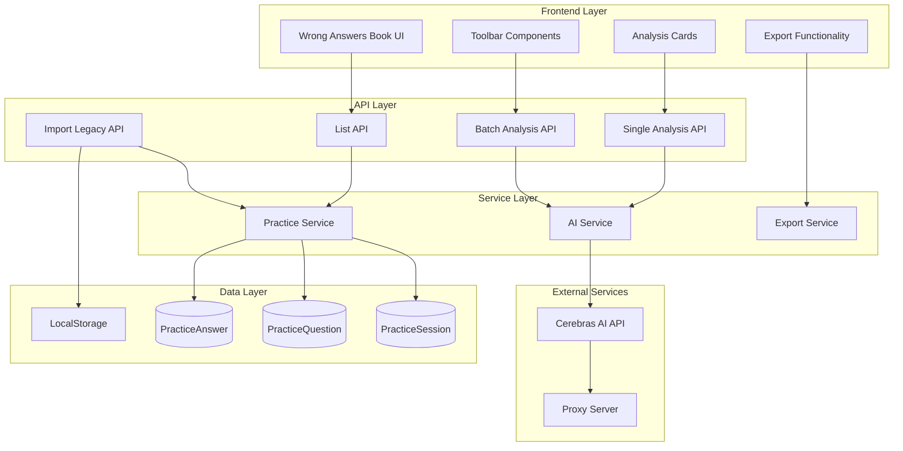

# Design Document

## Overview

The Wrong Answers AI Analysis feature extends the existing language learning application with intelligent analysis capabilities for incorrect answers. The system leverages the existing Cerebras AI integration to provide detailed Chinese explanations, error categorization, and learning strategies. The design builds upon the current database schema, API patterns, and UI components while introducing new data models and endpoints specifically for AI-powered analysis.

## Architecture

### System Components



### Data Flow

1. **Legacy Migration**: Frontend detects localStorage data → Import API → Database storage
2. **AI Analysis Request**: User clicks analysis → Single/Batch API → AI Service → Cerebras API → Database update
3. **Data Retrieval**: Wrong Answers Book → List API → Database query → UI rendering
4. **Export**: Export button → Export Service → File generation → Download

## Components and Interfaces

### Database Schema Extensions

The design extends the existing Prisma schema with three new models:

```prisma
model PracticeSession {
  id          String             @id @default(cuid())
  userId      String
  topic       String
  difficulty  String
  language    String
  transcript  String
  score       Int?
  createdAt   DateTime           @default(now())
  updatedAt   DateTime           @updatedAt
  questions   PracticeQuestion[]
  
  user        User               @relation(fields: [userId], references: [id], onDelete: Cascade)
}

model PracticeQuestion {
  id                 String            @id @default(cuid())
  sessionId          String
  index              Int
  type               String
  question           String
  options            Json?
  correctAnswer      String
  explanation        String?
  transcriptSnapshot String?
  createdAt          DateTime          @default(now())
  answers            PracticeAnswer[]
  
  session            PracticeSession   @relation(fields: [sessionId], references: [id], onDelete: Cascade)
}

model PracticeAnswer {
  id                     String            @id @default(cuid())
  questionId             String
  userAnswer             String
  isCorrect              Boolean
  attemptedAt            DateTime          @default(now())
  aiAnalysis             Json?
  aiAnalysisGeneratedAt  DateTime?
  tags                   String[]          @default([])
  needsAnalysis          Boolean           @default(true)
  
  question               PracticeQuestion  @relation(fields: [questionId], references: [id], onDelete: Cascade)
}
```

### API Interfaces

#### Import Legacy Data API
```typescript
// POST /api/practice/import-legacy
interface ImportLegacyRequest {
  sessions: LegacySession[]
}

interface LegacySession {
  sessionId: string
  topic: string
  difficulty: string
  language: string
  transcript: string
  score: number
  createdAt: string
  questions: LegacyQuestion[]
}

interface LegacyQuestion {
  index: number
  type: string
  question: string
  options?: string[]
  correctAnswer: string
  explanation?: string
  answers: LegacyAnswer[]
}

interface LegacyAnswer {
  userAnswer: string
  isCorrect: boolean
  attemptedAt: string
}
```

#### AI Analysis APIs
```typescript
// POST /api/ai/wrong-answers/analyze
interface AnalyzeRequest {
  questionId: string
  answerId: string
  questionType: string
  question: string
  options?: string[]
  userAnswer: string
  correctAnswer: string
  transcript: string
  exerciseTopic: string
  exerciseDifficulty: string
  language: string
  attemptedAt: string
}

interface AnalyzeResponse {
  analysis: string
  key_reason: string
  ability_tags: string[]
  signal_words: string[]
  strategy: string
  related_sentences: RelatedSentence[]
  confidence: 'high' | 'medium' | 'low'
}

// POST /api/ai/wrong-answers/analyze-batch
interface BatchAnalyzeRequest {
  answerIds: string[]
}

interface BatchAnalyzeResponse {
  success: AnalyzeResponse[]
  failed: { answerId: string; error: string }[]
}
```

#### List Wrong Answers API
```typescript
// GET /api/wrong-answers/list
interface WrongAnswersResponse {
  wrongAnswers: WrongAnswerItem[]
}

interface WrongAnswerItem {
  answerId: string
  questionId: string
  sessionId: string
  session: {
    topic: string
    difficulty: string
    language: string
    createdAt: string
  }
  question: {
    index: number
    type: string
    question: string
    options?: string[]
    correctAnswer: string
    explanation?: string
    transcript: string
  }
  answer: {
    userAnswer: string
    isCorrect: boolean
    attemptedAt: string
    aiAnalysis?: AnalyzeResponse
    aiAnalysisGeneratedAt?: string
    needsAnalysis: boolean
  }
}
```

### Frontend Components

#### Enhanced Wrong Answers Book
```typescript
interface WrongAnswersBookProps {
  onBack: () => void
}

interface WrongAnswersBookState {
  wrongAnswers: WrongAnswerItem[]
  filteredAnswers: WrongAnswerItem[]
  searchTerm: string
  filters: {
    difficulty: string
    language: string
    type: string
  }
  expandedCards: Set<string>
  analysisStates: Map<string, AnalysisState>
  batchProcessing: boolean
}

enum AnalysisState {
  NOT_GENERATED = 'not_generated',
  LOADING = 'loading',
  SUCCESS = 'success',
  ERROR = 'error'
}
```

#### AI Analysis Card Component
```typescript
interface AIAnalysisCardProps {
  answerId: string
  analysis?: AnalyzeResponse
  state: AnalysisState
  onGenerate: (answerId: string) => void
  onRetry: (answerId: string) => void
}
```

## Data Models

### AI Analysis JSON Schema
The AI analysis is stored as JSON in the database with the following structure:

```json
{
  "analysis": "详尽的中文解析，至少150字，包含错误原因分析、知识点解释和改进建议",
  "key_reason": "简述主要错误原因，如'细节理解缺失'或'推理判断错误'",
  "ability_tags": ["听力细节捕捉", "推理判断", "词汇理解"],
  "signal_words": ["关键提示词1", "关键提示词2", "重要信号词"],
  "strategy": "针对该题型的作答策略和技巧建议",
  "related_sentences": [
    {
      "quote": "听力材料中的原句片段",
      "comment": "该句与正确答案的关系说明"
    }
  ],
  "confidence": "high"
}
```

### Legacy Data Migration Model
```typescript
interface LegacyExercise {
  id: string
  topic: string
  difficulty: string
  language: string
  transcript: string
  questions: LegacyQuestion[]
  answers: string[]
  results: LegacyResult[]
  score: number
  createdAt: string
}

interface LegacyResult {
  is_correct: boolean
  correct_answer: string
  explanation?: string
}
```

## Error Handling

### API Error Responses
```typescript
interface APIError {
  error: string
  code?: string
  details?: unknown
}

// Common error codes
enum ErrorCodes {
  UNAUTHORIZED = 'UNAUTHORIZED',
  INVALID_REQUEST = 'INVALID_REQUEST',
  AI_SERVICE_ERROR = 'AI_SERVICE_ERROR',
  DATABASE_ERROR = 'DATABASE_ERROR',
  RATE_LIMIT_EXCEEDED = 'RATE_LIMIT_EXCEEDED'
}
```

### Frontend Error Handling
- Network errors: Show retry button with exponential backoff
- AI service errors: Display user-friendly message with retry option
- Validation errors: Show specific field validation messages
- Rate limiting: Show progress indicator and queue management

### Backend Error Handling
- Database connection failures: Automatic retry with circuit breaker
- AI API failures: Retry with exponential backoff (max 3 attempts)
- Proxy connection issues: Fallback to direct connection if configured
- JSON parsing errors: Log detailed error and return structured response

## Testing Strategy

### Unit Tests

#### Backend API Tests
```typescript
// Test files structure
__tests__/api/
├── practice/
│   └── import-legacy.test.ts
├── ai/
│   └── wrong-answers/
│       ├── analyze.test.ts
│       └── analyze-batch.test.ts
└── wrong-answers/
    └── list.test.ts
```

#### Frontend Component Tests
```typescript
// Test files structure
__tests__/components/
├── wrong-answers-book-enhanced.test.tsx
├── ai-analysis-card.test.tsx
└── batch-analysis-toolbar.test.tsx
```

#### Service Layer Tests
```typescript
// Test files structure
__tests__/lib/
├── ai-analysis-service.test.ts
├── practice-migration-service.test.ts
└── export-service.test.ts
```

### Integration Tests

#### Database Integration
- Test complete data flow from legacy import to AI analysis
- Verify data consistency across related tables
- Test concurrent access scenarios

#### AI Service Integration
- Mock Cerebras API responses for consistent testing
- Test error handling and retry logic
- Verify JSON schema validation

#### End-to-End Tests
- Complete user workflow from legacy migration to export
- Batch processing with mixed success/failure scenarios
- Cross-device synchronization testing

### Performance Tests

#### Load Testing
- Concurrent AI analysis requests (up to 100)
- Large dataset import performance
- Database query optimization validation

#### Memory Testing
- Frontend memory usage during batch processing
- Backend memory management for large exports
- AI service response caching efficiency

## Security Considerations

### Data Protection
- User data isolation: All queries filtered by userId
- Input sanitization: Validate all user inputs before processing
- Output sanitization: Escape AI-generated content for display

### API Security
- Authentication: Reuse existing JWT-based auth system
- Rate limiting: Implement per-user rate limits for AI requests
- Input validation: Strict schema validation for all endpoints

### AI Service Security
- API key protection: Store in environment variables only
- Proxy configuration: Secure proxy credentials
- Response validation: Validate AI responses against expected schema

## Performance Optimization

### Database Optimization
- Indexes on frequently queried fields (userId, createdAt, needsAnalysis)
- Pagination for large result sets
- Connection pooling for concurrent requests

### Frontend Optimization
- Virtual scrolling for large wrong answer lists
- Lazy loading of AI analysis content
- Debounced search and filtering
- Optimistic UI updates for better perceived performance

### AI Service Optimization
- Request batching with configurable concurrency limits
- Response caching for identical questions
- Retry logic with exponential backoff
- Connection pooling for proxy requests

### Export Optimization
- Streaming file generation for large exports
- Background processing for heavy operations
- Progress indicators for long-running tasks

## Deployment Considerations

### Environment Configuration
```bash
# Development
CEREBRAS_PROXY_URL=http://127.0.0.1:7890
NODE_ENV=development

# Production
CEREBRAS_PROXY_URL=http://81.71.93.183:10811
NODE_ENV=production
CEREBRAS_API_KEY=<production-key>
```

### Database Migration
```bash
# Run Prisma migration
npx prisma migrate dev --name add_wrong_answer_ai
npx prisma generate
```

### Monitoring and Logging
- AI API request/response logging
- Performance metrics for batch processing
- Error tracking for failed analysis requests
- User activity monitoring for feature adoption