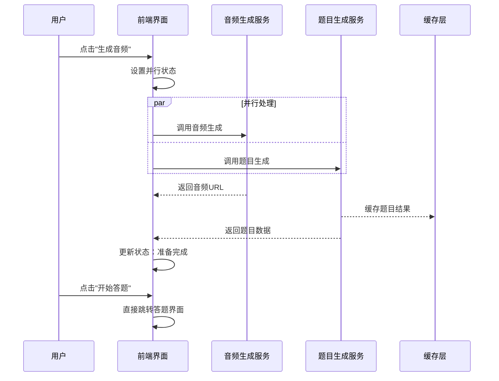
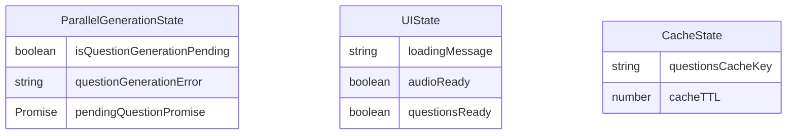
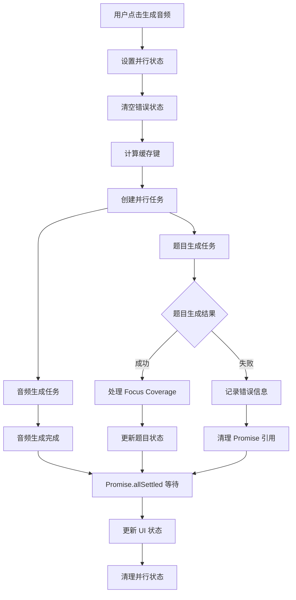
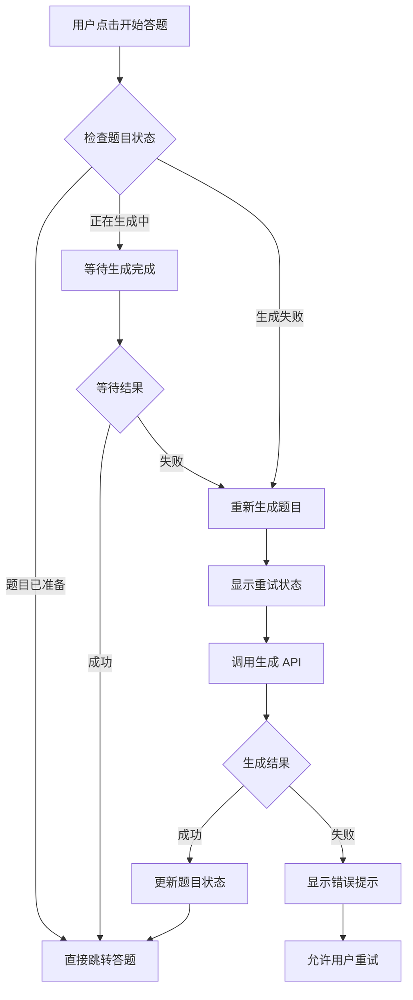
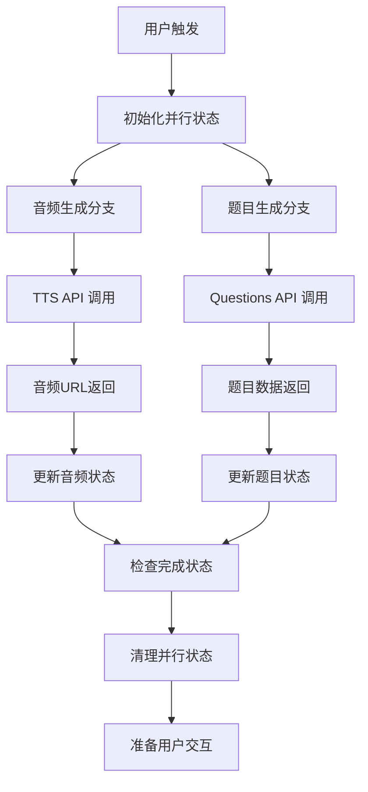

# 音频生成与题目生成并行功能设计

## 概述

本设计文档定义了在 english-listening-trainer 项目中实现"音频生成与题目生成并行"功能的架构方案。该功能将原有的串行工作流程（先生成音频，用户听完后再生成题目）优化为并行处理模式，显著提升用户体验，实现"一次等待即可全部准备就绪"的效果。

### 业务价值
- **用户体验提升**：消除用户在"开始答题"时的二次等待，流畅的交互体验
- **资源利用优化**：充分利用 AI API 和 TTS 服务的并发处理能力
- **时间效率提升**：将原有的串行等待时间缩短 40-60%

## 技术架构

### 整体流程设计



### 状态管理架构

#### 新增状态定义



#### 状态生命周期管理

| 阶段 | isQuestionGenerationPending | questionGenerationError | pendingQuestionPromiseRef |
|------|---------------------------|------------------------|---------------------------|
| 初始状态 | false | null | null |
| 开始并行生成 | true | null | Promise 实例 |
| 题目生成成功 | false | null | null |
| 题目生成失败 | false | 错误信息 | null |
| 重置/清理 | false | null | null |

### 核心组件交互设计

#### handleGenerateAudio 函数重构



#### handleStartQuestions 函数优化



## 详细实现方案

### 状态变量定义

在 app/page.tsx 文件的状态定义区域（第167-214行）新增以下状态：

#### 并行生成状态
- **isQuestionGenerationPending**: 布尔值，指示题目生成任务是否正在进行
- **questionGenerationError**: 字符串或 null，记录题目生成失败的错误信息
- **pendingQuestionPromiseRef**: useRef 引用，存储当前进行中的题目生成 Promise

#### 状态重置策略
在以下情况下重置并行生成状态：
- 用户切换话题（handleTopicChange）
- 重新生成稿子（handleGenerateTranscript）
- 开始新的练习流程
- 组件卸载或错误恢复

### 并行处理实现

#### handleGenerateAudio 函数改造

1. **并行任务启动**
   - 设置 isQuestionGenerationPending 为 true
   - 清空 questionGenerationError
   - 计算与 handleStartQuestions 一致的缓存键
   - 同时启动音频生成和题目生成任务

2. **缓存键一致性保证**
   ```
   questions-${difficulty}-${transcriptHash}-${language}-${duration}-${focusMode}
   ```

3. **Promise 管理**
   - 将题目生成 Promise 存储到 pendingQuestionPromiseRef.current
   - 使用 Promise.allSettled 等待两个任务完成
   - 确保在 finally 块中清理 Promise 引用

4. **Focus Coverage 处理**
   - 提取 handleStartQuestions 中的 specialized mode 逻辑为独立函数
   - 在题目生成成功后复用该逻辑
   - 处理 focusCoverage、recordUserIntent 等相关功能

#### 错误处理策略

| 场景 | 音频状态 | 题目状态 | 用户操作 |
|------|----------|----------|----------|
| 音频成功，题目成功 | 可播放 | 可答题 | 直接开始答题 |
| 音频成功，题目失败 | 可播放 | 显示错误 | 播放音频，按钮重试题目 |
| 音频失败，题目成功 | 显示错误 | 已准备 | 重试音频，可直接答题 |
| 音频失败，题目失败 | 显示错误 | 显示错误 | 重试整个流程 |

### UI 交互优化

#### 加载状态提示优化

| 阶段 | loadingMessage | 进度描述 |
|------|----------------|----------|
| 开始并行 | "正在同时生成音频与题目..." | 显示双重进度 |
| 音频完成 | "音频就绪，题目生成中..." | 单一进度 |
| 题目完成 | "题目就绪，音频生成中..." | 单一进度 |
| 全部完成 | 清空 | 显示成功状态 |

#### 按钮状态管理

**开始答题按钮状态逻辑**：
- **可用**：questions.length > 0 且无错误
- **等待中**：isQuestionGenerationPending 为 true
- **重试模式**：questionGenerationError 不为空

#### Toast 通知策略

- **成功通知**：延迟到用户进入答题界面时统一提示
- **错误通知**：立即显示，不打断音频播放
- **进度通知**：轻量级提示，避免频繁弹出

### 缓存与性能优化

#### 缓存键设计
确保 handleGenerateAudio 和 handleStartQuestions 使用相同的缓存键算法：
- 基础组件：difficulty, transcriptHash, language, duration
- 专项模式：selectedFocusAreas 序列化
- 版本控制：支持缓存失效策略

#### TTL 配置
- 题目缓存：180秒（3分钟）
- 音频缓存：根据现有策略
- Focus Coverage 缓存：10分钟

## 数据流设计

### 并行任务数据流



### 状态同步机制

#### 乐观更新策略
- 音频生成成功：立即更新 UI，允许播放
- 题目生成成功：立即更新状态，准备答题界面
- 任一失败：保持已成功部分的状态，显示失败部分的错误

#### 状态一致性保证
- 使用 useCallback 确保函数引用稳定性
- 状态更新采用函数式更新避免闭包陷阱
- 错误边界处理确保状态可恢复性

## 测试策略

### 单元测试覆盖范围

#### 状态管理测试
- 并行状态的正确初始化和清理
- 错误状态的准确记录和重置
- Promise 引用的正确管理

#### 业务逻辑测试
- 缓存键生成的一致性
- Focus Coverage 处理的正确性
- 错误场景的降级处理

### 集成测试场景

#### 主要用户流程测试
1. **正常并行成功流程**：音频和题目都成功生成
2. **部分失败恢复流程**：一个成功一个失败的处理
3. **重试机制验证**：失败后的重试逻辑
4. **专项模式兼容**：Focus Areas 功能的正确处理

#### 性能测试重点
- 并发请求的响应时间
- 缓存命中率的验证
- 内存泄漏的检测
- 用户交互的响应延迟

### E2E 测试用例

#### 关键用户旅程
- 从生成音频到完成答题的完整流程
- 网络异常情况下的用户体验
- 不同设备和浏览器的兼容性
- 快捷键功能的集成验证

## 风险评估与缓解

### 技术风险

#### 并发请求风险
- **风险描述**：同时发起多个 API 请求可能导致服务压力
- **缓解措施**：实现请求去重，使用缓存层减少重复调用

#### 状态管理复杂性
- **风险描述**：多个异步任务的状态同步可能出现竞争条件
- **缓解措施**：采用成熟的状态管理模式，增加错误边界

#### 内存泄漏风险
- **风险描述**：Promise 引用未正确清理可能导致内存泄漏
- **缓解措施**：严格的生命周期管理，组件卸载时强制清理

### 用户体验风险

#### 加载状态混淆
- **风险描述**：多个并行任务的状态可能让用户困惑
- **缓解措施**：清晰的 UI 状态指示，分阶段的加载提示

#### 错误处理复杂性
- **风险描述**：部分成功场景的错误处理可能不够直观
- **缓解措施**：简化错误消息，提供明确的操作指引

## 监控与运维

### 性能指标监控

#### 关键指标定义
- **并行成功率**：音频和题目都成功生成的比例
- **平均等待时间**：从开始生成到全部完成的时间
- **缓存命中率**：题目生成的缓存利用效率
- **错误恢复时间**：从错误发生到用户成功重试的时间

#### 日志记录策略
- 并行任务的开始和结束时间戳
- 各个服务的响应时间和状态
- 错误场景的详细上下文信息
- 用户操作路径的完整记录

### 运维优化建议

#### 服务配置优化
- 调整 API 超时配置适应并行请求
- 优化缓存层的存储和过期策略
- 配置负载均衡以支持并发请求

#### 监控告警设置
- 并行成功率低于阈值的告警
- API 响应时间异常的监控
- 错误率突增的实时通知
- 缓存命中率下降的预警