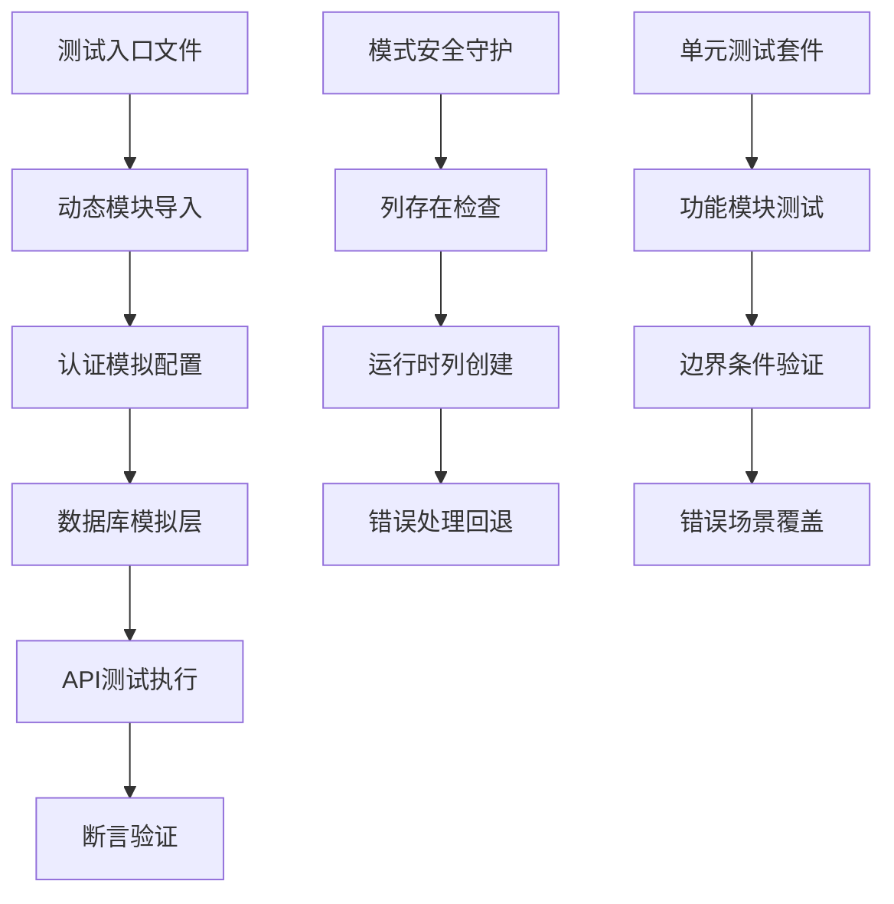

# 测试套件优化与数据库模式安全增强设计

## 概述

本设计文档定义了针对 Next.js/Prisma "english-listening-trainer" 项目的测试套件优化和数据库模式安全增强策略。重点解决测试中的模块导入问题、认证模拟配置、专项字段处理验证，以及新增的运行时模式保护机制。

### 背景
项目当前正在实施运行时数据库模式保护（通过 `ensureTableColumn`），同时需要优化测试套件中的认证模拟逻辑和断言验证。核心目标是确保测试环境的稳定性，避免模块导入错误和认证模拟配置问题。

## 架构

### 测试组织结构
- **集成测试层**: 验证 API 端点的完整行为流程
- **单元测试层**: 专注于独立功能模块的验证  
- **模拟服务层**: 提供一致性的测试数据和外部依赖模拟

### 核心组件关系



## API 集成测试重构

### 认证模块导入优化

#### 当前问题分析
测试文件中使用 `require('../../../lib/auth')` 导致模块导入时机问题，需要改为异步动态导入以确保模拟配置的正确性。

#### 重构策略

| 组件 | 当前实现 | 目标实现 | 改进收益 |
|------|----------|----------|----------|
| 模块导入 | 同步 require | 异步 dynamic import | 解决导入时机问题 |
| 模拟配置 | beforeEach 同步 | beforeEach 异步 | 确保模拟正确设置 |
| 状态重置 | 手动清理 | 自动重置机制 | 防止测试间干扰 |

#### 实现规范

**动态导入模式**:
每个测试场景中的认证模块访问都应使用以下模式：
```javascript
// 获取模拟后的认证模块
const authModule = await import('../../../lib/auth')
const requireAuthMock = authModule.requireAuth as ReturnType<typeof vi.fn>
requireAuthMock.mockResolvedValue({ ... })
```

**beforeEach 钩子异步化**:
所有包含认证设置的 beforeEach 钩子必须声明为 async 并正确等待异步操作。

### 专项字段处理验证

#### 测试场景矩阵

| 测试场景 | specializedMode | 预期行为 | 验证重点 |
|----------|-----------------|----------|----------|
| 专项模式开启 | true | 包含焦点区域字段 | focusAreas, perFocusAccuracy 存在 |
| 专项模式关闭 | false | 排除焦点区域字段 | 专项字段应为 undefined |
| 成绩计算验证 | true | 按焦点区域计算准确率 | perFocusAccuracy 数值正确性 |
| 覆盖度数据处理 | true | 焦点覆盖度信息 | focusCoverage 结构完整性 |

#### 断言修正方案
针对 "should handle non-specialized mode correctly" 测试用例，需要验证当 `specializedMode: false` 时，API 不应在 exerciseData 中注入专项字段。

## 数据库模式安全机制

### ensureTableColumn 功能验证

#### 单元测试覆盖策略

| 测试类别 | 验证场景 | 模拟配置 | 预期结果 |
|----------|----------|----------|----------|
| 列存在检查 | 表中已有目标列 | $queryRawUnsafe 返回包含列的结果 | 返回 true，无创建操作 |
| 列创建成功 | 表中缺失目标列 | $executeRawUnsafe 成功执行 | 返回 true，列被创建 |
| 重复列处理 | 创建时遇到重复列错误 | 抛出 "duplicate column" 错误 | 返回 true，视为成功 |
| 创建失败回退 | 列创建操作失败 | $executeRawUnsafe 抛出其他错误 | 返回 false，记录错误日志 |

#### Prisma 模拟配置

**查询模拟策略**:
- `$queryRawUnsafe`: 模拟 PRAGMA table_info 查询结果
- `$executeRawUnsafe`: 模拟 ALTER TABLE 执行结果
- 错误场景模拟: 包括重复列名、权限错误等

**缓存行为验证**:
验证 `schemaColumnCache` 的正确性，确保重复检查时使用缓存结果。

### API 路由中的模式保护

#### 集成点验证

| API 端点 | 保护位置 | 失败行为 | 错误响应 |
|----------|----------|----------|----------|
| /api/practice/save | 数据保存前 | 返回 500 错误 | 模式缺失提示 |
| /api/practice/import-legacy | 批量导入前 | 返回 500 错误 | 列创建失败提示 |

#### 临时日志清理
当前实现中包含 `console.log` 语句用于调试模式保护功能，需要：
- 保留错误路径的结构化日志
- 移除成功路径的临时调试输出
- 确保日志消息的国际化一致性

## 测试执行与验证

### 测试套件运行策略

#### 目标测试范围
- `tests/integration/api/practice-save.spec.ts`
- `tests/integration/api/import-legacy.spec.ts`  
- `tests/unit/lib/database/ensure-table-column.test.ts` (新增)

#### 执行命令规范
```bash
# 单独运行目标测试套件
npx vitest run tests/integration/api/practice-save.spec.ts tests/integration/api/import-legacy.spec.ts

# 包含新增单元测试
npx vitest run tests/unit/lib/database/
```

### 验证检查清单

#### 功能完整性验证

| 验证项目 | 检查方法 | 通过标准 |
|----------|----------|----------|
| 认证模拟稳定性 | 运行所有认证相关测试 | 无模块导入错误 |
| 专项字段处理 | 验证 specializedMode 逻辑 | 字段注入行为正确 |
| 模式保护机制 | 单元测试覆盖 | 所有边界条件通过 |
| API 错误处理 | 集成测试验证 | 错误响应格式正确 |

#### 代码质量检查

**文件变更审查**:
- `lib/database.ts`: 确认注释和格式符合项目规范
- API 路由文件: 验证日志清理和错误消息一致性
- 测试文件: 确认模拟配置和断言的准确性

**Git 状态确认**:
运行 `git status` 确保只有预期文件被修改，避免意外的配置或临时文件变更。

## 文档与维护

### 行为文档化策略

#### 模式安全机制说明
需要在适当的文档位置（README.md 或 docs/ 目录）添加以下内容：
- `ensureTableColumn` 功能的工作原理
- 针对历史 SQLite 快照的兼容性处理说明
- 开发者在长期环境中运行最新 Prisma 迁移的提醒

#### 手动验证步骤指导
为开发者提供以下验证步骤：
1. 数据库种子数据创建验证
2. `npm run dev` 环境下的迁移流程检查
3. 新增模式保护功能的手动测试方法

### 维护策略

#### 测试稳定性保障
- 定期执行完整测试套件验证
- 监控测试执行时间和资源使用
- 维护模拟数据的真实性和完整性

#### 模式演进支持
- 建立列添加/删除的标准流程
- 维护向后兼容性检查机制
- 定期审查缓存策略的有效性

## 风险与约束

### 技术风险

| 风险类别 | 风险描述 | 缓解措施 |
|----------|----------|----------|
| 模拟配置复杂性 | 异步导入增加测试复杂度 | 标准化导入模式，提供示例代码 |
| 缓存状态污染 | 测试间模式缓存干扰 | 每个测试套件独立重置缓存 |
| 向下兼容风险 | 新模式保护影响历史数据 | 充分的错误处理和回退机制 |

### 性能约束

**测试执行性能**:
动态导入可能轻微增加测试执行时间，但通过并行执行和缓存优化可以抵消影响。

**运行时性能**:
`ensureTableColumn` 包含缓存机制，避免重复的数据库查询对性能的影响。

### 依赖约束

**Vitest 版本要求**:
确保 Vitest 版本支持 `vi.hoisted` 和动态导入的模拟配置。

**Prisma 兼容性**:
验证 `$queryRawUnsafe` 和 `$executeRawUnsafe` 在目标 Prisma 版本中的行为一致性。