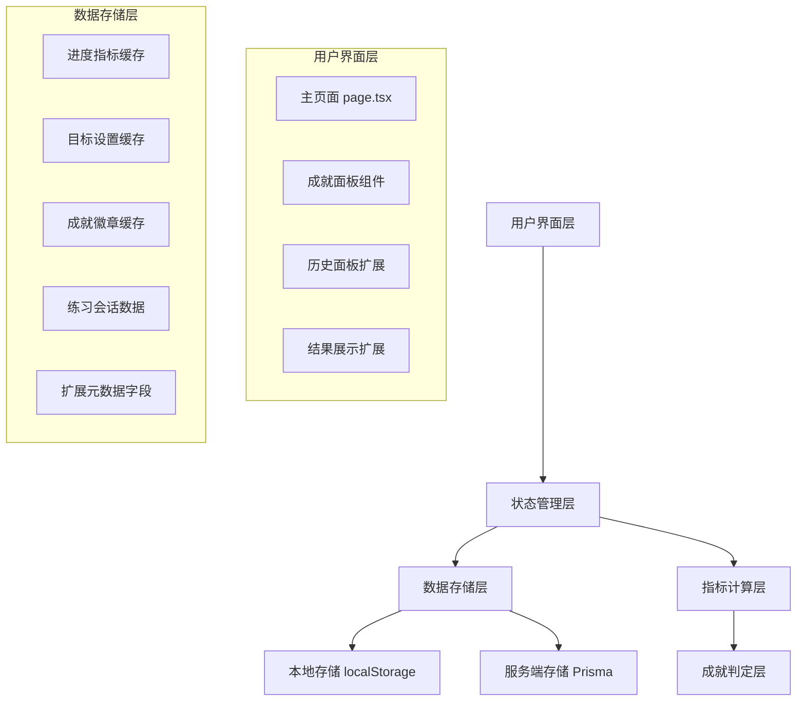
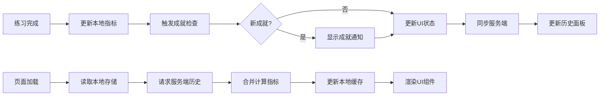
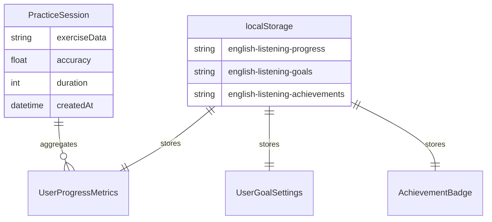
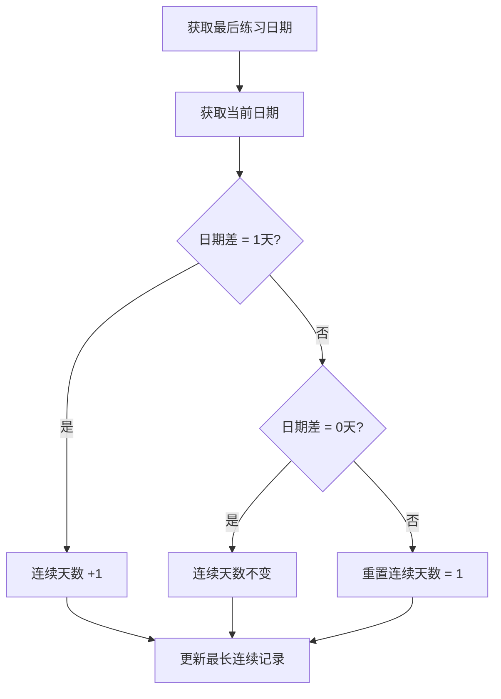
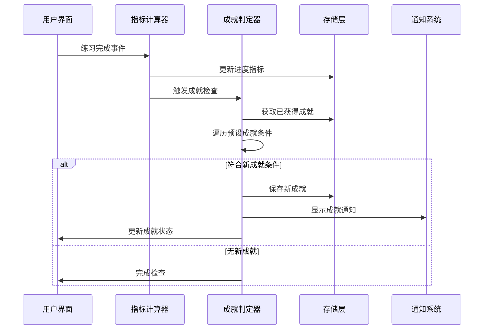
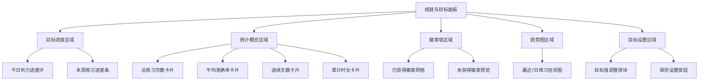

# 个人目标与成就系统设计

## 1. 系统概述

### 1.1 项目背景
现有英语听力训练应用已具备练习生成、答案批改、历史记录等核心功能。为增强用户学习动机和参与度，需要新增个人目标与成就系统，通过数据驱动的成就反馈和目标追踪，提升用户粘性和学习体验。

### 1.2 系统定位
- **单用户可见**: 个人专属的成就与目标系统，不涉及用户间比较
- **数据驱动**: 基于练习历史计算统计指标，生成成就徽章
- **目标导向**: 支持用户自定义日常和周期性目标设定
- **激励机制**: 通过可视化进度和徽章获取提供正向反馈

### 1.3 核心价值
- 提升用户学习动机和持续参与度
- 提供个性化的学习进度反馈
- 建立数据化的学习习惯追踪机制
- 增强产品用户粘性和留存率

## 2. 架构设计

### 2.1 系统架构概览



### 2.2 数据流架构



## 3. 数据模型设计

### 3.1 用户进度指标 (UserProgressMetrics)

| 字段名 | 类型 | 说明 | 示例值 |
|--------|------|------|--------|
| totalSessions | number | 总练习次数 | 25 |
| totalCorrectAnswers | number | 总正确答案数 | 180 |
| totalQuestions | number | 总题目数 | 200 |
| averageAccuracy | number | 平均准确率(%) | 90.0 |
| totalListeningMinutes | number | 累计听力时长(分钟) | 120 |
| currentStreakDays | number | 当前连续练习天数 | 7 |
| longestStreakDays | number | 最长连续练习天数 | 15 |
| lastPracticedAt | string | 最后练习时间(ISO) | "2024-01-15T10:30:00Z" |
| weeklyTrend | Array | 最近7天练习趋势 | [{"date": "2024-01-15", "sessions": 2}] |

### 3.2 用户目标设置 (UserGoalSettings)

| 字段名 | 类型 | 说明 | 默认值 |
|--------|------|------|--------|
| dailyMinutesTarget | number | 每日目标听力时长(分钟) | 20 |
| weeklySessionsTarget | number | 每周目标练习次数 | 5 |
| lastUpdatedAt | string | 目标最后更新时间(ISO) | 当前时间 |

### 3.3 成就徽章 (AchievementBadge)

| 字段名 | 类型 | 说明 | 示例 |
|--------|------|------|------|
| id | string | 徽章唯一标识 | "first-session" |
| titleKey | string | 标题国际化键 | "achievements.firstSession.title" |
| descriptionKey | string | 描述国际化键 | "achievements.firstSession.desc" |
| earnedAt | string? | 获得时间(可选) | "2024-01-15T10:30:00Z" |
| conditions | object | 获得条件 | {"type": "sessions", "threshold": 1} |

### 3.4 数据存储策略



## 4. 核心功能模块

### 4.1 指标计算与聚合

#### 4.1.1 实时指标更新
- **触发时机**: 每次练习完成后
- **计算逻辑**: 
  - 累加练习次数、题目数、正确答案数
  - 重计算平均准确率 = 总正确数 / 总题目数 × 100
  - 累加听力时长（秒数转换为分钟并四舍五入）
  - 基于日期计算连续练习天数

#### 4.1.2 连续天数计算算法


#### 4.1.3 周趋势数据维护
- 维护最近7天的练习次数数组
- 每日练习完成后更新对应日期的计数
- 自动移除7天前的数据，补充新日期的空数据

### 4.2 成就系统设计

#### 4.2.1 预设成就类型

| 成就ID | 中文名称 | 英文名称 | 获得条件 | 类型 |
|--------|----------|----------|----------|------|
| first-session | 初次体验 | First Try | 完成1次练习 | sessions |
| ten-sessions | 十次里程碑 | Ten Sessions | 完成10次练习 | sessions |
| fifty-sessions | 五十次里程碑 | Fifty Sessions | 完成50次练习 | sessions |
| accuracy-master | 准确率大师 | Accuracy Master | 平均准确率≥90%且总练习≥5次 | accuracy |
| streak-3 | 三日坚持 | Three Day Streak | 连续练习3天 | streak |
| streak-7 | 一周坚持 | One Week Streak | 连续练习7天 | streak |
| streak-30 | 一月坚持 | One Month Streak | 连续练习30天 | streak |
| listening-100 | 百分钟听力 | 100 Minutes | 累计听力≥100分钟 | minutes |
| listening-500 | 五百分钟听力 | 500 Minutes | 累计听力≥500分钟 | minutes |

#### 4.2.2 成就判定流程



### 4.3 目标追踪系统

#### 4.3.1 目标类型与计算

| 目标类型 | 计算方式 | 重置周期 | 显示方式 |
|----------|----------|----------|----------|
| 每日听力时长 | 当日累计分钟数 vs 目标值 | 每日0点重置 | 环形进度条 |
| 每周练习次数 | 本周累计次数 vs 目标值 | 每周一重置 | 线性进度条 |

#### 4.3.2 目标达成提醒策略
- **达成时刻**: 当日或当周首次达成目标时显示祝贺通知
- **频率限制**: 同一目标类型每日最多提醒2次，避免打扰
- **提醒内容**: 双语提醒文案，包含具体达成数值

## 5. 用户界面设计

### 5.1 主页面集成

#### 5.1.1 成就面板入口
- **位置**: 主页面练习设置区域下方
- **触发**: 点击"成就与目标"按钮切换面板显示状态
- **状态**: 使用 `isGoalPanelOpen` 控制展开/收起

#### 5.1.2 面板布局设计



#### 5.1.3 响应式适配
- **移动端**: 单列布局，垂直堆叠各区域
- **桌面端**: 2-3列网格布局，横向排列
- **组件**: 使用 Flexbox 和 Grid 实现响应式

### 5.2 组件集成点

#### 5.2.1 历史面板扩展 (components/history-panel.tsx)
- **统计摘要**: 在过滤区域上方新增当前筛选范围的统计卡片
- **详细信息**: 点击记录时显示对成就的贡献度
- **清空提醒**: 清空历史时提示成就统计可能失准

#### 5.2.2 结果展示扩展 (components/results-display.tsx)
- **成就变化**: 结果卡片下方显示本次练习对指标的影响
- **视觉反馈**: 使用图标（Trophy, Zap）增强视觉效果
- **增量显示**: 展示 currentStreakDays、averageAccuracy 等的变化值

## 6. 技术实现策略

### 6.1 状态管理架构

#### 6.1.1 主页面状态扩展 (app/page.tsx)
```
新增状态变量:
- progressMetrics: UserProgressMetrics
- goalSettings: UserGoalSettings
- earnedAchievements: AchievementBadge[]
- isGoalPanelOpen: boolean
```

#### 6.1.2 生命周期事件处理
- **组件挂载**: useEffect 读取 localStorage 并请求服务端历史
- **练习完成**: 更新指标、检查成就、保存状态
- **目标修改**: 立即保存到 localStorage 并显示确认提示

### 6.2 数据同步策略

#### 6.2.1 本地优先原则
- **即时响应**: 所有指标更新首先在 localStorage 完成
- **容错机制**: 服务端同步失败不影响本地功能
- **数据合并**: 页面加载时以服务端数据为准，合并本地更新

#### 6.2.2 服务端扩展

**API 接口扩展**:
- `app/api/practice/save/route.ts`: 在 exerciseData 中包含成就元数据
- `app/api/practice/history/route.ts`: 返回数据包含成就相关字段

**数据库适配**:
- 若 Prisma schema 允许：直接扩展 practiceSession 表字段
- 若不允许：通过 exerciseData JSON 字段扩展

### 6.3 国际化实现

#### 6.3.1 文案资源扩展
在 `lib/i18n/translations/` 中新增成就系统相关键值：

| 分类 | 键名示例 | 用途 |
|------|----------|------|
| dashboard | dashboard.totalSessions | 总练习次数 |
| dashboard | dashboard.dailyTarget | 每日目标 |
| dashboard | dashboard.achievements | 成就徽章 |
| achievements | achievements.firstSession.title | 成就标题 |
| achievements | achievements.firstSession.desc | 成就描述 |

#### 6.3.2 动态内容处理
- 使用 `useBilingualText` hook 获取静态文案
- 动态数值通过模板插值：`t('dashboard.progress', { value: 85 })`
- 成就通知使用双语格式显示

## 7. 异常处理与边界条件

### 7.1 用户认证状态处理

#### 7.1.1 未登录用户
- **本地功能**: 完整的成就系统功能，仅存储在 localStorage
- **提示标识**: 面板顶部显示"当前仅保存于本地"
- **同步提示**: 建议用户登录以实现跨设备同步

#### 7.1.2 登录状态切换
- **登录后**: 将本地数据与服务端数据合并
- **登出后**: 保留本地数据，显示本地模式提示

### 7.2 存储异常处理

#### 7.2.1 localStorage 不可用
- **检测机制**: 在存储操作中使用 try/catch 包装
- **降级策略**: 显示功能不可用警告，不阻断主流程
- **用户提示**: "浏览器存储被禁用，部分成就功能不可用"

#### 7.2.2 数据格式异常
- **解析失败**: 捕获 JSON.parse 异常，恢复为默认值
- **版本兼容**: 对旧版本数据格式进行兼容性处理
- **错误恢复**: 自动修复损坏数据，提示用户数据已重置

### 7.3 网络异常处理

#### 7.3.1 服务端请求失败
- **本地优先**: 继续使用 localStorage 数据
- **用户提示**: 显示"使用本地缓存数据"
- **重试机制**: 提供手动刷新按钮重新请求

#### 7.3.2 数据同步冲突
- **时间戳比较**: 以 lastUpdatedAt 更新的数据为准
- **增量合并**: 对于累计类数据采用最大值策略
- **用户确认**: 重大差异时提示用户选择保留哪个版本

## 8. 性能优化策略

### 8.1 计算性能优化

#### 8.1.1 数据计算缓存
- **React.useMemo**: 缓存派生指标（如完成率百分比）
- **计算分片**: 大量历史数据分批处理（每200条分块）
- **性能目标**: 1000条记录聚合操作控制在50ms内

#### 8.1.2 渲染性能优化
- **React.memo**: 对成就面板组件进行记忆化
- **组件拆分**: 将大面板拆分为独立的小组件
- **状态局部化**: 避免全局状态更新导致的整页重渲染

### 8.2 存储性能优化

#### 8.2.1 数据压缩策略
- **周趋势限制**: 仅保存最近7天数据
- **成就列表限制**: localStorage 中成就数量控制在50个以内
- **清理机制**: 定期清理过期的临时数据

#### 8.2.2 读写频率控制
- **批量更新**: 避免频繁的 localStorage 写操作
- **防抖机制**: 用户设置修改使用防抖延迟保存
- **异步写入**: 使用 requestIdleCallback 进行后台写入

## 9. 安全与隐私保护

### 9.1 数据隐私保护

#### 9.1.1 本地数据安全
- **数据范围**: 仅存储统计指标和时间戳，不含敏感信息
- **访问隔离**: 数据仅在当前浏览器可见，不跨用户共享
- **自动清理**: 浏览器清除数据时自动清空相关缓存

#### 9.1.2 服务端数据安全
- **用户隔离**: 后端 API 确保只返回当前用户的练习记录
- **异常检测**: 发现跨用户数据泄露时立即停止显示并记录错误
- **权限控制**: 遵循现有 CSRF 和身份验证逻辑

### 9.2 操作安全保护

#### 9.2.1 数据完整性
- **输入验证**: 对用户设定的目标值进行合理性检查
- **数据校验**: localStorage 读取时验证数据格式完整性
- **错误恢复**: 检测到数据异常时自动恢复为安全的默认值

#### 9.2.2 防误操作机制
- **确认对话框**: 清空历史等重要操作提供二次确认
- **数据备份**: 关键操作前自动创建本地数据快照
- **撤销机制**: 为误操作提供恢复选项

## 10. 测试策略

### 10.1 单元测试覆盖

#### 10.1.1 核心逻辑测试
- **指标计算函数**: 测试累计统计、平均值计算、连续天数算法
- **成就判定逻辑**: 测试各类成就条件的判断准确性
- **数据存储工具**: 测试 localStorage 读写和异常处理

#### 10.1.2 边界条件测试
- **空数据状态**: 测试首次使用时的默认值处理
- **极端数值**: 测试大量练习数据的性能表现
- **异常数据**: 测试损坏数据的恢复机制

### 10.2 集成测试验证

#### 10.2.1 用户流程测试
- **完整练习流程**: 从练习完成到成就获得的端到端验证
- **状态切换**: 测试登录/登出状态下的数据同步
- **页面刷新**: 验证数据持久化和状态恢复

#### 10.2.2 兼容性测试
- **浏览器兼容**: 测试不同浏览器的 localStorage 表现
- **设备适配**: 验证移动端和桌面端的响应式布局
- **数据迁移**: 测试旧版本数据的兼容性处理

## 11. 部署与监控

### 11.1 渐进式部署策略

#### 11.1.1 功能开关控制
- **特性标志**: 通过环境变量控制成就系统的启用
- **用户分组**: 支持对特定用户群体开放测试
- **回滚机制**: 出现问题时快速禁用功能

#### 11.1.2 数据迁移计划
- **向前兼容**: 新版本支持读取旧版本的数据格式
- **平滑升级**: 用户首次访问时自动迁移历史数据
- **迁移验证**: 迁移完成后验证数据完整性

### 11.2 运行监控

#### 11.2.1 性能监控指标
- **计算耗时**: 监控大数据量下的指标计算性能
- **存储使用**: 跟踪 localStorage 使用量和增长趋势
- **用户参与**: 统计成就系统的使用率和参与度

#### 11.2.2 错误监控
- **异常捕获**: 收集和分析成就系统相关的前端错误
- **数据完整性**: 监控数据损坏和恢复的频率
- **用户反馈**: 收集用户对成就系统的使用体验反馈

## 12. 扩展性设计

### 12.1 功能扩展能力

#### 12.1.1 成就系统扩展
- **动态成就**: 支持通过配置文件新增成就类型
- **条件组合**: 支持多条件组合的复杂成就判定
- **分级成就**: 支持同一类型的多级别成就（铜银金）

#### 12.1.2 统计维度扩展
- **难度分析**: 按不同难度级别统计练习表现
- **语言分析**: 按不同语言统计学习进度
- **主题分析**: 按练习主题统计专长领域

### 12.2 集成扩展点

#### 12.2.1 社交功能预留
- **数据导出**: 支持成就数据导出分享
- **排行榜接口**: 为未来排行榜功能预留数据接口
- **挑战系统**: 为好友挑战功能预留扩展点

#### 12.2.2 个性化推荐
- **学习建议**: 基于成就数据生成个性化学习建议
- **内容推荐**: 根据用户强弱项推荐针对性练习
- **目标建议**: 基于历史表现智能推荐合理目标

## 13. 用户体验设计原则

### 13.1 渐进式披露

#### 13.1.1 信息层次化
- **核心指标**: 优先展示最重要的进度信息
- **详细数据**: 通过点击展开查看详细统计
- **高级功能**: 将复杂设置放在次级页面

#### 13.1.2 渐进式引导
- **新手指引**: 首次使用时提供功能介绍
- **成就引导**: 接近获得成就时提供进度提示
- **目标建议**: 基于当前能力推荐合理的目标设定

### 13.2 正向激励机制

#### 13.2.1 即时反馈
- **练习完成**: 立即显示对总体进度的贡献
- **成就获得**: 第一时间展示成就获得动画
- **目标达成**: 及时庆祝目标完成的成果

#### 13.2.2 持续激励
- **进度可视化**: 通过进度条直观显示目标完成度
- **趋势展示**: 展示学习趋势的正向变化
- **里程碑庆祝**: 重要成就获得时的特殊庆祝效果

## 14. 验收标准

### 14.1 功能验收标准

#### 14.1.1 核心功能完整性
- ✅ 练习完成后指标自动更新并持久化保存
- ✅ 页面刷新后数据状态完整恢复
- ✅ 用户可查看、设置和修改个人目标
- ✅ 成就获得时立即显示通知提示
- ✅ 历史面板和结果页正确显示成就统计

#### 14.1.2 状态处理完整性
- ✅ 未登录状态下完整功能可用且有明确提示
- ✅ 登录状态切换时数据正确同步
- ✅ localStorage 不可用时优雅降级
- ✅ 网络异常时本地功能不受影响

### 14.2 技术验收标准

#### 14.2.1 代码质量标准
- ✅ TypeScript 编译无错误和警告
- ✅ 控制台无未捕获异常
- ✅ 所有新增类型定义完整且一致使用
- ✅ 国际化文案完整覆盖中英文版本

#### 14.2.2 性能验收标准
- ✅ 1000条历史记录聚合计算在50ms内完成
- ✅ 页面渲染保持流畅，无明显卡顿
- ✅ localStorage 操作不阻塞主线程
- ✅ 移动端和桌面端响应式布局正常

### 14.3 用户体验验收标准

#### 14.3.1 界面交互标准
- ✅ 成就面板展开/收起动画流畅
- ✅ 进度条和统计卡片视觉反馈清晰
- ✅ 徽章墙布局美观且响应式适配
- ✅ 目标设置界面操作直观易用

#### 14.3.2 信息传达标准
- ✅ 成就获得通知内容准确且激励性强
- ✅ 进度指标展示清晰且易于理解
- ✅ 错误提示友好且具有指导性
- ✅ 双语文案表达准确且风格一致