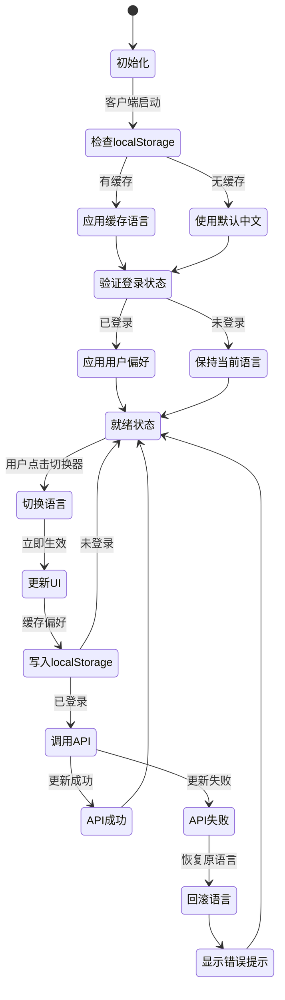
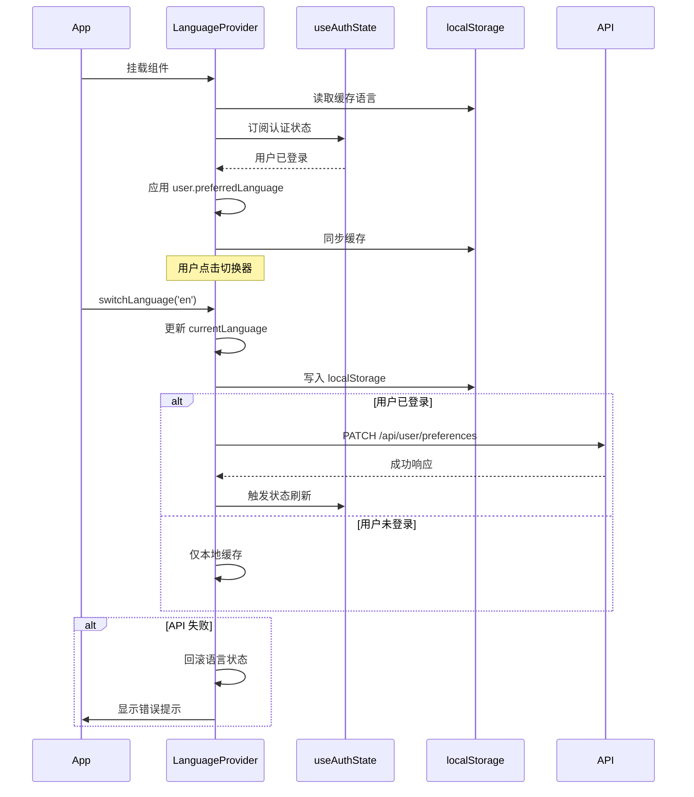
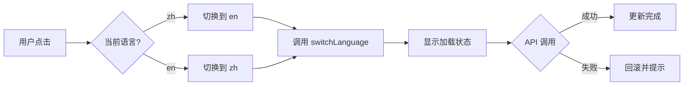
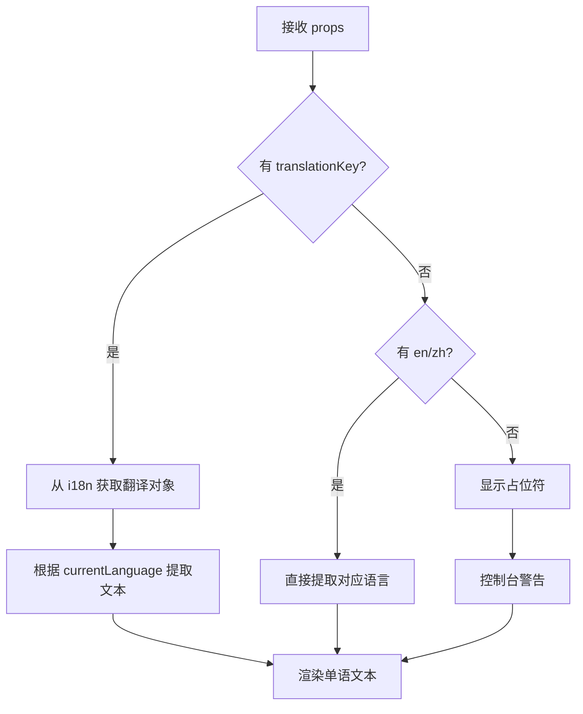
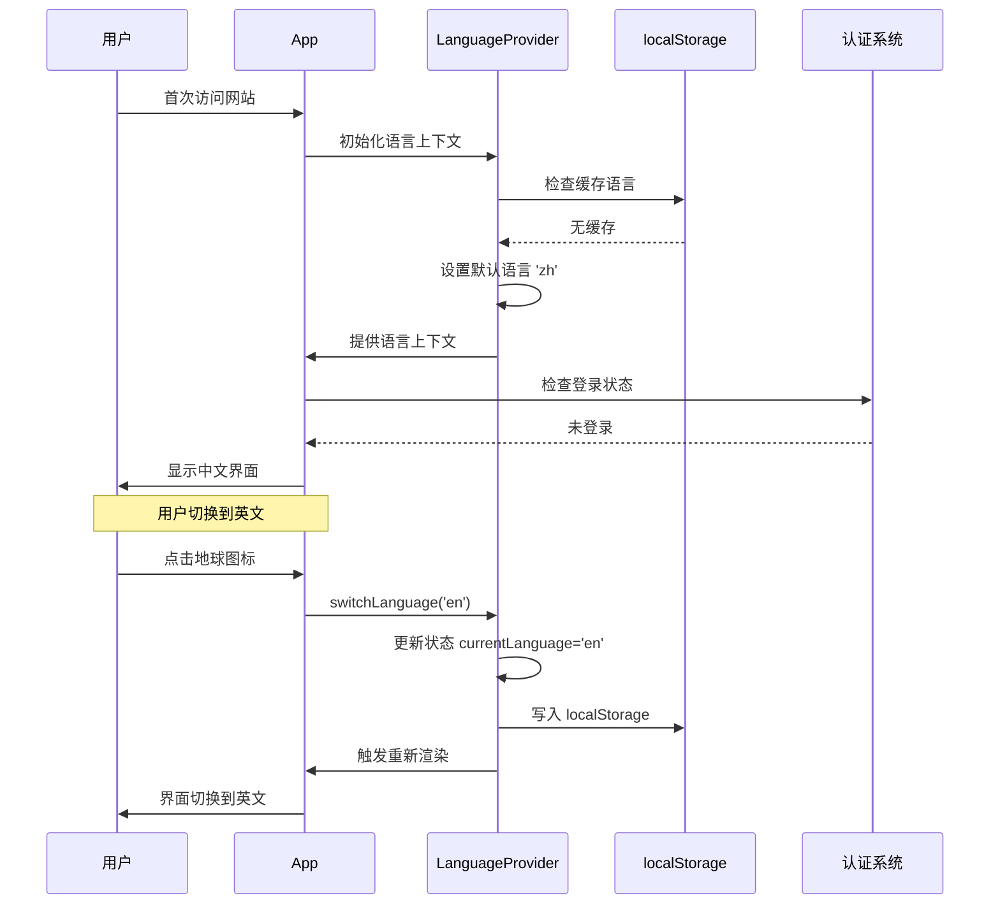
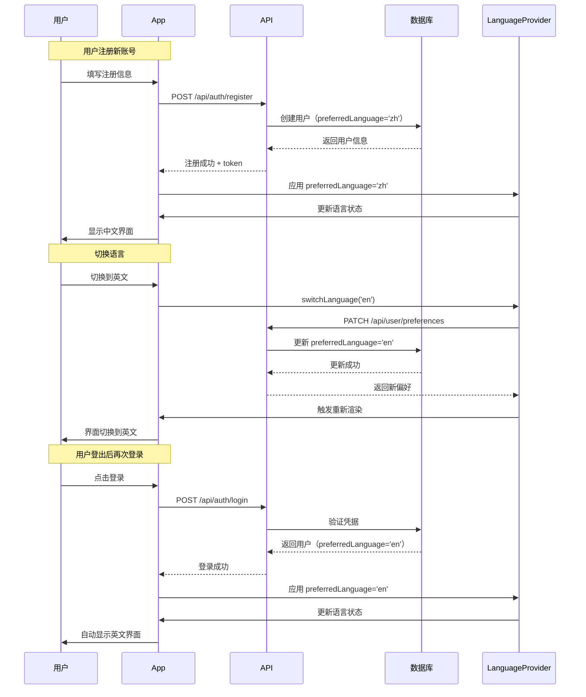
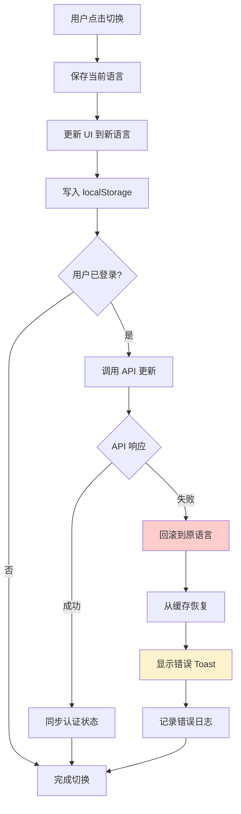

# 语言偏好切换系统设计文档

## 1. 概述

### 1.1 功能背景
当前系统通过 `BilingualText` 组件和 `useBilingualText` Hook 默认展示"英文 中文"格式的双语文本。本设计旨在实现基于数据库的用户语言偏好管理，允许用户通过右上角地球图标在中英文之间切换，且默认仅显示中文内容。用户的语言偏好将持久化到数据库，并在登录后自动应用。

### 1.2 核心目标
- 用户默认仅看到中文内容（新用户、未登录用户）
- 支持通过地球图标切换语言，切换后立即更新所有 UI 文案
- 语言偏好持久化到数据库，登录后自动恢复
- 复用现有 i18n 基础设施，无需引入新框架
- 未登录用户使用 `localStorage` 暂存偏好（可选）

### 1.3 实施范围

**包含内容**:
- 数据库 Schema 扩展（`users` 表新增 `preferredLanguage` 字段）
- 用户偏好读写 API 端点
- 前端语言状态管理与持久化
- 全局语言切换器 UI 组件
- `BilingualText` 和相关组件的单语渲染逻辑
- 登录流程中语言偏好的自动应用

**不包含内容**:
- 新增其他语言支持（仅限中英文）
- 自动检测用户浏览器语言
- AI 接口返回内容的语言调整

### 1.4 成功标准
- 登录用户刷新页面后保持上次选择的语言
- 切换语言后所有双语文案仅显示对应语种
- 地球图标在桌面和移动端均可正常使用，无文字或 tooltip
- 数据库迁移成功，新字段通过 Prisma 校验
- 切换语言无需刷新页面，即时生效

## 2. 架构设计

### 2.1 系统架构图

```mermaid
flowchart TB
    subgraph Client["客户端"]
        UI[用户界面]
        LSwitcher[语言切换器组件]
        BText[BilingualText组件]
        LContext[语言上下文Provider]
        LSStorage[localStorage]
    end
    
    subgraph State["状态管理"]
        AuthState[useAuthState Hook]
        LangState[语言偏好状态]
    end
    
    subgraph API["API层"]
        AuthAPI[/api/auth/me]
        PrefAPI[/api/user/preferences]
        LoginAPI[/api/auth/login]
    end
    
    subgraph Database["数据库"]
        UserTable[(users表)]
    end
    
    UI --> LSwitcher
    UI --> BText
    LSwitcher --> LContext
    BText --> LContext
    
    LContext --> LangState
    LangState --> AuthState
    
    AuthState --> AuthAPI
    LSwitcher --> PrefAPI
    LoginAPI --> AuthAPI
    
    AuthAPI --> UserTable
    PrefAPI --> UserTable
    LoginAPI --> UserTable
    
    LangState -.暂存.-> LSStorage
    
    style UserTable fill:#e1f5ff
    style LContext fill:#fff4e6
    style LSwitcher fill:#e8f5e9
```

### 2.2 数据模型设计

#### 2.2.1 Users 表扩展

| 字段名 | 类型 | 约束 | 默认值 | 说明 |
|--------|------|------|--------|------|
| id | String | PRIMARY KEY | - | 用户唯一标识 |
| email | String | UNIQUE | - | 用户邮箱 |
| password | String | NOT NULL | - | 加密密码 |
| name | String? | NULLABLE | - | 用户名称 |
| isAdmin | Boolean | NOT NULL | false | 管理员标识 |
| **preferredLanguage** | **String** | **NOT NULL** | **'zh'** | **语言偏好（'zh' / 'en'）** |
| createdAt | DateTime | NOT NULL | now() | 创建时间 |
| updatedAt | DateTime | NOT NULL | now() | 更新时间 |

**索引策略**:
- 已有索引保持不变
- 无需为 `preferredLanguage` 单独建索引（读取频率通过主键查询）

**数据迁移要点**:
- 为所有现有用户设置 `preferredLanguage = 'zh'`
- 字段类型使用 `String` 而非 `Enum`，便于未来扩展
- 添加数据库级 CHECK 约束：`preferredLanguage IN ('zh', 'en')`（PostgreSQL 支持，SQLite 通过应用层验证）

### 2.3 API 接口设计

#### 2.3.1 获取用户信息（扩展现有接口）

**接口路径**: `GET /api/auth/me`

**功能扩展**: 响应体中包含 `preferredLanguage` 字段

**响应示例**:
```json
{
  "user": {
    "id": "user123",
    "email": "user@example.com",
    "name": "张三",
    "isAdmin": false,
    "preferredLanguage": "zh",
    "createdAt": "2024-01-01T00:00:00Z",
    "updatedAt": "2024-01-15T12:00:00Z"
  },
  "metadata": {
    "cacheVersion": 12345,
    "lastModified": "2024-01-15T12:00:00Z"
  }
}
```

#### 2.3.2 更新语言偏好

**接口路径**: `PATCH /api/user/preferences`

**请求头**:
| 字段 | 值 | 必填 |
|------|-----|------|
| Content-Type | application/json | 是 |
| Authorization | Bearer {token} | 是（或 Cookie） |

**请求体**:
```json
{
  "preferredLanguage": "en"
}
```

**参数验证**:
| 参数 | 类型 | 约束 | 说明 |
|------|------|------|------|
| preferredLanguage | string | 必填，只能为 'zh' 或 'en' | 目标语言 |

**响应**:

成功（200）:
```json
{
  "success": true,
  "user": {
    "id": "user123",
    "preferredLanguage": "en",
    "updatedAt": "2024-01-15T12:30:00Z"
  }
}
```

失败（400）:
```json
{
  "error": "Invalid language preference",
  "message": "Language must be 'zh' or 'en'"
}
```

失败（401）:
```json
{
  "error": "Unauthorized",
  "message": "Authentication required"
}
```

#### 2.3.3 登录接口扩展

**接口路径**: `POST /api/auth/login`

**功能扩展**: 响应体中包含 `preferredLanguage` 字段

**响应示例**:
```json
{
  "user": {
    "id": "user123",
    "email": "user@example.com",
    "name": "张三",
    "isAdmin": false,
    "preferredLanguage": "zh",
    "createdAt": "2024-01-01T00:00:00Z",
    "updatedAt": "2024-01-15T12:00:00Z"
  },
  "token": "eyJhbGciOiJIUzI1NiIsInR5cCI6IkpXVCJ9..."
}
```

### 2.4 状态管理设计

#### 2.4.1 语言状态流转



#### 2.4.2 语言上下文数据结构

**LanguageContextType**:
| 属性 | 类型 | 说明 |
|------|------|------|
| currentLanguage | 'zh' \| 'en' | 当前激活语言 |
| isChanging | boolean | 是否正在切换中 |
| switchLanguage | (lang: 'zh' \| 'en') => Promise\<void\> | 切换语言函数 |
| isReady | boolean | 是否初始化完成 |

**状态优先级**:
1. 用户数据库偏好（最高优先级）
2. localStorage 缓存偏好
3. 默认语言（'zh'）

### 2.5 前端组件设计

#### 2.5.1 LanguageProvider 组件

**职责**:
- 管理全局语言状态
- 监听认证状态变化，同步用户偏好
- 提供语言切换方法
- 处理 localStorage 同步

**生命周期**:


#### 2.5.2 LanguageSwitcher 组件

**UI 规格**:

| 属性 | 桌面端 | 移动端 |
|------|--------|--------|
| 图标 | 地球图标（🌐 或 Lucide Globe） | 同左 |
| 尺寸 | 40x40px | 44x44px（符合触控规范） |
| 位置 | 右上角导航区 | 右上角导航区 |
| 文字 | 无 | 无 |
| Tooltip | 无 | 无 |
| 交互反馈 | Hover 高亮 | 触摸涟漪效果 |

**视觉状态**:
- 默认：半透明背景
- 激活中文：无特殊标识（依赖 UI 反馈）
- 激活英文：无特殊标识
- 切换中：旋转动画（0.3s）
- 错误：红色边框闪烁（1s）

**交互逻辑**:


#### 2.5.3 BilingualText 组件改造

**改造策略**: 修改渲染逻辑，根据 `currentLanguage` 仅渲染单一语言文本

**渲染决策流程**:


**核心修改点**:
- `formatBilingual` 改为 `selectLanguage(en, zh, currentLanguage)`
- `getBilingualValue` 内部调用新函数
- 保持向后兼容（内部转换逻辑，外部 API 不变）

## 3. 业务流程设计

### 3.1 首次访问流程



### 3.2 注册与登录流程



### 3.3 切换语言失败处理



**错误处理策略**:

| 错误类型 | 用户提示（中文） | 用户提示（英文） | 处理方式 |
|---------|----------------|----------------|---------|
| 网络超时 | 网络连接超时，语言设置未保存 | Network timeout, preference not saved | 回滚 + 本地保留新语言 |
| 401 未授权 | 登录已过期，请重新登录 | Session expired, please login | 回滚 + 显示登录框 |
| 500 服务器错误 | 服务器繁忙，请稍后重试 | Server error, please retry | 回滚 + 允许重试 |
| 验证失败 | 无效的语言选项 | Invalid language option | 回滚 + 控制台警告 |

## 4. 技术实现方案

### 4.1 数据库迁移

**迁移文件命名**: `20240115_add_preferred_language_to_users`

**SQLite 迁移 SQL**:
```sql
-- 新增字段
ALTER TABLE users ADD COLUMN preferred_language TEXT NOT NULL DEFAULT 'zh';

-- 为现有用户设置默认值（已通过 DEFAULT 处理）
-- UPDATE users SET preferred_language = 'zh' WHERE preferred_language IS NULL;
```

**PostgreSQL 迁移 SQL**（生产环境）:
```sql
-- 新增字段（带 CHECK 约束）
ALTER TABLE users ADD COLUMN preferred_language VARCHAR(2) NOT NULL DEFAULT 'zh';
ALTER TABLE users ADD CONSTRAINT check_language CHECK (preferred_language IN ('zh', 'en'));

-- 为现有用户设置默认值
UPDATE users SET preferred_language = 'zh' WHERE preferred_language IS NULL;
```

**Prisma Schema 更新**:
```prisma
model User {
  id                String    @id @default(cuid())
  email             String    @unique
  password          String
  name              String?
  isAdmin           Boolean   @default(false)
  preferredLanguage String    @default("zh") @map("preferred_language")
  createdAt         DateTime  @default(now()) @map("created_at")
  updatedAt         DateTime  @updatedAt @map("updated_at")
  
  practiceSessions PracticeSession[]
  
  @@index([isAdmin])
  @@index([createdAt])
  @@map("users")
}
```

**迁移验证清单**:
- [ ] 在开发环境（SQLite）执行迁移
- [ ] 验证新用户注册时 `preferredLanguage` 默认为 'zh'
- [ ] 验证现有用户数据完整性
- [ ] 在测试环境（PostgreSQL）执行迁移
- [ ] 验证 CHECK 约束生效
- [ ] 运行 Prisma 客户端生成：`npx prisma generate`

### 4.2 API 层实现要点

#### 4.2.1 GET /api/auth/me 扩展

**修改点**:
- `auth.ts` 中的 `BASE_USER_SELECT` 新增 `preferredLanguage: true`
- 响应体自动包含该字段

**无需额外逻辑修改**（字段自动包含在查询结果中）

#### 4.2.2 PATCH /api/user/preferences 实现

**核心逻辑**:
1. 验证用户身份（复用 `requireAuth` 中间件）
2. 验证 `preferredLanguage` 参数（'zh' 或 'en'）
3. 更新数据库用户记录
4. 清除用户缓存（调用 `clearUserCache(userId)`）
5. 返回更新后的用户信息

**伪代码逻辑**:
```
function handlePreferencesUpdate(request):
  // 认证检查
  authResult = requireAuth(request)
  if authResult.error:
    return 401 Unauthorized
  
  // 解析请求体
  body = parseJSON(request.body)
  language = body.preferredLanguage
  
  // 参数验证
  if language not in ['zh', 'en']:
    return 400 Bad Request
  
  // 更新数据库
  user = updateUser(authResult.user.userId, {
    preferredLanguage: language
  })
  
  // 清除缓存
  clearUserCache(user.id)
  
  // 返回结果
  return 200 OK {
    success: true,
    user: {
      id: user.id,
      preferredLanguage: user.preferredLanguage,
      updatedAt: user.updatedAt
    }
  }
```

**错误处理**:
- 捕获数据库异常（连接失败、约束冲突）
- 记录错误日志
- 返回通用 500 错误，避免暴露内部细节

#### 4.2.3 POST /api/auth/login 扩展

**修改点**: 无需修改，`preferredLanguage` 字段已包含在用户查询中

### 4.3 前端状态管理实现

#### 4.3.1 LanguageProvider 实现要点

**状态定义**:
```typescript
type Language = 'zh' | 'en'

interface LanguageState {
  currentLanguage: Language
  isChanging: boolean
  isReady: boolean
}
```

**初始化逻辑**:
```
useEffect(() => {
  // 1. 读取 localStorage
  cachedLang = localStorage.getItem('elt.language')
  
  // 2. 设置初始语言
  if cachedLang and cachedLang in ['zh', 'en']:
    setCurrentLanguage(cachedLang)
  else:
    setCurrentLanguage('zh')
  
  // 3. 标记就绪
  setIsReady(true)
}, [])
```

**监听认证状态**:
```
useEffect(() => {
  if authState.user and authState.user.preferredLanguage:
    // 用户偏好优先级最高
    if currentLanguage != authState.user.preferredLanguage:
      setCurrentLanguage(authState.user.preferredLanguage)
      localStorage.setItem('elt.language', authState.user.preferredLanguage)
}, [authState.user])
```

**切换语言函数**:
```
async function switchLanguage(newLang: Language): Promise<void> {
  previousLang = currentLanguage
  
  try:
    // 立即更新 UI
    setIsChanging(true)
    setCurrentLanguage(newLang)
    localStorage.setItem('elt.language', newLang)
    
    // 如果已登录，调用 API
    if authState.isAuthenticated:
      response = await fetch('/api/user/preferences', {
        method: 'PATCH',
        body: JSON.stringify({ preferredLanguage: newLang })
      })
      
      if not response.ok:
        throw new Error('Failed to update preference')
      
      // 刷新认证状态
      authState.checkAuthStatus()
    
    setIsChanging(false)
  
  catch error:
    // 回滚
    setCurrentLanguage(previousLang)
    localStorage.setItem('elt.language', previousLang)
    setIsChanging(false)
    
    // 显示错误提示
    toast.error(getErrorMessage(error))
```

#### 4.3.2 useAuthState Hook 扩展

**修改点**:
- `AuthUserInfo` 接口新增 `preferredLanguage?: string` 字段
- 无需其他逻辑修改（字段自动包含在 API 响应中）

### 4.4 UI 组件实现

#### 4.4.1 LanguageSwitcher 组件

**组件结构**:
```
LanguageSwitcher
├── Button 容器（无边框，圆形）
│   ├── Globe 图标（Lucide React）
│   └── 旋转动画（isChanging 时）
└── 错误状态指示（红色边框）
```

**样式规格**（Tailwind CSS）:
- 容器：`w-10 h-10 md:w-10 md:h-10 rounded-full hover:bg-accent transition-colors`
- 图标：`w-5 h-5 text-foreground`
- 旋转：`animate-spin`（0.3s duration）
- 错误：`ring-2 ring-destructive animate-pulse`

**可访问性**:
- `aria-label`: "Switch language 切换语言"
- `role`: "button"
- `tabIndex`: 0
- 键盘支持：Enter / Space 触发切换

#### 4.4.2 BilingualText 改造

**新增工具函数**:
```typescript
function selectLanguage(
  en: string,
  zh: string,
  currentLanguage: Language
): string {
  return currentLanguage === 'en' ? en : zh
}
```

**修改点**:
```
// 原逻辑
displayText = formatBilingual(en, zh, options)

// 新逻辑
displayText = selectLanguage(en, zh, currentLanguage) + unitSuffix
```

**向后兼容**:
- `formatBilingual` 函数保留（内部可能仍用于特殊场景）
- 组件外部 API 不变，仅内部实现调整

### 4.5 布局集成

**App Layout 修改**:
```
RootLayout
└── ThemeProvider
    └── LanguageProvider（新增）
        └── ErrorBoundary
            └── {children}
```

**导航栏集成**:
```
NavBar（或 Header 组件）
├── Logo
├── 导航链接
├── ThemeToggle（主题切换器）
├── LanguageSwitcher（新增）
└── UserMenu
```

**位置约定**:
- 桌面端：ThemeToggle 右侧，UserMenu 左侧
- 移动端：与主题切换器并排，收起在汉堡菜单中（可选）

## 5. 测试策略

### 5.1 数据库迁移测试

| 测试场景 | 验证点 | 预期结果 |
|---------|--------|---------|
| 新用户注册 | `preferredLanguage` 字段值 | 默认为 'zh' |
| 现有用户查询 | 字段存在性 | 字段存在且为 'zh' |
| 字段约束（PostgreSQL） | 插入非法值 'fr' | 抛出约束错误 |
| 字段默认值 | 创建用户未指定语言 | 自动设置为 'zh' |

### 5.2 API 单元测试

**GET /api/auth/me**:
- [ ] 响应包含 `preferredLanguage` 字段
- [ ] 字段值为 'zh' 或 'en'

**PATCH /api/user/preferences**:
- [ ] 未登录返回 401
- [ ] 有效语言参数返回 200
- [ ] 无效语言参数返回 400
- [ ] 数据库更新成功
- [ ] 缓存被清除

**POST /api/auth/login**:
- [ ] 响应包含 `preferredLanguage` 字段
- [ ] 字段值与数据库一致

### 5.3 前端集成测试

**LanguageProvider**:
- [ ] 初始化时读取 localStorage
- [ ] 无缓存时默认为 'zh'
- [ ] 监听认证状态变化
- [ ] 用户登录后应用数据库偏好
- [ ] 用户登出后保持 localStorage 缓存

**LanguageSwitcher**:
- [ ] 点击切换语言
- [ ] 切换时显示加载状态
- [ ] API 成功后 UI 更新
- [ ] API 失败后回滚并提示错误
- [ ] 键盘导航可用

**BilingualText**:
- [ ] currentLanguage='zh' 时仅显示中文
- [ ] currentLanguage='en' 时仅显示英文
- [ ] 切换语言后立即更新文本
- [ ] 无翻译时显示占位符

### 5.4 端到端测试场景

**场景 1：首次访问 → 注册 → 切换语言**
```
1. 打开网站
   验证：界面显示中文
2. 点击注册
   验证：注册表单为中文
3. 提交注册
   验证：注册成功，界面保持中文
4. 点击地球图标切换到英文
   验证：界面立即切换到英文
5. 刷新页面
   验证：界面仍为英文
```

**场景 2：登录 → 切换语言 → 登出 → 再登录**
```
1. 登录账号（preferredLanguage='zh'）
   验证：界面显示中文
2. 切换到英文
   验证：界面切换到英文，数据库已更新
3. 登出
   验证：界面保持英文（localStorage 缓存）
4. 再次登录
   验证：界面仍为英文（数据库偏好生效）
```

**场景 3：离线切换语言（未登录）**
```
1. 断开网络
2. 点击地球图标
   验证：界面切换成功，localStorage 已更新
3. 重新连接网络并登录
   验证：弹出提示同步偏好，或自动同步到数据库
```

## 6. 错误处理与边界情况

### 6.1 异常场景处理表

| 场景 | 处理策略 | 用户体验 |
|------|---------|---------|
| localStorage 不可用 | 仅使用内存状态 | 刷新后丢失偏好 |
| API 更新超时 | 3 秒后回滚 | Toast 提示"网络超时" |
| 数据库字段缺失（旧版本） | 前端默认 'zh' | 降级体验，无错误 |
| 用户偏好为非法值 | 重置为 'zh' | 记录警告日志 |
| 并发切换请求 | 取消前一个请求 | 以最后一次为准 |

### 6.2 降级方案

**当 API 不可用时**:
- 仅使用 localStorage 保存偏好
- 在顶部显示横幅："语言设置暂未同步到服务器"
- 下次登录时检测差异，提示用户选择

**当数据库迁移未完成时**:
- 前端检测 `preferredLanguage` 字段是否存在
- 若不存在，使用本地逻辑，不调用更新 API
- 记录错误到监控系统

## 7. 性能优化

### 7.1 性能指标

| 指标 | 目标值 | 测量方法 |
|------|--------|---------|
| 初始化语言上下文 | < 50ms | Performance.now() |
| 切换语言响应时间 | < 300ms | 点击到 UI 更新 |
| API 更新响应时间 | < 500ms | 网络面板 |
| 重新渲染组件数量 | < 20 个 | React DevTools Profiler |

### 7.2 优化策略

**避免不必要的重新渲染**:
- 使用 `useMemo` 缓存语言上下文值
- `BilingualText` 组件使用 `React.memo`
- 语言切换时仅触发订阅该上下文的组件更新

**减少 API 调用**:
- 短时间内连续切换使用防抖（300ms）
- 取消进行中的请求（AbortController）

**缓存优化**:
- localStorage 读写异步化（Web Worker，可选）
- i18n 翻译对象缓存保持不变

## 8. 安全考虑

### 8.1 输入验证

**客户端验证**:
- 下拉选择器限定为 'zh' / 'en'（用户无法输入任意值）
- TypeScript 类型检查

**服务端验证**:
- 严格校验 `preferredLanguage` 参数
- 拒绝非法值，返回 400 错误
- 使用白名单验证（不依赖枚举类型）

### 8.2 权限控制

**API 访问控制**:
- `/api/user/preferences` 需要认证（检查 JWT）
- 仅允许用户修改自己的偏好
- 管理员无特殊权限（一致性原则）

**数据隔离**:
- 用户 A 无法修改用户 B 的语言偏好
- API 从 JWT 中提取 `userId`，不信任请求体

### 8.3 防护措施

**防止 CSRF**:
- 使用 SameSite Cookie
- API 调用使用 PATCH 方法（非幂等）

**防止 XSS**:
- 语言参数严格验证，不渲染到 DOM
- React 自动转义输出

**速率限制**:
- 同一用户 1 分钟内最多切换 10 次语言
- 超出限制返回 429 Too Many Requests

## 9. 部署与回滚

### 9.1 部署步骤

**阶段 1：数据库迁移**（T0）
1. 在生产数据库执行迁移 SQL
2. 验证 `preferredLanguage` 字段已添加
3. 检查现有用户默认值为 'zh'

**阶段 2：后端部署**（T0 + 10分钟）
1. 部署 API 更新（`/api/user/preferences` 等）
2. 验证健康检查通过
3. 测试语言偏好更新接口

**阶段 3：前端部署**（T0 + 20分钟）
1. 部署前端代码（LanguageProvider、BilingualText）
2. 验证语言切换器显示
3. 测试完整流程

**阶段 4：监控观察**（T0 + 30分钟）
1. 监控错误日志
2. 检查 API 调用成功率
3. 收集用户反馈

### 9.2 回滚方案

**前端快速回滚**:
- 恢复上一版本前端代码
- 用户重新看到双语文案
- 数据库字段保留（不影响功能）

**后端回滚**:
- 禁用 `/api/user/preferences` 端点（返回 501 Not Implemented）
- 保持数据库字段（向前兼容）

**数据库回滚**（不推荐）:
- 仅在迁移后 1 小时内且无用户数据变更时执行
- 删除 `preferredLanguage` 字段
- 需要同步回滚后端代码

### 9.3 灰度发布（可选）

**灰度策略**:
- 阶段 1：内部测试账号（5%）
- 阶段 2：新注册用户（20%）
- 阶段 3：全量用户（100%）

**灰度开关**:
- 环境变量 `ENABLE_LANGUAGE_SWITCHING`
- Feature Flag 服务（如 LaunchDarkly）

## 10. 监控与日志

### 10.1 关键指标

**业务指标**:
| 指标名称 | 计算方式 | 告警阈值 |
|---------|---------|---------|
| 语言切换成功率 | 成功次数 / 总次数 | < 95% |
| 中文用户占比 | 使用中文用户 / 总用户 | - |
| 英文用户占比 | 使用英文用户 / 总用户 | - |
| 语言偏好更新失败率 | 失败次数 / 总次数 | > 5% |

**技术指标**:
| 指标名称 | 计算方式 | 告警阈值 |
|---------|---------|---------|
| API 响应时间（P95） | /api/user/preferences | > 1000ms |
| 前端切换延迟（P95） | 点击到渲染完成 | > 500ms |
| 数据库查询时间 | UPDATE users | > 100ms |

### 10.2 日志记录

**应记录的事件**:
- 用户切换语言（userId、oldLang、newLang、timestamp）
- API 更新失败（userId、error、timestamp）
- 数据库约束冲突（userId、invalidValue、timestamp）
- localStorage 不可用（userAgent、timestamp）

**日志级别**:
- INFO：正常切换
- WARN：API 失败、回滚
- ERROR：数据库错误、验证失败
- DEBUG：详细状态变更（开发环境）

**日志格式**（JSON）:
```json
{
  "timestamp": "2024-01-15T12:30:00Z",
  "level": "INFO",
  "event": "language_switched",
  "userId": "user123",
  "oldLanguage": "zh",
  "newLanguage": "en",
  "source": "ui_click",
  "duration_ms": 320
}
```

## 11. 国际化翻译资源扩展

### 11.1 新增翻译键

**common.json 扩展**:
| 键路径 | 中文 | 英文 |
|--------|------|------|
| errors.languageUpdateFailed | 语言设置更新失败 | Failed to update language preference |
| errors.invalidLanguage | 无效的语言选项 | Invalid language option |
| messages.languageSwitched | 语言已切换 | Language switched |

**components.json 扩展**:
| 键路径 | 中文 | 英文 |
|--------|------|------|
| languageSwitcher.ariaLabel | 切换语言 | Switch language |
| languageSwitcher.switchingTo | 正在切换到{language} | Switching to {language} |

### 11.2 动态文本处理

**Toast 提示双语化**:
```
// 错误提示
currentLanguage === 'zh' 
  ? "网络连接超时，语言设置未保存"
  : "Network timeout, preference not saved"

// 成功提示
currentLanguage === 'zh'
  ? "语言已切换"
  : "Language switched"
```

## 12. 附录

### 12.1 相关文件清单

**数据库层**:
- `prisma/schema.prisma` - Schema 定义
- `prisma/migrations/20240115_add_preferred_language_to_users/migration.sql` - 迁移文件

**后端 API**:
- `lib/auth.ts` - 用户查询扩展
- `app/api/user/preferences/route.ts` - 新增偏好更新端点
- `app/api/auth/me/route.ts` - 响应扩展（无需修改，自动包含）
- `app/api/auth/login/route.ts` - 响应扩展（无需修改）

**前端组件**:
- `components/providers/language-provider.tsx` - 新增语言上下文
- `components/ui/language-switcher.tsx` - 新增切换器组件
- `components/ui/bilingual-text.tsx` - 改造单语渲染
- `hooks/use-bilingual-text.ts` - 改造工具函数
- `hooks/use-auth-state.ts` - 类型扩展

**配置文件**:
- `lib/i18n/translations/common.json` - 新增翻译键
- `lib/i18n/translations/components.json` - 新增翻译键
- `lib/i18n/types.ts` - 类型定义扩展

**布局集成**:
- `app/layout.tsx` - 添加 LanguageProvider
- 导航栏组件（待定，可能是 `components/nav-bar.tsx`）

### 12.2 技术依赖

**现有依赖**（无需新增）:
- React 19
- Next.js 15
- Prisma ORM
- i18next
- Tailwind CSS
- Lucide React（地球图标）

**环境变量**（无新增）:
- `DATABASE_URL` - 数据库连接
- `JWT_SECRET` - JWT 密钥

### 12.3 术语表

| 术语 | 定义 |
|------|------|
| 语言偏好 | 用户选择的界面显示语言（'zh' 或 'en'） |
| 单语渲染 | BilingualText 仅显示当前语言文本，而非"英文 中文"格式 |
| 双语格式 | 原有的"English 中文"并排显示模式 |
| 地球图标 | 语言切换器的 UI 表现形式，无文字标签 |
| 语言上下文 | LanguageProvider 提供的全局语言状态 |
| 偏好同步 | 将 localStorage 缓存与数据库字段保持一致的过程 |
| 回滚 | API 失败后恢复到切换前的语言状态 |

### 12.4 参考资料

**设计模式**:
- React Context API 最佳实践
- 乐观 UI 更新模式
- 错误边界与回滚策略

**标准规范**:
- WCAG 2.1 可访问性指南（语言切换器）
- ISO 639-1 语言代码（'zh', 'en'）
- REST API 设计规范（PATCH 方法语义）
- 切换语言无需刷新页面，即时生效

## 2. 架构设计

### 2.1 系统架构图

```mermaid
flowchart TB
    subgraph Client["客户端"]
        UI[用户界面]
        LSwitcher[语言切换器组件]
        BText[BilingualText组件]
        LContext[语言上下文Provider]
        LSStorage[localStorage]
    end
    
    subgraph State["状态管理"]
        AuthState[useAuthState Hook]
        LangState[语言偏好状态]
    end
    
    subgraph API["API层"]
        AuthAPI[/api/auth/me]
        PrefAPI[/api/user/preferences]
        LoginAPI[/api/auth/login]
    end
    
    subgraph Database["数据库"]
        UserTable[(users表)]
    end
    
    UI --> LSwitcher
    UI --> BText
    LSwitcher --> LContext
    BText --> LContext
    
    LContext --> LangState
    LangState --> AuthState
    
    AuthState --> AuthAPI
    LSwitcher --> PrefAPI
    LoginAPI --> AuthAPI
    
    AuthAPI --> UserTable
    PrefAPI --> UserTable
    LoginAPI --> UserTable
    
    LangState -.暂存.-> LSStorage
    
    style UserTable fill:#e1f5ff
    style LContext fill:#fff4e6
    style LSwitcher fill:#e8f5e9
```

### 2.2 数据模型设计

#### 2.2.1 Users 表扩展

| 字段名 | 类型 | 约束 | 默认值 | 说明 |
|--------|------|------|--------|------|
| id | String | PRIMARY KEY | - | 用户唯一标识 |
| email | String | UNIQUE | - | 用户邮箱 |
| password | String | NOT NULL | - | 加密密码 |
| name | String? | NULLABLE | - | 用户名称 |
| isAdmin | Boolean | NOT NULL | false | 管理员标识 |
| **preferredLanguage** | **String** | **NOT NULL** | **'zh'** | **语言偏好（'zh' / 'en'）** |
| createdAt | DateTime | NOT NULL | now() | 创建时间 |
| updatedAt | DateTime | NOT NULL | now() | 更新时间 |

**索引策略**:
- 已有索引保持不变
- 无需为 `preferredLanguage` 单独建索引（读取频率通过主键查询）

**数据迁移要点**:
- 为所有现有用户设置 `preferredLanguage = 'zh'`
- 字段类型使用 `String` 而非 `Enum`，便于未来扩展
- 添加数据库级 CHECK 约束：`preferredLanguage IN ('zh', 'en')`（PostgreSQL 支持，SQLite 通过应用层验证）

### 2.3 API 接口设计

#### 2.3.1 获取用户信息（扩展现有接口）

**接口路径**: `GET /api/auth/me`

**功能扩展**: 响应体中包含 `preferredLanguage` 字段

**响应示例**:
```json
{
  "user": {
    "id": "user123",
    "email": "user@example.com",
    "name": "张三",
    "isAdmin": false,
    "preferredLanguage": "zh",
    "createdAt": "2024-01-01T00:00:00Z",
    "updatedAt": "2024-01-15T12:00:00Z"
  },
  "metadata": {
    "cacheVersion": 12345,
    "lastModified": "2024-01-15T12:00:00Z"
  }
}
```

#### 2.3.2 更新语言偏好

**接口路径**: `PATCH /api/user/preferences`

**请求头**:
| 字段 | 值 | 必填 |
|------|-----|------|
| Content-Type | application/json | 是 |
| Authorization | Bearer {token} | 是（或 Cookie） |

**请求体**:
```json
{
  "preferredLanguage": "en"
}
```

**参数验证**:
| 参数 | 类型 | 约束 | 说明 |
|------|------|------|------|
| preferredLanguage | string | 必填，只能为 'zh' 或 'en' | 目标语言 |

**响应**:

成功（200）:
```json
{
  "success": true,
  "user": {
    "id": "user123",
    "preferredLanguage": "en",
    "updatedAt": "2024-01-15T12:30:00Z"
  }
}
```

失败（400）:
```json
{
  "error": "Invalid language preference",
  "message": "Language must be 'zh' or 'en'"
}
```

失败（401）:
```json
{
  "error": "Unauthorized",
  "message": "Authentication required"
}
```

#### 2.3.3 登录接口扩展

**接口路径**: `POST /api/auth/login`

**功能扩展**: 响应体中包含 `preferredLanguage` 字段

**响应示例**:
```json
{
  "user": {
    "id": "user123",
    "email": "user@example.com",
    "name": "张三",
    "isAdmin": false,
    "preferredLanguage": "zh",
    "createdAt": "2024-01-01T00:00:00Z",
    "updatedAt": "2024-01-15T12:00:00Z"
  },
  "token": "eyJhbGciOiJIUzI1NiIsInR5cCI6IkpXVCJ9..."
}
```

### 2.4 状态管理设计

#### 2.4.1 语言状态流转


#### 2.4.2 语言上下文数据结构

**LanguageContextType**:
| 属性 | 类型 | 说明 |
|------|------|------|
| currentLanguage | 'zh' \| 'en' | 当前激活语言 |
| isChanging | boolean | 是否正在切换中 |
| switchLanguage | (lang: 'zh' \| 'en') => Promise\<void\> | 切换语言函数 |
| isReady | boolean | 是否初始化完成 |

**状态优先级**:
1. 用户数据库偏好（最高优先级）
2. localStorage 缓存偏好
3. 默认语言（'zh'）

### 2.5 前端组件设计

#### 2.5.1 LanguageProvider 组件

**职责**:
- 管理全局语言状态
- 监听认证状态变化，同步用户偏好
- 提供语言切换方法
- 处理 localStorage 同步

**生命周期**:


#### 2.5.2 LanguageSwitcher 组件

**UI 规格**:

| 属性 | 桌面端 | 移动端 |
|------|--------|--------|
| 图标 | 地球图标（🌐 或 Lucide Globe） | 同左 |
| 尺寸 | 40x40px | 44x44px（符合触控规范） |
| 位置 | 右上角导航区 | 右上角导航区 |
| 文字 | 无 | 无 |
| Tooltip | 无 | 无 |
| 交互反馈 | Hover 高亮 | 触摸涟漪效果 |

**视觉状态**:
- 默认：半透明背景
- 激活中文：无特殊标识（依赖 UI 反馈）
- 激活英文：无特殊标识
- 切换中：旋转动画（0.3s）
- 错误：红色边框闪烁（1s）

**交互逻辑**:


#### 2.5.3 BilingualText 组件改造

**改造策略**: 修改渲染逻辑，根据 `currentLanguage` 仅渲染单一语言文本

**渲染决策流程**:


**核心修改点**:
- `formatBilingual` 改为 `selectLanguage(en, zh, currentLanguage)`
- `getBilingualValue` 内部调用新函数
- 保持向后兼容（内部转换逻辑，外部 API 不变）

## 3. 业务流程设计

### 3.1 首次访问流程


### 3.2 注册与登录流程


### 3.3 切换语言失败处理


**错误处理策略**:

| 错误类型 | 用户提示（中文） | 用户提示（英文） | 处理方式 |
|---------|----------------|----------------|---------|
| 网络超时 | 网络连接超时，语言设置未保存 | Network timeout, preference not saved | 回滚 + 本地保留新语言 |
| 401 未授权 | 登录已过期，请重新登录 | Session expired, please login | 回滚 + 显示登录框 |
| 500 服务器错误 | 服务器繁忙，请稍后重试 | Server error, please retry | 回滚 + 允许重试 |
| 验证失败 | 无效的语言选项 | Invalid language option | 回滚 + 控制台警告 |

## 4. 技术实现方案

### 4.1 数据库迁移

**迁移文件命名**: `20240115_add_preferred_language_to_users`

**SQLite 迁移 SQL**:
```sql
-- 新增字段
ALTER TABLE users ADD COLUMN preferred_language TEXT NOT NULL DEFAULT 'zh';

-- 为现有用户设置默认值（已通过 DEFAULT 处理）
-- UPDATE users SET preferred_language = 'zh' WHERE preferred_language IS NULL;
```

**PostgreSQL 迁移 SQL**（生产环境）:
```sql
-- 新增字段（带 CHECK 约束）
ALTER TABLE users ADD COLUMN preferred_language VARCHAR(2) NOT NULL DEFAULT 'zh';
ALTER TABLE users ADD CONSTRAINT check_language CHECK (preferred_language IN ('zh', 'en'));

-- 为现有用户设置默认值
UPDATE users SET preferred_language = 'zh' WHERE preferred_language IS NULL;
```

**Prisma Schema 更新**:
```prisma
model User {
  id                String    @id @default(cuid())
  email             String    @unique
  password          String
  name              String?
  isAdmin           Boolean   @default(false)
  preferredLanguage String    @default("zh") @map("preferred_language")
  createdAt         DateTime  @default(now()) @map("created_at")
  updatedAt         DateTime  @updatedAt @map("updated_at")
  
  practiceSessions PracticeSession[]
  
  @@index([isAdmin])
  @@index([createdAt])
  @@map("users")
}
```

**迁移验证清单**:
- [ ] 在开发环境（SQLite）执行迁移
- [ ] 验证新用户注册时 `preferredLanguage` 默认为 'zh'
- [ ] 验证现有用户数据完整性
- [ ] 在测试环境（PostgreSQL）执行迁移
- [ ] 验证 CHECK 约束生效
- [ ] 运行 Prisma 客户端生成：`npx prisma generate`

### 4.2 API 层实现要点

#### 4.2.1 GET /api/auth/me 扩展

**修改点**:
- `auth.ts` 中的 `BASE_USER_SELECT` 新增 `preferredLanguage: true`
- 响应体自动包含该字段

**无需额外逻辑修改**（字段自动包含在查询结果中）

#### 4.2.2 PATCH /api/user/preferences 实现

**核心逻辑**:
1. 验证用户身份（复用 `requireAuth` 中间件）
2. 验证 `preferredLanguage` 参数（'zh' 或 'en'）
3. 更新数据库用户记录
4. 清除用户缓存（调用 `clearUserCache(userId)`）
5. 返回更新后的用户信息

**伪代码逻辑**:
```
function handlePreferencesUpdate(request):
  // 认证检查
  authResult = requireAuth(request)
  if authResult.error:
    return 401 Unauthorized
  
  // 解析请求体
  body = parseJSON(request.body)
  language = body.preferredLanguage
  
  // 参数验证
  if language not in ['zh', 'en']:
    return 400 Bad Request
  
  // 更新数据库
  user = updateUser(authResult.user.userId, {
    preferredLanguage: language
  })
  
  // 清除缓存
  clearUserCache(user.id)
  
  // 返回结果
  return 200 OK {
    success: true,
    user: {
      id: user.id,
      preferredLanguage: user.preferredLanguage,
      updatedAt: user.updatedAt
    }
  }
```

**错误处理**:
- 捕获数据库异常（连接失败、约束冲突）
- 记录错误日志
- 返回通用 500 错误，避免暴露内部细节

#### 4.2.3 POST /api/auth/login 扩展

**修改点**: 无需修改，`preferredLanguage` 字段已包含在用户查询中

### 4.3 前端状态管理实现

#### 4.3.1 LanguageProvider 实现要点

**状态定义**:
```typescript
type Language = 'zh' | 'en'

interface LanguageState {
  currentLanguage: Language
  isChanging: boolean
  isReady: boolean
}
```

**初始化逻辑**:
```
useEffect(() => {
  // 1. 读取 localStorage
  cachedLang = localStorage.getItem('elt.language')
  
  // 2. 设置初始语言
  if cachedLang and cachedLang in ['zh', 'en']:
    setCurrentLanguage(cachedLang)
  else:
    setCurrentLanguage('zh')
  
  // 3. 标记就绪
  setIsReady(true)
}, [])
```

**监听认证状态**:
```
useEffect(() => {
  if authState.user and authState.user.preferredLanguage:
    // 用户偏好优先级最高
    if currentLanguage != authState.user.preferredLanguage:
      setCurrentLanguage(authState.user.preferredLanguage)
      localStorage.setItem('elt.language', authState.user.preferredLanguage)
}, [authState.user])
```

**切换语言函数**:
```
async function switchLanguage(newLang: Language): Promise<void> {
  previousLang = currentLanguage
  
  try:
    // 立即更新 UI
    setIsChanging(true)
    setCurrentLanguage(newLang)
    localStorage.setItem('elt.language', newLang)
    
    // 如果已登录，调用 API
    if authState.isAuthenticated:
      response = await fetch('/api/user/preferences', {
        method: 'PATCH',
        body: JSON.stringify({ preferredLanguage: newLang })
      })
      
      if not response.ok:
        throw new Error('Failed to update preference')
      
      // 刷新认证状态
      authState.checkAuthStatus()
    
    setIsChanging(false)
  
  catch error:
    // 回滚
    setCurrentLanguage(previousLang)
    localStorage.setItem('elt.language', previousLang)
    setIsChanging(false)
    
    // 显示错误提示
    toast.error(getErrorMessage(error))
```

#### 4.3.2 useAuthState Hook 扩展

**修改点**:
- `AuthUserInfo` 接口新增 `preferredLanguage?: string` 字段
- 无需其他逻辑修改（字段自动包含在 API 响应中）

### 4.4 UI 组件实现

#### 4.4.1 LanguageSwitcher 组件

**组件结构**:
```
LanguageSwitcher
├── Button 容器（无边框，圆形）
│   ├── Globe 图标（Lucide React）
│   └── 旋转动画（isChanging 时）
└── 错误状态指示（红色边框）
```

**样式规格**（Tailwind CSS）:
- 容器：`w-10 h-10 md:w-10 md:h-10 rounded-full hover:bg-accent transition-colors`
- 图标：`w-5 h-5 text-foreground`
- 旋转：`animate-spin`（0.3s duration）
- 错误：`ring-2 ring-destructive animate-pulse`

**可访问性**:
- `aria-label`: "Switch language 切换语言"
- `role`: "button"
- `tabIndex`: 0
- 键盘支持：Enter / Space 触发切换

#### 4.4.2 BilingualText 改造

**新增工具函数**:
```typescript
function selectLanguage(
  en: string,
  zh: string,
  currentLanguage: Language
): string {
  return currentLanguage === 'en' ? en : zh
}
```

**修改点**:
```
// 原逻辑
displayText = formatBilingual(en, zh, options)

// 新逻辑
displayText = selectLanguage(en, zh, currentLanguage) + unitSuffix
```

**向后兼容**:
- `formatBilingual` 函数保留（内部可能仍用于特殊场景）
- 组件外部 API 不变，仅内部实现调整

### 4.5 布局集成

**App Layout 修改**:
```
RootLayout
└── ThemeProvider
    └── LanguageProvider（新增）
        └── ErrorBoundary
            └── {children}
```

**导航栏集成**:
```
NavBar（或 Header 组件）
├── Logo
├── 导航链接
├── ThemeToggle（主题切换器）
├── LanguageSwitcher（新增）
└── UserMenu
```

**位置约定**:
- 桌面端：ThemeToggle 右侧，UserMenu 左侧
- 移动端：与主题切换器并排，收起在汉堡菜单中（可选）

## 5. 测试策略

### 5.1 数据库迁移测试

| 测试场景 | 验证点 | 预期结果 |
|---------|--------|---------|
| 新用户注册 | `preferredLanguage` 字段值 | 默认为 'zh' |
| 现有用户查询 | 字段存在性 | 字段存在且为 'zh' |
| 字段约束（PostgreSQL） | 插入非法值 'fr' | 抛出约束错误 |
| 字段默认值 | 创建用户未指定语言 | 自动设置为 'zh' |

### 5.2 API 单元测试

**GET /api/auth/me**:
- [ ] 响应包含 `preferredLanguage` 字段
- [ ] 字段值为 'zh' 或 'en'

**PATCH /api/user/preferences**:
- [ ] 未登录返回 401
- [ ] 有效语言参数返回 200
- [ ] 无效语言参数返回 400
- [ ] 数据库更新成功
- [ ] 缓存被清除

**POST /api/auth/login**:
- [ ] 响应包含 `preferredLanguage` 字段
- [ ] 字段值与数据库一致

### 5.3 前端集成测试

**LanguageProvider**:
- [ ] 初始化时读取 localStorage
- [ ] 无缓存时默认为 'zh'
- [ ] 监听认证状态变化
- [ ] 用户登录后应用数据库偏好
- [ ] 用户登出后保持 localStorage 缓存

**LanguageSwitcher**:
- [ ] 点击切换语言
- [ ] 切换时显示加载状态
- [ ] API 成功后 UI 更新
- [ ] API 失败后回滚并提示错误
- [ ] 键盘导航可用

**BilingualText**:
- [ ] currentLanguage='zh' 时仅显示中文
- [ ] currentLanguage='en' 时仅显示英文
- [ ] 切换语言后立即更新文本
- [ ] 无翻译时显示占位符

### 5.4 端到端测试场景

**场景 1：首次访问 → 注册 → 切换语言**
```
1. 打开网站
   验证：界面显示中文
2. 点击注册
   验证：注册表单为中文
3. 提交注册
   验证：注册成功，界面保持中文
4. 点击地球图标切换到英文
   验证：界面立即切换到英文
5. 刷新页面
   验证：界面仍为英文
```

**场景 2：登录 → 切换语言 → 登出 → 再登录**
```
1. 登录账号（preferredLanguage='zh'）
   验证：界面显示中文
2. 切换到英文
   验证：界面切换到英文，数据库已更新
3. 登出
   验证：界面保持英文（localStorage 缓存）
4. 再次登录
   验证：界面仍为英文（数据库偏好生效）
```

**场景 3：离线切换语言（未登录）**
```
1. 断开网络
2. 点击地球图标
   验证：界面切换成功，localStorage 已更新
3. 重新连接网络并登录
   验证：弹出提示同步偏好，或自动同步到数据库
```

## 6. 错误处理与边界情况

### 6.1 异常场景处理表

| 场景 | 处理策略 | 用户体验 |
|------|---------|---------|
| localStorage 不可用 | 仅使用内存状态 | 刷新后丢失偏好 |
| API 更新超时 | 3 秒后回滚 | Toast 提示"网络超时" |
| 数据库字段缺失（旧版本） | 前端默认 'zh' | 降级体验，无错误 |
| 用户偏好为非法值 | 重置为 'zh' | 记录警告日志 |
| 并发切换请求 | 取消前一个请求 | 以最后一次为准 |

### 6.2 降级方案

**当 API 不可用时**:
- 仅使用 localStorage 保存偏好
- 在顶部显示横幅："语言设置暂未同步到服务器"
- 下次登录时检测差异，提示用户选择

**当数据库迁移未完成时**:
- 前端检测 `preferredLanguage` 字段是否存在
- 若不存在，使用本地逻辑，不调用更新 API
- 记录错误到监控系统

## 7. 性能优化

### 7.1 性能指标

| 指标 | 目标值 | 测量方法 |
|------|--------|---------|
| 初始化语言上下文 | < 50ms | Performance.now() |
| 切换语言响应时间 | < 300ms | 点击到 UI 更新 |
| API 更新响应时间 | < 500ms | 网络面板 |
| 重新渲染组件数量 | < 20 个 | React DevTools Profiler |

### 7.2 优化策略

**避免不必要的重新渲染**:
- 使用 `useMemo` 缓存语言上下文值
- `BilingualText` 组件使用 `React.memo`
- 语言切换时仅触发订阅该上下文的组件更新

**减少 API 调用**:
- 短时间内连续切换使用防抖（300ms）
- 取消进行中的请求（AbortController）

**缓存优化**:
- localStorage 读写异步化（Web Worker，可选）
- i18n 翻译对象缓存保持不变

## 8. 安全考虑

### 8.1 输入验证

**客户端验证**:
- 下拉选择器限定为 'zh' / 'en'（用户无法输入任意值）
- TypeScript 类型检查

**服务端验证**:
- 严格校验 `preferredLanguage` 参数
- 拒绝非法值，返回 400 错误
- 使用白名单验证（不依赖枚举类型）

### 8.2 权限控制

**API 访问控制**:
- `/api/user/preferences` 需要认证（检查 JWT）
- 仅允许用户修改自己的偏好
- 管理员无特殊权限（一致性原则）

**数据隔离**:
- 用户 A 无法修改用户 B 的语言偏好
- API 从 JWT 中提取 `userId`，不信任请求体

### 8.3 防护措施

**防止 CSRF**:
- 使用 SameSite Cookie
- API 调用使用 PATCH 方法（非幂等）

**防止 XSS**:
- 语言参数严格验证，不渲染到 DOM
- React 自动转义输出

**速率限制**:
- 同一用户 1 分钟内最多切换 10 次语言
- 超出限制返回 429 Too Many Requests

## 9. 部署与回滚

### 9.1 部署步骤

**阶段 1：数据库迁移**（T0）
1. 在生产数据库执行迁移 SQL
2. 验证 `preferredLanguage` 字段已添加
3. 检查现有用户默认值为 'zh'

**阶段 2：后端部署**（T0 + 10分钟）
1. 部署 API 更新（`/api/user/preferences` 等）
2. 验证健康检查通过
3. 测试语言偏好更新接口

**阶段 3：前端部署**（T0 + 20分钟）
1. 部署前端代码（LanguageProvider、BilingualText）
2. 验证语言切换器显示
3. 测试完整流程

**阶段 4：监控观察**（T0 + 30分钟）
1. 监控错误日志
2. 检查 API 调用成功率
3. 收集用户反馈

### 9.2 回滚方案

**前端快速回滚**:
- 恢复上一版本前端代码
- 用户重新看到双语文案
- 数据库字段保留（不影响功能）

**后端回滚**:
- 禁用 `/api/user/preferences` 端点（返回 501 Not Implemented）
- 保持数据库字段（向前兼容）

**数据库回滚**（不推荐）:
- 仅在迁移后 1 小时内且无用户数据变更时执行
- 删除 `preferredLanguage` 字段
- 需要同步回滚后端代码

### 9.3 灰度发布（可选）

**灰度策略**:
- 阶段 1：内部测试账号（5%）
- 阶段 2：新注册用户（20%）
- 阶段 3：全量用户（100%）

**灰度开关**:
- 环境变量 `ENABLE_LANGUAGE_SWITCHING`
- Feature Flag 服务（如 LaunchDarkly）

## 10. 监控与日志

### 10.1 关键指标

**业务指标**:
| 指标名称 | 计算方式 | 告警阈值 |
|---------|---------|---------|
| 语言切换成功率 | 成功次数 / 总次数 | < 95% |
| 中文用户占比 | 使用中文用户 / 总用户 | - |
| 英文用户占比 | 使用英文用户 / 总用户 | - |
| 语言偏好更新失败率 | 失败次数 / 总次数 | > 5% |

**技术指标**:
| 指标名称 | 计算方式 | 告警阈值 |
|---------|---------|---------|
| API 响应时间（P95） | /api/user/preferences | > 1000ms |
| 前端切换延迟（P95） | 点击到渲染完成 | > 500ms |
| 数据库查询时间 | UPDATE users | > 100ms |

### 10.2 日志记录

**应记录的事件**:
- 用户切换语言（userId、oldLang、newLang、timestamp）
- API 更新失败（userId、error、timestamp）
- 数据库约束冲突（userId、invalidValue、timestamp）
- localStorage 不可用（userAgent、timestamp）

**日志级别**:
- INFO：正常切换
- WARN：API 失败、回滚
- ERROR：数据库错误、验证失败
- DEBUG：详细状态变更（开发环境）

**日志格式**（JSON）:
```json
{
  "timestamp": "2024-01-15T12:30:00Z",
  "level": "INFO",
  "event": "language_switched",
  "userId": "user123",
  "oldLanguage": "zh",
  "newLanguage": "en",
  "source": "ui_click",
  "duration_ms": 320
}
```

## 11. 国际化翻译资源扩展

### 11.1 新增翻译键

**common.json 扩展**:
| 键路径 | 中文 | 英文 |
|--------|------|------|
| errors.languageUpdateFailed | 语言设置更新失败 | Failed to update language preference |
| errors.invalidLanguage | 无效的语言选项 | Invalid language option |
| messages.languageSwitched | 语言已切换 | Language switched |

**components.json 扩展**:
| 键路径 | 中文 | 英文 |
|--------|------|------|
| languageSwitcher.ariaLabel | 切换语言 | Switch language |
| languageSwitcher.switchingTo | 正在切换到{language} | Switching to {language} |

### 11.2 动态文本处理

**Toast 提示双语化**:
```
// 错误提示
currentLanguage === 'zh' 
  ? "网络连接超时，语言设置未保存"
  : "Network timeout, preference not saved"

// 成功提示
currentLanguage === 'zh'
  ? "语言已切换"
  : "Language switched"
```

## 12. 附录

### 12.1 相关文件清单

**数据库层**:
- `prisma/schema.prisma` - Schema 定义
- `prisma/migrations/20240115_add_preferred_language_to_users/migration.sql` - 迁移文件

**后端 API**:
- `lib/auth.ts` - 用户查询扩展
- `app/api/user/preferences/route.ts` - 新增偏好更新端点
- `app/api/auth/me/route.ts` - 响应扩展（无需修改，自动包含）
- `app/api/auth/login/route.ts` - 响应扩展（无需修改）

**前端组件**:
- `components/providers/language-provider.tsx` - 新增语言上下文
- `components/ui/language-switcher.tsx` - 新增切换器组件
- `components/ui/bilingual-text.tsx` - 改造单语渲染
- `hooks/use-bilingual-text.ts` - 改造工具函数
- `hooks/use-auth-state.ts` - 类型扩展

**配置文件**:
- `lib/i18n/translations/common.json` - 新增翻译键
- `lib/i18n/translations/components.json` - 新增翻译键
- `lib/i18n/types.ts` - 类型定义扩展

**布局集成**:
- `app/layout.tsx` - 添加 LanguageProvider
- 导航栏组件（待定，可能是 `components/nav-bar.tsx`）

### 12.2 技术依赖

**现有依赖**（无需新增）:
- React 19
- Next.js 15
- Prisma ORM
- i18next
- Tailwind CSS
- Lucide React（地球图标）

**环境变量**（无新增）:
- `DATABASE_URL` - 数据库连接
- `JWT_SECRET` - JWT 密钥

### 12.3 术语表

| 术语 | 定义 |
|------|------|
| 语言偏好 | 用户选择的界面显示语言（'zh' 或 'en'） |
| 单语渲染 | BilingualText 仅显示当前语言文本，而非"英文 中文"格式 |
| 双语格式 | 原有的"English 中文"并排显示模式 |
| 地球图标 | 语言切换器的 UI 表现形式，无文字标签 |
| 语言上下文 | LanguageProvider 提供的全局语言状态 |
| 偏好同步 | 将 localStorage 缓存与数据库字段保持一致的过程 |
| 回滚 | API 失败后恢复到切换前的语言状态 |

### 12.4 参考资料

**设计模式**:
- React Context API 最佳实践
- 乐观 UI 更新模式
- 错误边界与回滚策略

**标准规范**:
- WCAG 2.1 可访问性指南（语言切换器）
- ISO 639-1 语言代码（'zh', 'en'）
- REST API 设计规范（PATCH 方法语义）
