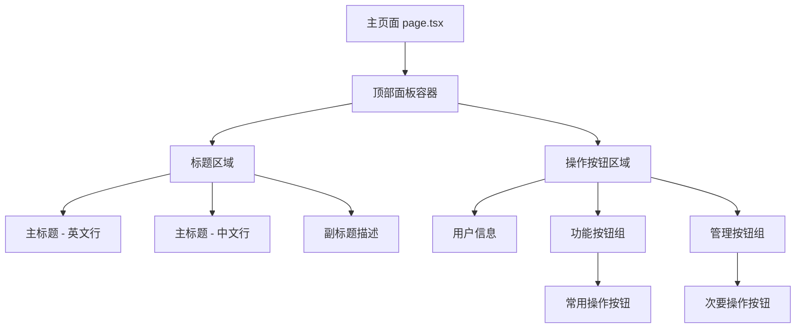

# 页面布局调整设计文档

## 概述

本设计文档旨在优化英语听力训练器主页面的布局与样式，确保在13英寸屏幕上无需滚动即可完整展示标题与操作按钮，提升用户体验和视觉统一性。

## 项目背景

通过代码分析发现，当前项目是一个基于Next.js的全栈英语听力训练应用，采用TypeScript + React技术栈，使用Tailwind CSS进行样式设计。主要页面结构包括：
- 主应用页面：`app/page.tsx`
- 主组件：`components/main-app.tsx`  
- UI组件库：`components/ui/`目录下的各种可复用组件
- 已有Badge和Button组件支持多种变体样式

## 设计目标

### 核心需求
1. **标题重构**：将主标题分为两行显示，中英文分离，保持视觉平衡
2. **响应式适配**：确保在1024px+桌面端和768px以下移动端都有良好表现
3. **按钮布局优化**：实现智能换行，避免水平滚动，优化操作区域
4. **样式统一**：统一按钮样式、颜色规范，复用现有组件
5. **13英寸屏幕适配**：确保核心内容在较小桌面屏幕上完整可见

### 视觉设计原则
- 保持现有的玻璃态效果（glass-effect）设计风格
- 采用深色半透明背景配合高亮蓝色文本
- 确保信息层次清晰，主标题突出
- 按钮组织符合用户使用频率

## 架构设计

### 组件层次结构



### 响应式断点策略

| 屏幕尺寸 | 断点 | 标题字号 | 按钮布局 | 内边距 |
|---------|------|----------|----------|--------|
| 大屏 | lg: 1024px+ | text-7xl | 单行5-6个 | p-8 |
| 中屏 | md: 768px+ | text-6xl | 单行4-5个 | p-6 |
| 小屏 | sm: 640px+ | text-5xl | 自适应换行 | p-4 |
| 移动端 | < 640px | text-4xl | 垂直堆叠 | p-3 |

## 详细设计规范

### 主标题组件设计

#### 结构布局
```
背景面板 (bg-slate-900/50 backdrop-blur rounded-3xl)
├── 主标题区域 (space-y-2)
│   ├── 英文标题行 "English Listening Trainer"
│   └── 中文标题行 "英语听力训练器"
├── 副标题区域 (text-slate-300)
│   ├── 英文描述
│   └── 中文描述
└── 操作区域 (flex-wrap gap-3)
    ├── 用户信息显示
    ├── 常用功能按钮
    └── 管理功能按钮
```

#### 样式规范
- **主标题**：
  - 字体大小：`text-5xl md:text-6xl lg:text-7xl`
  - 行高：`leading-tight`
  - 宽度控制：最大560px，使用`text-balance`
  - 行间距：`space-y-2`

- **副标题**：
  - 字体大小：比主标题小两级 `text-lg md:text-xl`
  - 颜色：`text-slate-300`
  - 对齐：与主标题左对齐

### 按钮系统设计

#### 按钮分类与优先级
1. **第一优先级（第一行显示）**：
   - 用户账号信息
   - Assessment 评估
   - History 历史记录  
   - Wrong Answers Book 错题本

2. **第二优先级（第二行显示）**：
   - 管理员功能
   - 快捷键帮助
   - 主题切换
   - 退出登录

#### 按钮样式规范
- **复用现有组件**：优先使用`components/ui/badge.tsx`和`components/ui/button.tsx`
- **统一样式**：
  - 背景：`bg-slate-900/60`
  - 文本颜色：`text-sky-400`
  - 圆角：继承组件默认圆角
  - 图标大小：统一为`w-4 h-4`
- **响应式行为**：
  - 桌面端：`flex-wrap`自动换行
  - 移动端：垂直堆叠布局

### 容器布局设计

#### 主容器结构
```
外层容器 (max-w-7xl mx-auto px-4)
└── 内容面板 (bg-slate-900/50 backdrop-blur rounded-3xl p-6 md:p-8)
    ├── 标题组 (mb-6)
    │   ├── 主标题区
    │   └── 副标题区
    └── 操作组 (flex flex-wrap gap-3)
        ├── 用户信息 Badge
        ├── 功能按钮组
        └── 管理按钮组
```

#### 间距与边距规范
- **容器内边距**：`p-6 md:p-8`（响应式递增）
- **元素间距**：`gap-3`（统一3级间距）
- **区块间距**：`mb-6`（标题与操作区间距）
- **行间距**：`space-y-2`（标题行间距）

## 用户体验优化

### 13英寸屏幕适配
- **视口高度优化**：确保核心内容在1280x800分辨率下完整可见
- **按钮智能换行**：第一行容纳4-5个按钮，避免挤压
- **字体缩放策略**：在较小屏幕上适当降低字号保持可读性

### 交互体验增强
- **焦点管理**：保持现有的键盘导航支持
- **触摸友好**：按钮尺寸符合触摸设备操作习惯
- **加载状态**：复用现有的loading状态处理
- **错误处理**：保持现有的错误边界和提示机制

### 性能考虑
- **CSS优化**：利用Tailwind的JIT编译，避免冗余样式
- **组件复用**：最大化复用现有UI组件，减少包体积
- **渲染优化**：避免不必要的重新渲染，保持响应性

## 国际化支持

### 多语言文本处理
- **动态标题**：支持通过i18n配置切换中英文标题
- **按钮文本**：复用现有的`useBilingualText`钩子
- **描述文本**：确保中英文描述长度在视觉上保持平衡

### 文本长度适配
- **英文文本**：考虑英文单词换行，使用`text-balance`
- **中文文本**：确保中文标题在各屏幕尺寸下完整显示
- **混合内容**：处理中英混合文本的排版问题

## 技术实现策略

### 样式应用方案
1. **利用现有glass-effect类**：继承项目既有的玻璃态效果
2. **扩展Tailwind配置**：在需要时添加自定义样式类
3. **组件props配置**：通过className和variant配置现有组件
4. **CSS变量支持**：利用项目现有的CSS变量系统

### 组件修改策略
1. **最小化改动**：优先通过样式调整而非结构重构
2. **向后兼容**：确保修改不破坏现有功能
3. **渐进增强**：先实现基础布局，再添加高级特性
4. **测试友好**：保持现有的测试数据属性和结构

## 测试验证

### 视觉回归测试
- **多分辨率验证**：1440px、1280px、1024px、768px下的显示效果
- **浏览器兼容**：确保在主流浏览器中的一致性表现
- **主题切换**：验证亮色/暗色主题下的视觉效果

### 功能测试
- **按钮交互**：确保所有按钮功能正常
- **响应式行为**：验证不同屏幕下的布局切换
- **键盘导航**：确保快捷键功能不受影响

### 性能测试
- **代码规范检查**：运行`npm run lint`确保代码质量
- **包体积影响**：确认样式修改不显著增加构建体积
- **渲染性能**：验证布局修改不影响页面加载速度

## 实施计划

### 阶段1：基础布局调整
1. 修改主标题为双行显示
2. 调整副标题样式和定位
3. 实现按钮容器的flex布局

### 阶段2：样式优化
1. 统一按钮样式和颜色
2. 添加背景面板效果
3. 优化间距和圆角

### 阶段3：响应式适配
1. 实现多断点字体缩放
2. 优化移动端布局
3. 调整按钮换行逻辑

### 阶段4：测试与验证
1. 多设备测试验证
2. 代码质量检查
3. 性能指标评估  - 对齐：与主标题左对齐

### 按钮系统设计

#### 按钮分类与优先级
1. **第一优先级（第一行显示）**：
   - 用户账号信息
   - Assessment 评估
   - History 历史记录  
   - Wrong Answers Book 错题本

2. **第二优先级（第二行显示）**：
   - 管理员功能
   - 快捷键帮助
   - 主题切换
   - 退出登录

#### 按钮样式规范
- **复用现有组件**：优先使用`components/ui/badge.tsx`和`components/ui/button.tsx`
- **统一样式**：
  - 背景：`bg-slate-900/60`
  - 文本颜色：`text-sky-400`
  - 圆角：继承组件默认圆角
  - 图标大小：统一为`w-4 h-4`
- **响应式行为**：
  - 桌面端：`flex-wrap`自动换行
  - 移动端：垂直堆叠布局

### 容器布局设计

#### 主容器结构
```
外层容器 (max-w-7xl mx-auto px-4)
└── 内容面板 (bg-slate-900/50 backdrop-blur rounded-3xl p-6 md:p-8)
    ├── 标题组 (mb-6)
    │   ├── 主标题区
    │   └── 副标题区
    └── 操作组 (flex flex-wrap gap-3)
        ├── 用户信息 Badge
        ├── 功能按钮组
        └── 管理按钮组
```

#### 间距与边距规范
- **容器内边距**：`p-6 md:p-8`（响应式递增）
- **元素间距**：`gap-3`（统一3级间距）
- **区块间距**：`mb-6`（标题与操作区间距）
- **行间距**：`space-y-2`（标题行间距）

## 用户体验优化

### 13英寸屏幕适配
- **视口高度优化**：确保核心内容在1280x800分辨率下完整可见
- **按钮智能换行**：第一行容纳4-5个按钮，避免挤压
- **字体缩放策略**：在较小屏幕上适当降低字号保持可读性

### 交互体验增强
- **焦点管理**：保持现有的键盘导航支持
- **触摸友好**：按钮尺寸符合触摸设备操作习惯
- **加载状态**：复用现有的loading状态处理
- **错误处理**：保持现有的错误边界和提示机制

### 性能考虑
- **CSS优化**：利用Tailwind的JIT编译，避免冗余样式
- **组件复用**：最大化复用现有UI组件，减少包体积
- **渲染优化**：避免不必要的重新渲染，保持响应性

## 国际化支持

### 多语言文本处理
- **动态标题**：支持通过i18n配置切换中英文标题
- **按钮文本**：复用现有的`useBilingualText`钩子
- **描述文本**：确保中英文描述长度在视觉上保持平衡

### 文本长度适配
- **英文文本**：考虑英文单词换行，使用`text-balance`
- **中文文本**：确保中文标题在各屏幕尺寸下完整显示
- **混合内容**：处理中英混合文本的排版问题

## 技术实现策略

### 样式应用方案
1. **利用现有glass-effect类**：继承项目既有的玻璃态效果
2. **扩展Tailwind配置**：在需要时添加自定义样式类
3. **组件props配置**：通过className和variant配置现有组件
4. **CSS变量支持**：利用项目现有的CSS变量系统

### 组件修改策略
1. **最小化改动**：优先通过样式调整而非结构重构
2. **向后兼容**：确保修改不破坏现有功能
3. **渐进增强**：先实现基础布局，再添加高级特性
4. **测试友好**：保持现有的测试数据属性和结构

## 测试验证

### 视觉回归测试
- **多分辨率验证**：1440px、1280px、1024px、768px下的显示效果
- **浏览器兼容**：确保在主流浏览器中的一致性表现
- **主题切换**：验证亮色/暗色主题下的视觉效果

### 功能测试
- **按钮交互**：确保所有按钮功能正常
- **响应式行为**：验证不同屏幕下的布局切换
- **键盘导航**：确保快捷键功能不受影响

### 性能测试
- **代码规范检查**：运行`npm run lint`确保代码质量
- **包体积影响**：确认样式修改不显著增加构建体积
- **渲染性能**：验证布局修改不影响页面加载速度

## 实施计划

### 阶段1：基础布局调整
1. 修改主标题为双行显示
2. 调整副标题样式和定位
3. 实现按钮容器的flex布局

### 阶段2：样式优化
1. 统一按钮样式和颜色
2. 添加背景面板效果
3. 优化间距和圆角

### 阶段3：响应式适配
1. 实现多断点字体缩放
2. 优化移动端布局
3. 调整按钮换行逻辑

### 阶段4：测试与验证
1. 多设备测试验证
2. 代码质量检查
3. 性能指标评估


