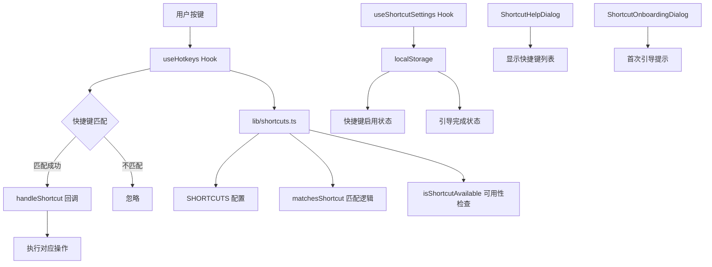
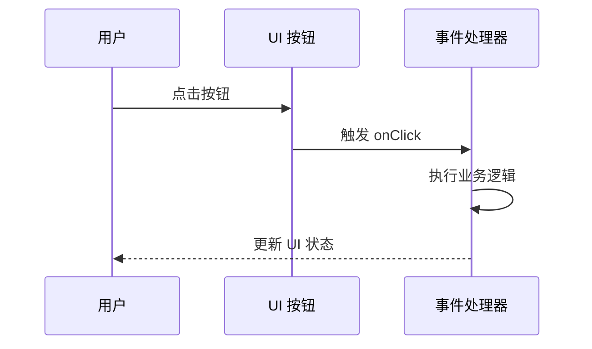

# 移除快捷键功能设计文档

## 概述

本文档定义快捷键系统的完整下线方案，目标是从代码库、UI、翻译文案、localStorage 存储和测试中彻底移除快捷键相关功能，确保应用在无快捷键支持的情况下依然保持完整功能与良好体验。

### 背景

项目当前包含完整的快捷键系统，涵盖：
- 自定义 Hooks（`use-hotkeys.ts` 及 `useShortcutSettings`）
- 配置模块（`lib/shortcuts.ts`）
- UI 组件（`ShortcutHelpDialog`、`ShortcutOnboardingDialog`）
- localStorage 持久化设置（`english-listening-shortcuts-*` 键）
- 国际化翻译文案（`shortcuts.*` 命名空间）
- 单元测试覆盖（`tests/unit/hooks/use-hotkeys.test.ts`）

快捷键功能虽然提升了高级用户的操作效率，但增加了系统复杂度，且使用率较低。根据产品决策，决定下线此功能以简化代码结构与维护成本。

### 核心目标

1. **彻底移除**：删除所有快捷键相关代码、配置、UI 组件和测试，不保留任何备份或隐藏入口
2. **清理存储**：移除 localStorage 中的快捷键设置键，避免遗留数据
3. **文案清理**：删除翻译文件中的快捷键相关文案
4. **零引用**：确保代码库中无任何快捷键相关导入或引用，构建、lint 和测试通过且无未使用代码警告
5. **UI 简化**：移除首页"快捷键帮助"按钮和所有快捷键提示文案

### 非目标

- **不替换**：不引入任何替代性的快捷键或键盘导航方案
- **不保留**：不在代码中保留已注释的快捷键逻辑备份
- **不兼容**：无需为已使用快捷键的用户提供迁移通知（功能静默下线）

---

## 系统架构

### 当前快捷键架构



**核心模块关系**：
- `useHotkeys` 订阅全局 `keydown` 事件，通过 `lib/shortcuts.ts` 提供的匹配函数识别快捷键
- `useShortcutSettings` 管理快捷键启用状态与引导标记，持久化至 localStorage
- `ShortcutHelpDialog` 展示当前可用快捷键列表，根据步骤（setup/listening/questions/results）和音频状态动态筛选
- `app/page.tsx` 作为消费者，注册 `handleShortcut` 回调处理具体业务逻辑

### 删除后的架构

移除快捷键后，应用将回归纯点击/触摸交互模式，用户通过以下方式操作：
- 点击按钮触发功能（如"练习历史"、"错题本"）
- 音频播放控制通过 `AudioPlayer` 组件的 UI 按钮
- 对话框关闭通过右上角"×"按钮或点击遮罩

**交互流简化**：



---

## 数据模型

### 待删除的 LocalStorage 键

| 键名 | 用途 | 数据类型 | 删除方式 |
|-----|------|---------|---------|
| `english-listening-shortcuts-enabled` | 快捷键启用/禁用状态 | boolean | 代码删除后自然失效 |
| `english-listening-shortcuts-onboarded` | 用户是否已完成快捷键引导 | boolean | 代码删除后自然失效 |

**清理策略**：
- 不需要主动清理历史数据，因删除相关代码后，这些键将不再被读取或写入
- 用户的 localStorage 中可能残留这些键，但不会影响应用功能（孤立数据无副作用）

### 待删除的翻译键命名空间

**文件**：`lib/i18n/translations/common.json`

**命名空间**：`shortcuts` 对象（包含以下键）

| 翻译键 | 中文示例 | 英文示例 | 用途 |
|-------|---------|---------|------|
| `shortcuts.title` | "快捷键" | "Keyboard Shortcuts" | 帮助对话框标题 |
| `shortcuts.description` | "使用这些快捷键更高效地操作应用" | "Use these keyboard shortcuts..." | 对话框描述 |
| `shortcuts.playPause` | "播放/暂停音频" | "Play/Pause Audio" | 空格键操作说明 |
| `shortcuts.openHistory` | "打开历史面板" | "Open History Panel" | Shift+H 操作说明 |
| `shortcuts.openWrongAnswers` | "打开错题本" | "Open Wrong Answers Book" | Shift+W 操作说明 |
| `shortcuts.toggleSpecializedMode` | "切换专项模式" | "Toggle Specialized Mode" | Shift+M 操作说明 |
| `shortcuts.closeDialog` | "关闭对话框/返回" | "Close Dialog/Return" | Esc 操作说明 |
| `shortcuts.showHelp` | "显示快捷键帮助" | "Show Shortcuts Help" | Shift+? 操作说明 |
| `shortcuts.returnHome` | "返回主页" | "Return to Home" | 操作说明 |
| `shortcuts.onboardingTitle` | "快捷键功能已启用！" | "Keyboard Shortcuts Available!" | 引导对话框标题 |
| `shortcuts.onboardingDescription` | "您现在可以使用快捷键..." | "You can now use keyboard shortcuts..." | 引导描述 |
| `shortcuts.onboardingGotIt` | "知道了！" | "Got it!" | 引导确认按钮 |
| *其他* | 包括 `shortcutKey`、`action`、`availability`、`allSteps`、`*Step`、`requiresAudio` 等 | | 表格列标题与状态标签 |

**删除范围**：整个 `shortcuts` 对象（约 30 行）

---

## 功能模块删除清单

### 核心文件删除

#### 1. Hooks 层

**文件**：`hooks/use-hotkeys.ts`（约 270 行）

**功能概述**：
- `useHotkeys`：监听全局 `keydown` 事件，匹配并触发快捷键操作
- `useShortcutSettings`：管理快捷键启用状态与引导标记，同步 localStorage
- `useSimpleHotkey`：简化版快捷键 Hook（用于单个快捷键绑定）

**删除内容**：
- 导出的三个 Hook 函数
- 类型定义（`ShortcutHandler`、`UseHotkeysOptions`、`HotkeysState`）
- localStorage 同步逻辑（含自定义事件 `shortcut-settings-changed` 与 `storage` 事件监听）
- 整个文件删除

#### 2. 配置与工具层

**文件**：`lib/shortcuts.ts`（约 180 行）

**功能概述**：
- 快捷键定义数组 `SHORTCUTS`（包含 7 个快捷键配置）
- 平台检测逻辑（`isMac` 常量判断显示 ⌘ 或 Ctrl）
- 修饰键映射 `MODIFIER_KEYS`（Ctrl/Alt/Shift/Meta）
- 工具函数：
  - `formatShortcut`：格式化快捷键显示文本
  - `matchesShortcut`：判断 KeyboardEvent 是否匹配快捷键
  - `isInInputElement`：检查事件目标是否为输入框
  - `isShortcutAvailable`：检查快捷键在当前步骤是否可用
- 常量：
  - `SHORTCUTS_STORAGE_KEYS`（localStorage 键名）
  - `DEFAULT_SHORTCUTS_SETTINGS`

**删除内容**：整个文件删除

#### 3. UI 组件层

**文件**：`components/shortcut-help-dialog.tsx`（约 217 行）

**组件定义**：
- `ShortcutHelpDialog`：显示快捷键列表的对话框，支持按步骤和音频状态筛选
- `ShortcutOnboardingDialog`：首次使用快捷键时的引导对话框

**UI 特性**：
- 使用 `shadcn/ui` 的 `Dialog`、`Table`、`Badge` 组件
- 集成双语文本支持（`useBilingualText`）
- 显示当前步骤与音频状态
- 灰色显示不可用快捷键

**删除内容**：整个文件删除

### 消费者代码清理

#### 文件：`app/page.tsx`

**当前依赖**：
``typescript
// 第 24-25 行：导入
import { ShortcutHelpDialog, ShortcutOnboardingDialog } from "@/components/shortcut-help-dialog"
import { useHotkeys, useShortcutSettings, type ShortcutHandler } from "@/hooks/use-hotkeys"
```

**状态管理**：
```typescript
// 第 158-159 行：快捷键 UI 状态
const [showShortcutHelp, setShowShortcutHelp] = useState<boolean>(false)
const [showOnboarding, setShowOnboarding] = useState<boolean>(false)

// 第 164 行：快捷键设置
const { enabled: shortcutsEnabled, onboarded, setOnboarded } = useShortcutSettings()
```

**事件处理器**：
```typescript
// 第 1287-1324 行：handleShortcut 函数
const handleShortcut: ShortcutHandler = useCallback((action) => {
  switch (action) {
    case 'play-pause': /* ... */
    case 'open-history': /* ... */
    case 'open-wrong-answers': /* ... */
    case 'toggle-specialized-mode': /* ... */
    case 'close-dialog': /* ... */
    case 'show-help': setShowShortcutHelp(true); break
    case 'return-home': /* ... */
  }
}, [step, isSpecializedMode, showShortcutHelp, showOnboarding])

// 第 1328-1332 行：handleCompleteOnboarding 函数
const handleCompleteOnboarding = useCallback(() => {
  setOnboarded(true)
  setShowOnboarding(false)
}, [setOnboarded])
```

**Hook 调用**：
```typescript
// 第 1333-1338 行：useHotkeys 订阅
useHotkeys({
  enabled: shortcutsEnabled,
  currentStep: step,
  hasAudio: Boolean(audioUrl && !audioError),
  onShortcut: handleShortcut
})
```

**UI 渲染**：
```typescript
// 第 1703 行：快捷键帮助按钮（在设置页面）
onClick={() => setShowShortcutHelp(true)}

// 第 1835-1848 行：对话框组件
<ShortcutHelpDialog
  open={showShortcutHelp}
  onOpenChange={setShowShortcutHelp}
  currentStep={step}
  hasAudio={Boolean(audioUrl && !audioError)}
/>

<ShortcutOnboardingDialog
  open={showOnboarding}
  onOpenChange={setShowOnboarding}
  onComplete={handleCompleteOnboarding}
/>
```

**删除清单**：

| 行号范围 | 内容 | 删除方式 |
|---------|------|---------|
| 24-25 | 快捷键组件与 Hook 导入 | 删除两行 import 语句 |
| 158-159 | `showShortcutHelp`、`showOnboarding` 状态 | 删除两行 useState 声明 |
| 164 | `useShortcutSettings` 调用 | 删除整行 |
| 1287-1324 | `handleShortcut` 事件处理器 | 删除整个 useCallback 块 |
| 1328-1332 | `handleCompleteOnboarding` 函数 | 删除整个 useCallback 块 |
| 1333-1338 | `useHotkeys` Hook 调用 | 删除整个调用块 |
| 1703 | 快捷键帮助按钮的 `onClick` | 删除该按钮或移除 `onClick` 属性 |
| 1835-1848 | 两个快捷键对话框组件 | 删除两个 JSX 元素 |

**注意事项**：
- 删除第 1703 行的按钮时，需检查其父容器是否为快捷键专用容器，如是则一并删除
- `handleShortcut` 中引用的其他函数（如 `setStep`、`audioPlayerRef`）仍需保留，仅删除快捷键相关逻辑

### 测试文件删除

#### 文件：`tests/unit/hooks/use-hotkeys.test.ts`

**测试覆盖**：
- `useHotkeys` Hook 的所有功能（约 450 行）
- localStorage 同步与跨标签通信
- 快捷键匹配与步骤可用性检查
- `useShortcutSettings` 的设置管理
- `useSimpleHotkey` 的简化功能

**删除内容**：整个文件删除

---

## 翻译文案清理

### 文件：`lib/i18n/translations/common.json`

**位置**：第 832 行起（`"shortcuts"` 对象）

**删除范围**：
```

```

**删除后验证**：
- 确认 JSON 结构完整（删除对象后需保留前一个对象的闭合逗号或移除多余逗号）
- 运行 `npm run lint` 确认无 JSON 解析错误
- 检查其他翻译文件（`components.json`、`pages.json`）是否存在快捷键相关键（需额外搜索）

---

## 文档更新

### 项目文档检查

**需要检查的文档**：

| 文件路径 | 检查内容 | 操作 |
|---------|---------|------|
| `README.md` | 是否提及快捷键功能、键盘导航测试 | 删除相关描述或示例 |
| `documents/project-board.md` | 待办事项中的快捷键下线任务 | 移至"Done"列并标记完成日期 |
| `documents/requirements/remove-shortcuts.md` | 需求文档本身 | 可保留作为历史记录 |
| `documents/requirements/left-sidebar-layout.md` | 是否依赖快捷键功能 | 更新相关描述（如有） |
| `test-results/validation-report.md` | 是否包含快捷键测试项 | 删除相关测试条目 |

**README.md 清理**：
- 搜索关键词：`shortcuts`、`keyboard`、`快捷键`
- 删除功能列表中的快捷键介绍
- 删除使用指南中的快捷键说明

**project-board.md 更新**：
- 将"彻底移除快捷键功能"任务从"To-Do"移至"Done"
- 添加完成时间戳（格式：`2025-XX-XX`）

---

## 实施计划

### 阶段划分


### 阶段 1：代码删除（高风险）

**顺序**：自底向上删除，避免悬空引用

1. **删除 UI 组件**
   - 删除 `components/shortcut-help-dialog.tsx`
   - 验证：无其他文件导入此组件

2. **删除消费者引用**
   - 在 `app/page.tsx` 中删除所有快捷键相关代码（见"消费者代码清理"表格）
   - 验证：应用可正常启动，无编译错误

3. **删除 Hooks 与配置**
   - 删除 `hooks/use-hotkeys.ts`
   - 删除 `lib/shortcuts.ts`
   - 验证：运行 `npm run build` 无未使用导出警告

4. **删除测试文件**
   - 删除 `tests/unit/hooks/use-hotkeys.test.ts`
   - 验证：运行 `npm run test` 无引用失败

### 阶段 2：翻译清理

**步骤**：
1. 打开 `lib/i18n/translations/common.json`
2. 删除第 832 行起的 `shortcuts` 对象
3. 检查删除后的 JSON 语法（前一对象的尾逗号处理）
4. 搜索其他翻译文件（`components.json`、`pages.json`）是否存在 `shortcuts.` 引用
5. 验证：运行应用后无翻译缺失警告

### 阶段 3：测试验证

**测试矩阵**：

| 测试类型 | 验证项 | 通过标准 |
|---------|-------|---------|
| 单元测试 | `npm run test` | 所有测试通过，无快捷键相关测试 |
| 类型检查 | `npm run type-check` | 无类型错误 |
| Lint 检查 | `npm run lint` | 无未使用导入警告 |
| 构建验证 | `npm run build` | 构建成功，无死代码警告 |
| 功能测试 | 手动操作主流程 | 音频播放、历史面板、错题本通过按钮正常打开 |
| 回归测试 | 检查专项模式、成就系统 | 不受快捷键删除影响 |

**功能测试场景**：
1. 启动应用 → 无快捷键相关按钮或提示
2. 按下 `Shift+?` → 无反应（快捷键监听已移除）
3. 点击"练习历史"按钮 → 正常打开历史面板
4. 点击"错题本"按钮 → 正常打开错题本
5. 播放音频后按空格键 → 无播放/暂停效果（音频控制仅通过 UI）

### 阶段 4：文档更新

**检查清单**：
- [ ] README.md 已删除快捷键相关内容
- [ ] project-board.md 已标记任务完成
- [ ] 其他需求文档已同步更新（如 left-sidebar-layout.md）
- [ ] test-results/validation-report.md 已移除快捷键测试项

---

## 验收标准

### 代码验收

| 标准 | 验证方法 | 期望结果 |
|-----|---------|---------|
| 无快捷键文件 | `ls hooks/use-hotkeys.ts lib/shortcuts.ts components/shortcut-help-dialog.tsx` | 文件不存在错误 |
| 无导入引用 | `grep -r "use-hotkeys\|lib/shortcuts\|ShortcutHelpDialog" --include="*.ts" --include="*.tsx"` | 仅匹配测试文件或文档 |
| 无 localStorage 使用 | `grep -r "english-listening-shortcuts" --include="*.ts" --include="*.tsx"` | 无匹配 |
| 构建无警告 | `npm run build 2>&1 | grep -i "unused\|warn"` | 无快捷键相关警告 |
| 测试全通过 | `npm run test` | 0 failed, 0 skipped |

### UI 验收

| 验证点 | 操作 | 期望结果 |
|-------|------|---------|
| 首页无快捷键按钮 | 打开应用首页 | 不显示"快捷键帮助"或"?"按钮 |
| 按键无响应 | 按下 `Shift+?`、`Shift+H`、空格等 | 无任何快捷键操作触发 |
| 功能按钮可用 | 点击"练习历史"、"错题本"、音频播放按钮 | 功能正常 |
| 无翻译缺失 | 切换中英文界面 | 无 `[missing:shortcuts.*]` 提示 |

### 文档验收

- [ ] README.md 不包含快捷键相关描述
- [ ] project-board.md 已标记任务完成
- [ ] 无文档引用已删除的组件或 Hook

---

## 风险与缓解

### 风险识别

| 风险 | 影响范围 | 概率 | 缓解措施 |
|-----|---------|------|---------|
| 误删其他功能代码 | 高 | 低 | 通过 Git diff 仔细检查每次删除，遵循"自底向上"顺序 |
| 用户习惯快捷键操作 | 中 | 中 | 功能静默下线，无需通知（快捷键使用率低） |
| 翻译文件 JSON 格式损坏 | 高 | 低 | 删除后立即运行 lint 和本地测试 |
| 文档描述与实际功能不符 | 低 | 中 | 全面搜索文档中的快捷键关键词并更新 |
| 覆盖测试不足导致隐藏 Bug | 中 | 中 | 执行完整的手动回归测试矩阵 |

### 回滚计划

如删除后发现严重问题：
1. 使用 `git revert` 撤销所有删除提交
2. 恢复 `hooks/use-hotkeys.ts`、`lib/shortcuts.ts`、`components/shortcut-help-dialog.tsx`
3. 恢复 `app/page.tsx` 中的相关逻辑
4. 恢复翻译文件中的 `shortcuts` 对象
5. 重新运行测试验证

---

## 交付物

### 代码变更

- **删除文件**（3 个）：
  - `hooks/use-hotkeys.ts`
  - `lib/shortcuts.ts`
  - `components/shortcut-help-dialog.tsx`
  - `tests/unit/hooks/use-hotkeys.test.ts`

- **修改文件**（2 个）：
  - `app/page.tsx`（删除约 60 行快捷键相关代码）
  - `lib/i18n/translations/common.json`（删除 `shortcuts` 对象）

### 文档变更

- `README.md`：删除快捷键功能介绍
- `documents/project-board.md`：标记任务完成
- `documents/requirements/left-sidebar-layout.md`：更新兼容性描述（如需）
- `test-results/validation-report.md`：删除快捷键测试项

### 测试报告

- 单元测试通过截图
- 构建日志（无警告）
- 功能测试矩阵勾选表

---

## 附录

### 快捷键完整列表（删除前记录）

| 快捷键 | 操作 | 可用步骤 | 特殊要求 |
|-------|------|---------|---------|
| `Space` | 播放/暂停音频 | listening, questions | 需要音频加载完成 |
| `Shift+H` | 打开历史面板 | setup, results | - |
| `Shift+W` | 打开错题本 | setup, results | - |
| `Shift+M` | 切换专项模式 | setup | - |
| `Esc` | 关闭对话框/返回 | 所有步骤 | - |
| `Shift+?` | 显示快捷键帮助 | 所有步骤 | - |
| `Shift+Home` | 返回主页 | 所有步骤 | - |

### 关键代码片段（删除前参考）

#### lib/shortcuts.ts - 快捷键匹配逻辑

```

```

#### useHotkeys - localStorage 同步机制

```
