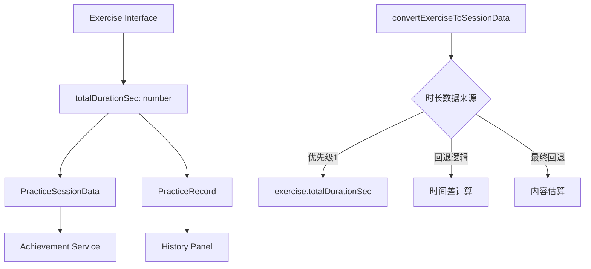
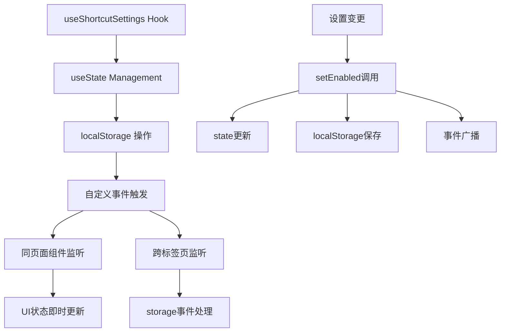
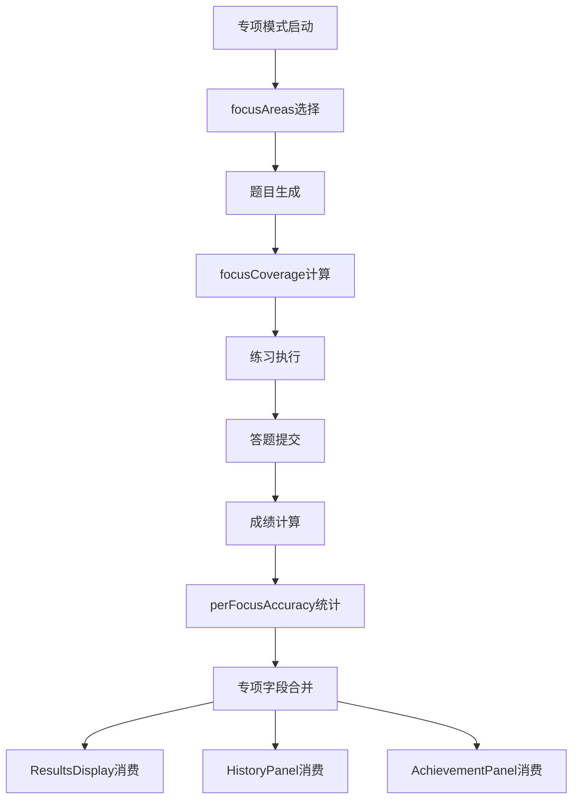
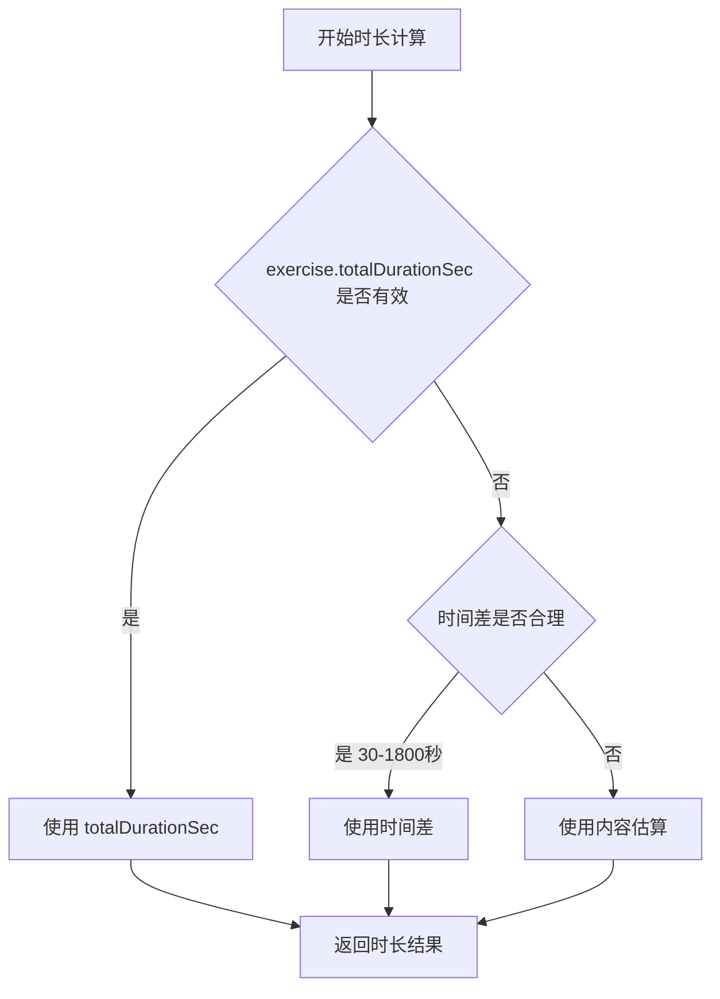
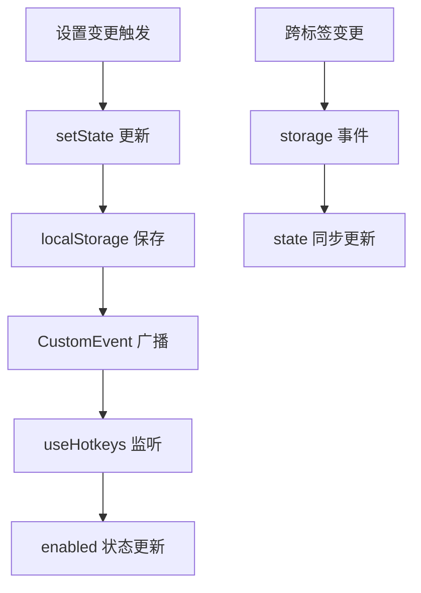
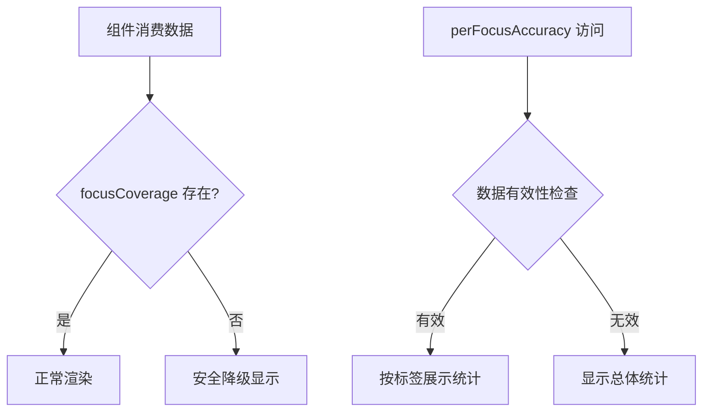
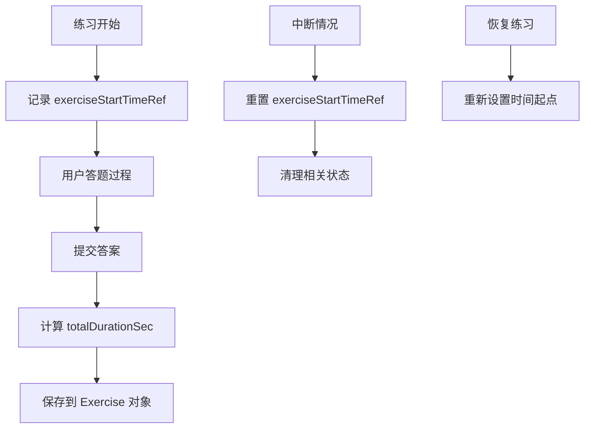
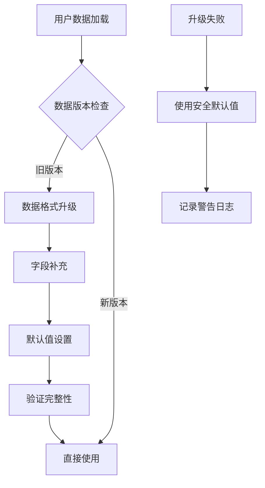

# 专项练习数据持久化修复设计文档

## 概述

本设计文档规范了英语听力训练系统中专项练习数据持久化相关遗留问题的修复方案。重点解决类型定义不一致、成就系统时长统计、快捷键设置同步、专项数据合并以及练习时长采集等关键问题。

### 核心问题识别

1. **类型定义不一致**: Exercise 接口缺少标准化时长字段，导致使用 `(exercise as any)` 强制类型转换
2. **成就系统数据源**: 时长统计依赖回退逻辑而非标准字段，影响统计准确性
3. **快捷键状态不同步**: 设置变更后UI状态未即时更新，存在状态一致性问题
4. **专项数据整合**: 专项练习字段在组件消费端处理不完整
5. **时长采集时机**: 练习开始时间记录位置不准确，重置逻辑不完整

## 技术架构

### 数据模型优化架构

### 状态管理同步架构

### 专项练习数据流架构

## 详细设计规范

### 类型与数据模型修复

#### Exercise 接口标准化

在 `lib/types.ts` 中已存在的 Exercise 接口将确保 `totalDurationSec` 字段的一致使用：

| 字段名 | 类型 | 说明 | 必需性 |
|--------|------|------|--------|
| totalDurationSec | number \| undefined | 练习总时长（秒），用于成就系统与历史统计 | 可选 |
| focusAreas | FocusArea[] \| undefined | 专项练习考察点标签 | 可选 |
| focusCoverage | FocusCoverage \| undefined | 标签覆盖率信息 | 可选 |
| specializedMode | boolean \| undefined | 是否为专项练习模式 | 可选 |
| perFocusAccuracy | Record<string, number> \| undefined | 按标签的正确率统计 | 可选 |

#### 类型同步更新策略

需要验证以下类型引用的一致性：

- **PracticeSessionData**: 确保 `duration` 字段对应 Exercise 的 `totalDurationSec`
- **PracticeRecord**: 验证时长字段的统一命名
- **成就服务相关接口**: 确保时长统计使用标准字段

### 成就系统与本地存储优化

#### convertExerciseToSessionData 函数修复

现有的时长获取逻辑采用三级优先级策略：

#### 数据兼容性保障

| 场景 | 处理策略 | 回退方案 |
|------|----------|----------|
| 新练习数据 | 优先使用 totalDurationSec | 时间差计算 |
| 历史练习数据 | 时间差计算 | 内容长度估算 |
| 音频异常情况 | 内容长度估算 | 最小60秒保底 |
| 数据损坏情况 | 默认估算值 | 用户提示重新练习 |

### 快捷键设置即时同步

#### 状态管理策略

`useShortcutSettings` Hook 实现状态与存储的双向同步：

| 功能 | 实现方式 | 同步机制 |
|------|----------|----------|
| 状态读取 | useState 初始化从 localStorage 加载 | 页面加载时同步 |
| 状态更新 | setEnabled/setOnboarded 同时更新 state 和 storage | 立即生效 |
| 跨组件同步 | CustomEvent 事件广播 | 同页面即时同步 |
| 跨标签同步 | storage 事件监听 | 跨标签页同步 |

#### 事件监听架构

### 专项数据合并与消费

#### 数据合并流程

在 `handleSubmitAnswers` 中确保以下专项字段的正确合并：

| 字段名 | 数据来源 | 计算逻辑 | 消费组件 |
|--------|----------|----------|----------|
| focusAreas | 用户选择 + AI生成匹配 | 并集合并 | ResultsDisplay, HistoryPanel |
| focusCoverage | AI分析结果 | 覆盖率计算 | 专项分析面板 |
| specializedMode | 模式标记 | 布尔值 | 历史记录筛选 |
| perFocusAccuracy | 按题目标签统计 | 分标签正确率 | AchievementPanel |

#### 数据安全访问策略

### 练习时长采集机制

#### 时间节点管理

`exerciseStartTimeRef` 的设置和重置时机：

| 操作 | 设置时机 | 重置时机 | 备注 |
|------|----------|----------|------|
| 生成练习 | 音频加载完成后 | 切换模式时 | 确保计时准确性 |
| 恢复历史 | 恢复操作完成后 | 重新生成时 | 避免时间重复 |
| 模式切换 | - | 立即重置 | 防止跨模式计时 |
| 应用推荐 | - | 立即重置 | 重新开始计时 |

#### 时长计算精度保障

## 组件交互规范

### ResultsDisplay 组件适配

确保组件能够安全处理专项练习字段：

- 检查 `exercise.specializedMode` 决定显示模式
- 安全访问 `exercise.perFocusAccuracy` 避免未定义错误
- 对 `focusCoverage` 进行空值检查

### HistoryPanel 组件增强

历史记录面板需要支持专项数据的筛选和展示：

- 按 `specializedMode` 标记区分普通和专项练习
- 展示 `focusAreas` 标签信息
- 支持按专项标签筛选历史记录

### AchievementPanel 组件集成

成就面板消费专项统计数据：

- 读取 `perFocusAccuracy` 进行专项能力分析
- 基于 `totalDurationSec` 计算累计听力时长
- 支持专项练习成就解锁逻辑

## 验证与测试策略

### 自动化验证

| 验证项目 | 验证方法 | 预期结果 |
|----------|----------|----------|
| 类型检查 | npm run lint | 无 TypeScript 错误 |
| 单元测试 | npm run test | 关键函数测试通过 |
| 数据一致性 | 集成测试 | 时长字段统计准确 |

### 手动验证流程

#### 专项模式完整流程

1. **生成环节**: 选择专项标签 → 生成练习 → 验证 `focusAreas` 设置
2. **练习环节**: 听音频 → 答题 → 验证时长记录
3. **结果环节**: 查看结果 → 验证专项统计 → 检查 `perFocusAccuracy`
4. **历史环节**: 查看历史 → 验证专项标记 → 检查筛选功能
5. **成就环节**: 打开成就面板 → 验证时长累计 → 检查专项成就

#### 快捷键同步验证

1. **设置切换**: 快捷键开关 → 观察按钮文案变化 → 验证即时生效
2. **功能响应**: 切换后测试快捷键 → 验证启用/禁用状态
3. **持久化**: 刷新页面 → 验证设置保持 → 检查状态一致性

## 风险控制与回滚策略

### 潜在风险识别

| 风险类型 | 影响程度 | 缓解策略 |
|----------|----------|----------|
| 类型不兼容 | 高 | 渐进式类型迁移，保持向后兼容 |
| 数据丢失 | 高 | 多级回退机制，安全默认值 |
| 性能影响 | 中 | 数据缓存，惰性计算 |
| 状态不一致 | 中 | 事件机制同步，错误恢复 |

### 回滚预案

如发现修复引入新问题，可采用以下回滚策略：

1. **字段级回滚**: 保持 `totalDurationSec` 可选，回退到时间差计算
2. **功能级回滚**: 禁用专项模式，恢复基础练习功能
3. **存储级回滚**: 清理问题数据，重置为默认状态

### 数据迁移保障

对现有用户数据的兼容性处理：

## 实施计划

### 阶段性推进

1. **第一阶段**: 类型定义修复和数据模型统一
2. **第二阶段**: 快捷键状态同步机制实现
3. **第三阶段**: 专项数据合并逻辑完善
4. **第四阶段**: 时长采集机制优化
5. **第五阶段**: 组件适配和测试验证

### 质量保证

- 每个阶段完成后进行代码审查
- 实施单元测试和集成测试
- 进行用户体验测试确保功能正常
- 监控错误日志和性能指标

本设计确保专项练习数据持久化的完整性、准确性和可靠性，为用户提供一致的学习体验。