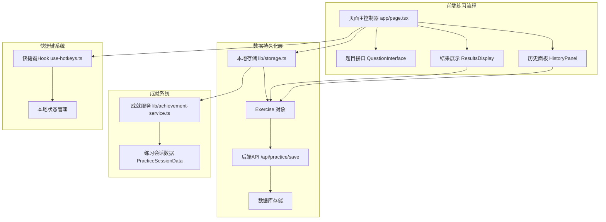
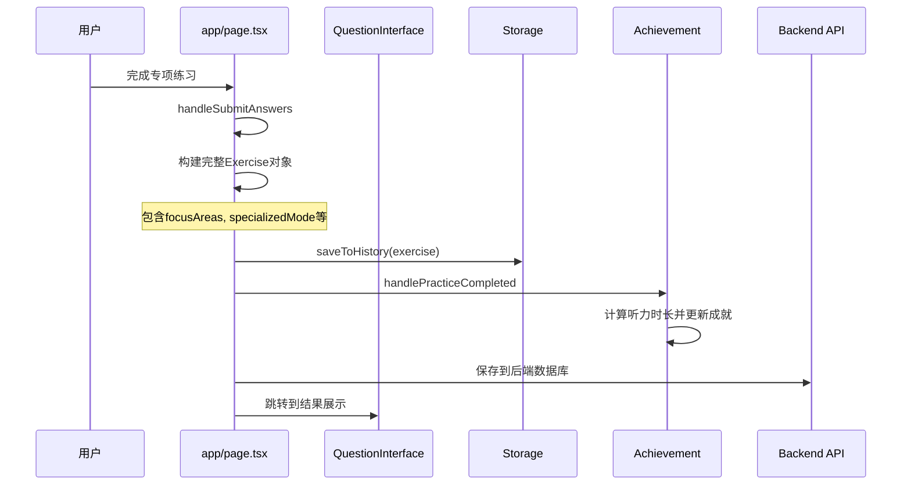
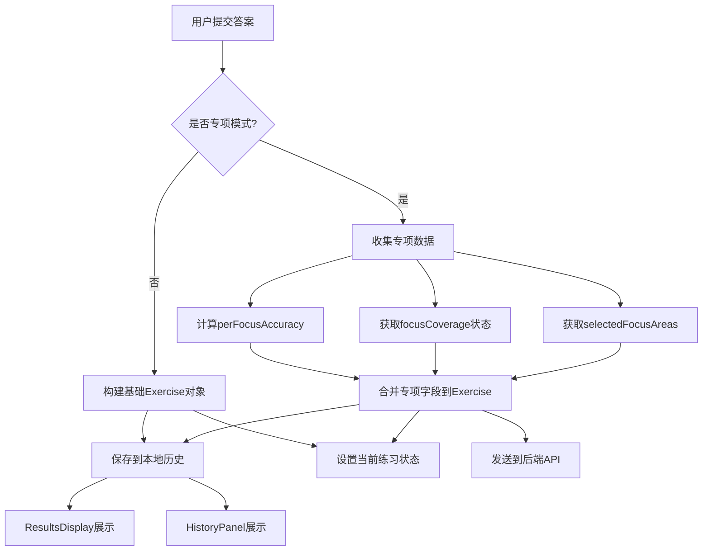
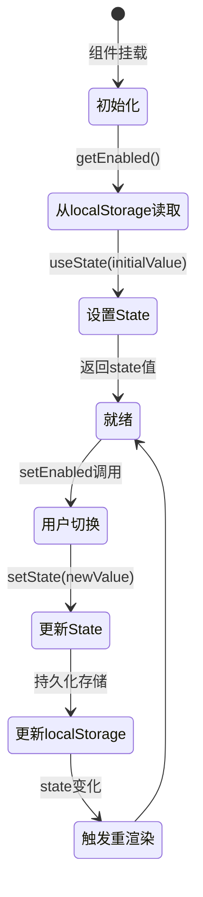
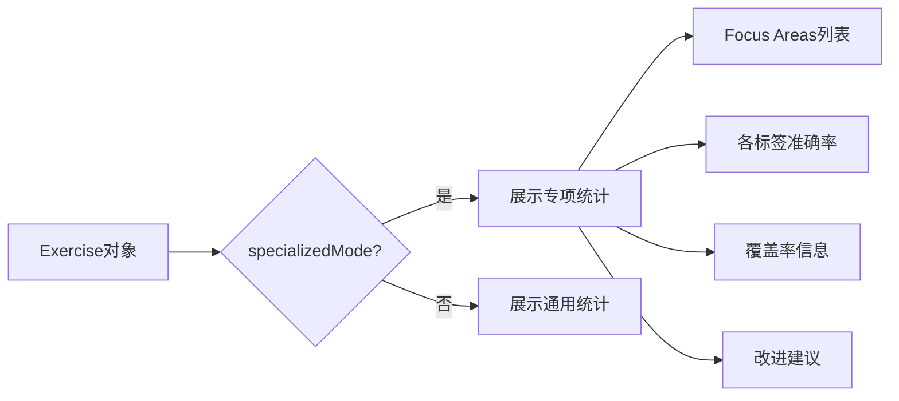
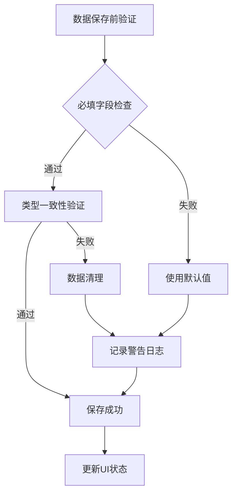

# 专项练习数据持久化设计文档

## 概述

针对英语听力训练应用中专项练习模式的数据持久化缺失问题，本设计文档定义了三个核心功能的解决方案：

1. **专项练习数据持久化** - 确保专项练习相关字段正确保存到 Exercise 对象中
2. **听力分钟数统计修复** - 修复成就系统中听力时长统计为零的问题  
3. **快捷键开关状态同步** - 解决快捷键启用/禁用状态不实时更新的问题

## 技术架构

### 系统组件关系



### 数据流架构



## 核心功能设计

### 1. 专项练习数据持久化

#### 业务价值
确保专项练习模式下的核心数据（focus areas、覆盖率、准确率等）能正确保存和展示，为用户提供完整的学习进度追踪。

#### 数据模型扩展

Exercise 类型已定义的专项练习字段：
- `focusAreas?: FocusArea[]` - 选中的专项能力标签
- `focusCoverage?: FocusCoverage` - 标签覆盖率信息
- `specializedMode?: boolean` - 是否为专项模式
- `perFocusAccuracy?: Record<string, number>` - 各标签准确率

#### 数据持久化流程



#### 实现策略

**Exercise对象构建逻辑**：
```typescript
// 基础Exercise构建
const baseExercise: Exercise = {
  id: Date.now().toString(),
  difficulty: difficulty as DifficultyLevel,
  language,
  topic,
  transcript,
  questions,
  answers,
  results: gradingResults,
  createdAt: new Date().toISOString(),
}

// 专项模式字段合并
const exercise: Exercise = {
  ...baseExercise,
  ...(isSpecializedMode && {
    focusAreas: selectedFocusAreas,
    focusCoverage: focusCoverage,
    specializedMode: true,
    perFocusAccuracy: calculatePerFocusAccuracy(gradingResults, questions)
  })
}
```

**数据验证策略**：
- 仅在 `isSpecializedMode` 为 true 时添加专项字段
- 确保 `calculatePerFocusAccuracy` 只调用一次避免性能问题
- 保证 `saveToHistory()` 和 `setCurrentExercise()` 接收同一对象引用

### 2. 听力分钟数统计修复

#### 问题分析
当前 `convertExerciseToSessionData` 函数中 duration 硬编码为 0，导致成就系统无法正确累积听力时长。

#### 时长数据源优先级

```mermaid
flowchart TD
    A[开始获取练习时长] --> B{audioDuration可用?}
    B -->|是| C[使用audioDuration]
    B -->|否| D{duration设置可用?}
    D -->|是| E[使用练习设置duration]
    D -->|否| F[计算实际用时]
    
    F --> G[Date.now() - createdAt]
    
    C --> H[转换为秒数]
    E --> I{确认duration单位}
    I -->|秒| H
    I -->|分钟| J[乘以60转换] --> H
    G --> H
    
    H --> K[传递给成就系统]
```

#### 数据流集成

**时长传递链路**：
1. `handleSubmitAnswers` 中计算 `practiceDurationSec`
2. 构建 Exercise 对象时包含时长信息
3. `convertExerciseToSessionData` 从 Exercise 对象获取真实时长
4. 成就系统按分钟计算累积时长

**单位标准化**：
- 内部统一使用秒为单位
- 成就系统计算时转换为分钟：`Math.round(duration / 60)`
- 确保与 `DURATION_OPTIONS` 配置单位一致

### 3. 快捷键开关状态同步

#### 问题根因
`useShortcutSettings` Hook 每次返回 localStorage 快照，缺少 React 状态驱动UI更新机制。

#### 状态管理重构



#### Hook重构策略

**状态同步机制**：
```typescript
export function useShortcutSettings() {
  // 内部React状态管理
  const [enabledState, setEnabledState] = useState(() => {
    // 初始化时从localStorage读取
    return getInitialEnabledState()
  })
  
  const [onboardedState, setOnboardedState] = useState(() => {
    return getInitialOnboardedState()
  })
  
  // 同步更新函数
  const setEnabled = useCallback((enabled: boolean) => {
    setEnabledState(enabled)  // 更新React状态
    updateLocalStorage(enabled)  // 更新localStorage
  }, [])
  
  return {
    enabled: enabledState,  // 返回React状态而非localStorage快照
    setEnabled,
    onboarded: onboardedState,
    setOnboarded
  }
}
```

## 系统集成点

### 结果展示界面集成

ResultsDisplay 组件需要正确读取和展示专项练习数据：



### 历史面板集成

HistoryPanel 组件支持专项练习数据的筛选和展示：

**筛选维度**：
- 练习模式（专项/通用）
- 特定能力标签
- 准确率范围
- 覆盖率水平

### 成就系统集成

确保专项练习的时长正确计入成就统计：

**计算逻辑**：
- 累积总听力时长（分钟）
- 更新每日/每周目标进度
- 触发相关成就徽章
- 更新平均准确率统计

## 错误处理与边界情况

### 数据完整性保障



### 降级策略

**localStorage 不可用时**：
- 快捷键设置回退到默认启用状态
- 练习笔记功能禁用但不影响核心流程
- 显示用户友好的降级提示

**计算失败时**：
- perFocusAccuracy 计算异常时使用空对象
- 时长获取失败时使用练习开始到结束的时间差
- 保证核心练习流程不被阻断

## 测试策略

### 数据持久化测试

**验证项目**：
- 专项模式下 Exercise 对象包含所有必要字段
- 通用模式下不包含专项字段
- 历史记录和结果展示界面正确读取数据

### 时长统计测试

**测试场景**：
- audioDuration 可用时的时长计算
- 回退到练习设置 duration 的计算
- 最终 fallback 到实际用时的计算
- 成就系统分钟数累积的正确性

### 快捷键状态测试

**测试用例**：
- 切换开关后UI立即更新
- 快捷键监听器状态同步更新
- 页面刷新后设置保持
- localStorage 异常时的降级行为

## 实施优先级

1. **高优先级** - 专项练习数据持久化：直接影响用户体验
2. **中优先级** - 听力分钟数统计修复：影响成就系统准确性
3. **低优先级** - 快捷键开关状态同步：用户体验优化

## 性能考虑

### 计算优化
- `calculatePerFocusAccuracy` 函数只在专项模式下调用一次
- 缓存计算结果避免重复计算
- 使用 `useMemo` 优化组件渲染性能

### 存储优化
- localStorage 操作异步化避免阻塞UI
- 批量更新减少存储写入次数
- 数据结构扁平化减少序列化开销

## 实施清单（务必逐项执行）

### 专项练习数据持久化
- **目标**：在 `handleSubmitAnswers` 内构建 `Exercise` 时就合并专项字段，确保 `ResultsDisplay` 与 `HistoryPanel` 读取到完整信息。
- **操作步骤**：
  1. 先创建基础 `Exercise` 对象，仅包含通用字段。
  2. 若 `isSpecializedMode` 为真，构造一个 `specializedFields` 对象，内容包括：
     - `focusAreas: [...selectedFocusAreas]`
     - `focusCoverage`
     - `specializedMode: true`
     - `perFocusAccuracy: memoizedPerFocusAccuracy`（注意只计算一次并缓存）。
  3. 将两个对象合并生成最终 `exercise`，并同时传給 `setCurrentExercise(exercise)`、`saveToHistory(exercise)` 以及后续后端保存逻辑。
- **验证**：专项模式下完成练习后，结果页出现标签列表、覆盖率提示、各标签准确率；历史面板同时展示相同数据。普通模式不应写这些字段。

### 听力时长累计修复
- **目标**：让 `convertExerciseToSessionData` 获得真实练习时长，从而驱动 `totalListeningMinutes` 与目标系统。
- **操作步骤**：
  1. 在 `handleSubmitAnswers` 中计算 `practiceDurationSec`，优先级：`audioDuration`（有效且 >0）→ 练习设置 `duration`（确认单位，必要时转换为秒）→ `Date.now() - new Date(exercise.createdAt).getTime()`。
  2. 将 `practiceDurationSec` 注入 `exercise`（可新增字段如 `totalDurationSec` 或通过局部变量传递），保证 `convertExerciseToSessionData` 能读取到。
  3. 更新 `lib/storage.ts` 的 `convertExerciseToSessionData`，改为使用前述秒数值填充 `PracticeSessionData.duration`，禁止继续写死 0。
  4. 将该秒数传递到 `/api/practice/save` 的 payload 中（遵循现有字段命名）。
- **验证**：练习结束后检查 localStorage `english-listening-progress`，`totalListeningMinutes` 应随之增加；成就面板的每日/每周目标即时刷新；控制台或日志中不再出现 duration=0。

### 快捷键开关即时同步
- **目标**：切换快捷键开关后立刻驱动 UI 与 `useHotkeys`。
- **操作步骤**：
  1. 改造 `useShortcutSettings`，为 `enabled`、`onboarded` 分别引入 `useState`，初始值来源于 localStorage。
  2. 在 `setEnabled` / `setOnboarded` 中同时更新 state 与 localStorage，返回值结构保持 `{ enabled, setEnabled, onboarded, setOnboarded }`。
  3. 确保 `app/page.tsx` 中的按钮、入门引导等直接依赖该 state，切换后无需刷新即可生效。
- **验证**：切换按钮后立刻观察文案/样式变化，并实际触发快捷键确认启用状态；刷新页面验证持久化成功。

### 回归测试
- 运行 `npm run lint`、`npm run test`，确保无类型或单测失败。
- 人工验证三个核心流程：专项数据展示、听力分钟数累积、快捷键开关。
- 如有必要在提交说明中简要记录改动和验证方式。
