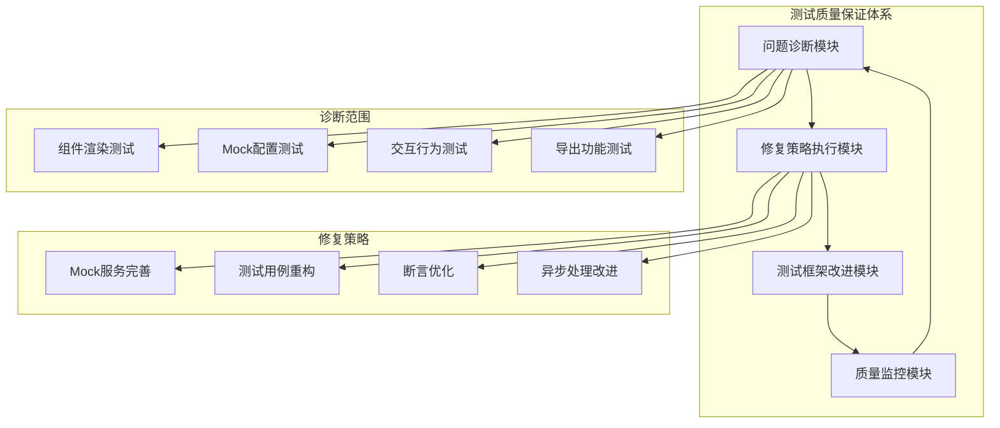
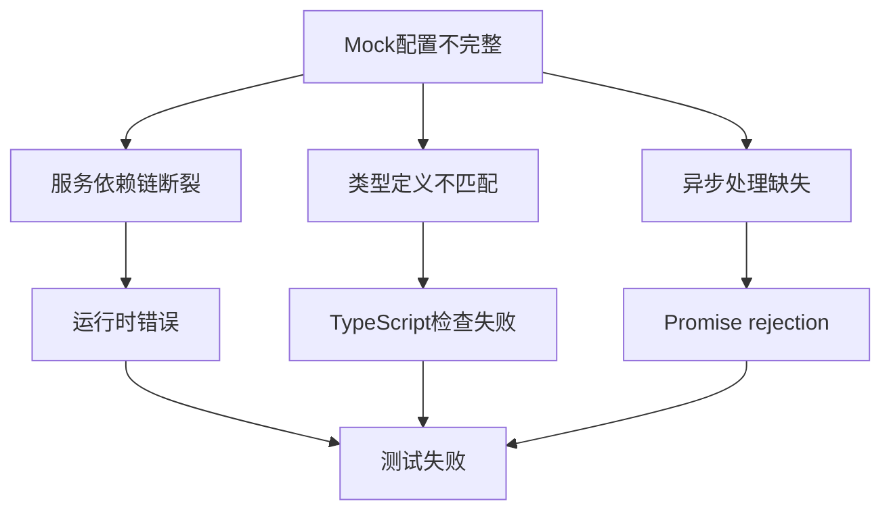
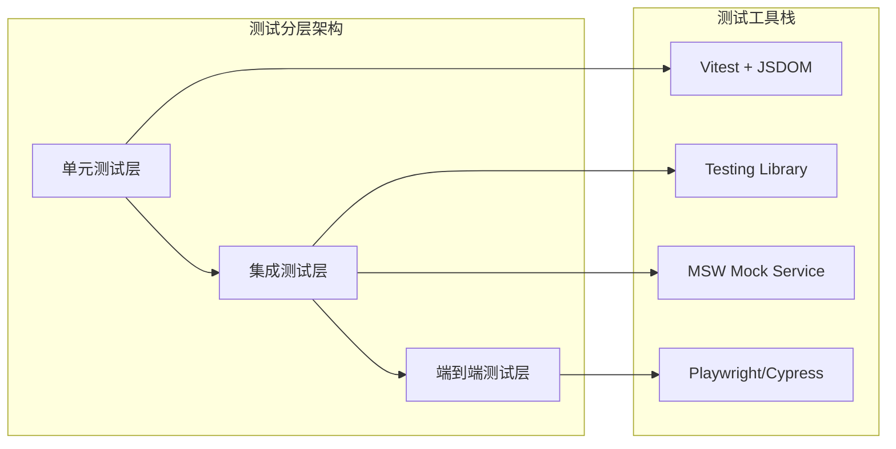
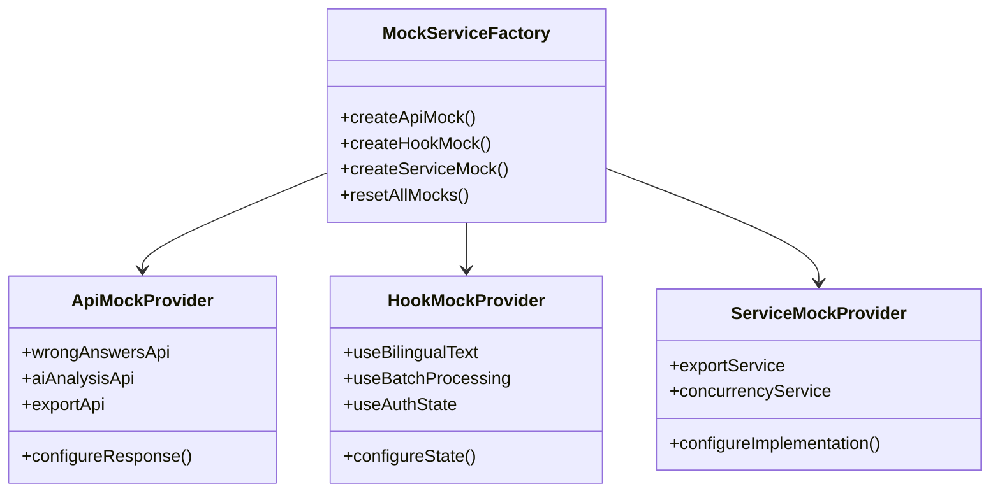
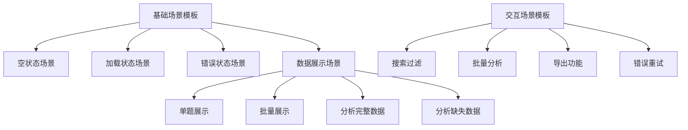
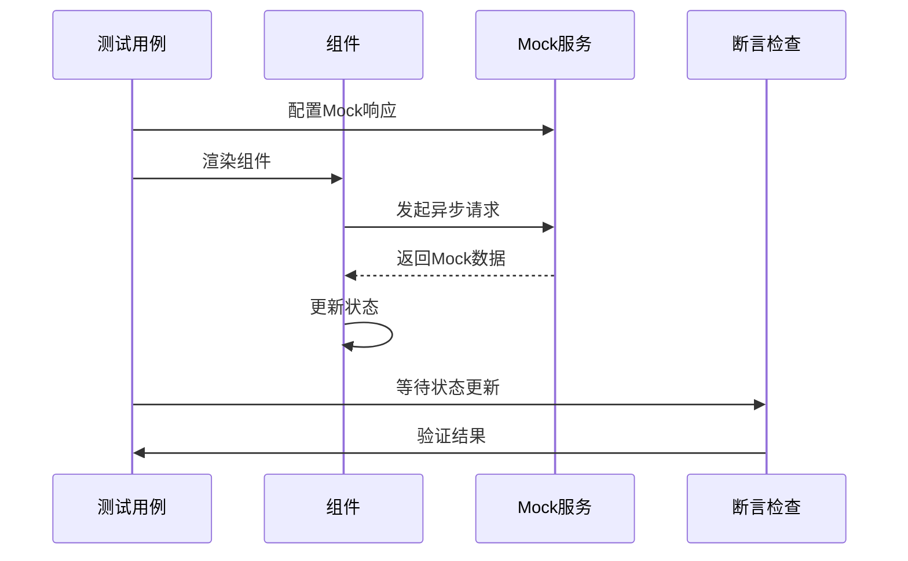
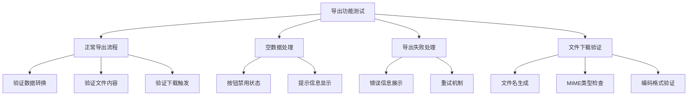
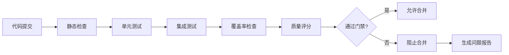
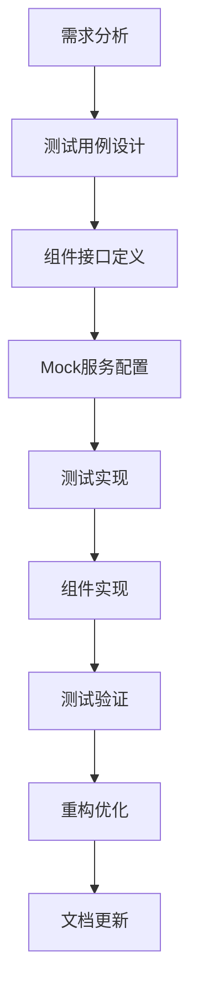

# 英语听力训练应用测试质量保证体系设计

## 概述

本设计文档针对英语听力训练应用中发现的测试问题，提供系统性的诊断与修复策略，并设计一套改进的前端组件测试框架。通过分析当前测试失败的根本原因，制定测试架构优化方案，确保代码质量和系统稳定性。

## 架构概述

基于项目当前使用的Vitest测试框架，设计一个分层的测试质量保证体系，包含测试问题诊断、修复策略执行、测试框架改进和质量监控四个核心模块。

## 测试问题诊断与分析

### 问题分类体系

| 问题类型 | 严重程度 | 影响范围 | 修复优先级 |
|----------|----------|----------|------------|
| Mock配置不完整 | 高 | 全局 | P0 |
| 元素选择器歧义 | 中 | 组件级 | P1 |
| 异步操作处理 | 中 | 功能级 | P1 |
| 交互事件模拟 | 低 | 单一测试 | P2 |

### 核心问题详细分析

#### Mock服务配置问题

**问题描述**：测试环境中多个服务的Mock配置不完整，导致undefined返回值

**影响范围**：
- `aiAnalysisConcurrency.getStatus()` 返回undefined
- `useBatchProcessing` hook缺失导出
- `ExportService.exportToTXT` 异步处理问题

**根因分析**：

#### 元素查找歧义问题

**问题描述**：多个元素具有相同文本内容，导致`getByText`查找失败

**典型场景**：
- "Your Answer"文本在多个答案比较区域出现
- 导出按钮在不同状态下的文本冲突

**解决策略**：
- 使用更精确的选择器策略
- 实施数据测试ID规范
- 建立元素层次结构查找机制

#### 交互事件处理问题

**问题描述**：元素具有`pointer-events: none`属性，无法进行用户交互

**技术分析**：
- CSS样式影响测试环境中的交互行为
- 下拉菜单和选择器组件的状态管理问题
- 异步渲染导致的时序问题

## 测试框架改进方案

### 分层测试架构设计

### 组件测试规范重构

#### 测试文件组织结构

| 测试类型 | 文件命名模式 | 测试范围 | 工具选择 |
|----------|--------------|----------|----------|
| 单元测试 | `*.unit.test.ts` | 纯函数、工具类 | Vitest |
| 组件测试 | `*.component.test.tsx` | React组件 | Testing Library |
| 集成测试 | `*.integration.test.ts` | API + 组件 | MSW + Testing Library |
| E2E测试 | `*.e2e.test.ts` | 完整用户流程 | Playwright |

#### Mock服务标准化设计

### 测试数据管理系统

#### 测试数据工厂模式

**设计原则**：
- 可预测的测试数据生成
- 数据关系的完整性保证
- 多场景数据模板支持

**数据模型设计**：

| 数据类型 | 工厂方法 | 可配置属性 | 依赖关系 |
|----------|----------|------------|----------|
| WrongAnswerItem | `createWrongAnswer()` | difficulty, language, hasAnalysis | Session + Question + Answer |
| Session | `createSession()` | topic, difficulty, language | - |
| Question | `createQuestion()` | type, options, transcript | - |
| AIAnalysis | `createAnalysis()` | confidence, tags, strategy | - |

#### 测试场景模板库

## 错题本组件测试优化设计

### 组件测试重构策略

#### 测试用例分组重组

**当前问题**：测试用例过于集中，缺乏清晰的功能边界

**改进方案**：

| 测试组 | 测试范围 | 主要验证点 | Mock需求 |
|--------|----------|------------|----------|
| 渲染与状态 | 基础渲染、状态管理 | 组件挂载、数据显示 | API Mock |
| 用户交互 | 搜索、过滤、导航 | 事件响应、状态更新 | Hook Mock |
| 数据处理 | 加载、错误、重试 | 异步处理、错误边界 | Service Mock |
| 批量操作 | AI分析、导出功能 | 批量处理、进度跟踪 | 综合Mock |

#### 元素选择器优化策略

**问题**：当前使用文本选择器导致歧义

**解决方案**：
- 实施`data-testid`属性标准
- 建立语义化选择器层次
- 使用角色和标签组合查找

**选择器优先级规范**：

| 优先级 | 选择器类型 | 使用场景 | 示例 |
|--------|------------|----------|------|
| P1 | `data-testid` | 关键功能元素 | `getByTestId('export-button')` |
| P2 | 语义角色 | 交互元素 | `getByRole('button', { name: /export/i })` |
| P3 | 标签文本 | 静态内容 | `getByLabelText('Search questions')` |
| P4 | 文本内容 | 最后选择 | `getByText(/export/i)` |

### 异步操作测试改进

#### 异步处理标准化模式

#### 等待策略优化

**当前问题**：使用`waitFor`但缺乏精确的等待条件

**改进方案**：

| 等待类型 | 使用场景 | 等待条件 | 超时设置 |
|----------|----------|----------|----------|
| 数据加载 | API请求完成 | 特定元素出现 | 5秒 |
| 状态更新 | 用户交互后 | 状态值变化 | 2秒 |
| 动画完成 | UI转换 | CSS类变化 | 1秒 |
| 错误处理 | 异常情况 | 错误信息显示 | 3秒 |

## 导出功能测试专项优化

### 导出服务测试重构

#### Mock策略改进

**问题分析**：当前Mock返回值不匹配实际服务接口

**解决方案**：
- 完善`ExportService.exportToTXT`的Mock实现
- 确保异步返回值的类型一致性
- 添加文件下载操作的Mock验证

#### 测试场景完善

### 批量分析功能测试优化

#### 并发处理测试设计

**测试重点**：
- 批量处理进度跟踪
- 并发限制机制验证
- 失败重试逻辑测试
- 取消操作功能验证

**Mock配置标准**：

| Mock对象 | 配置项 | 测试场景 | 验证点 |
|----------|--------|----------|--------|
| useBatchProcessing | 状态管理 | 进度跟踪 | 状态一致性 |
| aiAnalysisConcurrency | 并发控制 | 资源管理 | 限制生效 |
| API调用 | 响应模拟 | 成功/失败 | 错误处理 |

## 测试质量监控与持续改进

### 测试覆盖率监控

#### 覆盖率指标体系

| 指标类型 | 目标值 | 监控范围 | 告警阈值 |
|----------|--------|----------|----------|
| 行覆盖率 | >90% | 核心组件 | <85% |
| 分支覆盖率 | >85% | 业务逻辑 | <80% |
| 函数覆盖率 | >95% | 公共方法 | <90% |
| 语句覆盖率 | >90% | 全部代码 | <85% |

#### 质量门禁设计

### 测试性能优化

#### 执行效率提升策略

**并行化测试执行**：
- 按测试类型分组并行
- 独立Mock环境隔离
- 资源共享优化

**测试数据缓存**：
- 静态测试数据预生成
- Mock响应结果缓存
- 组件渲染状态复用

#### 测试维护自动化

| 自动化任务 | 执行频率 | 触发条件 | 处理方式 |
|------------|----------|----------|----------|
| 失效测试检测 | 每日 | CI运行后 | 自动标记 |
| Mock配置更新 | 代码变更时 | API接口变化 | 自动同步 |
| 测试数据清理 | 每周 | 数据库变更 | 自动重生成 |
| 覆盖率报告 | 每次构建 | PR提交 | 自动生成 |

## 技术实施规范

### 开发流程集成

#### 测试驱动开发流程

#### 代码审查检查点

| 检查项 | 重要性 | 检查标准 | 工具支持 |
|--------|--------|----------|----------|
| 测试覆盖率 | 必须 | 新增代码>90% | Istanbul |
| Mock配置 | 必须 | 依赖完整Mock | 人工审查 |
| 断言准确性 | 重要 | 测试预期明确 | ESLint规则 |
| 测试隔离性 | 重要 | 无副作用影响 | 人工审查 |

### 工具链配置优化

#### Vitest配置增强

**推荐配置改进**：
- 增加测试并行度配置
- 优化Mock模块解析
- 强化异步操作超时控制
- 完善测试环境隔离

#### 测试辅助工具集成

| 工具类型 | 推荐工具 | 功能作用 | 集成方式 |
|----------|----------|----------|----------|
| 视觉回归测试 | Chromatic | UI变化检测 | CI集成 |
| 性能测试 | Lighthouse CI | 组件性能监控 | 自动化执行 |
| 可访问性测试 | axe-core | 无障碍检查 | 测试内嵌 |
| API测试 | MSW | 网络请求Mock | 开发依赖 |