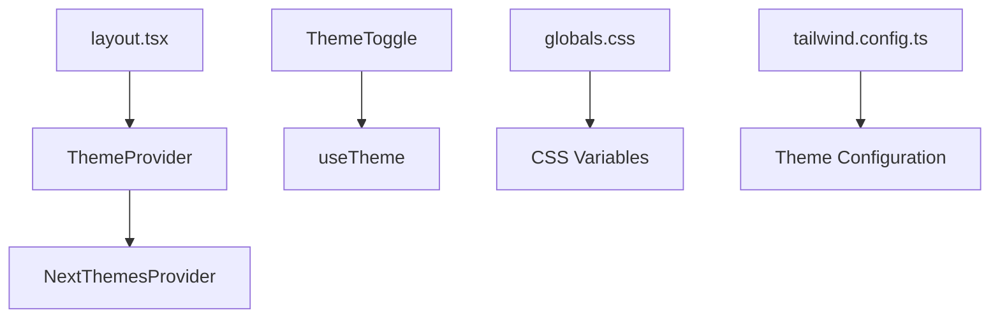
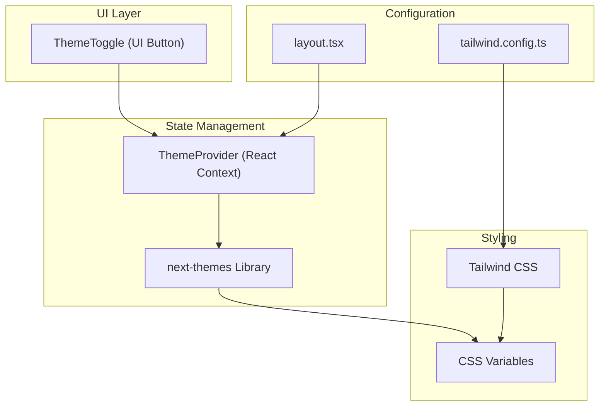
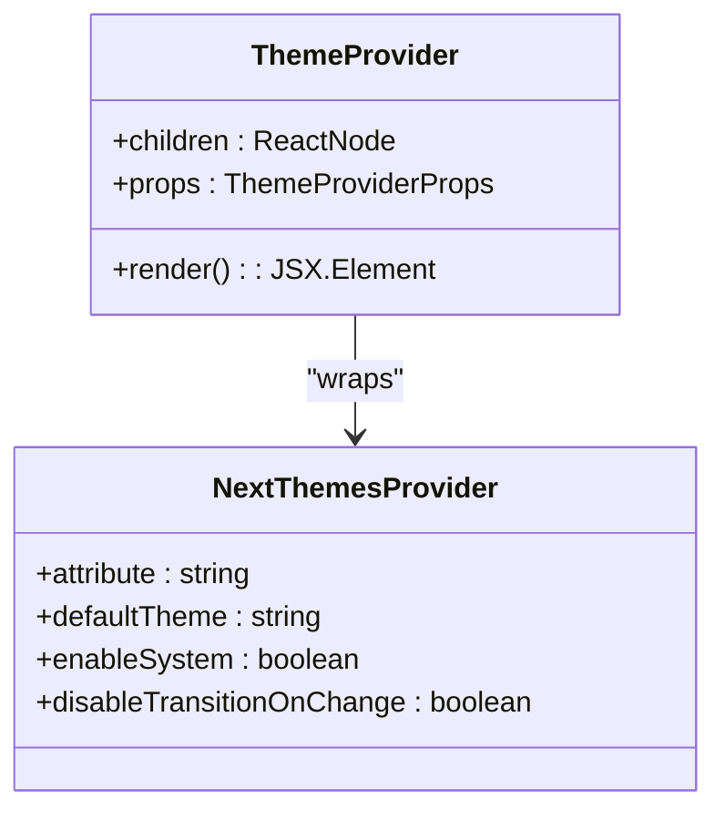
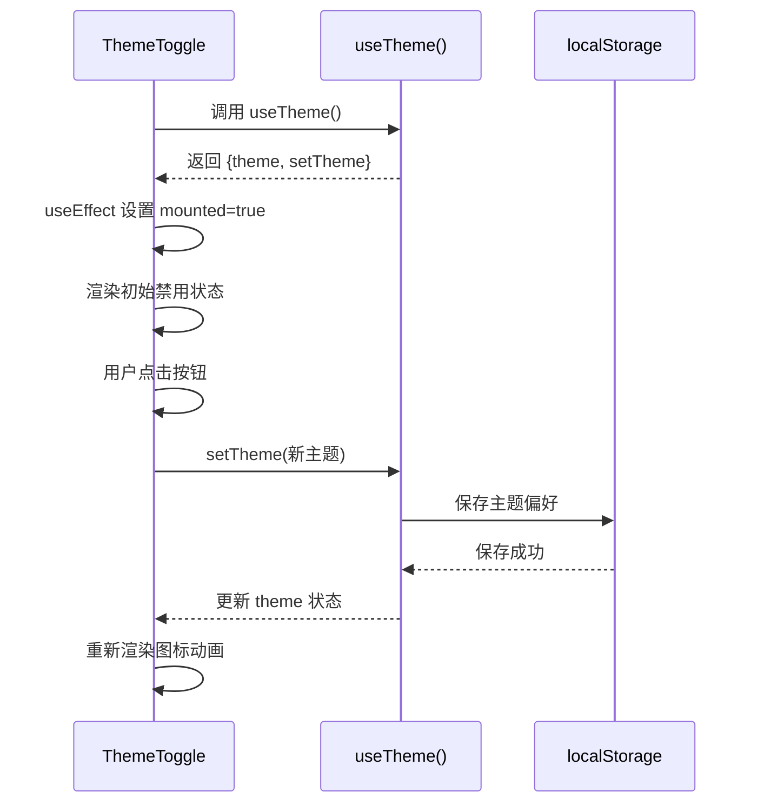
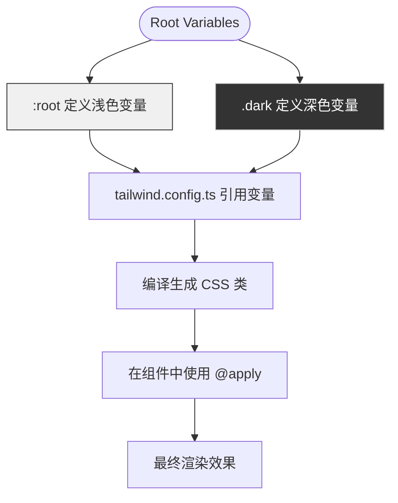

# 主题系统

<cite>
**本文档引用的文件**
- [theme-provider.tsx](file://components/theme-provider.tsx)
- [theme-toggle.tsx](file://components/theme-toggle.tsx)
- [globals.css](file://app/globals.css)
- [layout.tsx](file://app/layout.tsx)
- [tailwind.config.ts](file://tailwind.config.ts)
</cite>

## 目录
1. [简介](#简介)
2. [项目结构](#项目结构)
3. [核心组件](#核心组件)
4. [架构概览](#架构概览)
5. [详细组件分析](#详细组件分析)
6. [依赖关系分析](#依赖关系分析)
7. [性能考虑](#性能考虑)
8. [故障排除指南](#故障排除指南)
9. [结论](#结论)

## 简介
本项目实现了一套完整的亮暗模式主题切换系统，基于 React Context 和 `next-themes` 库进行全局状态管理。系统支持用户手动切换主题、持久化偏好至 localStorage，并能与操作系统深色模式自动同步。通过 Tailwind CSS 与 CSS 变量结合的方式，实现了平滑的视觉样式切换，并在 SSR 环境下有效避免了内容闪烁（FOUC）问题。

## 项目结构
主题系统相关文件分布在 `components/` 和 `app/` 目录中，主要包含提供者组件、切换按钮、全局样式配置和布局集成。



**Diagram sources**
- [layout.tsx](file://app/layout.tsx#L1-L40)
- [components/theme-provider.tsx](file://components/theme-provider.tsx#L1-L12)
- [components/theme-toggle.tsx](file://components/theme-toggle.tsx#L1-L49)
- [app/globals.css](file://app/globals.css#L1-L112)
- [tailwind.config.ts](file://tailwind.config.ts#L1-L100)

**Section sources**
- [layout.tsx](file://app/layout.tsx#L1-L40)
- [components/theme-provider.tsx](file://components/theme-provider.tsx#L1-L12)

## 核心组件
系统由 `ThemeProvider` 和 `ThemeToggle` 两个核心组件构成，分别负责主题状态管理和用户交互。

**Section sources**
- [components/theme-provider.tsx](file://components/theme-provider.tsx#L8-L10)
- [components/theme-toggle.tsx](file://components/theme-toggle.tsx#L8-L48)

## 架构概览
整个主题系统采用分层架构设计，从上到下依次为：UI 组件层、状态管理层、样式定义层和配置层。



**Diagram sources**
- [components/theme-provider.tsx](file://components/theme-provider.tsx#L8-L10)
- [components/theme-toggle.tsx](file://components/theme-toggle.tsx#L8-L48)
- [app/globals.css](file://app/globals.css#L1-L112)
- [tailwind.config.ts](file://tailwind.config.ts#L1-L100)
- [app/layout.tsx](file://app/layout.tsx#L1-L40)

## 详细组件分析

### ThemeProvider 分析
`ThemeProvider` 是一个封装组件，用于将 `next-themes` 的功能集成到应用中。



**Diagram sources**
- [components/theme-provider.tsx](file://components/theme-provider.tsx#L8-L10)

**Section sources**
- [components/theme-provider.tsx](file://components/theme-provider.tsx#L8-L10)

### ThemeToggle 分析
`ThemeToggle` 组件实现了主题切换按钮的完整逻辑，包括状态读取、点击处理和加载状态管理。



**Diagram sources**
- [components/theme-toggle.tsx](file://components/theme-toggle.tsx#L8-L48)

**Section sources**
- [components/theme-toggle.tsx](file://components/theme-toggle.tsx#L8-L48)

### 样式系统分析
CSS 变量与 Tailwind 的集成机制确保了主题样式的统一管理和高效应用。



**Diagram sources**
- [app/globals.css](file://app/globals.css#L8-L63)
- [tailwind.config.ts](file://tailwind.config.ts#L15-L50)

**Section sources**
- [app/globals.css](file://app/globals.css#L8-L63)
- [tailwind.config.ts](file://tailwind.config.ts#L15-L50)

## 依赖关系分析
主题系统各组件之间的依赖关系清晰明确，形成了稳定的调用链路。

```mermaid
graph LR
layout.tsx --> theme-provider.tsx
theme-provider.tsx --> next-themes
theme-toggle.tsx --> useTheme
useTheme --> next-themes
globals.css --> tailwind.config.ts
tailwind.config.ts --> CSS Variables
theme-toggle.tsx --> button.tsx
theme-toggle.tsx --> useBilingualText
```

**Diagram sources**
- [app/layout.tsx](file://app/layout.tsx#L1-L40)
- [components/theme-provider.tsx](file://components/theme-provider.tsx#L1-L12)
- [components/theme-toggle.tsx](file://components/theme-toggle.tsx#L1-L49)
- [app/globals.css](file://app/globals.css#L1-L112)
- [tailwind.config.ts](file://tailwind.config.ts#L1-L100)

**Section sources**
- [app/layout.tsx](file://app/layout.tsx#L1-L40)
- [components/theme-provider.tsx](file://components/theme-provider.tsx#L1-L12)
- [components/theme-toggle.tsx](file://components/theme-toggle.tsx#L1-L49)

## 性能考虑
系统在 SSR 环境下通过 `suppressHydrationWarning` 属性避免 hydration 警告，并利用 `disableTransitionOnChange` 防止主题切换时的样式抖动。客户端渲染前的骨架屏机制也提升了用户体验。

## 故障排除指南
常见问题包括主题不生效、图标显示异常和 localStorage 同步失败。建议检查 `layout.tsx` 中的 `ThemeProvider` 配置、确认 `next-themes` 正确安装以及验证浏览器存储权限设置。

**Section sources**
- [app/layout.tsx](file://app/layout.tsx#L25-L35)
- [components/theme-provider.tsx](file://components/theme-provider.tsx#L8-L10)
- [components/theme-toggle.tsx](file://components/theme-toggle.tsx#L15-L25)

## 结论
该主题系统设计合理，实现了完整的亮暗模式切换功能，具备良好的可维护性和扩展性。通过标准化的架构和清晰的依赖关系，为后续自定义主题扩展提供了坚实基础，同时也满足了无障碍访问的基本要求。