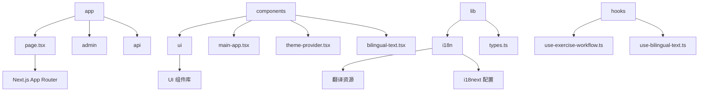
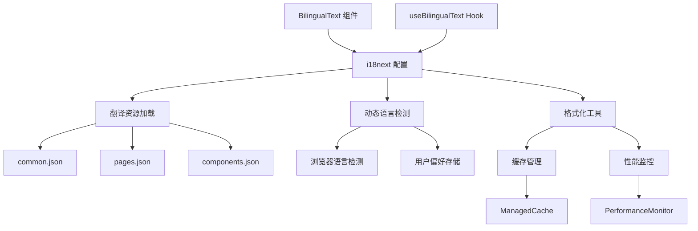
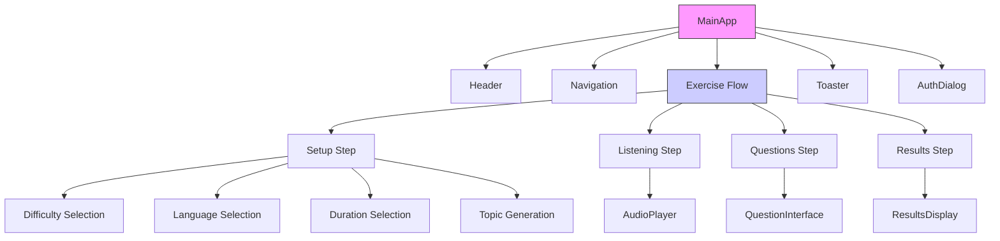
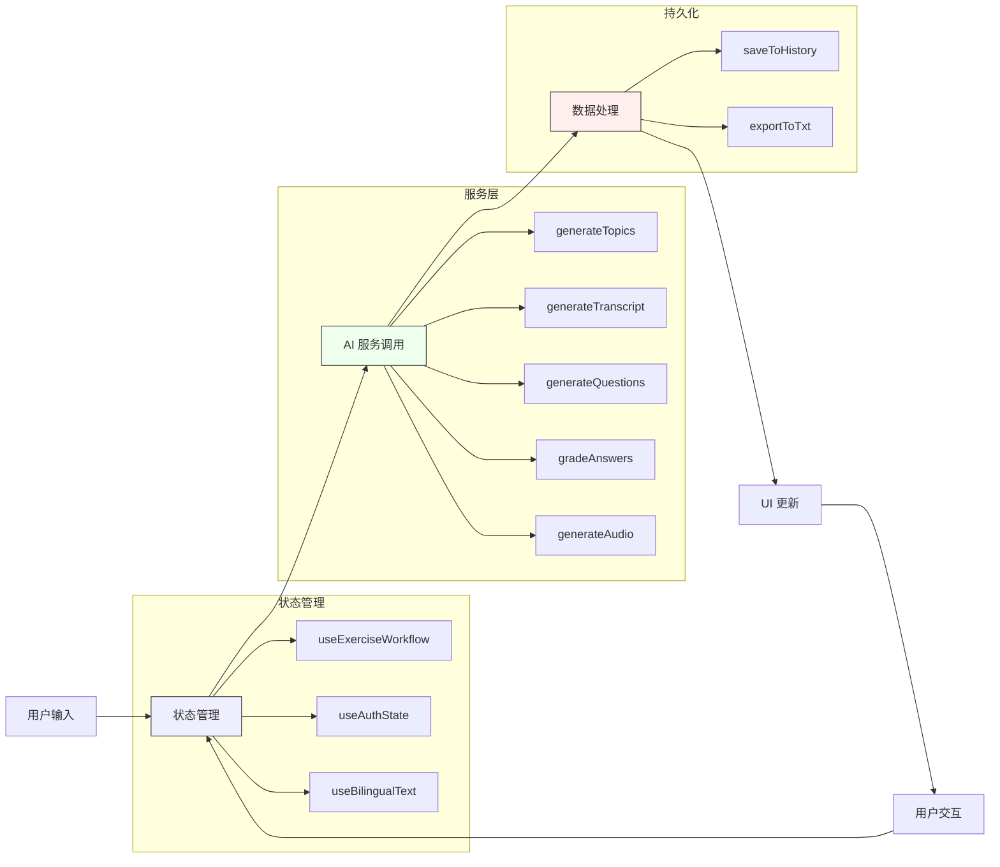

# 前端架构

<cite>
**本文档引用的文件**
- [main-app.tsx](file://components/main-app.tsx)
- [use-exercise-workflow.ts](file://hooks/use-exercise-workflow.ts)
- [bilingual-text.tsx](file://components/ui/bilingual-text.tsx)
- [theme-provider.tsx](file://components/theme-provider.tsx)
- [theme-toggle.tsx](file://components/theme-toggle.tsx)
- [i18n/config.ts](file://lib/i18n/config.ts)
- [i18n/types.ts](file://lib/i18n/types.ts)
- [use-bilingual-text.ts](file://hooks/use-bilingual-text.ts)
</cite>

## 目录
1. [项目结构](#项目结构)
2. [核心组件分析](#核心组件分析)
3. [练习流程控制机制](#练习流程控制机制)
4. [双语支持实现方案](#双语支持实现方案)
5. [主题系统实现](#主题系统实现)
6. [组件树与数据流](#组件树与数据流)

## 项目结构



**Diagram sources**
- [app/page.tsx](file://app/page.tsx)
- [components/main-app.tsx](file://components/main-app.tsx)
- [lib/i18n/config.ts](file://lib/i18n/config.ts)
- [hooks/use-exercise-workflow.ts](file://hooks/use-exercise-workflow.ts)

**Section sources**
- [app/page.tsx](file://app/page.tsx)
- [components/main-app.tsx](file://components/main-app.tsx)

## 核心组件分析

### MainApp 组件

`MainApp` 组件是应用的核心业务逻辑容器，负责组织和协调整个听力练习的工作流程。该组件使用 React Server Components 和客户端组件协同工作，通过状态管理来控制用户界面的不同阶段。

组件主要功能包括：
- 管理用户认证状态
- 控制练习流程的状态转换
- 协调 AI 服务调用（生成话题、文稿、问题等）
- 处理音频生成和播放
- 管理历史记录和错误处理

**Section sources**
- [components/main-app.tsx](file://components/main-app.tsx)

## 练习流程控制机制

### use-exercise-workflow Hook

`use-exercise-workflow` 自定义 Hook 实现了练习流程的完整控制机制，采用 Redux 风格的状态管理模式来管理复杂的练习状态。

```mermaid
classDiagram
    class ExerciseStep {
        +setup
        +listening
        +questions
        +results
    }
    class ExerciseFormData {
        +topic : string
        +customTopic : string
        +difficulty : DifficultyLevel
        +duration : number
        +focus : string
    }
    class ExerciseState {
        +currentStep : ExerciseStep
        +formData : ExerciseFormData
        +isGenerating : boolean
        +generationProgress : string
        +transcript : string
        +audioUrl : string
        +questions : Question[]
        +userAnswers : string[]
        +results : GradingResult[] | null
        +exercise : Exercise | null
        +suggestedTopics : string[]
        +error : string | null
    }
    class ExerciseAction {
        +SET_STEP
        +SET_FORM_DATA
        +SET_GENERATING
        +SET_PROGRESS
        +SET_TRANSCRIPT
        +SET_AUDIO_URL
        +SET_QUESTIONS
        +SET_USER_ANSWERS
        +SET_RESULTS
        +SET_EXERCISE
        +SET_SUGGESTED_TOPICS
        +SET_ERROR
        +RESET
    }
    ExerciseState --> ExerciseFormData : "包含"
    ExerciseState --> ExerciseStep : "当前步骤"
    ExerciseAction --> ExerciseState : "更新"
    note right of ExerciseState
        使用 useReducer 管理状态转换<br/>确保状态一致性
    end note
```

**Diagram sources**
- [hooks/use-exercise-workflow.ts](file://hooks/use-exercise-workflow.ts#L14-L57)

**Section sources**
- [hooks/use-exercise-workflow.ts](file://hooks/use-exercise-workflow.ts)

#### 状态管理设计

练习流程的状态管理采用不可变更新模式，通过 `useReducer` Hook 实现：

- **ExerciseStep**: 定义练习的四个主要阶段：设置、听力、答题和结果展示
- **ExerciseFormData**: 存储用户在设置阶段输入的表单数据
- **ExerciseState**: 包含所有练习相关的状态信息
- **ExerciseAction**: 定义所有可能的状态变更操作

这种设计确保了状态变更的可预测性和调试友好性，同时通过 `useCallback` 优化性能，避免不必要的重新渲染。

## 双语支持实现方案

### i18next 国际化架构

基于 i18next 的双语支持系统实现了完整的中英文切换功能，采用模块化设计提高可维护性。



**Diagram sources**
- [lib/i18n/config.ts](file://lib/i18n/config.ts)
- [lib/i18n/memory-management.ts](file://lib/i18n/memory-management.ts)
- [lib/i18n/performance.ts](file://lib/i18n/performance.ts)

### 翻译资源管理

双语系统通过以下方式管理翻译资源：

1. **资源文件组织**:
   - `common.json`: 通用文本（按钮、标签、消息）
   - `pages.json`: 页面特定文本
   - `components.json`: 组件特定文本

2. **懒加载机制**:
   - 使用动态导入实现代码分割
   - 按需加载翻译资源，减少初始加载时间

3. **缓存策略**:
   - 实现两级缓存（翻译缓存和格式化缓存）
   - 设置最大大小和过期时间，防止内存泄漏

**Section sources**
- [lib/i18n/config.ts](file://lib/i18n/config.ts)
- [lib/i18n/types.ts](file://lib/i18n/types.ts)

### BilingualText 组件

`BilingualText` 组件是双语支持的核心 UI 组件，提供一致的双语文本显示。

```mermaid
classDiagram
class BilingualTextProps {
+translationKey? : string
+en? : string
+zh? : string
+unit? : string
+className? : string
+as? : keyof HTMLElementTagNameMap
+options? : FormatOptions
}
class FormatOptions {
+withUnit? : string
+withParentheses? : boolean
+separator? : string
}
class TranslationKey {
+en : string
+zh : string
}
class UseBilingualTextReturn {
+t : (key : string, options? : FormatOptions) => string
+formatBilingual : (en : string, zh : string, options? : FormatOptions) => string
+getBilingualValue : (translationKey : TranslationKey, options? : FormatOptions) => string
}
BilingualTextProps --> FormatOptions : "可选"
BilingualTextProps --> TranslationKey : "或直接文本"
UseBilingualTextReturn --> BilingualTextProps : "提供"
note right of BilingualTextProps
支持多种使用方式：
1. translationKey : 使用翻译键
2. en/zh : 直接提供双语文本
end note
```

**Diagram sources**
- [components/ui/bilingual-text.tsx](file://components/ui/bilingual-text.tsx)
- [hooks/use-bilingual-text.ts](file://hooks/use-bilingual-text.ts)
- [lib/i18n/types.ts](file://lib/i18n/types.ts)

#### 使用模式

组件支持两种主要使用模式：

1. **翻译键模式**:
```tsx
<BilingualText translationKey="buttons.startPractice" />
```

2. **直接文本模式**:
```tsx
<BilingualText en="Start Practice" zh="开始练习" />
```

这种灵活性使得组件既可用于静态文本，也可用于动态内容。

## 主题系统实现

### ThemeProvider 组件

主题提供者组件基于 `next-themes` 库实现亮暗模式切换。

```mermaid
classDiagram
class ThemeProviderProps {
+children : React.ReactNode
+attribute? : string
+defaultTheme? : string
+enableSystem? : boolean
+disableTransitionOnChange? : boolean
}
class ThemeToggle {
+mounted : boolean
+theme : string
+setTheme : (theme : string) => void
}
ThemeProviderProps --> NextThemesProvider : "包装"
ThemeToggle --> useTheme : "使用"
ThemeToggle --> Button : "UI 元素"
note right of ThemeProviderProps
轻量级包装器，将 next-themes
功能暴露给应用其他部分
end note
```

**Diagram sources**
- [components/theme-provider.tsx](file://components/theme-provider.tsx)
- [components/theme-toggle.tsx](file://components/theme-toggle.tsx)

**Section sources**
- [components/theme-provider.tsx](file://components/theme-provider.tsx)
- [components/theme-toggle.tsx](file://components/theme-toggle.tsx)

### 切换机制

主题切换通过以下流程实现：

1. **状态初始化**: 使用 `useState` 确保服务端渲染兼容性
2. **主题读取**: 通过 `useTheme` Hook 获取当前主题
3. **切换处理**: 点击时调用 `setTheme` 切换到相反主题
4. **无障碍支持**: 提供屏幕阅读器友好的标签

## 组件树与数据流

### 组件层次结构



**Diagram sources**
- [components/main-app.tsx](file://components/main-app.tsx)

### 数据流动路径



**Diagram sources**
- [components/main-app.tsx](file://components/main-app.tsx)
- [hooks/use-exercise-workflow.ts](file://hooks/use-exercise-workflow.ts)
- [lib/ai-service.ts](file://lib/ai-service.ts)
- [lib/storage.ts](file://lib/storage.ts)

#### 数据流说明

1. **用户输入**: 用户在界面上进行各种操作和输入
2. **状态管理**: 输入被收集并存储在相应的状态 Hook 中
3. **服务调用**: 当需要外部数据时，调用相应的服务函数
4. **数据处理**: 服务返回的数据被处理并更新到状态中
5. **UI 更新**: 状态变化触发 UI 重新渲染
6. **持久化**: 重要数据被保存到本地存储或导出

这种单向数据流设计确保了应用状态的可预测性和可调试性，同时通过合理的状态拆分提高了组件的复用性。