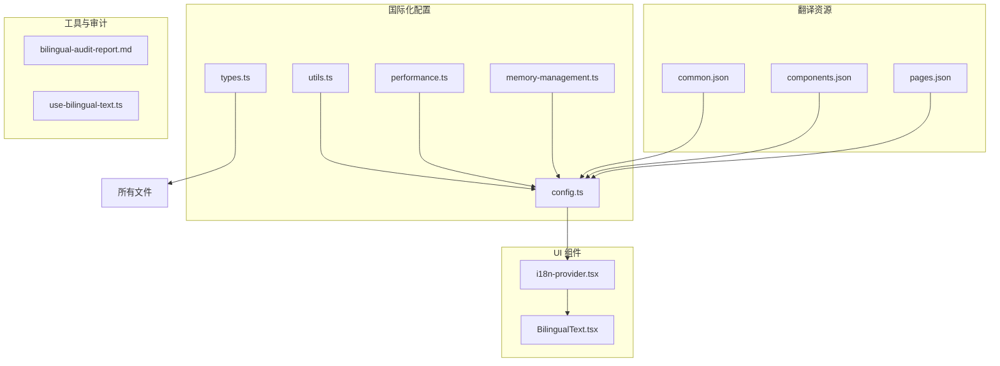
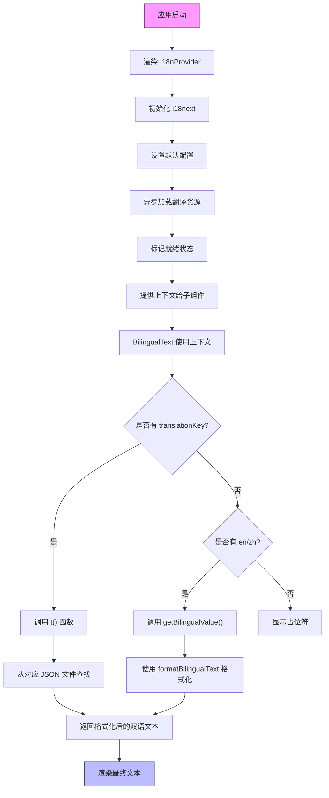
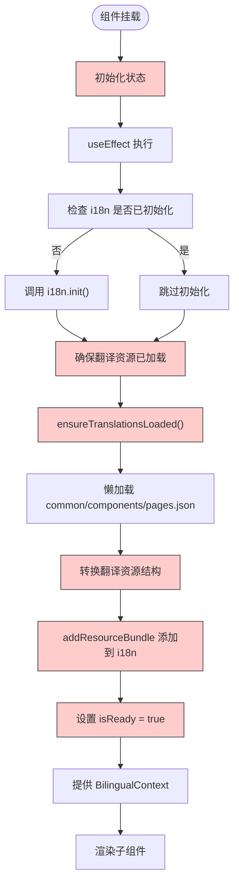
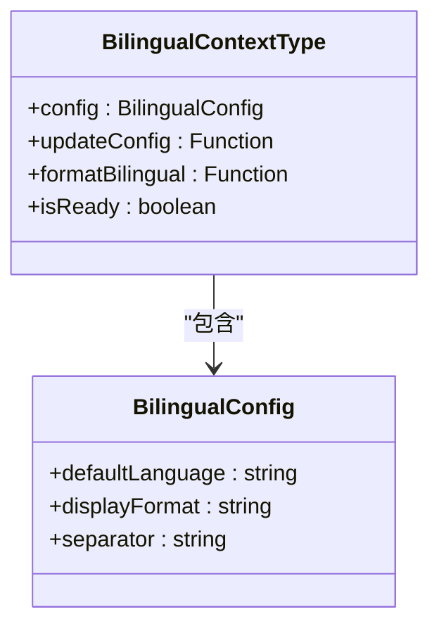
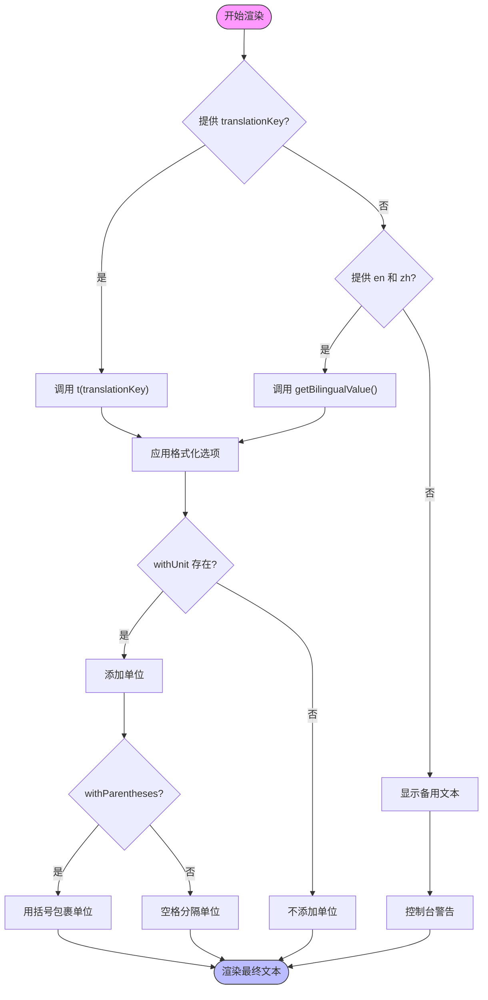
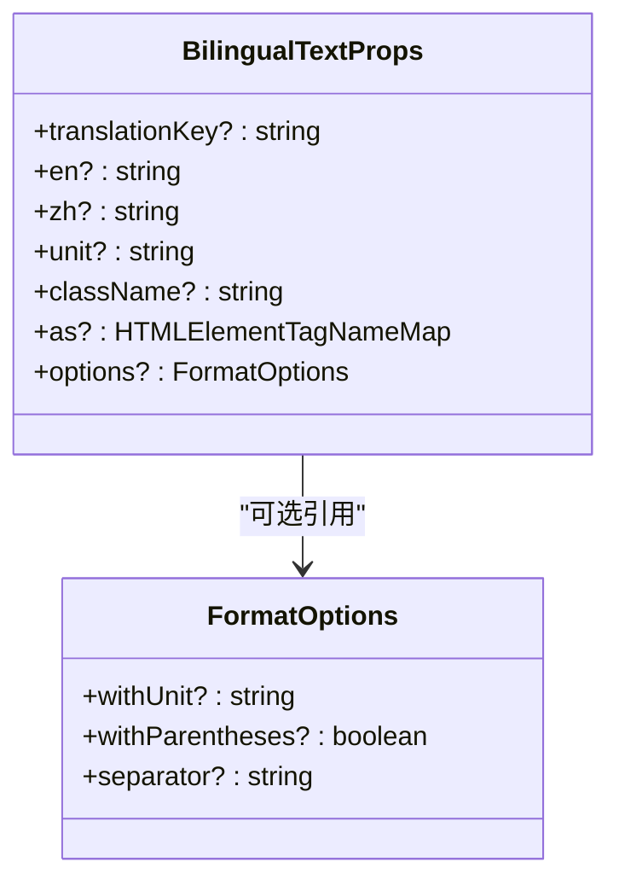

# 国际化实现

<cite>
**本文档引用的文件**  
- [i18n-provider.tsx](file://components/providers/i18n-provider.tsx)
- [bilingual-text.tsx](file://components/ui/bilingual-text.tsx)
- [config.ts](file://lib/i18n/config.ts)
- [types.ts](file://lib/i18n/types.ts)
- [common.json](file://lib/i18n/translations/common.json)
- [components.json](file://lib/i18n/translations/components.json)
- [pages.json](file://lib/i18n/translations/pages.json)
- [use-bilingual-text.ts](file://hooks/use-bilingual-text.ts)
- [bilingual-audit-report.md](file://documents/bilingual-audit-report.md)
</cite>

## 目录
1. [简介](#简介)
2. [项目结构](#项目结构)
3. [核心组件](#核心组件)
4. [架构概述](#架构概述)
5. [详细组件分析](#详细组件分析)
6. [依赖分析](#依赖分析)
7. [性能考虑](#性能考虑)
8. [故障排除指南](#故障排除指南)
9. [结论](#结论)

## 简介
本系统基于 i18next 实现双语支持，提供完整的中英文国际化解决方案。通过 `i18n-provider.tsx` 初始化 i18next 实例并注入 React 上下文，`bilingual-text.tsx` 组件根据当前语言环境智能渲染文本。翻译资源按功能模块组织为 common.json、components.json 和 pages.json 三个文件，采用统一的命名规范。系统支持动态语言切换，结合 localStorage 持久化用户偏好，并兼容 SSR 渲染。内置性能优化机制包括懒加载语言包和缓存管理，同时提供详细的多语言文本审计流程。

## 项目结构
国际化相关代码分布在特定目录中，形成清晰的关注点分离架构。配置和核心逻辑位于 lib/i18n 目录，UI 组件在 components 目录，实际翻译内容存储在 JSON 文件中。



**图示来源**
- [config.ts](file://lib/i18n/config.ts#L1-L183)
- [i18n-provider.tsx](file://components/providers/i18n-provider.tsx#L36-L103)
- [bilingual-text.tsx](file://components/ui/bilingual-text.tsx#L9-L45)
- [common.json](file://lib/i18n/translations/common.json#L0-L757)
- [components.json](file://lib/i18n/translations/components.json#L0-L799)
- [pages.json](file://lib/i18n/translations/pages.json#L0-L155)

**章节来源**
- [lib/i18n](file://lib/i18n)
- [components/providers](file://components/providers)
- [components/ui](file://components/ui)
- [hooks](file://hooks)

## 核心组件
系统由多个协同工作的核心组件构成，共同实现完整的双语支持功能。`I18nProvider` 负责初始化和状态管理，`BilingualText` 组件处理具体的文本渲染，而底层配置文件定义了格式化规则和默认行为。

**章节来源**
- [i18n-provider.tsx](file://components/providers/i18n-provider.tsx#L36-L103)
- [bilingual-text.tsx](file://components/ui/bilingual-text.tsx#L9-L45)
- [config.ts](file://lib/i18n/config.ts#L1-L183)

## 架构概述
整个国际化系统的架构设计遵循分层原则，从底层配置到上层 UI 形成清晰的数据流和控制流。



**图示来源**
- [i18n-provider.tsx](file://components/providers/i18n-provider.tsx#L36-L103)
- [bilingual-text.tsx](file://components/ui/bilingual-text.tsx#L9-L45)
- [config.ts](file://lib/i18n/config.ts#L1-L183)

## 详细组件分析

### I18nProvider 分析
`I18nProvider` 是整个国际化系统的核心容器组件，负责初始化 i18next 实例、加载翻译资源并提供 React 上下文。

#### 组件生命周期流程图


**图示来源**
- [i18n-provider.tsx](file://components/providers/i18n-provider.tsx#L36-L103)
- [config.ts](file://lib/i18n/config.ts#L1-L183)

#### 上下文值结构


**图示来源**
- [i18n-provider.tsx](file://components/providers/i18n-provider.tsx#L36-L103)
- [types.ts](file://lib/i18n/types.ts#L1-L107)

**章节来源**
- [i18n-provider.tsx](file://components/providers/i18n-provider.tsx#L36-L103)
- [types.ts](file://lib/i18n/types.ts#L1-L107)

### BilingualText 组件分析
`BilingualText` 是用于渲染双语文本的基础 UI 组件，支持多种输入方式和格式化选项。

#### 文本渲染决策流程


**图示来源**
- [bilingual-text.tsx](file://components/ui/bilingual-text.tsx#L9-L45)
- [use-bilingual-text.ts](file://hooks/use-bilingual-text.ts#L20-L160)

#### 组件属性接口


**图示来源**
- [bilingual-text.tsx](file://components/ui/bilingual-text.tsx#L9-L45)
- [types.ts](file://lib/i18n/types.ts#L1-L107)

**章节来源**
- [bilingual-text.tsx](file://components/ui/bilingual-text.tsx#L9-L45)
- [types.ts](file://lib/i18n/types.ts#L1-L107)

### 翻译资源配置分析
翻译资源按功能域划分为三个独立的 JSON 文件，每个文件都有明确的职责范围。

#### 翻译资源组织结构
```mermaid
erDiagram
  COMMON ||--o{ BUTTONS : contains
  COMMON ||--o{ LABELS : contains
  COMMON ||--o{ MESSAGES : contains
  COMMON ||--o{ PLACEHOLDERS : contains
  
  COMPONENTS ||--o{ AUDIO_PLAYER : contains
  COMPONENTS ||--o{ QUESTION_INTERFACE : contains
  COMPONENTS ||--o{ WRONG_ANSWERS_BOOK : contains
  COMPONENTS ||--o{ AUTH_DIALOG : contains
  COMPONENTS ||--o{ NAVIGATION : contains
  
  PAGES ||--o{ HOME : contains
  PAGES ||--o{ AS