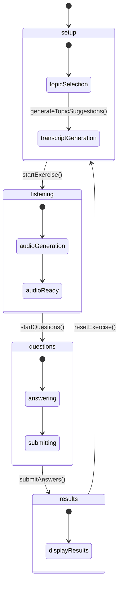
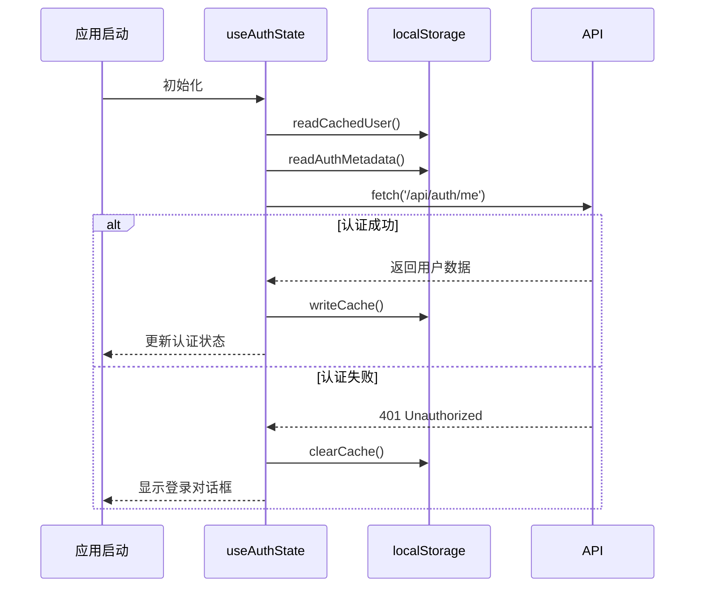
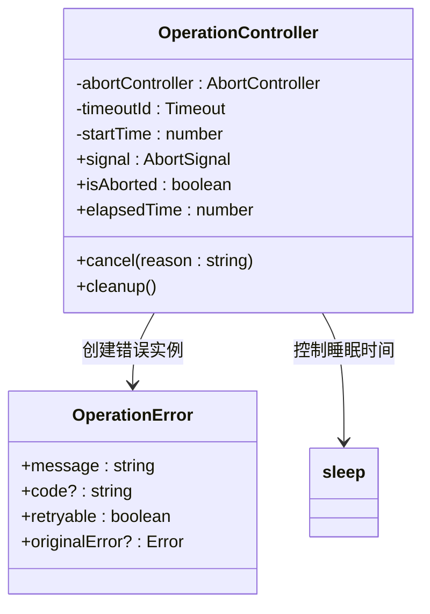
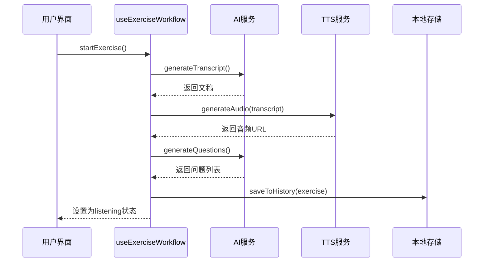
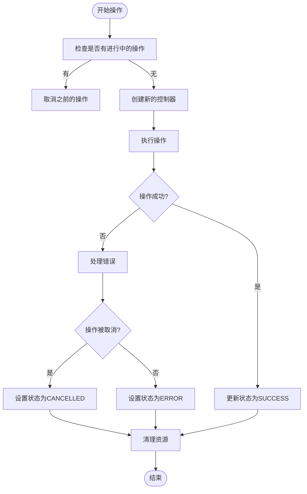

# 状态管理

<cite>
**本文档中引用的文件**
- [use-exercise-workflow.ts](file://hooks/use-exercise-workflow.ts)
- [use-auth-state.ts](file://hooks/use-auth-state.ts)
- [use-enhanced-operations.ts](file://hooks/use-enhanced-operations.ts)
</cite>

## 目录
1. [简介](#简介)
2. [核心状态管理Hook分析](#核心状态管理hook分析)
3. [听力练习生命周期与状态机设计](#听力练习生命周期与状态机设计)
4. [用户认证状态管理](#用户认证状态管理)
5. [增强型增删改查操作封装](#增强型增删改查操作封装)
6. [状态流转时序图](#状态流转时序图)
7. [错误处理与竞态条件解决方案](#错误处理与竞态条件解决方案)
8. [后端数据库同步策略](#后端数据库同步策略)
9. [总结](#总结)

## 简介
本项目采用React自定义Hook实现前端状态管理，通过`use-exercise-workflow`、`use-auth-state`和`use-enhanced-operations`三个核心Hook分别管理听力练习流程、用户认证状态以及复杂的数据操作。这些Hook利用useState、useReducer和useEffect等基础Hook协调异步请求、UI更新和副作用处理，实现了清晰的状态流转和错误处理机制。

## 核心状态管理Hook分析

### use-exercise-workflow Hook
该Hook是听力练习功能的核心状态管理器，负责协调整个练习流程的生命周期。

**Section sources**
- [use-exercise-workflow.ts](file://hooks/use-exercise-workflow.ts#L1-L358)

### use-auth-state Hook
该Hook用于维护用户的认证状态，并在多个组件间共享。

**Section sources**
- [use-auth-state.ts](file://hooks/use-auth-state.ts#L1-L258)

### use-enhanced-operations Hook
该Hook封装了复杂的增删改查操作，提供统一的错误处理和状态管理。

**Section sources**
- [use-enhanced-operations.ts](file://hooks/use-enhanced-operations.ts#L1-L600)

## 听力练习生命周期与状态机设计

### 状态定义
`use-exercise-workflow`使用useReducer管理一个包含多个字段的状态对象，主要状态包括：
- `currentStep`: 练习当前所处阶段（setup, listening, questions, results）
- `formData`: 用户输入的练习配置信息
- `isGenerating`: 是否正在生成内容
- `transcript`: 生成的听力文稿
- `audioUrl`: 生成的音频URL
- `questions`: 生成的问题列表
- `userAnswers`: 用户的答案
- `results`: 评分结果

### 状态流转
状态机通过dispatch分发不同类型的action来改变状态，每个action对应特定的状态变更逻辑。初始状态由`createInitialState`函数创建，根据用户评估结果设置推荐难度等级。

**Diagram sources**
- [use-exercise-workflow.ts](file://hooks/use-exercise-workflow.ts#L29-L42)
- [use-exercise-workflow.ts](file://hooks/use-exercise-workflow.ts#L44-L57)

**Section sources**
- [use-exercise-workflow.ts](file://hooks/use-exercise-workflow.ts#L59-L87)
- [use-exercise-workflow.ts](file://hooks/use-exercise-workflow.ts#L89-L128)

## 用户认证状态管理

### 认证状态结构
`useAuthState`Hook维护以下状态：
- `user`: 当前登录用户信息
- `isAuthenticated`: 是否已认证
- `isLoading`: 是否正在加载认证状态
- `showAuthDialog`: 是否显示认证对话框
- `authRefreshing`: 认证状态是否正在刷新
- `cacheStale`: 缓存是否过期

### 跨组件共享
通过localStorage持久化存储用户信息和元数据，在应用初始化时从缓存读取初始状态。使用useEffect在组件挂载时自动检查认证状态。

**Diagram sources**
- [use-auth-state.ts](file://hooks/use-auth-state.ts#L85-L257)

**Section sources**
- [use-auth-state.ts](file://hooks/use-auth-state.ts#L61-L94)
- [use-auth-state.ts](file://hooks/use-auth-state.ts#L96-L144)

## 增强型增删改查操作封装

### 操作状态枚举
`useEnhancedOperation`提供了统一的操作状态管理，包含以下状态：
- IDLE: 空闲
- LOADING: 加载中
- SUCCESS: 成功
- ERROR: 错误
- CANCELLED: 已取消

### 功能特性
该Hook封装了超时控制、重试机制（指数退避）、操作取消、进度反馈等功能，支持批量操作和缓存操作。

**Diagram sources**
- [use-enhanced-operations.ts](file://hooks/use-enhanced-operations.ts#L0-L63)
- [use-enhanced-operations.ts](file://hooks/use-enhanced-operations.ts#L169-L216)

**Section sources**
- [use-enhanced-operations.ts](file://hooks/use-enhanced-operations.ts#L169-L216)
- [use-enhanced-operations.ts](file://hooks/use-enhanced-operations.ts#L213-L252)

## 状态流转时序图

**Diagram sources**
- [use-exercise-workflow.ts](file://hooks/use-exercise-workflow.ts#L126-L357)

## 错误处理与竞态条件解决方案

### 错误处理机制
所有异步操作都包裹在try-catch块中，捕获到错误后通过dispatch更新error状态，并使用toast显示友好的错误提示。在finally块中确保isGenerating状态被正确重置。

### 竞态条件处理
- 使用AbortController防止重复请求
- 在执行新操作前先清理之前的控制器
- 使用ref引用保持对当前操作控制器的引用
- 实现超时机制避免请求无限等待

**Diagram sources**
- [use-enhanced-operations.ts](file://hooks/use-enhanced-operations.ts#L169-L216)
- [use-enhanced-operations.ts](file://hooks/use-enhanced-operations.ts#L213-L252)

**Section sources**
- [use-enhanced-operations.ts](file://hooks/use-enhanced-operations.ts#L169-L216)
- [use-enhanced-operations.ts](file://hooks/use-enhanced-operations.ts#L213-L252)

## 后端数据库同步策略

### 乐观更新 vs 拉取刷新
- **乐观更新**: 在提交答案后立即更新本地状态，假设服务器操作会成功
- **拉取刷新**: 提交后重新获取最新数据以确保一致性

### 实际应用
在听力练习场景中，采用混合策略：
1. 开始练习时生成的内容直接更新本地状态（乐观更新）
2. 提交答案后调用评分API，成功后更新本地结果
3. 定期轮询或在关键操作后刷新用户统计数据

## 总结
本项目的状态管理方案通过精心设计的自定义Hook实现了关注点分离和逻辑复用。`use-exercise-workflow`有效地管理了复杂的听力练习生命周期，`use-auth-state`提供了可靠的用户认证状态管理，而`use-enhanced-operations`则为各种数据操作提供了统一的接口和错误处理机制。这种架构使得代码更加模块化、可测试且易于维护。