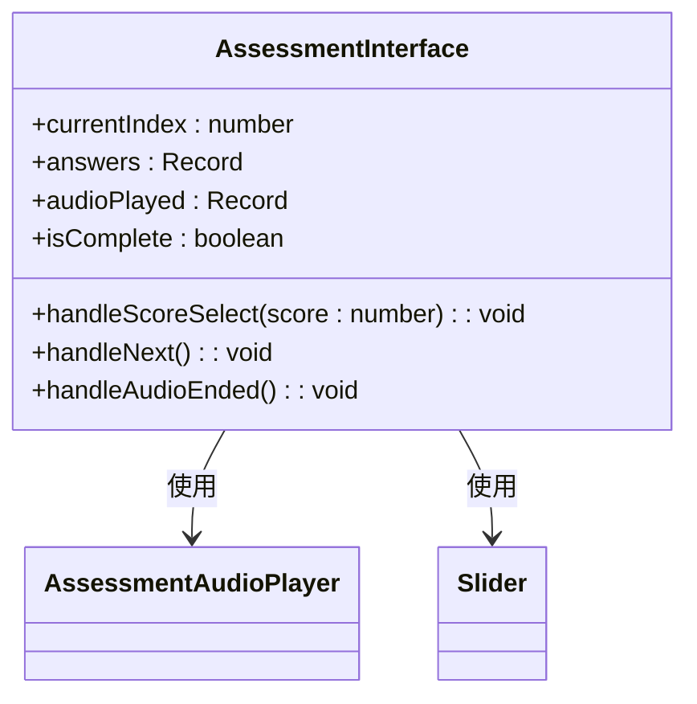
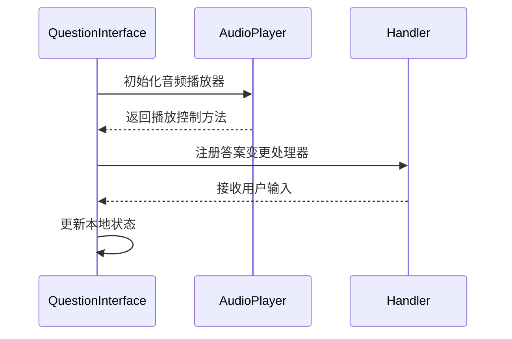
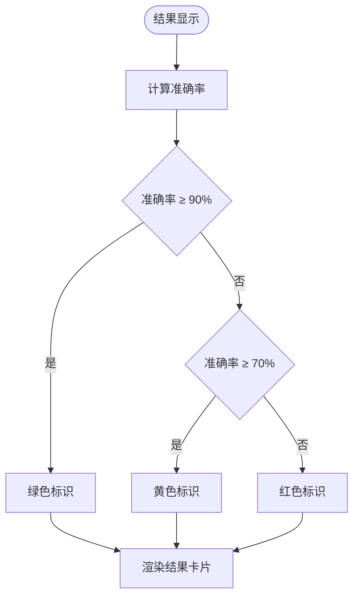
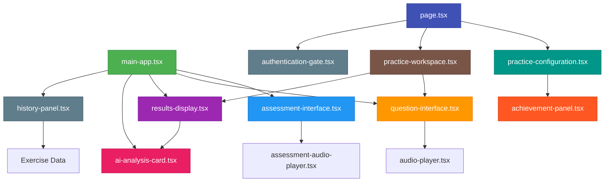

# 组件体系

<cite>
**本文档引用的文件**   
- [main-app.tsx](file://components/main-app.tsx)
- [assessment-interface.tsx](file://components/assessment-interface.tsx)
- [question-interface.tsx](file://components/question-interface.tsx)
- [results-display.tsx](file://components/results-display.tsx)
- [ai-analysis-card.tsx](file://components/ai-analysis-card.tsx)
- [history-panel.tsx](file://components/history-panel.tsx)
- [page.tsx](file://app/page.tsx) - *重构主页练习配置和认证流程*
- [practice-configuration.tsx](file://components/home/practice-configuration.tsx) - *重构主页练习配置和认证流程*
</cite>

## 更新摘要
**变更内容**   
- 根据代码变更更新了核心容器协调机制部分，反映主页组件重构
- 新增了关于PracticeConfiguration组件的详细说明
- 更新了业务组件职责划分部分，反映新的组件结构
- 修正了组件间数据传递模式的描述
- 更新了组件依赖关系图以反映最新的组件关系

## 目录
1. [核心容器协调机制](#核心容器协调机制)
2. [业务组件职责划分](#业务组件职责划分)
3. [组件间数据传递模式](#组件间数据传递模式)
4. [UI组合结构分析](#ui组合结构分析)
5. [组件依赖关系图](#组件依赖关系图)

## 核心容器协调机制

`main-app.tsx` 作为应用的核心容器，通过状态管理和条件渲染协调各个业务组件的展示与交互。该组件使用 `step` 状态变量控制当前显示的界面，当用户点击导航按钮时，会更新 `step` 值并渲染相应的组件。

在最新的重构中，主页组件（`page.tsx`）已被拆分为多个专门的组件，包括 `PracticeConfiguration`、`PracticeWorkspace` 和 `AuthenticationGate`。这种重构提高了代码的可维护性和可重用性。

`PracticeConfiguration` 组件负责管理练习设置界面，包括难度、语言、时长等参数的配置。它通过 props 接收来自父组件的状态和回调函数，并将用户的选择传递回父组件。

`PracticeWorkspace` 组件负责管理练习工作区的渲染，根据当前步骤（listening、questions、results）显示相应的组件。它封装了音频播放器、问题界面和结果展示等组件的条件渲染逻辑。

`AuthenticationGate` 组件负责处理认证相关的逻辑，包括显示加载状态、认证对话框和受保护的内容。它确保只有经过认证的用户才能访问应用的主要功能。

**Section sources**
- [main-app.tsx](file://components/main-app.tsx#L75-L719)
- [page.tsx](file://app/page.tsx#L84-L1835) - *重构主页练习配置和认证流程*
- [practice-configuration.tsx](file://components/home/practice-configuration.tsx#L115-L728) - *重构主页练习配置和认证流程*

## 业务组件职责划分

### 评估界面管理

`assessment-interface.tsx` 组件负责管理听力练习的整体流程状态。该组件维护当前题目索引、用户答案和音频播放状态等关键状态，确保评估过程的连贯性。

组件内部定义了五段不同难度级别的测试音频，每段音频包含特定的主题和描述信息。用户在完成所有题目的评分后，系统会根据平均得分计算出用户的英语听力水平等级（从A1初学者到C2精通级），并生成相应的学习建议。



**Diagram sources **
- [assessment-interface.tsx](file://components/assessment-interface.tsx#L84-L341)
- [assessment-audio-player.tsx](file://components/assessment-audio-player.tsx#L15-L158)

**Section sources**
- [assessment-interface.tsx](file://components/assessment-interface.tsx#L84-L341)

### 单题交互处理

`question-interface.tsx` 组件专门处理单个问题的交互逻辑。该组件支持两种题型：单选题和简答题，能够根据题目类型动态渲染不同的输入控件。

对于单选题，组件使用 RadioGroup 实现选项选择功能；对于简答题，则提供 Textarea 供用户输入答案。组件还集成了音频播放器，允许用户在答题过程中随时回听音频内容。



**Diagram sources **
- [question-interface.tsx](file://components/question-interface.tsx#L309-L309)

**Section sources**
- [question-interface.tsx](file://components/question-interface.tsx#L309-L309)

### 结果展示与AI分析

`results-display.tsx` 和 `ai-analysis-card.tsx` 组件共同负责展示练习结果与AI分析建议。前者以卡片形式呈现整体准确率、正确题数等统计信息，后者则提供详细的AI驱动的学习反馈。

`results-display` 组件通过颜色编码直观地显示答题准确率，绿色表示优秀（≥90%），黄色表示良好（70%-89%），红色表示需改进（<70%）。用户可以展开查看每道题目的详细作答情况，包括自己的答案、正确答案和解析。



**Diagram sources **
- [results-display.tsx](file://components/results-display.tsx#L17-L200)

**Section sources**
- [results-display.tsx](file://components/results-display.tsx#L17-L200)

### 历史记录回放

`history-panel.tsx` 组件提供历史记录回放功能，允许用户查看过去的练习记录。该组件实现了搜索、过滤和排序功能，帮助用户快速找到特定的练习历史。

用户可以根据主题关键词进行搜索，按难度级别或语言进行过滤，并按照时间顺序或得分高低进行排序。点击任意一条历史记录即可恢复当时的练习状态，重新查看题目和答案。

**Section sources**
- [history-panel.tsx](file://components/history-panel.tsx#L19-L250)

## 组件间数据传递模式

组件间主要通过 props 传递数据和回调函数来实现通信。父组件将状态作为 props 传递给子组件，同时传递用于更新状态的回调函数。

在重构后的代码中，这种模式得到了进一步的优化。`page.tsx` 作为顶层组件，管理所有全局状态，并通过 props 将这些状态和回调函数传递给 `PracticeConfiguration` 和 `PracticeWorkspace` 组件。

例如，在主页组件中：
```typescript
<PracticeConfiguration
  practiceSetup={{
    difficulty,
    duration,
    language,
    topic,
    suggestedTopics,
    isSetupComplete,
    onDifficultyChange: setDifficulty,
    onDurationChange: setDuration,
    onLanguageChange: handleLanguageChange,
    onTopicChange: setTopic,
    topicInputRef,
  }}
  templateManager={{
    templates,
    templateOpLoadingId,
    renamingId,
    renameText,
    onRenameTextChange: setRenameText,
    onApplyTemplate: applyTemplate,
    onStartRename: startRename,
    onConfirmRename: confirmRename,
    onResetRenameState: resetRenameState,
    onDeleteTemplate: deleteTemplateById,
    onSaveTemplate: saveTemplateFromPrompt,
  }}
  specialized={{
    isEnabled: isSpecializedMode,
    selectedAreas: selectedFocusAreas,
    recommendedAreas: recommendedFocusAreas,
    focusAreaStats,
    focusCoverage,
    isLoadingRecommendations,
    loadingStates,
    progressInfo,
    presets: specializedPresets,
    onToggle: handleSpecializedModeToggle,
    onSelectionChange: handleFocusAreaSelection,
    onApplyRecommendations: handleApplyRecommendations,
    onSavePreset: handleSaveSpecializedPreset,
    onLoadPreset: handleLoadSpecializedPreset,
    onDeletePreset: handleDeleteSpecializedPreset,
  }}
  operations={{
    loading,
    loadingMessage,
    onGenerateTopics: handleGenerateTopics,
    onGenerateExercise: handleGenerateTranscript,
  }}
  achievements={{
    isGoalPanelOpen,
    onToggleGoalPanel: () => setIsGoalPanelOpen((prev) => !prev),
    isAuthenticated,
  }}
/>
```

这种结构化的 props 传递方式使得组件间的依赖关系更加清晰，提高了代码的可读性和可维护性。

**Section sources**
- [page.tsx](file://app/page.tsx#L84-L1835) - *重构主页练习配置和认证流程*

## UI组合结构分析

应用采用 React 的组合模式构建可复用的 UI 层次结构。基础 UI 组件（如 Button、Card、Input）被封装在 `/components/ui` 目录下，业务组件则在此基础上进行组合和扩展。

例如，`ResultsDisplay` 组件由多个 `Card` 组件组合而成，每个 `Card` 又包含 `Progress`、`Badge` 等更小的 UI 元素。这种分层组合的方式提高了代码的复用性和可维护性。

此外，组件设计遵循单一职责原则，每个组件只关注一个特定的功能领域。这使得组件更容易测试、理解和重用。

**Section sources**
- [results-display.tsx](file://components/results-display.tsx#L17-L200)

## 组件依赖关系图



**Diagram sources **
- [main-app.tsx](file://components/main-app.tsx#L75-L719)
- [page.tsx](file://app/page.tsx#L84-L1835) - *重构主页练习配置和认证流程*
- [practice-configuration.tsx](file://components/home/practice-configuration.tsx#L115-L728) - *重构主页练习配置和认证流程*
- [practice-workspace.tsx](file://components/home/practice-workspace.tsx#L32-L105)
- [authentication-gate.tsx](file://components/home/authentication-gate.tsx#L20-L53)
- [assessment-interface.tsx](file://components/assessment-interface.tsx#L84-L341)
- [question-interface.tsx](file://components/question-interface.tsx#L309-L309)
- [results-display.tsx](file://components/results-display.tsx#L17-L200)
- [ai-analysis-card.tsx](file://components/ai-analysis-card.tsx#L38-L)