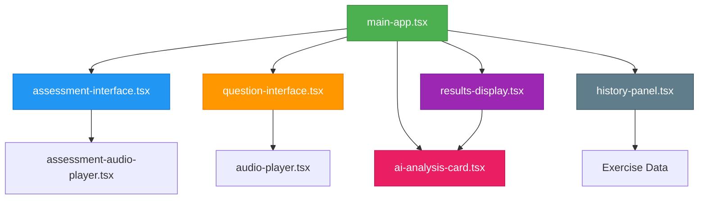

# 组件体系

<cite>
**本文档引用的文件**   
- [main-app.tsx](file://components/main-app.tsx)
- [assessment-interface.tsx](file://components/assessment-interface.tsx)
- [question-interface.tsx](file://components/question-interface.tsx)
- [results-display.tsx](file://components/results-display.tsx)
- [ai-analysis-card.tsx](file://components/ai-analysis-card.tsx)
- [history-panel.tsx](file://components/history-panel.tsx)
</cite>

## 目录
1. [核心容器协调机制](#核心容器协调机制)
2. [业务组件职责划分](#业务组件职责划分)
3. [组件间数据传递模式](#组件间数据传递模式)
4. [UI组合结构分析](#ui组合结构分析)
5. [组件依赖关系图](#组件依赖关系图)

## 核心容器协调机制

`main-app.tsx` 作为应用的核心容器，通过状态管理和条件渲染协调各个业务组件的展示与交互。该组件使用 `step` 状态变量控制当前显示的界面，当用户点击导航按钮时，会更新 `step` 值并渲染相应的组件。

例如，在听力评估流程中，当 `step` 为 "setup" 时显示练习设置界面；当用户完成设置后，`step` 变更为 "listening"，此时渲染音频播放器组件。这种基于状态的条件渲染模式实现了不同功能模块之间的平滑切换。

核心容器还负责管理全局状态，如用户认证信息、练习难度、主题等，并通过 props 将这些状态传递给子组件。同时，它也接收来自子组件的回调函数，实现父子组件间的双向通信。

**Section sources**
- [main-app.tsx](file://components/main-app.tsx#L75-L691)

## 业务组件职责划分

### 评估界面管理

`assessment-interface.tsx` 组件负责管理听力练习的整体流程状态。该组件维护当前题目索引、用户答案和音频播放状态等关键状态，确保评估过程的连贯性。

组件内部定义了五段不同难度级别的测试音频，每段音频包含特定的主题和描述信息。用户在完成所有题目的评分后，系统会根据平均得分计算出用户的英语听力水平等级（从A1初学者到C2精通级），并生成相应的学习建议。


**Diagram sources **
- [assessment-interface.tsx](file://components/assessment-interface.tsx#L84-L341)
- [assessment-audio-player.tsx](file://components/assessment-audio-player.tsx#L15-L158)

**Section sources**
- [assessment-interface.tsx](file://components/assessment-interface.tsx#L84-L341)

### 单题交互处理

`question-interface.tsx` 组件专门处理单个问题的交互逻辑。该组件支持两种题型：单选题和简答题，能够根据题目类型动态渲染不同的输入控件。

对于单选题，组件使用 RadioGroup 实现选项选择功能；对于简答题，则提供 Textarea 供用户输入答案。组件还集成了音频播放器，允许用户在答题过程中随时回听音频内容。


**Diagram sources **
- [question-interface.tsx](file://components/question-interface.tsx#L309-L309)

**Section sources**
- [question-interface.tsx](file://components/question-interface.tsx#L309-L309)

### 结果展示与AI分析

`results-display.tsx` 和 `ai-analysis-card.tsx` 组件共同负责展示练习结果与AI分析建议。前者以卡片形式呈现整体准确率、正确题数等统计信息，后者则提供详细的AI驱动的学习反馈。

`results-display` 组件通过颜色编码直观地显示答题准确率，绿色表示优秀（≥90%），黄色表示良好（70%-89%），红色表示需改进（<70%）。用户可以展开查看每道题目的详细作答情况，包括自己的答案、正确答案和解析。


**Diagram sources **
- [results-display.tsx](file://components/results-display.tsx#L17-L200)

**Section sources**
- [results-display.tsx](file://components/results-display.tsx#L17-L200)

### 历史记录回放

`history-panel.tsx` 组件提供历史记录回放功能，允许用户查看过去的练习记录。该组件实现了搜索、过滤和排序功能，帮助用户快速找到特定的练习历史。

用户可以根据主题关键词进行搜索，按难度级别或语言进行过滤，并按照时间顺序或得分高低进行排序。点击任意一条历史记录即可恢复当时的练习状态，重新查看题目和答案。

**Section sources**
- [history-panel.tsx](file://components/history-panel.tsx#L19-L250)

## 组件间数据传递模式

组件间主要通过 props 传递数据和回调函数来实现通信。父组件将状态作为 props 传递给子组件，同时传递用于更新状态的回调函数。

例如，在主应用组件中：
```typescript
<QuestionInterface
  questions={questions}
  answers={answers}
  onAnswerChange={setAnswers}
  onSubmit={handleSubmitAnswers}
/>
```

这里，`questions` 和 `answers` 是从父组件传递给子组件的数据，而 `onAnswerChange` 和 `onSubmit` 则是子组件调用以通知父组件状态变化的回调函数。

这种单向数据流的设计模式使得状态管理更加可预测和易于调试。所有的状态变更都必须通过明确的函数调用来触发，避免了隐式的副作用。

**Section sources**
- [main-app.tsx](file://components/main-app.tsx#L75-L691)

## UI组合结构分析

应用采用 React 的组合模式构建可复用的 UI 层次结构。基础 UI 组件（如 Button、Card、Input）被封装在 `/components/ui` 目录下，业务组件则在此基础上进行组合和扩展。

例如，`ResultsDisplay` 组件由多个 `Card` 组件组合而成，每个 `Card` 又包含 `Progress`、`Badge` 等更小的 UI 元素。这种分层组合的方式提高了代码的复用性和可维护性。

此外，组件设计遵循单一职责原则，每个组件只关注一个特定的功能领域。这使得组件更容易测试、理解和重用。

**Section sources**
- [results-display.tsx](file://components/results-display.tsx#L17-L200)

## 组件依赖关系图



**Diagram sources **
- [main-app.tsx](file://components/main-app.tsx#L75-L691)
- [assessment-interface.tsx](file://components/assessment-interface.tsx#L84-L341)
- [question-interface.tsx](file://components/question-interface.tsx#L309-L309)
- [results-display.tsx](file://components/results-display.tsx#L17-L200)
- [ai-analysis-card.tsx](file://components/ai-analysis-card.tsx#L38-L