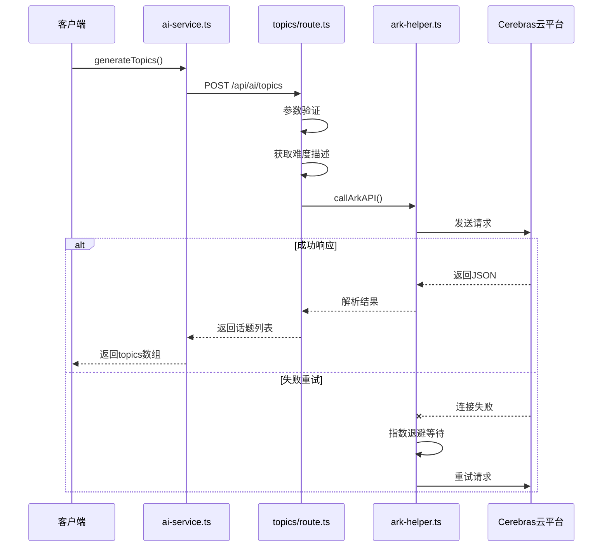
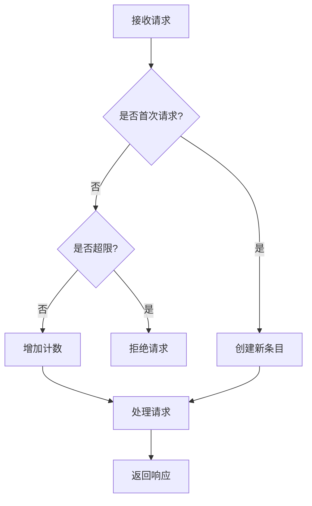

# AI内容生成API

<cite>
**本文档引用文件**  
- [ai-service.ts](file://lib/ai-service.ts)
- [topics/route.ts](file://app/api/ai/topics/route.ts)
- [transcript/route.ts](file://app/api/ai/transcript/route.ts)
- [questions/route.ts](file://app/api/ai/questions/route.ts)
- [grade/route.ts](file://app/api/ai/grade/route.ts)
- [expand/route.ts](file://app/api/ai/expand/route.ts)
- [ark-helper.ts](file://lib/ark-helper.ts)
- [rate-limiter.ts](file://lib/rate-limiter.ts)
- [difficulty-service.ts](file://lib/difficulty-service.ts)
- [text-expansion.ts](file://lib/text-expansion.ts)
- [types.ts](file://lib/types.ts)
</cite>

## 目录
1. [简介](#简介)
2. [核心功能与API端点](#核心功能与api端点)
3. [服务协调机制](#服务协调机制)
4. [服务调用链与容错策略](#服务调用链与容错策略)
5. [请求示例](#请求示例)
6. [速率限制机制](#速率限制机制)
7. [缓存优化方案](#缓存优化方案)
8. [错误处理与监控](#错误处理与监控)
9. [结论](#结论)

## 简介
本API系统为英语听力训练平台提供AI驱动的内容生成能力，涵盖主题生成、转录文本生成、问题生成、文本扩展和答案评分五大核心功能。所有AI调用均通过Cerebras云平台实现，并由`ai-service.ts`统一协调客户端请求。系统采用结构化提示工程、多阶段生成流程和智能重试机制，确保高质量输出的同时保障服务稳定性。

## 核心功能与API端点

### 主题生成 (/api/ai/topics)
生成适合特定难度等级的听力练习话题。

**输入参数：**
- `difficulty`: 难度级别 (A1, A2, B1, B2, C1, C2)
- `wordCount`: 目标词数
- `language`: 听力语言 (en-US, en-GB, es等)
- `difficultyLevel`: 数字型难度等级 (1-30)

**JSON响应结构：**
```json
{
  "success": true,
  "topics": ["topic1", "topic2", "topic3", "topic4", "topic5"]
}
```

### 转录文本生成 (/api/ai/transcript)
基于指定主题生成符合难度要求的听力稿。

**输入参数：**
- `difficulty`: 难度级别
- `wordCount`: 目标词数
- `topic`: 主题
- `language`: 语言
- `difficultyLevel`: 数字难度等级

**JSON响应结构：**
```json
{
  "success": true,
  "transcript": "生成的听力文本",
  "wordCount": 120,
  "generationAttempts": 2,
  "expansionAttempts": 3,
  "message": "生成成功"
}
```

### 问题生成 (/api/ai/questions)
根据听力稿生成理解性题目。

**输入参数：**
- `difficulty`: 难度级别
- `transcript`: 听力文本
- `duration`: 音频时长(秒)
- `language`: 语言
- `difficultyLevel`: 数字难度等级

**JSON响应结构：**
```json
{
  "success": true,
  "questions": [
    {
      "type": "single",
      "question": "问题文本",
      "options": ["A", "B", "C", "D"],
      "answer": "正确答案",
      "focus_areas": ["main-idea", "detail-comprehension"],
      "explanation": "解释文本"
    }
  ]
}
```

### 文本扩展 (/api/ai/expand)
将现有文本扩写至目标长度。

**输入参数：**
- `text`: 原始文本
- `targetWordCount`: 目标词数
- `topic`: 主题
- `difficulty`: 难度级别
- `language`: 语言
- `maxAttempts`: 最大尝试次数
- `minAcceptablePercentage`: 最小可接受百分比

**JSON响应结构：**
```json
{
  "success": true,
  "expandedText": "扩写后的文本",
  "originalWordCount": 80,
  "finalWordCount": 115,
  "expansionAttempts": 2,
  "meetsRequirement": true,
  "message": "扩写成功"
}
```

### 答案评分 (/api/ai/grade)
对用户答案进行专业批改。

**输入参数：**
- `transcript`: 原文
- `questions`: 题目列表
- `answers`: 用户答案
- `language`: 语言

**JSON响应结构：**
```json
{
  "success": true,
  "results": [
    {
      "type": "short",
      "user_answer": "用户答案",
      "correct_answer": "标准答案",
      "is_correct": false,
      "standard_answer": "参考答案",
      "score": 7,
      "short_feedback": "简要反馈",
      "error_tags": ["inference", "vocabulary"],
      "error_analysis": "中文错误分析"
    }
  ]
}
```

**Section sources**
- [topics/route.ts](file://app/api/ai/topics/route.ts#L1-L76)
- [transcript/route.ts](file://app/api/ai/transcript/route.ts#L1-L188)
- [questions/route.ts](file://app/api/ai/questions/route.ts#L1-L127)
- [expand/route.ts](file://app/api/ai/expand/route.ts#L1-L113)
- [grade/route.ts](file://app/api/ai/grade/route.ts#L1-L134)

## 服务协调机制
整个AI内容生成系统通过`ai-service.ts`作为客户端统一入口，该文件导出多个异步函数，每个函数对应一个API端点。这些函数使用通用的`postJson`工具方法向Next.js API路由发送POST请求，避免在浏览器端暴露Cerebras API密钥。

后端API路由接收到请求后，会调用`ark-helper.ts`中的`callArkAPI`函数与Cerebras云平台交互。该函数支持JSON Schema结构化输出，确保返回数据格式符合预期。同时，系统利用`difficulty-service.ts`提供的`getDifficultyPromptModifier`函数，将数字型难度等级转换为详细的提示词修饰符，精确控制生成内容的复杂度。

**Diagram sources**
- [ai-service.ts](file://lib/ai-service.ts#L1-L113)
- [ark-helper.ts](file://lib/ark-helper.ts#L1-L233)

```mermaid
flowchart TD
A[客户端] --> B[ai-service.ts]
B --> C[/api/ai/* 路由]
C --> D[ark-helper.ts]
D --> E[Cerebras云平台]
F[difficulty-service.ts] --> D
G[text-expansion.ts] --> C
```

## 服务调用链与容错策略
以`topics/route.ts`为例，展示完整的服务调用链和容错设计：

1. **请求验证**：检查必要参数是否存在
2. **难度映射**：通过`difficulty-service.ts`获取精确的难度描述
3. **提示词构建**：构造包含详细要求的系统提示
4. **模式定义**：使用JSON Schema约束输出格式
5. **AI调用**：通过`callArkAPI`发起请求
6. **结果验证**：检查返回数据是否符合预期结构
7. **异常处理**：捕获并记录错误，返回标准化错误响应

`callArkAPI`函数实现了多层次的容错机制：
- **代理健康检查**：定期检测代理服务器状态
- **自动回退**：代理失败时切换到直连模式
- **指数退避重试**：最多3次重试，间隔时间递增
- **电路断路器**：防止雪崩效应



**Diagram sources**
- [topics/route.ts](file://app/api/ai/topics/route.ts#L1-L76)
- [ark-helper.ts](file://lib/ark-helper.ts#L1-L233)

**Section sources**
- [topics/route.ts](file://app/api/ai/topics/route.ts#L1-L76)
- [ark-helper.ts](file://lib/ark-helper.ts#L1-L233)

## 请求示例

### 生成初级校园话题
```json
{
  "level": "A2",
  "topic": "school",
  "wordCount": 100,
  "language": "en-US"
}
```

### 生成听力稿（带扩写）
```json
{
  "difficulty": "B1",
  "wordCount": 150,
  "topic": "environmental protection",
  "language": "en-US",
  "difficultyLevel": 14
}
```

### 批改答案
```json
{
  "transcript": "The climate change conference...",
  "questions": [...],
  "answers": {
    "0": "The main point is about global warming",
    "1": "They discussed renewable energy"
  },
  "language": "en-US"
}
```

**Section sources**
- [topics/route.ts](file://app/api/ai/topics/route.ts#L1-L76)
- [transcript/route.ts](file://app/api/ai/transcript/route.ts#L1-L188)
- [grade/route.ts](file://app/api/ai/grade/route.ts#L1-L134)

## 速率限制机制
系统通过`rate-limiter.ts`实现精细化的速率控制，防止滥用并保障服务质量。

**预设配置：**
- **AI分析端点**：每分钟10次请求
- **批量处理**：每5分钟3次请求
- **通用API**：每分钟60次请求

**关键特性：**
- **自适应计数**：可选择是否计入成功/失败请求
- **多维度键值**：基于IP地址或用户ID进行限流
- **内存存储**：使用Map对象存储限流状态
- **定时清理**：每5分钟清理过期条目



**Diagram sources**
- [rate-limiter.ts](file://lib/rate-limiter.ts#L1-L276)

## 缓存优化方案
虽然当前代码未直接实现响应缓存，但可通过以下方式优化性能：

1. **应用层缓存**：在`ai-service.ts`中添加内存缓存，对相同参数的请求返回缓存结果
2. **CDN缓存**：对于不敏感的公共内容，可配置CDN进行边缘缓存
3. **数据库缓存**：将高频请求的结果持久化存储，减少AI调用次数
4. **本地缓存**：客户端可缓存最近生成的内容，减少网络往返

建议结合`rate-limiter.ts`中的键值生成逻辑，实现基于用户和请求参数的细粒度缓存策略。

## 错误处理与监控
系统建立了全面的错误处理和监控体系：

- **结构化错误**：所有错误都包含明确的消息和状态码
- **详细日志**：关键步骤输出调试信息，便于问题追踪
- **电路断路器**：`aiServiceCircuitBreaker`防止级联故障
- **代理健康检查**：定期检测连接