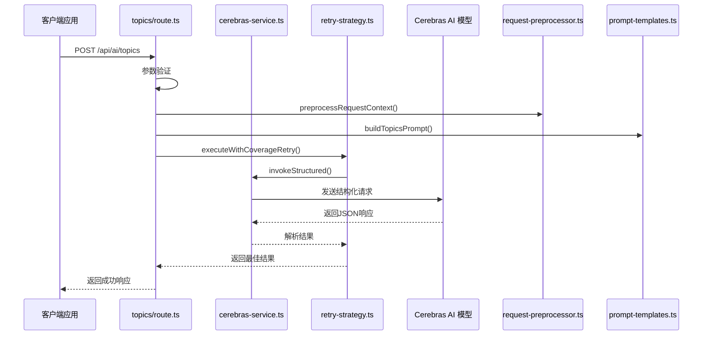
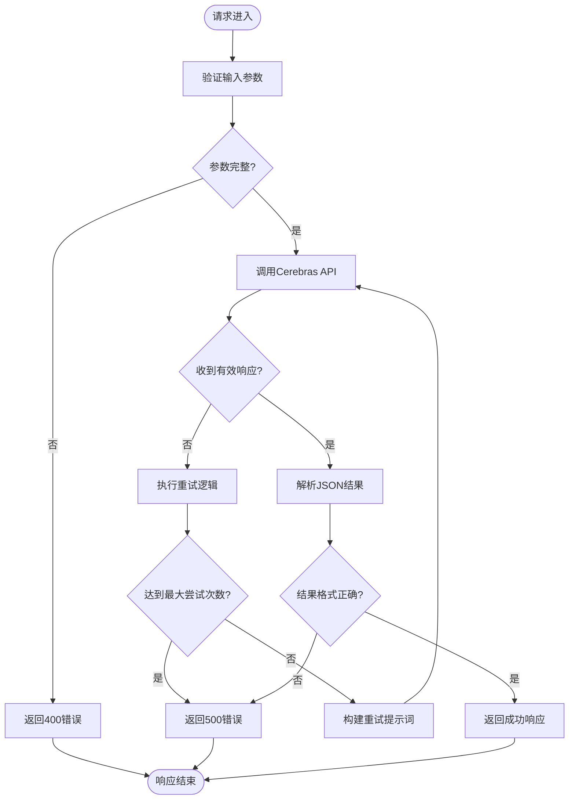
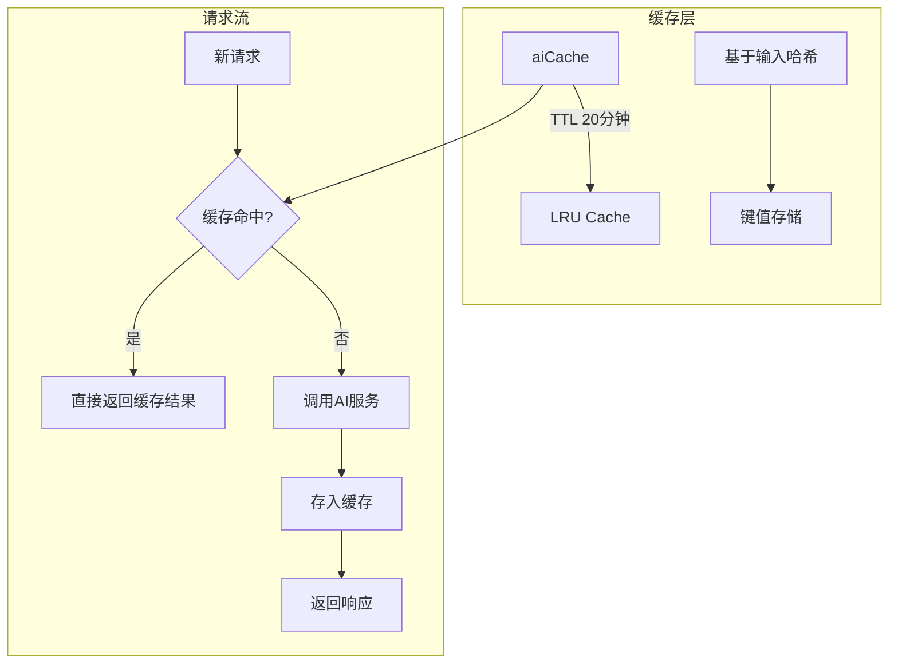

# 主题生成API

<cite>
**本文档引用的文件**
- [topics/route.ts](file://app/api/ai/topics/route.ts)
- [cerebras-service.ts](file://lib/ai/cerebras-service.ts)
- [retry-strategy.ts](file://lib/ai/retry-strategy.ts)
- [prompt-templates.ts](file://lib/ai/prompt-templates.ts)
- [schemas.ts](file://lib/ai/schemas.ts)
- [route-utils.ts](file://lib/ai/route-utils.ts)
- [rate-limiter.ts](file://lib/rate-limiter.ts)
- [request-preprocessor.ts](file://lib/ai/request-preprocessor.ts)
</cite>

## 更新摘要
**主要变更**   
- 更新了服务调用链描述，反映从`ark-helper.ts`到`cerebras-service.ts`的重构
- 修正了重试策略说明，从指数退避算法改为基于覆盖率的智能重试机制
- 更新了速率限制配置，反映`GENERAL_API`配置的实际应用
- 移除了关于动态代理支持的过时信息
- 增加了对`executeWithCoverageRetry`函数的详细说明
- 更新了架构图以反映新的调用管道结构

## 目录
1. [介绍](#介绍)
2. [请求结构与参数说明](#请求结构与参数说明)
3. [服务调用链与处理流程](#服务调用链与处理流程)
4. [错误处理机制](#错误处理机制)
5. [性能优化策略](#性能优化策略)
6. [使用示例](#使用示例)

## 介绍

主题生成API是英语听力训练系统的核心功能之一，专为K12学生设计。该接口通过`/api/ai/topics`端点接收用户指定的学习难度和可选主题关键词，调用Cerebras AI模型生成适合特定水平学习者的听力练习主题列表。系统结合了AI推理、速率限制、缓存优化和容错重试机制，确保高可用性和响应性能。

**Section sources**
- [topics/route.ts](file://app/api/ai/topics/route.ts#L1-L124)

## 请求结构与参数说明

### 请求体结构
```json
{
  "difficulty": "A2",
  "wordCount": 150,
  "language": "en-US",
  "topic": "daily-routine"
}
```

### 参数范围及默认值

| 参数 | 类型 | 必填 | 默认值 | 描述 |
|------|------|------|--------|------|
| `difficulty` | string | 是 | 无 | 难度等级（如A1, A2, B1等） |
| `wordCount` | number | 是 | 无 | 目标词汇量（建议100-300） |
| `language` | string | 否 | 'en-US' | 音频语言代码 |
| `topic` | string | 否 | 无 | 可选主题关键词 |

返回的JSON格式包含5个符合要求的主题标题及其元数据信息。

**Section sources**
- [topics/route.ts](file://app/api/ai/topics/route.ts#L15-L38)

## 服务调用链与处理流程

### 调用链分析


**Diagram sources**
- [topics/route.ts](file://app/api/ai/topics/route.ts#L15-L124)
- [cerebras-service.ts](file://lib/ai/cerebras-service.ts#L31-L60)
- [retry-strategy.ts](file://lib/ai/retry-strategy.ts#L59-L101)
- [request-preprocessor.ts](file://lib/ai/request-preprocessor.ts#L26-L51)
- [prompt-templates.ts](file://lib/ai/prompt-templates.ts#L13-L38)

### 处理逻辑详解
1. **参数解析**：从请求中提取`difficulty`, `wordCount`, `language`, `topic`
2. **输入验证**：检查必填字段是否存在
3. **上下文预处理**：调用`preprocessRequestContext`准备请求上下文
4. **提示词构造**：使用`buildTopicsPrompt`构建符合AI模型理解的自然语言指令
5. **结构化调用**：通过`invokeStructured`发送带有JSON schema约束的请求
6. **智能重试**：使用`executeWithCoverageRetry`根据结果质量决定是否重试

#### 超时与重试策略
系统采用基于覆盖率的智能重试策略：
- 当请求包含`focusAreas`时，最多执行2次尝试
- 当请求不包含`focusAreas`时，仅执行1次尝试
- 每次重试都会生成新的提示词，强调需要覆盖的领域
- 最终返回覆盖质量最高的结果

**Section sources**
- [retry-strategy.ts](file://lib/ai/retry-strategy.ts#L59-L101)
- [topics/route.ts](file://app/api/ai/topics/route.ts#L40-L65)

## 错误处理机制

### 错误传播路径


**Diagram sources**
- [topics/route.ts](file://app/api/ai/topics/route.ts#L15-L124)
- [cerebras-service.ts](file://lib/ai/cerebras-service.ts#L31-L60)

### 常见错误码
- `400 Bad Request`: 缺少必要参数
- `429 Too Many Requests`: 超出速率限制
- `500 Internal Server Error`: AI响应格式异常或内部错误
- `503 Service Unavailable`: 电路断路器开启，服务暂时不可用

所有错误均记录到服务器日志，并向客户端返回清晰的错误消息。

**Section sources**
- [topics/route.ts](file://app/api/ai/topics/route.ts#L70-L124)
- [route-utils.ts](file://lib/ai/route-utils.ts#L72-L128)

## 性能优化策略

### 速率限制配置
系统对AI相关接口实施严格的速率控制：

```typescript
GENERAL_API: {
  windowMs: 60 * 1000, // 1分钟
  maxRequests: 60   // 最多60次请求
}
```

实际部署中针对`/api/ai/topics`使用了`GENERAL_API`配置，即每分钟最多60次请求的限制，防止滥用并保障服务质量。

### 响应缓存机制
利用内存缓存提升重复请求的响应速度：



**Diagram sources**
- [rate-limiter.ts](file://lib/rate-limiter.ts#L153-L175)
- [route-utils.ts](file://lib/ai/route-utils.ts#L72-L128)

缓存键由输入参数的哈希值生成，确保相同请求获得一致响应，同时避免不必要的AI调用开销。

**Section sources**
- [rate-limiter.ts](file://lib/rate-limiter.ts#L153-L175)
- [route-utils.ts](file://lib/ai/route-utils.ts#L72-L128)

## 使用示例

### curl命令示例
```bash
curl -X POST https://api.example.com/api/ai/topics \
  -H "Content-Type: application/json" \
  -d '{
    "difficulty": "A2",
    "wordCount": 150,
    "topic": "daily-routine"
  }'
```

### 预期响应
```json
{
  "success": true,
  "topics": [
    "Morning routine: brushing teeth and getting dressed",
    "After school activities and homework time",
    "Family dinner and evening relaxation",
    "Weekend chores and grocery shopping",
    "Daily commute to school by bus"
  ]
}
```

此接口已集成至前端组件，支持实时生成符合学生水平的听力训练主题，显著提升个性化学习体验。

**Section sources**
- [topics/route.ts](file://app/api/ai/topics/route.ts#L15-L124)
- [cerebras-service.ts](file://lib/ai/cerebras-service.ts#L31-L60)