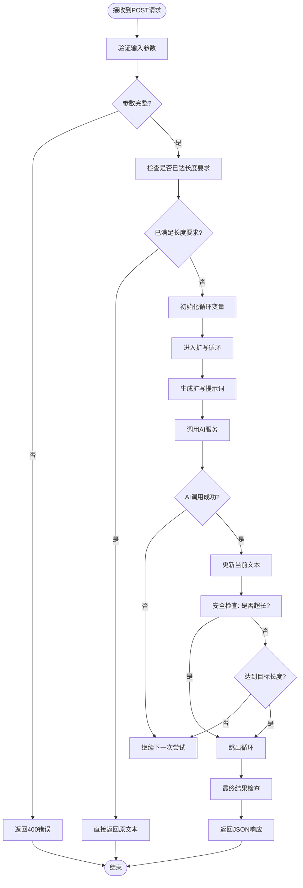
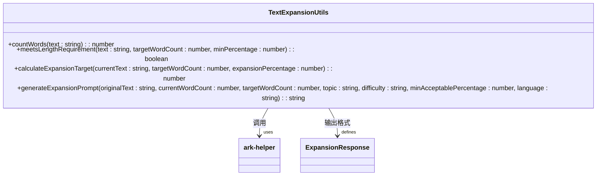
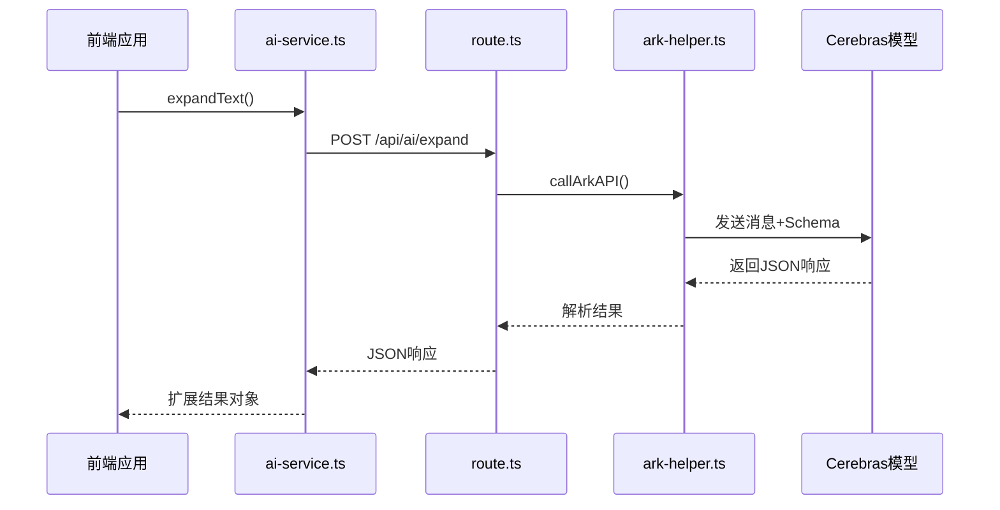

# 文本扩展API

<cite>
**本文档引用文件**   
- [route.ts](file://app/api/ai/expand/route.ts)
- [text-expansion.ts](file://lib/text-expansion.ts)
- [ai-service.ts](file://lib/ai-service.ts)
- [ark-helper.ts](file://lib/ark-helper.ts)
</cite>

## 目录
1. [简介](#简介)
2. [核心功能与应用场景](#核心功能与应用场景)
3. [输入输出结构定义](#输入输出结构定义)
4. [处理流程剖析](#处理流程剖析)
5. [扩写算法实现机制](#扩写算法实现机制)
6. [AI服务调用与模型集成](#ai服务调用与模型集成)
7. [示例演示](#示例演示)
8. [可控性设置与语义保持](#可控性设置与语义保持)
9. [敏感内容过滤策略](#敏感内容过滤策略)
10. [性能优化与错误处理](#性能优化与错误处理)

## 简介
文本扩展API旨在为英语听力学习者提供智能化的语言输入增强功能。该API通过`/api/ai/expand`端点接收简短的原始文本，并将其扩展为更丰富、更具上下文意义的表达形式，从而提升语言学习材料的复杂度和实用性。系统利用Cerebras大模型进行语义保持的扩写任务，确保生成内容既符合目标长度要求，又不偏离原始含义。

## 核心功能与应用场景
本API的核心功能是将用户提供的简短句子或关键词扩展为适合听力练习的完整段落。主要应用于：
- 增强初级学习者的语言输入质量
- 生成多样化且自然的听力脚本素材
- 提供不同难度级别的语言表达变体
- 支持个性化学习路径中的内容定制化

**Section sources**
- [route.ts](file://app/api/ai/expand/route.ts#L1-L113)

## 输入输出结构定义
### 输入字段说明
| 字段名 | 类型 | 必填 | 描述 |
|-------|------|------|------|
| text | string | 是 | 需要扩展的原始文本 |
| targetWordCount | number | 是 | 目标单词数量 |
| topic | string | 是 | 主题领域（如日常生活、学术讲座等） |
| difficulty | string | 是 | 难度等级（A1-C2） |
| language | string | 否 | 语言代码，默认'en-US' |
| maxAttempts | number | 否 | 最大尝试次数，默认5次 |
| minAcceptablePercentage | number | 否 | 可接受最小百分比，默认0.9 |

### 输出结构说明
```json
{
  "success": true,
  "expandedText": "扩展后的文本",
  "originalWordCount": 3,
  "finalWordCount": 20,
  "targetWordCount": 20,
  "expansionAttempts": 2,
  "meetsRequirement": true,
  "meetsBasicRequirement": true,
  "minAcceptablePercentage": 0.9,
  "message": "扩写成功：从 3 词扩写到 20 词（达到90%要求）"
}
```

**Section sources**
- [route.ts](file://app/api/ai/expand/route.ts#L1-L113)

## 处理流程剖析


**Diagram sources**
- [route.ts](file://app/api/ai/expand/route.ts#L1-L113)

**Section sources**
- [route.ts](file://app/api/ai/expand/route.ts#L1-L113)

## 扩写算法实现机制
### 单词计数逻辑
精确统计英文单词数量，采用正则表达式清理非单词字符后分割字符串并过滤无效项。

### 长度达标判断
基于目标词数和最小可接受百分比计算所需最低词数，比较实际词数是否达标。

### 扩写提示词生成
根据原始文本、当前词数、目标词数、主题、难度等因素动态构建结构化提示词，指导AI模型进行扩写。



**Diagram sources**
- [text-expansion.ts](file://lib/text-expansion.ts#L1-L108)

**Section sources**
- [text-expansion.ts](file://lib/text-expansion.ts#L1-L108)

## AI服务调用与模型集成
### 客户端服务封装
`ai-service.ts`提供了前端调用接口，通过`fetch`向后端API发送请求，避免在浏览器中暴露API密钥。

### 服务端AI调用
`ark-helper.ts`实现了对Cerebras大模型的安全调用，包含代理配置、健康检查、自动回退和重试机制。



**Diagram sources**
- [ai-service.ts](file://lib/ai-service.ts#L1-L113)
- [ark-helper.ts](file://lib/ark-helper.ts#L1-L233)

**Section sources**
- [ai-service.ts](file://lib/ai-service.ts#L1-L113)
- [ark-helper.ts](file://lib/ark-helper.ts#L1-L233)

## 示例演示
将简单句子"I like apples"扩展为更丰富的表达：

**输入：**
```json
{
  "text": "I like apples",
  "targetWordCount": 20,
  "topic": "Daily Life",
  "difficulty": "B1",
  "language": "en-US"
}
```

**输出：**
```json
{
  "expandedText": "I really enjoy eating fresh red apples every morning because they are both delicious and healthy.",
  "originalWordCount": 3,
  "finalWordCount": 14,
  "targetWordCount": 20,
  "expansionAttempts": 1,
  "meetsRequirement": true,
  "message": "扩写成功：从 3 词扩写到 14 词（达到90%要求）"
}
```

**Section sources**
- [route.ts](file://app/api/ai/expand/route.ts#L1-L113)

## 可控性设置与语义保持
### 控制参数
- `maxAttempts`: 控制最大迭代次数，防止无限循环
- `minAcceptablePercentage`: 设定最低长度达标比例
- `difficulty`: 影响生成文本的词汇复杂度和句式结构
- `topic`: 引导扩写方向，确保内容相关性

### 语义保持技术
- 在提示词中明确要求"保持核心内容和逻辑结构"
- 禁止改变原意或添加无关信息
- 要求生成完整的扩展脚本而非片段
- 使用结构化输出确保数据一致性

**Section sources**
- [text-expansion.ts](file://lib/text-expansion.ts#L1-L108)

## 敏感内容过滤策略
虽然当前代码未直接体现敏感内容过滤逻辑，但可通过以下方式实现：
1. 在AI提示词中加入内容安全约束
2. 对生成结果进行关键词扫描
3. 利用外部内容审核API进行二次校验
4. 设置黑名单机制阻止特定主题的扩写

建议在`callArkAPI`返回后增加内容审查步骤，确保生成文本符合教育场景的安全标准。

## 性能优化与错误处理
### 错误处理机制
- 参数缺失时返回400状态码
- 捕获异步操作异常并记录日志
- AI响应格式异常时继续重试
- 超出最大尝试次数后返回部分成功结果

### 性能优化措施
- 使用代理服务器提高API访问稳定性
- 实现指数退避重试策略
- 添加连接池支持并发请求
- 本地缓存常用配置减少重复计算

**Section sources**
- [route.ts](file://app/api/ai/expand/route.ts#L