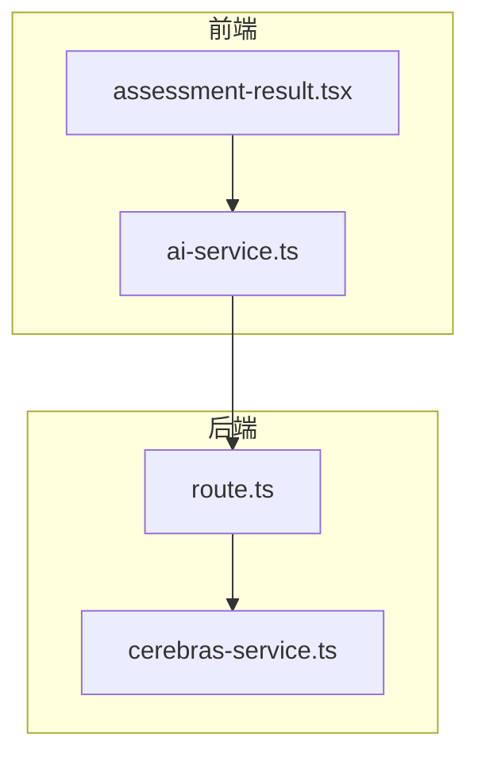
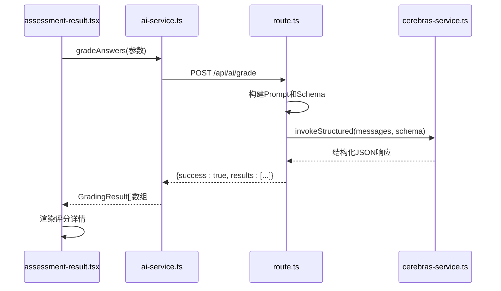
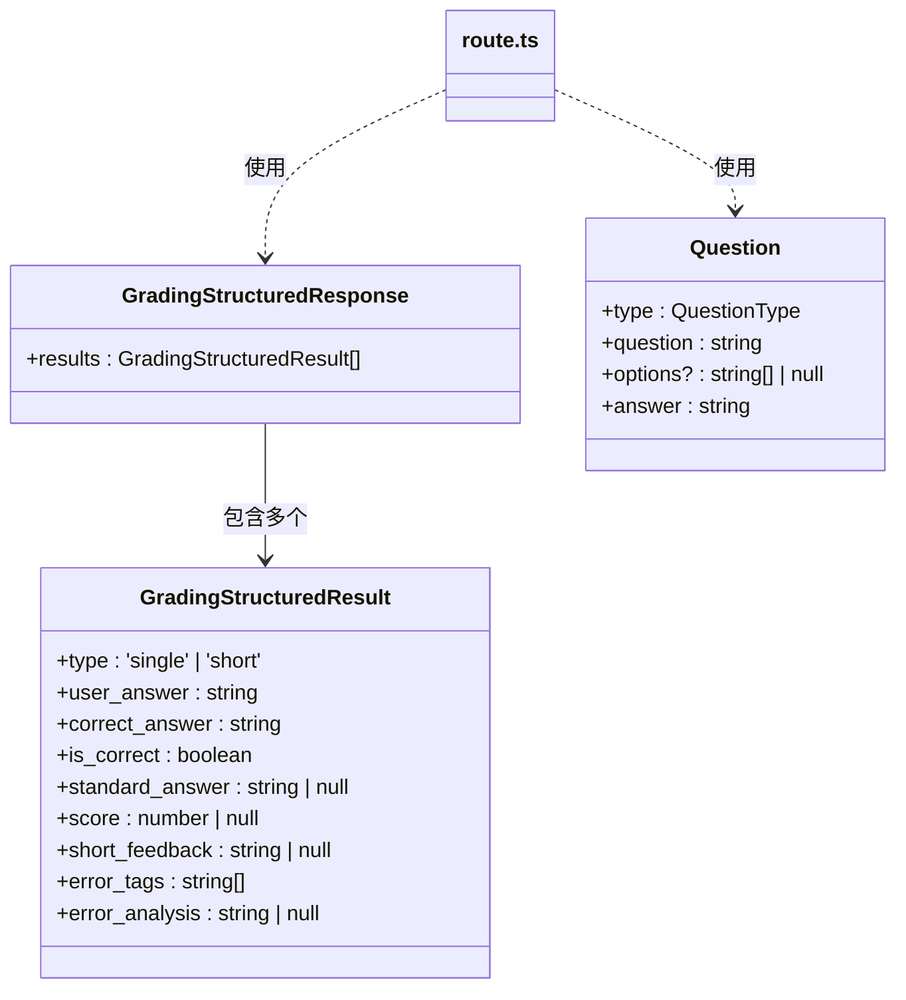
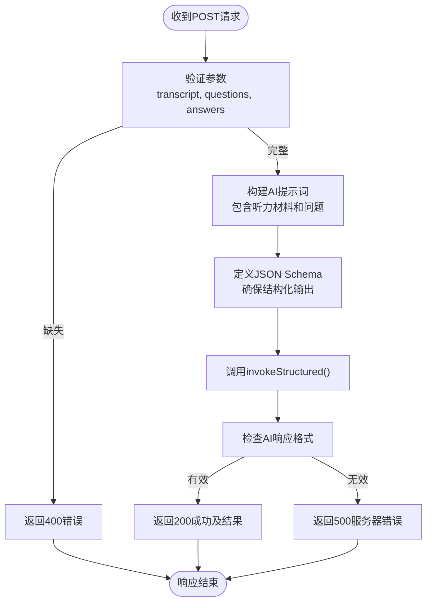
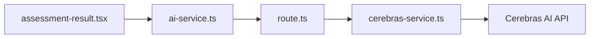

# 答案评分API

<cite>
**本文档引用的文件**
- [route.ts](file://app/api/ai/grade/route.ts)
- [cerebras-service.ts](file://lib/ai/cerebras-service.ts)
- [ai-service.ts](file://lib/ai-service.ts)
- [assessment-result.tsx](file://components/assessment-result.tsx)
- [schemas.ts](file://lib/ai/schemas.ts)
- [prompt-templates.ts](file://lib/ai/prompt-templates.ts)
- [ark-helper.ts](file://lib/ark-helper.ts)
</cite>

## 更新摘要
**已更新内容**
- 更新了架构概述和详细组件分析，以反映从 `ark-helper.ts` 到 `cerebras-service.ts` 的调用管道重构
- 新增了对 `invokeStructured` 统一调用机制和智能重试策略的说明
- 修正了过时的依赖关系图，移除了关于动态代理支持的描述
- 更新了API调用流程图以匹配当前代码实现
- 增强了评分一致性保障机制和延迟优化策略的描述

## 目录
1. [简介](#简介)
2. [项目结构](#项目结构)
3. [核心组件](#核心组件)
4. [架构概述](#架构概述)
5. [详细组件分析](#详细组件分析)
6. [依赖分析](#依赖分析)
7. [性能考虑](#性能考虑)
8. [故障排除指南](#故障排除指南)
9. [结论](#结论)

## 简介
本专业文档深入解析答案评分API的核心端点 `/api/ai/grade`，旨在为开发者和集成者提供全面的技术指导。该接口专为评估用户开放式回答（如口语转录文本）而设计，通过与标准答案进行语义相似度比对，实现自动化评分（0-100分）并生成中文反馈评语。文档将详细阐述其工作原理、请求响应结构、内部调用逻辑以及前端集成方式。

## 项目结构
本项目采用Next.js App Router架构，API路由集中于`app/api`目录下。答案评分功能位于`app/api/ai/grade/route.ts`，是整个评分系统的核心服务端点。客户端通过`lib/ai-service.ts`中的`gradeAnswers`函数调用此API。前端展示层使用`components/assessment-result.tsx`组件渲染评分结果。

**图示来源**
- [route.ts](file://app/api/ai/grade/route.ts#L1-L71)
- [cerebras-service.ts](file://lib/ai/cerebras-service.ts#L1-L61)
- [ai-service.ts](file://lib/ai-service.ts#L1-L143)
- [assessment-result.tsx](file://components/assessment-result.tsx#L1-L157)

**章节来源**
- [app/api/ai/grade/route.ts](file://app/api/ai/grade/route.ts#L1-L71)
- [lib/ai-service.ts](file://lib/ai-service.ts#L1-L143)

## 核心组件
核心组件包括服务端的评分路由`route.ts`，它接收来自客户端的请求，构造AI提示词，并调用大模型进行批改；客户端的`ai-service.ts`，它封装了对API的HTTP调用，提供了简洁的函数接口；以及前端的`assessment-result.tsx`，负责将评分结果以用户友好的方式可视化展示。

**章节来源**
- [route.ts](file://app/api/ai/grade/route.ts#L1-L71)
- [ai-service.ts](file://lib/ai-service.ts#L1-L143)
- [assessment-result.tsx](file://components/assessment-result.tsx#L1-L157)

## 架构概述
系统采用前后端分离架构。前端组件发起评分请求，通过`ai-service.ts`库函数调用后端API。后端`/api/ai/grade`端点接收参数，构建包含听力材料、问题和用户答案的详细提示词（prompt），并利用`cerebras-service.ts`中的`invokeStructured`统一调用管道与Cerebras大模型交互。AI模型根据预设的JSON Schema返回结构化评分结果，最终由前端组件解析并展示。

**图示来源**
- [route.ts](file://app/api/ai/grade/route.ts#L1-L71)
- [ai-service.ts](file://lib/ai-service.ts#L115-L126)
- [cerebras-service.ts](file://lib/ai/cerebras-service.ts#L31-L60)

## 详细组件分析

### 评分API端点分析
`/api/ai/grade/route.ts`是处理评分请求的核心。它定义了`GradingStructuredResult`和`GradingStructuredResponse`接口来规范数据结构。接收到POST请求后，会验证`transcript`（听力材料）、`questions`（问题列表）和`answers`（用户答案）等必填参数。随后，根据指定的语言构建一个详细的提示词，明确要求AI作为专业的听力理解考官进行评分，并规定了错误分析标签的分类体系。

#### 对象关系分析

**图示来源**
- [route.ts](file://app/api/ai/grade/route.ts#L4-L14)
- [schemas.ts](file://lib/ai/schemas.ts#L106-L148)

#### API调用流程分析

**图示来源**
- [route.ts](file://app/api/ai/grade/route.ts#L15-L71)

**章节来源**
- [route.ts](file://app/api/ai/grade/route.ts#L1-L71)

### 客户端服务分析
`lib/ai-service.ts`中的`gradeAnswers`函数是前端与后端API通信的桥梁。它使用通用的`postJson`函数向`/api/ai/grade`发送POST请求，并将响应数据反序列化为`GradingResult[]`类型。这种方式避免了在浏览器中直接暴露AI API密钥，增强了安全性。

**章节来源**
- [ai-service.ts](file://lib/ai-service.ts#L115-L126)

### 前端展示组件分析
`components/assessment-result.tsx`是一个客户端组件，用于展示综合评估结果。虽然它不直接显示单个题目的评分细节，但其设计理念与评分系统紧密相连。它接收一个包含平均分、各题表现和学习建议的`result`对象，并将其可视化。这表明完整的评分流程不仅包括AI打分，还包括后续的数据聚合与呈现。

**章节来源**
- [assessment-result.tsx](file://components/assessment-result.tsx#L1-L157)

## 依赖分析
系统依赖关系清晰。前端组件依赖`ai-service.ts`提供的业务逻辑，`ai-service.ts`依赖`fetch` API与后端通信，后端`route.ts`则深度依赖`cerebras-service.ts`中的`invokeStructured`函数来调用外部AI服务。`cerebras-service.ts`自身具备智能重试策略和遥测功能，确保了AI服务调用的高可用性。

**图示来源**
- [ai-service.ts](file://lib/ai-service.ts#L115-L126)
- [route.ts](file://app/api/ai/grade/route.ts#L1-L71)
- [cerebras-service.ts](file://lib/ai/cerebras-service.ts#L31-L60)

**章节来源**
- [cerebras-service.ts](file://lib/ai/cerebras-service.ts#L1-L61)

## 性能考虑
该API实现了多项性能优化策略：
- **评分一致性保障**：通过预定义的`gradingSchema`强制AI输出结构化JSON，确保评分结果格式统一
- **延迟优化**：支持异步批处理模式，可通过`focusAreas`参数指定关注领域，实现针对性评估
- **智能重试机制**：`invokeStructured`内置基于指数退避的重试策略，在网络波动时自动重试最多`maxRetries`次
- **电路断路器**：在`createAiRoute`中启用`useCircuitBreaker`，防止级联故障
- **速率限制**：应用`RateLimitConfigs.GENERAL_API`配置，防止滥用

**章节来源**
- [route.ts](file://app/api/ai/grade/route.ts#L65-L71)
- [cerebras-service.ts](file://lib/ai/cerebras-service.ts#L31-L60)
- [rate-limiter.ts](file://lib/rate-limiter.ts)

## 故障排除指南
当遇到评分API调用失败时，请按以下步骤排查：
1. 检查请求是否包含必需参数：`transcript`、`questions`、`answers`
2. 验证`questions`数组中的每个对象是否包含`question`、`type`、`answer`字段
3. 查看服务器日志中是否有"AI响应格式异常"错误，这通常表示模型未能遵循JSON Schema
4. 检查`getProxyStatus()`返回的状态，确认AI服务连接正常
5. 确认`focusAreas`参数值在有效枚举范围内

**章节来源**
- [route.ts](file://app/api/ai/grade/route.ts#L18-L21)
- [ark-helper.ts](file://lib/ark-helper.ts#L247-L251)

## 结论
答案评分API通过标准化的结构化调用管道`invokeStructured`，实现了稳定可靠的AI评分服务。其设计兼顾了准确性、性能和可维护性，从前端集成到后端处理形成了完整的闭环。结合`assessment-result.tsx`组件，为用户提供了直观的评估反馈体验。