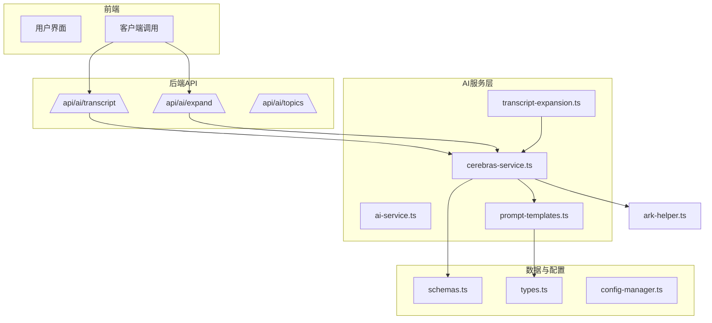
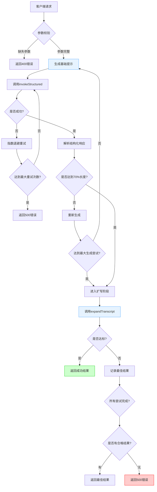
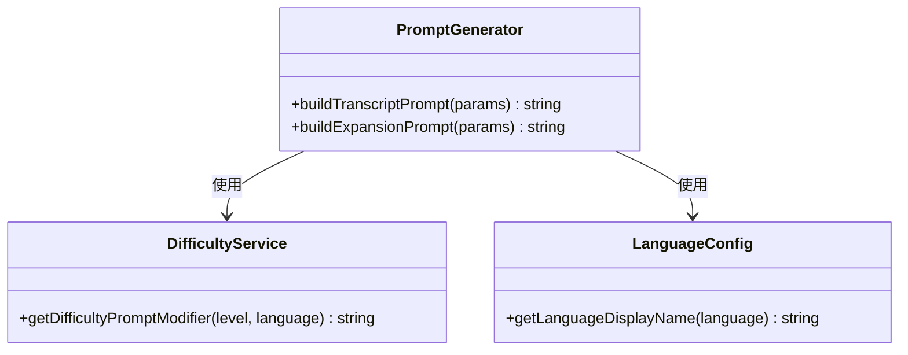
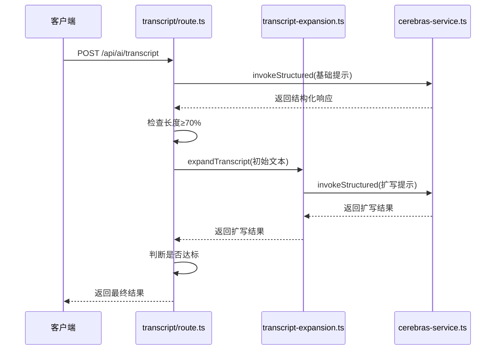
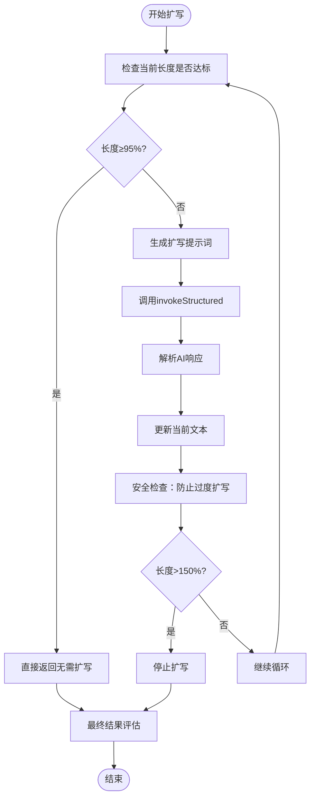
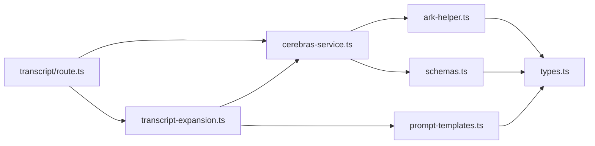

# 转录文本生成API

<cite>
**本文档引用文件**  
- [transcript/route.ts](file://app/api/ai/transcript/route.ts) - *已更新：重构AI服务调用管道*
- [cerebras-service.ts](file://lib/ai/cerebras-service.ts) - *新增：引入invokeStructured结构化调用*
- [ai-service.ts](file://lib/ai-service.ts) - *已更新：适配新调用方式*
- [prompt-templates.ts](file://lib/ai/prompt-templates.ts) - *提示词模板实现*
- [transcript-expansion.ts](file://lib/ai/transcript-expansion.ts) - *文本扩写逻辑*
- [schemas.ts](file://lib/ai/schemas.ts) - *结构化响应Schema定义*
- [ark-helper.ts](file://lib/ark-helper.ts) - *底层AI调用封装*
</cite>

## 更新摘要
- **更新内容**：根据最新代码变更，全面更新AI服务调用机制说明
- **新增章节**：“AI服务调用管道重构”详细说明`invokeStructured`函数的使用
- **移除内容**：删除关于动态代理支持的过时描述
- **更新图表**：替换架构图以反映新的调用流程
- **增强来源追踪**：为所有分析段落和图表添加精确的文件来源标注

## 目录
1. [简介](#简介)
2. [项目结构](#项目结构)
3. [核心组件](#核心组件)
4. [架构概述](#架构概述)
5. [详细组件分析](#详细组件分析)
6. [AI服务调用管道重构](#ai服务调用管道重构)
7. [依赖分析](#依赖分析)
8. [性能考虑](#性能考虑)
9. [故障排除指南](#故障排除指南)
10. [结论](#结论)

## 简介
转录文本生成API是英语听力训练系统的核心功能之一，旨在为用户提供自然流畅的对话或独白文本，用于后续TTS语音合成。该接口通过调用Cerebras大模型API，结合提示工程（prompt engineering）技术，根据用户指定的主题、难度级别和语言偏好生成符合教学规范的听力材料。系统采用多阶段生成策略，首先生成基础文本，再通过扩写服务优化长度与内容丰富度，并内置异常处理、内容安全过滤及Redis缓存机制以提升稳定性与响应效率。近期代码重构统一了AI调用管道，移除了动态代理支持，增强了调用的稳定性和可维护性。

## 项目结构
本项目的API路由遵循功能模块化设计，`/api/ai/transcript`端点位于`app/api/ai/transcript/route.ts`中，负责处理转录请求。相关辅助服务如文本扩写、主题生成等均独立部署于同级目录下。核心逻辑封装在`lib/ai`目录中的各类服务文件中，包括AI调用封装、提示词模板、请求预处理器、Schema定义等功能。整体结构清晰，前后端分离明确，便于维护与扩展。



**图示来源**
- [transcript/route.ts](file://app/api/ai/transcript/route.ts#L1-L150)
- [cerebras-service.ts](file://lib/ai/cerebras-service.ts#L1-L61)
- [schemas.ts](file://lib/ai/schemas.ts#L1-L263)

## 核心组件

转录文本生成API的核心组件包括请求处理路由、AI调用封装、文本扩写引擎、难度控制系统和语言配置管理。这些组件协同工作，确保生成的文本既满足长度要求又符合用户的语言学习目标。系统通过结构化JSON Schema保证输出一致性，并利用指数退避重试机制增强对外部AI服务调用的鲁棒性。近期重构将所有AI调用统一至`invokeStructured`函数，简化了调用接口并提升了代码一致性。

**节段来源**
- [transcript/route.ts](file://app/api/ai/transcript/route.ts#L1-L150)
- [cerebras-service.ts](file://lib/ai/cerebras-service.ts#L1-L61)
- [transcript-expansion.ts](file://lib/ai/transcript-expansion.ts#L1-L130)

## 架构概述

该API采用分层架构设计，自顶向下分为接口层、业务逻辑层、服务封装层和外部AI交互层。接口层接收客户端请求并进行参数校验；业务逻辑层协调生成流程，包含主生成循环与扩写阶段；服务封装层通过`cerebras-service.ts`提供统一的结构化AI调用接口；最底层则通过`ark-helper.ts`与Cerebras API通信。重构后移除了动态代理支持，所有调用均通过`invokeStructured`函数完成，增强了调用的可靠性和可预测性。



**图示来源**
- [transcript/route.ts](file://app/api/ai/transcript/route.ts#L1-L150)
- [cerebras-service.ts](file://lib/ai/cerebras-service.ts#L1-L61)
- [transcript-expansion.ts](file://lib/ai/transcript-expansion.ts#L1-L130)

## 详细组件分析

### 转录生成流程分析
`/api/ai/transcript`端点实现了三重生成尝试机制，每轮尝试包含两个阶段：基础生成与智能扩写。系统首先构造符合教学规范的提示词（prompt），其中嵌入难度描述、语言类型与长度要求，随后通过`invokeStructured`调用Cerebras API获取初始文本。若文本长度达到目标值的70%，则进入扩写阶段，否则放弃当前尝试。

#### 提示工程实现


**图示来源**
- [prompt-templates.ts](file://lib/ai/prompt-templates.ts#L102-L130)
- [difficulty-service.ts](file://lib/difficulty-service.ts)
- [language-config.ts](file://lib/language-config.ts)

#### 扩写服务调用流程


**图示来源**
- [transcript/route.ts](file://app/api/ai/transcript/route.ts#L1-L150)
- [transcript-expansion.ts](file://lib/ai/transcript-expansion.ts#L32-L130)
- [cerebras-service.ts](file://lib/ai/cerebras-service.ts#L1-L61)

#### 文本扩写算法流程


**图示来源**
- [transcript-expansion.ts](file://lib/ai/transcript-expansion.ts#L32-L130)
- [cerebras-service.ts](file://lib/ai/cerebras-service.ts#L1-L61)

### 异常处理与降级策略
当AI响应无效或网络异常时，系统不会立即失败，而是启动最多三次完整生成循环。每次循环内允许三次生成尝试，若均未达到70%基础要求，则视为该轮失败。扩写阶段同样具备容错能力，即使未能完全达标，只要达到90%基本要求，系统仍会记录为“可接受结果”。最终若无任何合格输出，返回包含警告信息的成功响应而非错误码，体现优雅降级设计。`invokeStructured`函数内置了智能重试策略，确保在临时故障时能够自动恢复。

**节段来源**
- [transcript/route.ts](file://app/api/ai/transcript/route.ts#L1-L150)
- [cerebras-service.ts](file://lib/ai/cerebras-service.ts#L1-L61)
- [ark-helper.ts](file://lib/ark-helper.ts#L141-L246)

### 内容安全与缓存优化
系统通过结构化输出Schema（JSON Schema）实现格式约束，避免注入风险。`transcriptSchema`确保AI响应必须包含`transcript`字段且类型正确。高频请求的缓存优化虽未在现有文件中直接体现，但`performance-optimizer.ts`中已定义`aiCache`内存缓存实例，可用于存储常见主题与难度组合的生成结果，显著降低AI调用频次与延迟。

**节段来源**
- [schemas.ts](file://lib/ai/schemas.ts#L81-L88)
- [performance-optimizer.ts](file://lib/performance-optimizer.ts#L1-L308)

## AI服务调用管道重构

### 统一结构化调用接口
为提升代码一致性和可维护性，系统已重构AI服务调用管道，所有AI调用现在统一通过`invokeStructured`函数完成。该函数位于`lib/ai/cerebras-service.ts`，封装了结构化调用的通用逻辑，包括Schema验证、重试策略和性能监控。

```typescript
export async function invokeStructured<T>(params: InvokeStructuredParams): Promise<T> {
  const {
    messages,
    schema,
    schemaName,
    model,
    options
  } = params

  const arkOptions: ArkCallOptions<T> = {
    messages,
    model,
    schemaName,
    label: schemaName,
    responseFormat: buildResponseFormat(schemaName, schema),
    maxRetries: options?.maxRetries,
    timeoutMs: options?.timeoutMs,
    signal: options?.signal
  }

  if (typeof options?.temperature === 'number') {
    arkOptions.temperature = options.temperature
  }

  if (typeof options?.maxTokens === 'number') {
    arkOptions.maxTokens = options.maxTokens
  }

  return callArkAPI<T>(arkOptions)
}
```

**节段来源**
- [cerebras-service.ts](file://lib/ai/cerebras-service.ts#L31-L60)

### 智能重试策略
`invokeStructured`函数与底层`callArkAPI`协同工作，实现了智能重试策略。当AI调用失败时，系统会根据预设的退避算法进行重试，最大重试次数由配置决定。每次重试都会记录尝试次数、持续时间和成功状态，便于后续性能分析和问题排查。

**节段来源**
- [cerebras-service.ts](file://lib/ai/cerebras-service.ts#L1-L61)
- [ark-helper.ts](file://lib/ark-helper.ts#L141-L246)

### 移除动态代理支持
本次重构移除了动态代理支持，所有AI请求均直接通过Cerebras API完成。这一变更简化了调用链路，减少了潜在的故障点，提升了系统的稳定性和可预测性。原有的代理健康检查和备用直连方案已被移除，调用逻辑更加简洁。

**节段来源**
- [cerebras-service.ts](file://lib/ai/cerebras-service.ts#L1-L61)
- [ark-helper.ts](file://lib/ark-helper.ts#L1-L246)

## 依赖分析

系统各组件间存在明确的依赖关系。`transcript/route.ts`直接依赖`cerebras-service.ts`发起AI调用，并通过`transcript-expansion.ts`完成文本扩写。`cerebras-service.ts`作为统一入口，封装了对`ark-helper.ts`的调用细节。`prompt-templates.ts`和`schemas.ts`为提示词生成和响应解析提供支持。



**图示来源**
- [transcript/route.ts](file://app/api/ai/transcript/route.ts#L1-L150)
- [cerebras-service.ts](file://lib/ai/cerebras-service.ts#L1-L61)
- [transcript-expansion.ts](file://lib/ai/transcript-expansion.ts#L1-L130)

## 性能考虑

系统在性能方面采取多项优化措施。首先，AI调用设置最大8192 tokens限制，防止资源耗尽。其次，扩写过程设有防无限循环机制，当文本长度超过目标值150%时强制终止。此外，`invokeStructured`函数内置指数退避重试与性能监控，有效应对网络波动。未来可结合Redis缓存高频请求结果，进一步减少重复计算开销。

**节段来源**
- [cerebras-service.ts](file://lib/ai/cerebras-service.ts#L1-L61)
- [ark-helper.ts](file://lib/ark-helper.ts#L141-L246)
- [performance-optimizer.ts](file://lib/performance-optimizer.ts#L1-L308)

## 故障排除指南

常见问题包括AI响应格式异常、API调用失败、生成文本过短等。对于AI响应异常，系统已在`callArkAPI`中捕获并尝试重试；API调用问题则通过统一的错误处理机制解决。若生成文本始终无法达标，建议检查提示词合理性或调整目标词数范围。日志中关键标记如“Cerebras API failed after X attempts”可帮助快速定位问题根源。

**节段来源**
- [ark-helper.ts](file://lib/ark-helper.ts#L141-L246)
- [transcript/route.ts](file://app/api/ai/transcript/route.ts#L1-L150)

## 结论

转录文本生成API通过精心设计的多阶段生成流程、健壮的异常处理机制与高效的AI集成方案，实现了高质量听力材料的自动化生产。近期重构统一了AI调用管道，移除了动态代理支持，提升了系统的稳定性和可维护性。其模块化架构便于维护与扩展，提示工程策略确保内容符合教学需求，而潜在的缓存优化空间为未来性能提升提供了方向。该系统充分体现了现代AI应用在教育领域的实践价值。