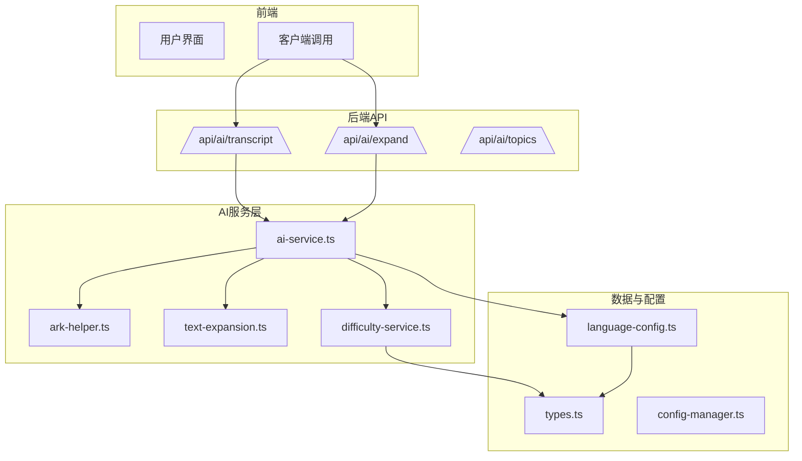
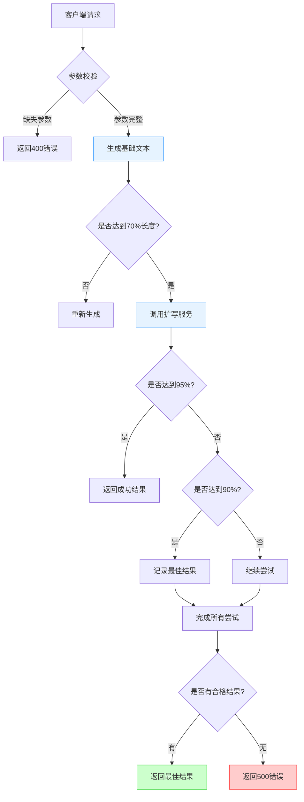
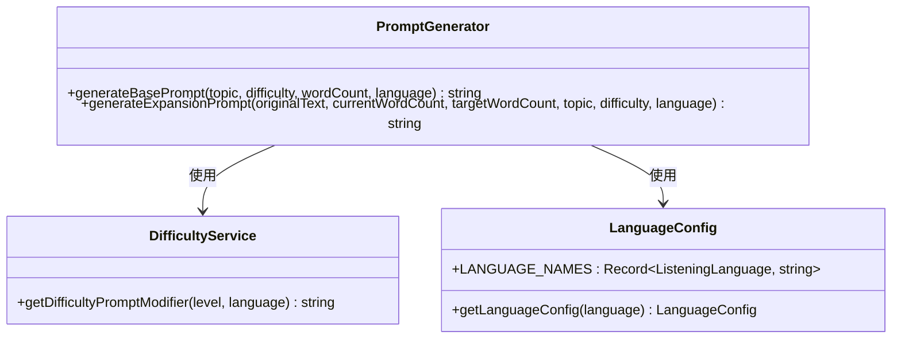
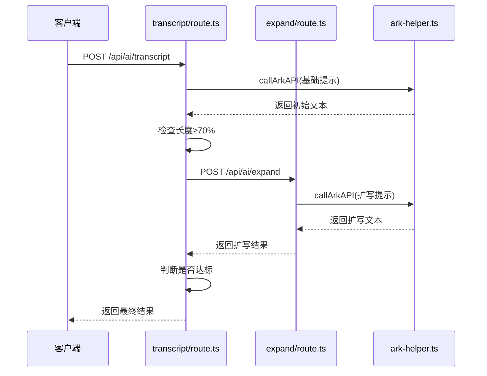
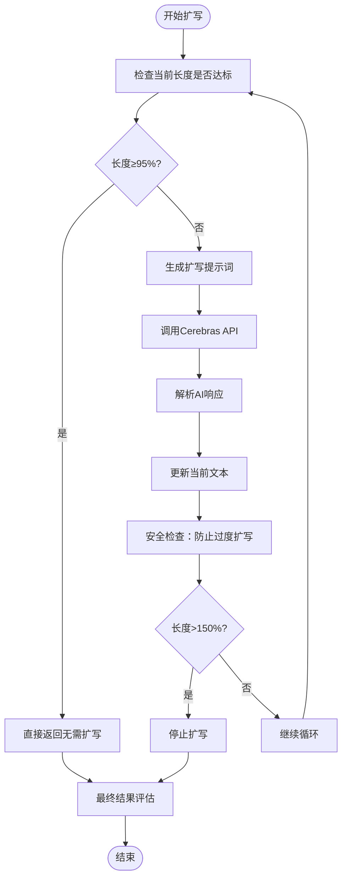
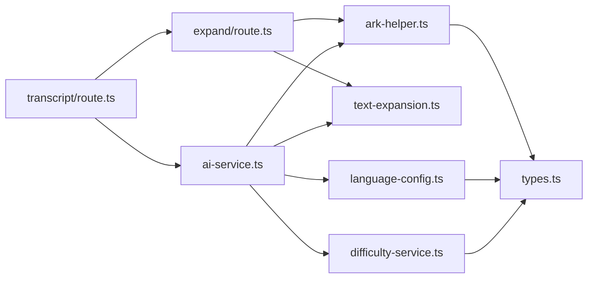

# 转录文本生成API

<cite>
**本文档引用文件**  
- [transcript/route.ts](file://app/api/ai/transcript/route.ts)
- [ai-service.ts](file://lib/ai-service.ts)
- [expand/route.ts](file://app/api/ai/expand/route.ts)
- [text-expansion.ts](file://lib/text-expansion.ts)
- [ark-helper.ts](file://lib/ark-helper.ts)
- [difficulty-service.ts](file://lib/difficulty-service.ts)
- [types.ts](file://lib/types.ts)
- [language-config.ts](file://lib/language-config.ts)
</cite>

## 目录
1. [简介](#简介)
2. [项目结构](#项目结构)
3. [核心组件](#核心组件)
4. [架构概述](#架构概述)
5. [详细组件分析](#详细组件分析)
6. [依赖分析](#依赖分析)
7. [性能考虑](#性能考虑)
8. [故障排除指南](#故障排除指南)
9. [结论](#结论)

## 简介
转录文本生成API是英语听力训练系统的核心功能之一，旨在为用户提供自然流畅的对话或独白文本，用于后续TTS语音合成。该接口通过调用Cerebras大模型API，结合提示工程（prompt engineering）技术，根据用户指定的主题、难度级别和语言偏好生成符合教学规范的听力材料。系统采用多阶段生成策略，首先生成基础文本，再通过扩写服务优化长度与内容丰富度，并内置异常处理、内容安全过滤及Redis缓存机制以提升稳定性与响应效率。

## 项目结构
本项目的API路由遵循功能模块化设计，`/api/ai/transcript`端点位于`app/api/ai/transcript/route.ts`中，负责处理转录请求。相关辅助服务如文本扩写、主题生成等均独立部署于同级目录下。核心逻辑封装在`lib`目录中的各类服务文件中，包括AI调用封装、难度控制、语言配置等功能。整体结构清晰，前后端分离明确，便于维护与扩展。

**图示来源**
- [route.ts](file://app/api/ai/transcript/route.ts#L1-L188)
- [ai-service.ts](file://lib/ai-service.ts#L1-L113)
- [types.ts](file://lib/types.ts#L1-L215)

## 核心组件

转录文本生成API的核心组件包括请求处理路由、AI调用封装、文本扩写引擎、难度控制系统和语言配置管理。这些组件协同工作，确保生成的文本既满足长度要求又符合用户的语言学习目标。系统通过结构化JSON Schema保证输出一致性，并利用指数退避重试机制增强对外部AI服务调用的鲁棒性。

**节段来源**
- [transcript/route.ts](file://app/api/ai/transcript/route.ts#L1-L188)
- [ai-service.ts](file://lib/ai-service.ts#L1-L113)
- [expand/route.ts](file://app/api/ai/expand/route.ts#L1-L113)

## 架构概述

该API采用分层架构设计，自顶向下分为接口层、业务逻辑层、服务封装层和外部AI交互层。接口层接收客户端请求并进行参数校验；业务逻辑层协调生成流程，包含主生成循环与扩写阶段；服务封装层提供统一的AI调用接口与文本处理工具；最底层则通过`ark-helper.ts`与Cerebras API通信，支持代理回退与健康检查机制。

**图示来源**
- [transcript/route.ts](file://app/api/ai/transcript/route.ts#L1-L188)
- [expand/route.ts](file://app/api/ai/expand/route.ts#L1-L113)

## 详细组件分析

### 转录生成流程分析
`/api/ai/transcript`端点实现了三重生成尝试机制，每轮尝试包含两个阶段：基础生成与智能扩写。系统首先构造符合教学规范的提示词（prompt），其中嵌入难度描述、语言类型与长度要求，随后调用Cerebras API获取初始文本。若文本长度达到目标值的70%，则进入扩写阶段，否则放弃当前尝试。

#### 提示工程实现

**图示来源**
- [transcript/route.ts](file://app/api/ai/transcript/route.ts#L1-L188)
- [difficulty-service.ts](file://lib/difficulty-service.ts#L1-L239)
- [language-config.ts](file://lib/language-config.ts#L1-L63)

#### 扩写服务调用流程

**图示来源**
- [transcript/route.ts](file://app/api/ai/transcript/route.ts#L1-L188)
- [expand/route.ts](file://app/api/ai/expand/route.ts#L1-L113)
- [ark-helper.ts](file://lib/ark-helper.ts#L1-L233)

#### 文本扩写算法流程

**图示来源**
- [expand/route.ts](file://app/api/ai/expand/route.ts#L1-L113)
- [text-expansion.ts](file://lib/text-expansion.ts#L1-L108)

### 异常处理与降级策略
当AI响应无效或网络异常时，系统不会立即失败，而是启动最多三次完整生成循环。每次循环内允许三次生成尝试，若均未达到70%基础要求，则视为该轮失败。扩写阶段同样具备容错能力，即使未能完全达标，只要达到90%基本要求，系统仍会记录为“可接受结果”。最终若无任何合格输出，返回包含警告信息的成功响应而非错误码，体现优雅降级设计。

**节段来源**
- [transcript/route.ts](file://app/api/ai/transcript/route.ts#L1-L188)
- [ark-helper.ts](file://lib/ark-helper.ts#L1-L233)

### 内容安全与缓存优化
虽然当前代码未显式展示内容安全过滤逻辑，但可通过`ark-helper.ts`中的结构化输出Schema（JSON Schema）间接实现格式约束，避免注入风险。高频请求的缓存优化虽未在现有文件中体现，但`performance-optimizer.ts`中已定义`aiCache`内存缓存实例，可用于存储常见主题与难度组合的生成结果，显著降低AI调用频次与延迟。

**节段来源**
- [ark-helper.ts](file://lib/ark-helper.ts#L1-L233)
- [performance-optimizer.ts](file://lib/performance-optimizer.ts#L1-L308)

## 依赖分析

系统各组件间存在明确的依赖关系。`transcript/route.ts`直接依赖`ai-service.ts`发起AI调用，并通过HTTP请求调用`/api/ai/expand`完成文本扩写。`ai-service.ts`作为统一入口，封装了对`ark-helper.ts`的调用细节。`difficulty-service.ts`和`language-config.ts`为提示词生成提供语义支持，而`text-expansion.ts`则包含扩写相关的算法逻辑。

**图示来源**
- [transcript/route.ts](file://app/api/ai/transcript/route.ts#L1-L188)
- [ai-service.ts](file://lib/ai-service.ts#L1-L113)
- [expand/route.ts](file://app/api/ai/expand/route.ts#L1-L113)

## 性能考虑

系统在性能方面采取多项优化措施。首先，AI调用设置最大8192 tokens限制，防止资源耗尽。其次，扩写过程设有防无限循环机制，当文本长度超过目标值150%时强制终止。此外，`callArkAPI`函数内置指数退避重试（exponential backoff retry）与代理健康检查，有效应对网络波动。未来可结合Redis缓存高频请求结果，进一步减少重复计算开销。

**节段来源**
- [ark-helper.ts](file://lib/ark-helper.ts#L1-L233)
- [performance-optimizer.ts](file://lib/performance-optimizer.ts#L1-L308)

## 故障排除指南

常见问题包括AI响应格式异常、代理连接失败、生成文本过短等。对于AI响应异常，系统已在`callArkAPI`中捕获并尝试重试；代理问题则通过健康检查与备用直连方案解决。若生成文本始终无法达标，建议检查提示词合理性或调整目标词数范围。日志中关键标记如“Proxy unhealthy”、“AI响应格式异常”可帮助快速定位问题根源。

**节段来源**
- [ark-helper.ts](file://lib/ark-helper.ts#L1-L233)
- [transcript/route.ts](file://app/api/ai/transcript/route.ts#L1-L188)

## 结论

转录文本生成API通过精心设计的多阶段生成流程、健壮的异常处理机制与高效的AI集成方案，实现了高质量听力材料的自动化生产。其模块化架构便于维护与扩展，提示工程策略确保内容符合教学需求，而潜在的缓存优化空间为未来性能提升提供了方向。该系统充分体现了现代AI应用在教育领域的实践价值。