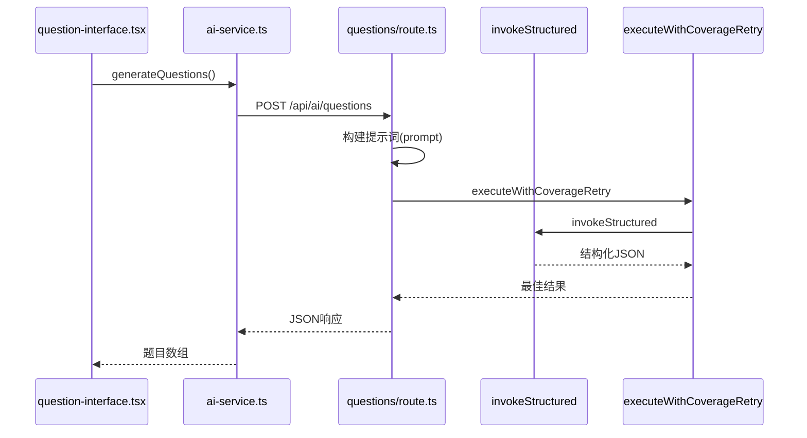
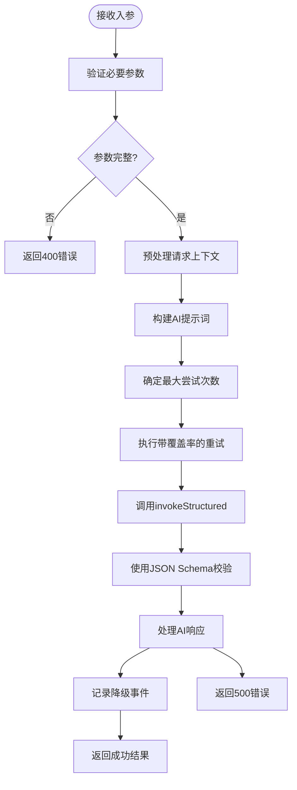
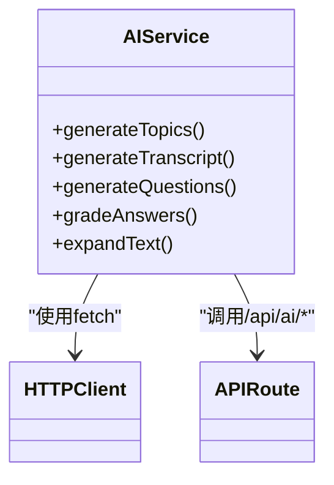
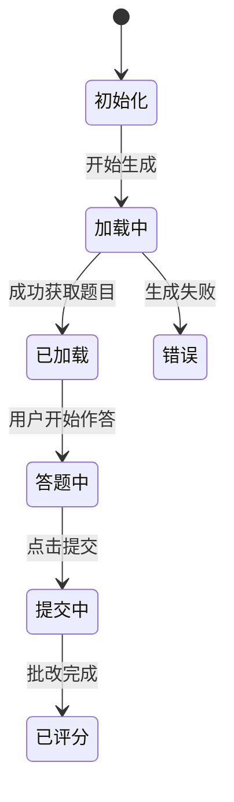
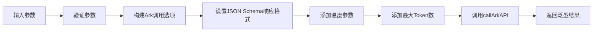
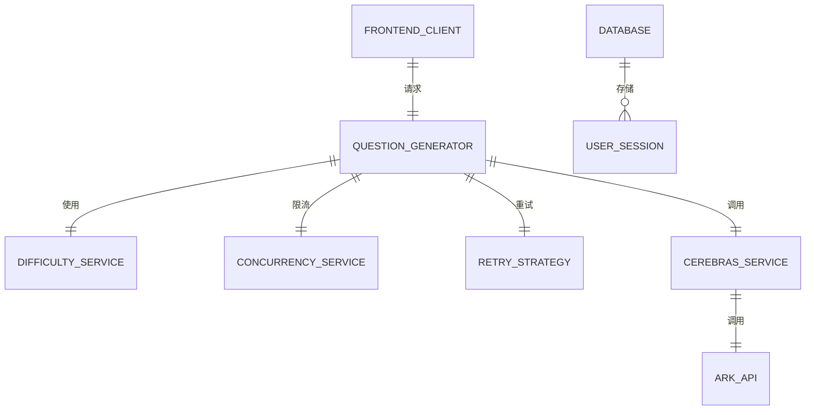
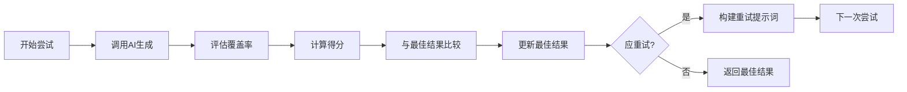

# 问题生成API

<cite>
**本文档引用文件**  
- [questions/route.ts](file://app/api/ai/questions/route.ts) - *重构AI服务调用管道并移除动态代理支持*
- [cerebras-service.ts](file://lib/ai/cerebras-service.ts) - *新增结构化调用函数invokeStructured*
- [ai-service.ts](file://lib/ai-service.ts) - *适配新的AI调用方式*
- [question-interface.tsx](file://components/question-interface.tsx) - *前端组件保持兼容*
- [retry-strategy.ts](file://lib/ai/retry-strategy.ts) - *引入智能重试策略*
- [request-preprocessor.ts](file://lib/ai/request-preprocessor.ts) - *请求上下文预处理逻辑*
- [prompt-templates.ts](file://lib/ai/prompt-templates.ts) - *问题生成提示词模板*
</cite>

## 更新摘要
**变更内容**   
- 更新核心架构说明，反映从`callArkAPI`到`invokeStructured`的调用方式变更
- 新增`executeWithCoverageRetry`智能重试机制的详细说明
- 修订API路由处理流程图与序列图，体现新的调用链路
- 更新依赖分析，移除已废弃的动态代理相关组件
- 增加对`cerebras-service.ts`中`invokeStructured`函数的专项分析
- 修正故障排除指南，适配新的错误处理逻辑

## 目录
1. [简介](#简介)
2. [项目结构](#项目结构)
3. [核心组件](#核心组件)
4. [架构概览](#架构概览)
5. [详细组件分析](#详细组件分析)
6. [依赖分析](#依赖分析)
7. [性能考量](#性能考量)
8. [故障排除指南](#故障排除指南)
9. [结论](#结论)

## 简介
本技术文档全面解析英语听力训练系统中的问题生成API，重点针对`/api/ai/questions`端点。该接口在完成听力材料转录后，自动创建配套的理解题目，支持选择题、填空题等多种题型。文档将深入说明请求参数（如题目数量、认知层次）、响应格式、AI生成质量保障机制，并结合前端组件实现数据对接。

## 项目结构
系统采用Next.js App Router架构，API路由集中于`app/api`目录下，按功能模块组织。问题生成相关逻辑位于`app/api/ai/questions/route.ts`，客户端服务封装于`lib/ai-service.ts`，前端交互界面由`components/question-interface.tsx`实现。

```mermaid
graph TB
subgraph "API层"
A[/api/ai/questions/route.ts] --> B[invokeStructured]
C[ai-service.ts] --> A
end
subgraph "前端层"
D[question-interface.tsx] --> C
E[main-app.tsx] --> D
end
subgraph "辅助服务"
F[difficulty-service.ts] --> A
G[concurrency-service.ts] --> A
H[retry-strategy.ts] --> A
end
```

**Diagram sources**
- [route.ts](file://app/api/ai/questions/route.ts)
- [cerebras-service.ts](file://lib/ai/cerebras-service.ts)
- [ai-service.ts](file://lib/ai-service.ts)
- [question-interface.tsx](file://components/question-interface.tsx)

**Section sources**
- [app/api/ai/questions/route.ts](file://app/api/ai/questions/route.ts)
- [lib/ai-service.ts](file://lib/ai-service.ts)
- [components/question-interface.tsx](file://components/question-interface.tsx)

## 核心组件
问题生成API的核心在于将转录文本作为上下文传递给AI模型，并通过结构化输出控制确保返回格式的规范性。系统利用`invokeStructured`函数进行调用，结合JSON Schema验证机制保证响应质量，并通过`executeWithCoverageRetry`实现智能重试策略。

**Section sources**
- [questions/route.ts](file://app/api/ai/questions/route.ts#L1-L186)
- [ai-service.ts](file://lib/ai-service.ts#L1-L143)
- [types.ts](file://lib/types.ts#L37-L47)
- [cerebras-service.ts](file://lib/ai/cerebras-service.ts#L1-L62)

## 架构概览
整个问题生成流程遵循清晰的分层架构：前端组件发起请求 → 客户端服务代理 → API路由处理 → 结构化AI调用 → 智能重试机制 → 结果返回。



**Diagram sources**
- [questions/route.ts](file://app/api/ai/questions/route.ts#L40-L129)
- [ai-service.ts](file://lib/ai-service.ts#L50-L65)
- [cerebras-service.ts](file://lib/ai/cerebras-service.ts#L31-L60)
- [retry-strategy.ts](file://lib/ai/retry-strategy.ts#L59-L101)

## 详细组件分析

### 问题生成API路由分析
`questions/route.ts`实现了完整的RESTful POST接口，接收转录文本和配置参数，生成符合教学要求的阅读理解题。

#### 请求处理流程


**Diagram sources**
- [questions/route.ts](file://app/api/ai/questions/route.ts#L15-L186)

**Section sources**
- [questions/route.ts](file://app/api/ai/questions/route.ts#L1-L186)

### 客户端AI服务分析
`ai-service.ts`为前端提供统一的AI功能调用接口，避免在浏览器中暴露敏感密钥。

#### 服务方法关系图


**Diagram sources**
- [ai-service.ts](file://lib/ai-service.ts#L1-L143)

**Section sources**
- [ai-service.ts](file://lib/ai-service.ts#L1-L143)

### 前端答题界面分析
`question-interface.tsx`组件负责展示生成的问题并收集用户答案，实现完整的练习闭环。

#### 组件状态管理


**Diagram sources**
- [question-interface.tsx](file://components/question-interface.tsx#L1-L436)

**Section sources**
- [question-interface.tsx](file://components/question-interface.tsx#L1-L436)

### 结构化AI调用服务分析
`cerebras-service.ts`提供了统一的结构化AI调用接口`invokeStructured`，替代了原有的动态代理调用方式。

#### invokeStructured函数调用流程


**Diagram sources**
- [cerebras-service.ts](file://lib/ai/cerebras-service.ts#L31-L60)

**Section sources**
- [cerebras-service.ts](file://lib/ai/cerebras-service.ts#L1-L62)

## 依赖分析
问题生成API依赖多个内部服务和外部AI模型，形成复杂的调用链路。



**Diagram sources**
- [questions/route.ts](file://app/api/ai/questions/route.ts)
- [difficulty-service.ts](file://lib/difficulty-service.ts)
- [concurrency-service.ts](file://lib/concurrency-service.ts)
- [retry-strategy.ts](file://lib/ai/retry-strategy.ts)
- [cerebras-service.ts](file://lib/ai/cerebras-service.ts)

**Section sources**
- [difficulty-service.ts](file://lib/difficulty-service.ts#L142-L199)
- [concurrency-service.ts](file://lib/concurrency-service.ts#L1-L251)
- [retry-strategy.ts](file://lib/ai/retry-strategy.ts#L1-L103)

## 性能考量
系统通过并发控制和智能重试机制应对高并发场景，确保服务稳定性。

### 智能重试处理策略


**Diagram sources**
- [retry-strategy.ts](file://lib/ai/retry-strategy.ts#L59-L101)

**Section sources**
- [retry-strategy.ts](file://lib/ai/retry-strategy.ts#L1-L103)

## 故障排除指南
当问题生成API出现异常时，可参考以下排查路径：

1. **参数缺失**：检查是否提供了`difficulty`和`transcript`必填字段
2. **AI响应异常**：查看日志中"AI响应格式异常"错误，确认Schema校验失败原因
3. **并发超限**：检查X-RateLimit头信息，确认是否达到速率限制
4. **重试机制**：观察`executeWithCoverageRetry`中的覆盖率评估逻辑是否触发重试
5. **结构化调用**：确认`invokeStructured`的schema配置是否正确

**Section sources**
- [questions/route.ts](file://app/api/ai/questions/route.ts#L170-L186)
- [cerebras-service.ts](file://lib/ai/cerebras-service.ts#L31-L60)
- [rate-limiter.ts](file://lib/rate-limiter.ts#L60-L105)

## 结论
问题生成API通过精心设计的提示工程和严格的结构化输出控制，实现了高质量的自动化题目生成。系统整合了难度分级、并发控制、智能重试等企业级特性，为英语听力训练提供了可靠的技术支撑。本次重构统一了AI调用管道，移除了动态代理支持，增强了系统的可维护性和稳定性。未来可进一步优化AI提示词，增加更多题型支持。