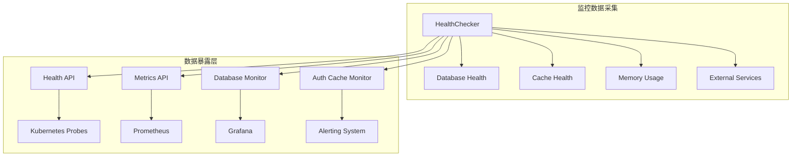
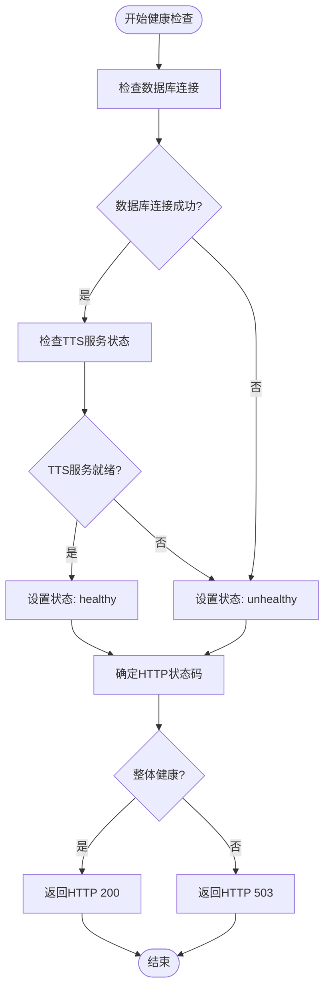
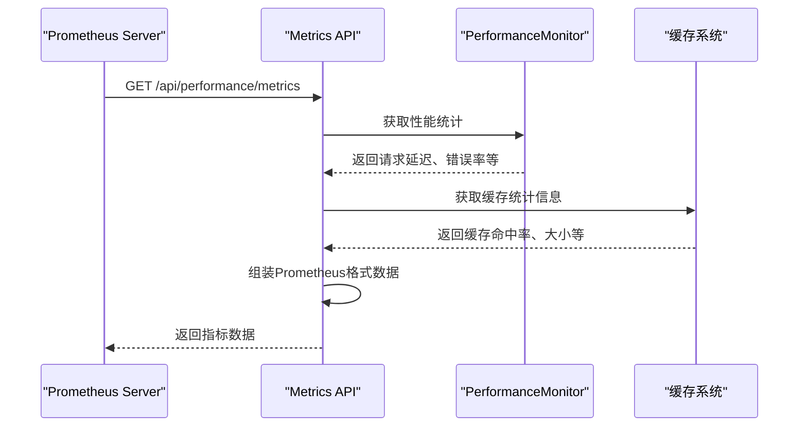
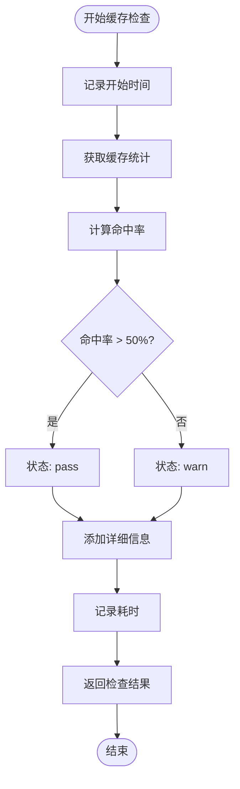
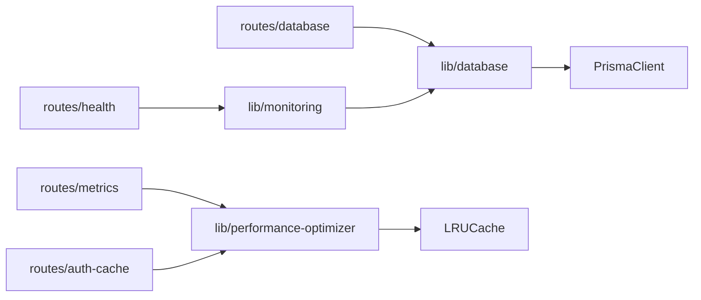

# 健康检查与性能监控API

<cite>
**本文档引用的文件**
- [health/route.ts](file://app/api/health/route.ts)
- [metrics/route.ts](file://app/api/performance/metrics/route.ts)
- [database/route.ts](file://app/api/performance/database/route.ts)
- [auth-cache/route.ts](file://app/api/performance/auth-cache/route.ts)
- [monitoring.ts](file://lib/monitoring.ts)
- [performance-optimizer.ts](file://lib/performance-optimizer.ts)
- [database.ts](file://lib/database.ts)
</cite>

## 目录
1. [简介](#简介)
2. [项目结构](#项目结构)
3. [核心组件](#核心组件)
4. [架构概述](#架构概述)
5. [详细组件分析](#详细组件分析)
6. [依赖分析](#依赖分析)
7. [性能考虑](#性能考虑)
8. [故障排除指南](#故障排除指南)
9. [结论](#结论)

## 简介
本专业文档全面覆盖英语听力训练系统的健康检查与性能监控API。重点说明系统存活检测、实时指标暴露、数据库延迟测试和认证缓存状态查看等关键功能。文档详细阐述了Kubernetes环境下的探针使用方式，Prometheus兼容格式的时间序列数据输出机制，以及Grafana仪表板集成建议。

## 项目结构
该系统采用分层架构设计，将健康检查与性能监控功能集中部署在`app/api/performance`目录下。通过模块化设计实现了功能解耦，便于独立维护和扩展。

```mermaid
graph TD
subgraph "API接口"
A[/api/health]
B[/api/performance/metrics]
C[/api/performance/database]
D[/api/performance/auth-cache]
end
subgraph "核心库"
E[monitoring.ts]
F[performance-optimizer.ts]
G[database.ts]
end
A --> E
B --> F
C --> G
D --> F
```

**图表来源**
- [health/route.ts](file://app/api/health/route.ts)
- [metrics/route.ts](file://app/api/performance/metrics/route.ts)
- [database.ts](file://lib/database.ts)
- [monitoring.ts](file://lib/monitoring.ts)
- [performance-optimizer.ts](file://lib/performance-optimizer.ts)

**章节来源**
- [app/api](file://app/api)

## 核心组件
系统的核心健康检查与性能监控组件包括：基础健康检查端点、性能指标收集器、数据库连通性检测器和认证缓存状态查看器。这些组件共同构成了完整的系统监控体系，为运维团队提供全面的系统状态视图。

**章节来源**
- [app/api/health/route.ts](file://app/api/health/route.ts)
- [app/api/performance/metrics/route.ts](file://app/api/performance/metrics/route.ts)
- [app/api/performance/database/route.ts](file://app/api/performance/database/route.ts)
- [app/api/performance/auth-cache/route.ts](file://app/api/performance/auth-cache/route.ts)

## 架构概述
系统采用分层监控架构，从基础设施到应用层进行全面的状态监测。通过标准化的API接口暴露监控数据，支持多种监控工具集成。



**图表来源**
- [monitoring.ts](file://lib/monitoring.ts)
- [health/route.ts](file://app/api/health/route.ts)
- [metrics/route.ts](file://app/api/performance/metrics/route.ts)

## 详细组件分析

### 健康检查端点分析
`/health`端点作为Kubernetes存活探针的关键接口，提供快速响应的系统状态检查。该端点无需认证，确保容器编排系统能够可靠地检测应用实例的健康状况。

#### 健康检查逻辑


**图表来源**
- [health/route.ts](file://app/api/health/route.ts)
- [database.ts](file://lib/database.ts)

**章节来源**
- [app/api/health/route.ts](file://app/api/health/route.ts)

### 性能指标组件分析
`/performance/metrics`端点暴露Prometheus兼容格式的时间序列数据，为系统性能监控提供标准化的数据源。

#### 指标收集流程


**图表来源**
- [metrics/route.ts](file://app/api/performance/metrics/route.ts)
- [performance-optimizer.ts](file://lib/performance-optimizer.ts)

**章节来源**
- [app/api/performance/metrics/route.ts](file://app/api/performance/metrics/route.ts)

### 数据库连通性检测分析
数据库连通性检测通过执行轻量级查询并测量RTT（往返时间）来评估数据库服务的可用性和性能。

#### 数据库健康检查
```mermaid
classDiagram
class HealthChecker {
+performHealthCheck() Promise~HealthCheckResult~
-checkDatabase() Promise~CheckResult~
-checkCache() Promise~CheckResult~
-checkMemory() Promise~CheckResult~
}
class DatabaseHealth {
+checkDatabaseHealth() Promise~{healthy, message}~
+withDatabase(operation) Promise~T~
}
class PerformanceMonitor {
+recordMetric(name, value, unit)
+getMetricStats(name, hours)
}
HealthChecker --> DatabaseHealth : "使用"
HealthChecker --> PerformanceMonitor : "记录指标"
DatabaseHealth --> PrismaClient : "依赖"
```

**图表来源**
- [monitoring.ts](file://lib/monitoring.ts)
- [database.ts](file://lib/database.ts)

**章节来源**
- [lib/monitoring.ts](file://lib/monitoring.ts)
- [lib/database.ts](file://lib/database.ts)

### 认证缓存状态查看分析
认证缓存状态查看功能验证Redis缓存命中率和服务可用性，确保用户认证过程的高效性。

#### 缓存健康检查


**图表来源**
- [monitoring.ts](file://lib/monitoring.ts)
- [performance-optimizer.ts](file://lib/performance-optimizer.ts)

**章节来源**
- [lib/monitoring.ts](file://lib/monitoring.ts)

## 依赖分析
系统各监控组件之间存在明确的依赖关系，形成了完整的监控链条。



**图表来源**
- [go.mod](file://package.json)
- [health/route.ts](file://app/api/health/route.ts)
- [metrics/route.ts](file://app/api/performance/metrics/route.ts)
- [database.ts](file://lib/database.ts)
- [monitoring.ts](file://lib/monitoring.ts)
- [performance-optimizer.ts](file://lib/performance-optimizer.ts)

**章节来源**
- [package.json](file://package.json)
- [app/api](file://app/api)
- [lib](file://lib)

## 性能考虑
系统在设计时充分考虑了性能影响，确保监控功能本身不会成为性能瓶颈。

- **轻量级检查**: 健康检查操作尽可能轻量化，避免对系统造成额外负担
- **异步执行**: 性能指标收集采用异步方式，不影响主业务流程
- **缓存机制**: 频繁访问的监控数据采用缓存策略，减少重复计算
- **采样频率**: 合理设置监控数据采集频率，平衡实时性与系统开销

## 故障排除指南
当监控系统出现异常时，可参考以下排查步骤：

1. 检查`/health`端点是否返回503状态码
2. 查看日志中是否有数据库连接失败的记录
3. 验证缓存服务是否正常运行
4. 检查内存使用情况是否超出阈值
5. 确认外部依赖服务的可达性

**章节来源**
- [lib/enhanced-error-handler.ts](file://lib/enhanced-error-handler.ts)
- [lib/error-handler.ts](file://lib/error-handler.ts)

## 结论
本健康检查与性能监控API为英语听力训练系统提供了全面的可观测性能力。通过标准化的接口设计和完善的监控体系，系统能够及时发现并预警潜在问题，确保服务的高可用性和稳定性。建议结合Prometheus和Grafana构建完整的监控告警平台，实现对系统状态的实时可视化监控。