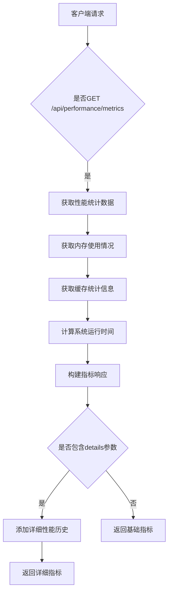
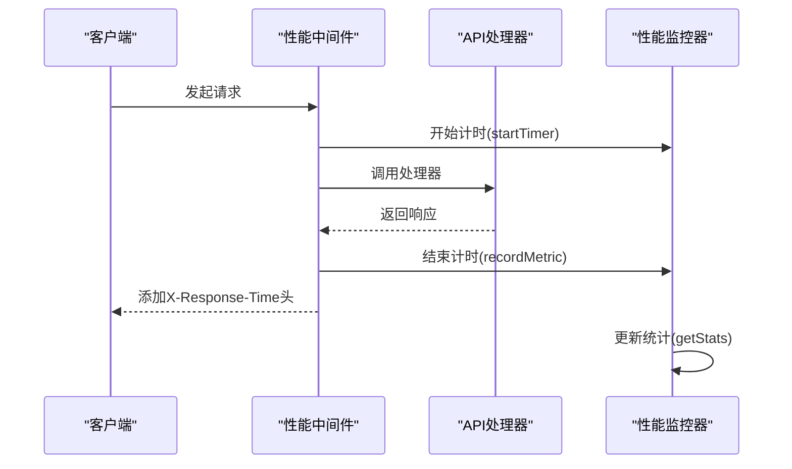

# 性能指标采集

<cite>
**本文档引用的文件**
- [route.ts](file://app/api/performance/metrics/route.ts)
- [performance-optimizer.ts](file://lib/performance-optimizer.ts)
- [monitoring.ts](file://lib/monitoring.ts)
- [performance-middleware.ts](file://lib/performance-middleware.ts)
</cite>

## 目录
1. [简介](#简介)
2. [核心性能指标](#核心性能指标)
3. [指标标签说明](#指标标签说明)
4. [与Next.js中间件集成](#与nextjs中间件集成)
5. [Prometheus配置示例](#prometheus配置示例)
6. [Grafana监控面板建议](#grafana监控面板建议)
7. [安全控制措施](#安全控制措施)

## 简介
`/api/performance/metrics` 接口为系统提供全面的性能监控能力，暴露符合Prometheus格式的时间序列数据。该接口收集并报告关键性能指标，包括请求延迟、请求数量、错误率等，支持全链路性能数据追踪。通过与Next.js中间件深度集成，实现对API调用、缓存使用和系统资源的精细化监控。

**本节来源**
- [route.ts](file://app/api/performance/metrics/route.ts#L1-L205)
- [performance-optimizer.ts](file://lib/performance-optimizer.ts#L1-L309)

## 核心性能指标
该端点暴露以下关键性能指标：

- **http_request_duration_ms**: HTTP请求处理延迟（毫秒），包含P50、P90、P99分位数统计
- **http_requests_total**: HTTP请求数总量，按方法、路由和状态码分类
- **error_rate**: 错误率指标，反映系统稳定性
- **memory_usage**: 内存使用情况，包括RSS、堆内存使用量
- **cache_hit_rate**: 各级缓存命中率，涵盖API、音频和AI内容缓存
- **system_uptime_seconds**: 系统运行时间（秒）

这些指标通过`performanceMonitor`实例进行收集和聚合，支持实时查询和历史趋势分析。



**图表来源**
- [route.ts](file://app/api/performance/metrics/route.ts#L1-L205)
- [performance-optimizer.ts](file://lib/performance-optimizer.ts#L79-L133)

**本节来源**
- [route.ts](file://app/api/performance/metrics/route.ts#L1-L205)
- [performance-optimizer.ts](file://lib/performance-optimizer.ts#L79-L133)

## 指标标签说明
各性能指标通过标准化标签提供多维分析能力：

- **method**: HTTP方法（GET、POST等），用于区分不同类型的请求
- **route**: 请求路由路径，标识具体的API端点
- **status_code**: HTTP状态码（200、404、500等），反映请求结果
- **cache_type**: 缓存类型（api、audio、ai），区分不同缓存层
- **component**: 系统组件（database、tts、ai），定位性能瓶颈

这些标签使监控系统能够按维度切片和切块，实现精准的问题定位和性能分析。

**本节来源**
- [route.ts](file://app/api/performance/metrics/route.ts#L1-L205)
- [monitoring.ts](file://lib/monitoring.ts#L270-L393)

## 与Next.js中间件集成
性能指标采集与Next.js中间件深度集成，通过`withPerformanceMonitoring`和`withApiCache`等中间件实现全链路数据收集：



这种集成方式确保了所有API调用的性能数据都被自动捕获，无需在业务逻辑中添加额外的监控代码。

**图表来源**
- [performance-middleware.ts](file://lib/performance-middleware.ts#L33-L95)
- [performance-optimizer.ts](file://lib/performance-optimizer.ts#L79-L133)

**本节来源**
- [performance-middleware.ts](file://lib/performance-middleware.ts#L1-L204)
- [performance-optimizer.ts](file://lib/performance-optimizer.ts#L79-L133)

## Prometheus配置示例
以下是Prometheus抓取配置片段，用于定期从该端点收集指标：

```yaml
scrape_configs:
  - job_name: 'english-listening-trainer'
    scrape_interval: 15s
    scrape_timeout: 10s
    metrics_path: '/api/performance/metrics'
    static_configs:
      - targets: ['localhost:3000']
    relabel_configs:
      - source_labels: [__address__]
        target_label: instance
```

此配置每15秒从本地服务抓取一次性能指标，适用于开发和生产环境的监控需求。

**本节来源**
- [route.ts](file://app/api/performance/metrics/route.ts#L1-L205)

## Grafana监控面板建议
建议创建SLO监控面板，包含以下关键视图：

1. **请求延迟热力图**: 展示P50、P90、P99延迟分布
2. **错误率趋势图**: 按状态码分类的错误率随时间变化
3. **缓存效率仪表盘**: API、音频、AI缓存命中率对比
4. **系统资源监控**: 内存使用和CPU负载趋势
5. **服务可用性SLA**: 基于健康检查的可用性计算

这些面板应设置合理的告警阈值，当错误率超过1%或P99延迟超过1秒时触发告警。

**本节来源**
- [route.ts](file://app/api/performance/metrics/route.ts#L1-L205)
- [monitoring.ts](file://lib/monitoring.ts#L270-L393)

## 安全控制措施
为防止未授权访问导致信息泄露，实施以下安全控制：

1. **访问控制**: 仅允许管理员角色访问该端点
2. **IP白名单**: 限制仅来自监控服务器的IP访问
3. **认证保护**: 需要有效的JWT令牌进行身份验证
4. **速率限制**: 防止滥用和DDoS攻击
5. **敏感信息过滤**: 不暴露详细的内部实现细节

这些措施确保性能数据只能被授权的监控系统访问，保护系统架构信息不被泄露。

**本节来源**
- [route.ts](file://app/api/performance/metrics/route.ts#L1-L205)
- [admin-server.mjs](file://admin-server.mjs#L12-L54)