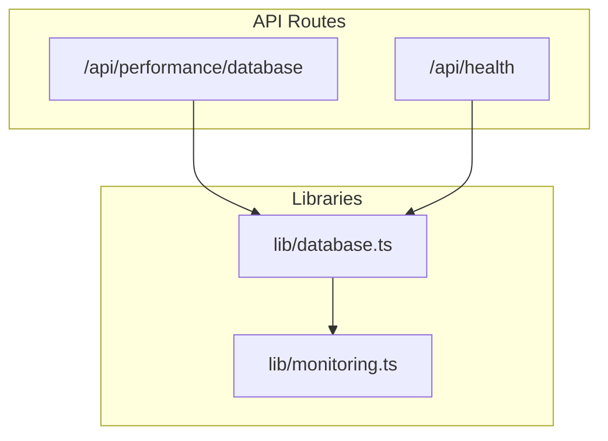
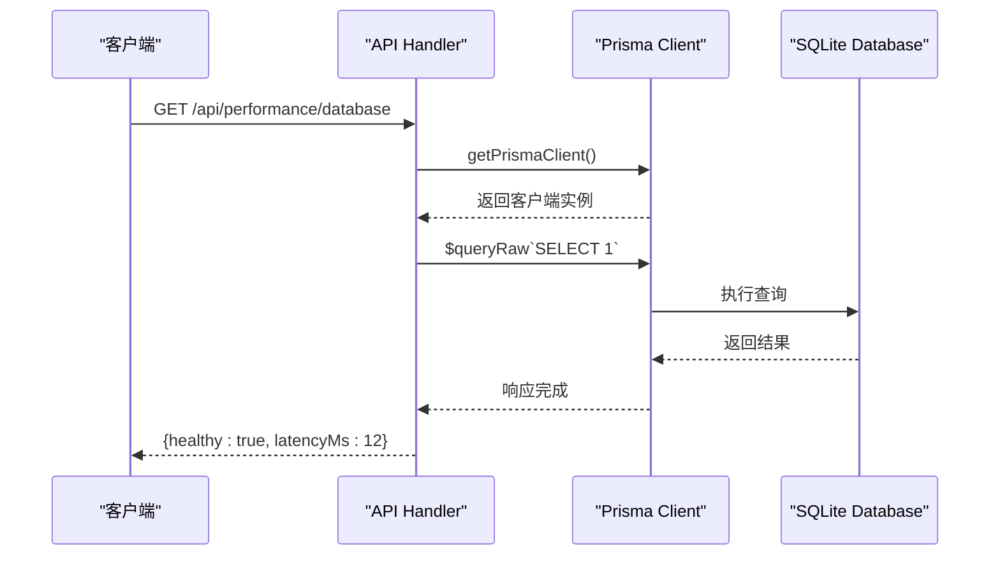
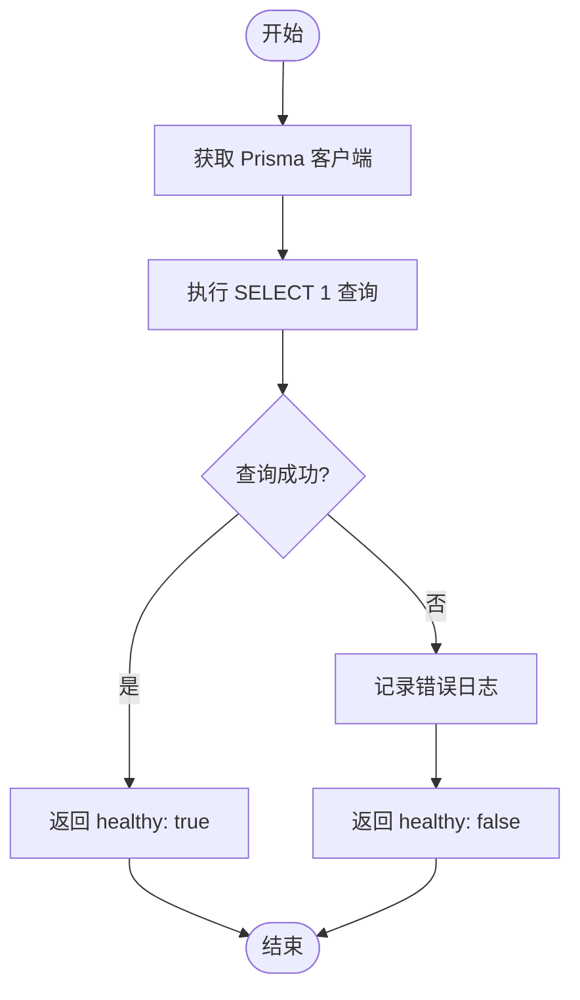

# 数据库性能监控

<cite>
**本文档引用的文件**
- [database/route.ts](file://app/api/performance/database/route.ts)
- [database.ts](file://lib/database.ts)
- [monitoring.ts](file://lib/monitoring.ts)
</cite>

## 目录
1. [简介](#简介)
2. [项目结构](#项目结构)
3. [核心组件](#核心组件)
4. [架构概述](#架构概述)
5. [详细组件分析](#详细组件分析)
6. [依赖分析](#依赖分析)
7. [性能考虑](#性能考虑)
8. [故障排除指南](#故障排除指南)
9. [结论](#结论)

## 简介
`/api/performance/database` 接口旨在通过执行轻量级 SQL 查询（如 `SELECT 1`）来检测数据库连通性与响应延迟。该接口测量 RTT（往返时间），并在响应中返回 `latencyMs` 指标，用于监控主从同步延迟、连接池饱和度等场景。结合 Prometheus 抓取配置和 Grafana 仪表板，可实现对数据库延迟趋势的可视化监控。

## 项目结构
本项目的 API 路由位于 `app/api` 目录下，其中 `/performance/database` 是专门用于数据库性能监控的端点。相关数据库操作逻辑封装在 `lib/database.ts` 中，而监控系统则由 `lib/monitoring.ts` 提供支持。



**图示来源**
- [database/route.ts](file://app/api/performance/database/route.ts)
- [database.ts](file://lib/database.ts)
- [monitoring.ts](file://lib/monitoring.ts)

**章节来源**
- [database/route.ts](file://app/api/performance/database/route.ts)
- [database.ts](file://lib/database.ts)

## 核心组件
`/api/performance/database` 接口尚未完全实现，当前返回状态码 501 表示未实现。其设计目标是调用底层数据库健康检查功能，并测量查询延迟。

**章节来源**
- [database/route.ts](file://app/api/performance/database/route.ts#L1-L5)

## 架构概述
系统通过 Prisma 客户端管理数据库连接，使用单例模式确保连接复用。`checkDatabaseHealth` 函数执行 `SELECT 1` 查询以验证数据库连通性，同时记录响应时间。监控模块定期收集性能指标并可用于告警。



**图示来源**
- [database.ts](file://lib/database.ts#L173-L185)
- [monitoring.ts](file://lib/monitoring.ts)

## 详细组件分析

### 数据库健康检查分析
`checkDatabaseHealth` 函数通过执行 `SELECT 1` 查询测试数据库连通性。若成功则返回 `{ healthy: true }`，否则捕获错误并返回失败信息。此机制可用于判断数据库是否可用。

#### 对象关系图
```mermaid
classDiagram
class PrismaClient {
+$queryRaw(sql) : Promise~any~
+$connect() : Promise~void~
+$disconnect() : Promise~void~
}
class DatabaseHealthChecker {
+checkDatabaseHealth() : Promise~{healthy : boolean, message : string}~
}
DatabaseHealthChecker --> PrismaClient : 使用
```

**图示来源**
- [database.ts](file://lib/database.ts#L173-L185)

#### API 请求流程


**图示来源**
- [database.ts](file://lib/database.ts#L173-L185)

**章节来源**
- [database.ts](file://lib/database.ts#L173-L185)

## 依赖分析
系统依赖于 Prisma ORM 进行数据库交互，利用其连接池和类型安全特性。`getPrismaClient` 函数确保全局仅存在一个客户端实例，避免频繁创建连接带来的开销。

```mermaid
dependency-graph
graph LR
A[database/route.ts] --> B[database.ts]
B --> C[PrismaClient]
B --> D[monitoring.ts]
D --> E[Logger]
D --> F[PerformanceMonitor]
```

**图示来源**
- [database.ts](file://lib/database.ts)
- [monitoring.ts](file://lib/monitoring.ts)

**章节来源**
- [database.ts](file://lib/database.ts)
- [monitoring.ts](file://lib/monitoring.ts)

## 性能考虑
- 使用 `$queryRaw` 执行最简查询以最小化网络和解析开销。
- Prisma 客户端预热连接并启用 WAL 模式提升并发性能。
- 错误重试机制增强稳定性，防止瞬时故障导致服务不可用。
- 内存中缓存 Prisma 实例减少初始化成本。

## 故障排除指南
当 `/api/performance/database` 返回不健康状态时，应检查以下方面：
- 数据库服务是否运行正常
- 网络连接是否存在中断或高延迟
- SQLite 文件路径权限是否正确
- 是否出现“database is locked”等并发访问冲突

**章节来源**
- [database.ts](file://lib/database.ts#L116-L130)
- [monitoring.ts](file://lib/monitoring.ts)

## 结论
尽管 `/api/performance/database` 当前尚未实现，但其底层依赖的 `checkDatabaseHealth` 已具备完整的数据库连通性检测能力。建议尽快完善该接口，返回包含 `latencyMs` 的详细响应，以便集成至 Prometheus/Grafana 监控体系中，实现全面的数据库性能可观测性。