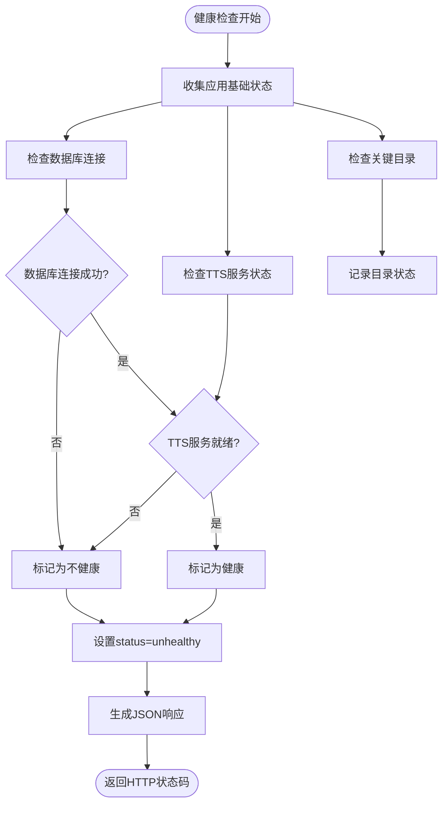
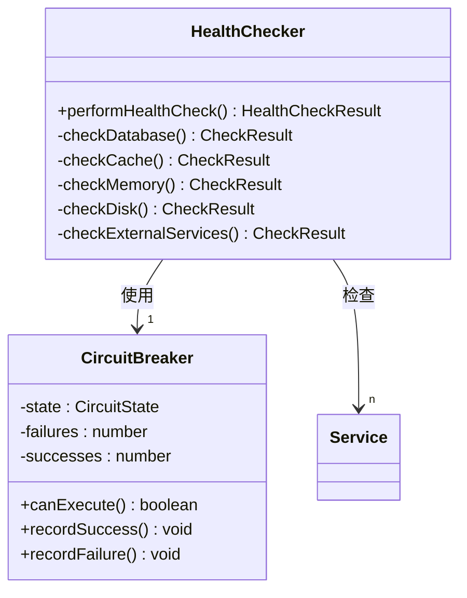

# 系统健康检查

<cite>
**本文档引用的文件**
- [route.ts](file://app/api/health/route.ts)
- [docker-compose.yml](file://docker-compose.yml)
- [database.ts](file://lib/database.ts)
- [kokoro-env.ts](file://lib/kokoro-env.ts)
- [monitoring.ts](file://lib/monitoring.ts)
</cite>

## 目录
1. [API概述](#api概述)
2. [健康检查实现机制](#健康检查实现机制)
3. [响应体结构说明](#响应体结构说明)
4. [Kubernetes探针配置示例](#kubernetes探针配置示例)
5. [错误传播与降级判断](#错误传播与降级判断)
6. [依赖服务状态聚合](#依赖服务状态聚合)

## API概述

`/api/health`端点作为Kubernetes存活探针（liveness probe）和就绪探针（readiness probe）的核心接口，提供快速、无认证的健康状态检查。该接口设计用于容器化环境中的自动化监控，通过聚合核心依赖服务的状态来决定应用的整体健康状况。

**Section sources**
- [route.ts](file://app/api/health/route.ts#L1-L10)

## 健康检查实现机制

健康检查接口通过并行检测多个关键系统组件的状态来评估应用健康度。主要检查项包括数据库连接、TTS服务可用性以及重要目录的存在性。检查逻辑采用降级策略，在非关键服务不可用时仍可维持整体健康状态。

数据库健康检查通过执行`SELECT 1`查询验证连接可用性；TTS服务检查根据`TTS_MODE`环境变量判断本地或云端服务状态；目录检查确保数据、音频和日志路径可访问。所有检查结果被聚合为统一的健康状态报告。



**Section sources**
- [route.ts](file://app/api/health/route.ts#L14-L122)
- [database.ts](file://lib/database.ts#L173-L185)

## 响应体结构说明

健康检查接口返回结构化的JSON响应，包含以下核心字段：

- `status`: 整体健康状态，值为"healthy"或"unhealthy"
- `timestamp`: 当前时间戳，ISO格式
- `uptime`: 应用运行时间（秒）
- `version`: 应用版本号
- `environment`: 运行环境标识
- `services`: 各子系统服务状态对象
- `directories`: 关键目录存在性检查结果
- `performance`: 性能指标，包括响应时间和内存使用情况

当发生错误时，响应体将包含`error`字段描述具体错误信息，并返回503状态码。

**Section sources**
- [route.ts](file://app/api/health/route.ts#L14-L122)

## Kubernetes探针配置示例

在Kubernetes部署中，可通过以下YAML配置定义存活和就绪探针：

```yaml
livenessProbe:
  httpGet:
    path: /api/health
    port: 3000
  initialDelaySeconds: 40
  periodSeconds: 30
  timeoutSeconds: 10
  failureThreshold: 3

readinessProbe:
  httpGet:
    path: /api/health
    port: 3000
  initialDelaySeconds: 20
  periodSeconds: 15
  timeoutSeconds: 5
  failureThreshold: 3
```

Docker Compose配置中也包含了类似的健康检查定义，使用wget命令定期检测`/api/health`端点。

```mermaid
graph TB
K8s[Kubernetes]
K8s --> Liveness[livenessProbe]
K8s --> Readiness[readinessProbe]
Liveness --> HTTP[HTTP GET /api/health]
Readiness --> HTTP
HTTP --> App[应用容器]
App --> Health[/api/health]
Health --> DB[(数据库)]
Health --> TTS[TTS服务]
Health --> Storage[(存储卷)]
```

**Diagram sources**
- [docker-compose.yml](file://docker-compose.yml#L50-L60)
- [route.ts](file://app/api/health/route.ts#L14-L122)

**Section sources**
- [docker-compose.yml](file://docker-compose.yml#L50-L60)

## 错误传播与降级判断

健康检查实现了精细化的错误处理和降级判断机制。整体健康状态由数据库连接状态和TTS服务状态共同决定，但采用非对称判断逻辑：数据库必须连接成功，而TTS服务允许"disabled"或"cloud"状态下的健康判定。

错误传播遵循分层处理原则：各子系统检查捕获特定异常并转换为状态标记，最外层的try-catch块处理未预期的严重错误，确保即使部分检查失败也能返回有意义的健康报告。内存使用等性能指标独立收集，不影响核心健康判断。

**Section sources**
- [route.ts](file://app/api/health/route.ts#L14-L122)
- [monitoring.ts](file://lib/monitoring.ts#L300-L350)

## 依赖服务状态聚合

系统通过`HealthChecker`类实现多维度的依赖服务状态聚合。除了基本的数据库和TTS检查外，还包含缓存命中率、内存使用、磁盘空间等指标的综合评估。电路断路器模式被应用于TTS服务调用，防止级联故障。

健康检查结果按以下优先级确定最终状态：
1. 任何"fail"状态导致整体"unhealthy"
2. 无"fail"但有"warn"状态导致"degraded"
3. 所有检查"pass"则为"healthy"

这种分层聚合机制确保了系统在部分组件异常时仍能提供准确的健康状态指示。



**Diagram sources**
- [monitoring.ts](file://lib/monitoring.ts#L300-L350)
- [kokoro-env.ts](file://lib/kokoro-env.ts#L123-L129)

**Section sources**
- [monitoring.ts](file://lib/monitoring.ts#L300-L350)
- [kokoro-env.ts](file://lib/kokoro-env.ts#L123-L129)