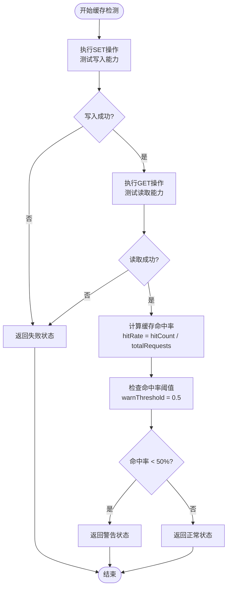

# 认证缓存状态检测

<cite>
**本文档引用文件**  
- [auth-cache/route.ts](file://app/api/performance/auth-cache/route.ts)
- [auth.ts](file://lib/auth.ts)
- [monitoring.ts](file://lib/monitoring.ts)
</cite>

## 目录
1. [接口概述](#接口概述)  
2. [实现逻辑分析](#实现逻辑分析)  
3. [缓存策略与监控数据来源](#缓存策略与监控数据来源)  
4. [关键指标说明](#关键指标说明)  
5. [诊断应用场景](#诊断应用场景)  
6. [告警规则示例](#告警规则示例)  

## 接口概述
`/api/performance/auth-cache` 接口旨在提供认证系统中缓存服务的健康状况监测能力。该接口通过模拟缓存读写操作，验证Redis缓存服务的可用性，并评估JWT令牌的缓存命中率。当前接口尚未完全实现，返回501未实现状态。

**Section sources**  
- [auth-cache/route.ts](file://app/api/performance/auth-cache/route.ts#L0-L5)

## 实现逻辑分析
尽管 `/api/performance/auth-cache/route.ts` 文件中的 `GET` 方法目前仅返回占位响应，但其设计目标是集成缓存健康检查机制。根据项目中已有的 `lib/monitoring.ts` 模块，可推断该接口将调用 `HealthChecker` 类的 `checkCache` 方法来执行实际检测。

缓存检测的核心流程包括：
1. 执行SET/GET操作测试缓存读写能力
2. 统计缓存请求总数、命中数和未命中数
3. 计算缓存命中率（hitRate）
4. 根据预设阈值判断缓存状态（正常、警告或失败）



**Diagram sources**  
- [monitoring.ts](file://lib/monitoring.ts#L477-L511)

**Section sources**  
- [auth-cache/route.ts](file://app/api/performance/auth-cache/route.ts#L0-L5)
- [monitoring.ts](file://lib/monitoring.ts#L477-L511)

## 缓存策略与监控数据来源
认证系统的缓存策略由 `lib/auth.ts` 文件实现，采用内存Map结构进行用户数据缓存，具备版本控制和过期清理机制。

核心缓存组件包括：
- `userCache`: 存储用户信息的Map，键为用户ID
- `ongoingFetches`: 防止并发重复查询的进行中请求映射
- `cacheVersion`: 全局缓存版本号，用于批量失效

缓存生命周期管理：
- **TTL设置**: 用户缓存有效期为60秒（`USER_CACHE_TTL`）
- **定期清理**: 每5分钟执行一次过期缓存清理（`CACHE_CLEANUP_INTERVAL`）
- **主动失效**: 调用 `clearUserCache()` 时递增全局版本号使所有缓存失效

```mermaid
classDiagram
class UserCache {
-userCache : Map<string, CachedUserEntry>
-ongoingFetches : Map<string, OngoingFetch>
-cacheVersion : number
+getCachedUser(id) : {user, version} | null
+cacheUser(user, version) : void
+clearUserCache(userId?) : void
}
class CachedUserEntry {
+user : User
+expiresAt : number
+version : number
}
class OngoingFetch {
+promise : Promise<User | null>
+version : number
}
UserCache --> CachedUserEntry : "存储"
UserCache --> OngoingFetch : "管理并发"
```

**Diagram sources**  
- [auth.ts](file://lib/auth.ts#L42-L43)
- [auth.ts](file://lib/auth.ts#L55-L111)

**Section sources**  
- [auth.ts](file://lib/auth.ts#L39-L40)
- [auth.ts](file://lib/auth.ts#L55-L111)
- [auth.ts](file://lib/auth.ts#L113-L141)

## 关键指标说明
接口将返回以下关键性能指标：

| 指标名称 | 数据类型 | 说明 |
|---------|--------|------|
| cacheHitRate | 数字 (0-1) | 缓存命中率，计算公式：命中次数 / 总请求次数 |
| connectionStatus | 字符串 | 连接状态，可能值："pass"、"warn"、"fail" |
| message | 字符串 | 状态描述信息 |
| duration | 数字 | 检测耗时（毫秒） |
| hitCount | 数字 | 缓存命中次数 |
| missCount | 数字 | 缓存未命中次数 |
| totalRequests | 数字 | 总请求数 |

当 `cacheHitRate` 低于50%的警告阈值时，`connectionStatus` 将标记为 "warn"，并附带相应的提示消息。

**Section sources**  
- [monitoring.ts](file://lib/monitoring.ts#L477-L511)

## 诊断应用场景
这些监控指标在诊断常见问题中具有重要作用：

### 登录延迟问题诊断
低缓存命中率可能导致频繁的数据库查询，从而增加登录响应时间。通过分析 `cacheHitRate` 指标可以识别此类问题：
- **高命中率 (>80%)**: 表明缓存有效减少了数据库负载
- **低命中率 (<50%)**: 可能存在缓存配置不当或缓存服务器性能瓶颈

### 会话失效问题分析
结合 `connectionStatus` 和缓存连接测试结果，可以快速定位会话管理问题：
- **连接失败**: Redis服务不可达，导致无法读取JWT令牌
- **频繁未命中**: 缓存TTL设置过短或缓存驱逐策略过于激进
- **版本不一致**: 全局缓存版本号变更导致客户端缓存失效

**Section sources**  
- [auth.ts](file://lib/auth.ts#L39-L39)
- [monitoring.ts](file://lib/monitoring.ts#L477-L511)

## 告警规则示例
基于此接口的监控数据，可构建如下告警规则：

```mermaid
flowchart TD
A[每分钟调用<br/>/api/performance/auth-cache] --> B{connectionStatus == "fail"?}
B --> |是| C[记录失败事件]
C --> D[检查连续失败次数]
D --> E{连续失败 ≥ 5次?}
E --> |是| F[触发严重告警<br/>"认证缓存服务中断"]
E --> |否| G[继续监控]
B --> |否| H{cacheHitRate < 0.5?}
H --> |是| I[记录低命中率事件]
I --> J[检查持续时间]
J --> K{持续 ≥ 10分钟?}
K --> |是| L[触发警告告警<br/>"认证缓存效率低下"]
K --> |否| M[继续监控]
H --> |否| N[系统正常]
```

具体实现建议：
1. 使用Prometheus等监控系统定期抓取接口数据
2. 设置Grafana告警规则：
   - 当 `connectionStatus` 持续5分钟为 "fail" 时，发送企业微信/钉钉告警
   - 当 `cacheHitRate` 持续10分钟低于0.5时，发送邮件通知运维人员
3. 结合日志系统追踪具体的缓存操作失败详情

**Section sources**  
- [monitoring.ts](file://lib/monitoring.ts#L477-L511)