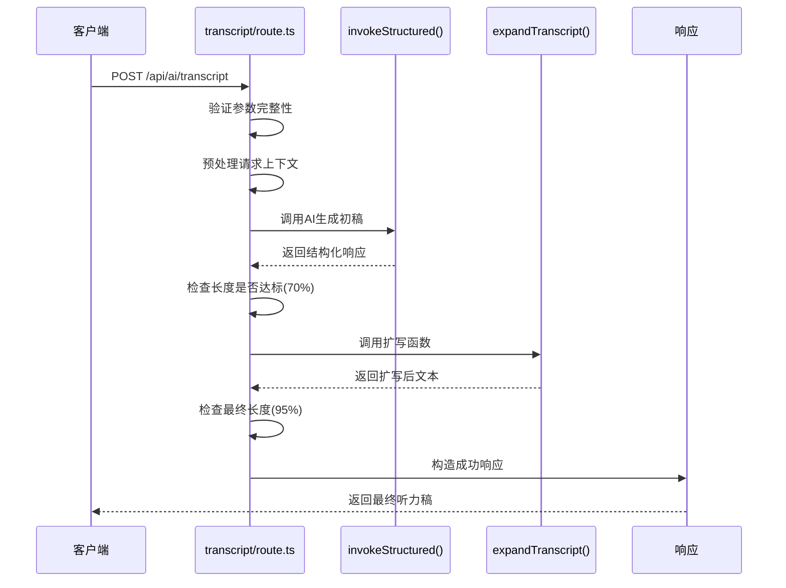

# 后端API接口

<cite>
**本文档中引用的文件**
- [login/route.ts](file://app/api/auth/login/route.ts)
- [transcript/route.ts](file://app/api/ai/transcript/route.ts)
- [tts/route-optimized.ts](file://app/api/tts/route-optimized.ts)
- [save/route.ts](file://app/api/practice/save/route.ts)
- [users/route.ts](file://app/api/admin/users/route.ts)
- [auth.ts](file://lib/auth.ts)
- [kokoro-service-gpu.ts](file://lib/kokoro-service-gpu.ts)
- [cerebras-service.ts](file://lib/ai/cerebras-service.ts)
- [route-utils.ts](file://lib/ai/route-utils.ts)
- [retry-strategy.ts](file://lib/ai/retry-strategy.ts)
- [performance-optimizer.ts](file://lib/performance-optimizer.ts)
- [audio/[filename]/route.ts](file://app/api/audio/[filename]/route.ts)
</cite>

## 更新摘要
**变更内容**
- 更新了语音合成接口部分，反映从`route.ts`到`route-optimized.ts`的迁移，支持GPU加速和音频缓存
- 新增了音频流式传输和断点续播功能说明，支持Range请求
- 更新了AI接口部分，确认所有AI调用已统一通过`invokeStructured`管道
- 新增了TTS并发限制器和内存缓存机制说明
- 修订了请求处理流程示例，准确反映当前代码实现
- 修正了错误响应模式，包含新的缓存命中和并发控制信息

## 目录
1. [简介](#简介)
2. [认证接口 (auth)](#认证接口-auth)
3. [AI生成接口 (ai)](#ai生成接口-ai)
4. [语音合成接口 (tts)](#语音合成接口-tts)
5. [练习记录接口 (practice)](#练习记录接口-practice)
6. [管理员接口 (admin)](#管理员接口-admin)
7. [JWT认证与会话管理机制](#jwt认证与会话管理机制)
8. [请求处理流程示例](#请求处理流程示例)
9. [错误响应模式](#错误响应模式)
10. [API版本控制与扩展规划](#api版本控制与扩展规划)

## 简介
本API文档全面覆盖英语听力训练应用的所有公开后端接口，按功能模块划分为认证(auth)、AI内容生成(ai)、语音合成(tts)、练习记录(practice)和管理员(admin)五大组。所有接口均基于Next.js路由处理器实现，采用RESTful设计风格，通过JSON格式进行数据交换。系统采用JWT令牌结合HTTP-only Cookie实现安全的身份验证与会话管理。近期对AI接口进行了重大重构，引入了结构化调用、统一的限流与熔断机制，以及基于覆盖率的重试策略。同时，语音合成服务已迁移至GPU专用服务，并增加了音频缓存和流式传输支持。

## 认证接口 (auth)
提供用户注册、登录、登出及身份查询功能，是所有受保护资源访问的前提。

### 登录 (/api/auth/login)
- **HTTP方法**: POST
- **认证要求**: 无需认证
- **请求参数**:
  - `email` (string, 必填): 用户邮箱
  - `password` (string, 必填): 用户密码
  - `rememberMe` (boolean, 可选): 是否长期记住登录状态
- **成功响应**:
```json
{
  "message": "登录成功",
  "user": { "id": "...", "email": "...", "name": "...", "isAdmin": false },
  "token": "JWT令牌"
}
```
- **特殊行为**: 成功登录后，服务器会在HTTP-only Cookie中设置名为`auth-token`的JWT令牌，并在响应体中同时返回该令牌。
- **错误码**:
  - 400: 邮箱或密码为空，或邮箱格式不正确
  - 401: 邮箱或密码错误
  - 500: 服务器内部错误

**Section sources**
- [login/route.ts](file://app/api/auth/login/route.ts#L1-L75)

## AI生成接口 (ai)
利用Cerebras Cloud SDK调用大语言模型，通过结构化管道生成高质量的听力学习内容，内置限流、熔断及覆盖率评估机制。

### 生成听力稿 (/api/ai/transcript)
- **HTTP方法**: POST
- **认证要求**: 无需认证（但后续操作可能需要）
- **请求参数**:
  - `difficulty` (string, 必填): 难度级别（如"beginner"）
  - `wordCount` (number, 必填): 目标词数
  - `topic` (string, 必填): 主题
  - `language` (string, 可选): 语言代码，默认为'en-US'
  - `difficultyLevel` (number, 可选): 数字形式的难度等级
  - `focusAreas` (array, 可选): 重点练习领域数组
- **成功响应**:
```json
{
  "success": true,
  "transcript": "生成的听力文本...",
  "focusCoverage": {
    "coverage": 0.8,
    "provided": ["main-idea", "detail-comprehension"],
    "missing": ["inference"]
  },
  "attempts": 2,
  "degradationReason": "经过2次生成尝试，最佳结果：142 / 150 词"
}
```
- **处理逻辑**: 接口使用`invokeStructured`管道调用AI模型生成初始文本，然后调用`expandTranscript`函数进行扩写。整个过程由`createAiRoute`高阶函数包装，内置速率限制和熔断器。对于包含`focusAreas`的请求，最多尝试2次以优化覆盖率。
- **错误码**:
  - 400: 缺少必填参数
  - 429: 请求过于频繁，请稍后再试
  - 503: AI服务暂时不可用（熔断器开启）
  - 500: 生成失败或无法满足长度要求

**Section sources**
- [transcript/route.ts](file://app/api/ai/transcript/route.ts#L1-L150)
- [cerebras-service.ts](file://lib/ai/cerebras-service.ts#L33-L64)
- [route-utils.ts](file://lib/ai/route-utils.ts#L72-L128)

### 文本扩写 (/api/ai/expand)
- **HTTP方法**: POST
- **认证要求**: 无需认证
- **请求参数**:
  - `text` (string, 必填): 要扩写的文本
  - `targetWordCount` (number, 必填): 目标词数
  - `topic` (string, 必填): 主题
  - `difficulty` (string, 必填): 难度级别
  - `language` (string, 可选): 语言代码，默认为'en-US'
  - `maxAttempts` (number, 可选): 最大尝试次数，默认为5
  - `minAcceptablePercentage` (number, 可选): 最小可接受百分比，默认为0.9
- **成功响应**:
```json
{
  "expandedText": "扩写后的文本...",
  "finalWordCount": 145,
  "meetsRequirement": true,
  "expansionAttempts": 3
}
```
- **核心机制**: 使用`invokeStructured`确保AI响应符合预定义的`expansionSchema`。扩写过程由`createAiRoute`提供统一的速率限制和熔断保护。
- **错误码**:
  - 400: 参数缺失
  - 429: 请求过于频繁，请稍后再试
  - 503: AI服务暂时不可用
  - 500: 扩写失败

**Section sources**
- [expand/route.ts](file://app/api/ai/expand/route.ts#L1-L38)
- [transcript-expansion.ts](file://lib/ai/transcript-expansion.ts)

### 生成题目 (/api/ai/questions)
- **HTTP方法**: POST
- **认证要求**: 无需认证
- **请求参数**:
  - `difficulty` (string, 必填): 难度级别
  - `transcript` (string, 必填): 听力稿文本
  - `duration` (number, 可选): 音频时长（秒）
  - `language` (string, 可选): 语言代码
  - `difficultyLevel` (number, 可选): 数字形式的难度等级
  - `focusAreas` (array, 可选): 重点练习领域数组
- **成功响应**:
```json
{
  "success": true,
  "questions": [
    {
      "question": "What is the main idea of the conversation?",
      "type": "single",
      "options": ["A", "B", "C", "D"],
      "answer": "A",
      "focus_areas": ["main-idea"],
      "explanation": "The conversation primarily discusses..."
    }
  ],
  "focusCoverage": {
    "coverage": 1,
    "provided": ["main-idea", "detail-comprehension"],
    "missing": []
  },
  "attempts": 1,
  "degradationReason": "所有重点领域均已覆盖"
}
```
- **处理逻辑**: 使用`executeWithCoverageRetry`策略，对于有`focusAreas`的请求，最多尝试2次。每次生成后评估`focusCoverage`，若不满足要求则构建改进提示进行重试。响应结构由`questionsSchema`严格定义。
- **错误码**:
  - 400: 参数缺失
  - 429: 请求过于频繁，请稍后再试
  - 503: AI服务暂时不可用
  - 500: 生成失败

**Section sources**
- [questions/route.ts](file://app/api/ai/questions/route.ts#L1-L186)
- [retry-strategy.ts](file://lib/ai/retry-strategy.ts#L59-L101)
- [schemas.ts](file://lib/ai/schemas.ts#L30-L100)

### 生成话题 (/api/ai/topics)
- **HTTP方法**: POST
- **认证要求**: 无需认证
- **请求参数**:
  - `difficulty` (string, 必填): 难度级别
  - `wordCount` (number, 必填): 目标词数
  - `language` (string, 可选): 语言代码
  - `difficultyLevel` (number, 可选): 数字形式的难度等级
  - `focusAreas` (array, 可选): 重点练习领域数组
- **成功响应**:
```json
{
  "success": true,
  "topics": ["气候变化的影响", "远程工作的利弊", "人工智能的未来发展"],
  "focusCoverage": {
    "coverage": 0.6,
    "provided": ["main-idea", "inference"],
    "missing": ["vocabulary", "detail-comprehension"]
  },
  "attempts": 1
}
```
- **核心机制**: 与`/api/ai/questions`类似，使用`executeWithCoverageRetry`策略优化`focusAreas`的覆盖率。响应必须符合`topicsSchema`定义的结构。
- **错误码**:
  - 400: 参数缺失
  - 429: 请求过于频繁，请稍后再试
  - 503: AI服务暂时不可用
  - 500: 生成失败

**Section sources**
- [topics/route.ts](file://app/api/ai/topics/route.ts#L1-L122)
- [retry-strategy.ts](file://lib/ai/retry-strategy.ts#L59-L101)
- [schemas.ts](file://lib/ai/schemas.ts#L1-L25)

### 批改答案 (/api/ai/grade)
- **HTTP方法**: POST
- **认证要求**: 无需认证
- **请求参数**:
  - `transcript` (string, 必填): 听力稿文本
  - `questions` (array, 必填): 问题数组
  - `answers` (array, 必填): 用户答案数组
  - `language` (string, 可选): 语言代码
  - `focusAreas` (array, 可选): 重点练习领域数组
- **成功响应**:
```json
{
  "success": true,
  "results": [
    {
      "type": "single",
      "user_answer": "B",
      "correct_answer": "A",
      "is_correct": false,
      "standard_answer": "The main idea is...",
      "score": null,
      "short_feedback": "理解有误",
      "error_tags": ["main-idea", "detail-missing"],
      "error_analysis": "您未能抓住对话的主旨..."
    }
  ],
  "focusCoverage": {
    "coverage": 0.75,
    "provided": ["main-idea", "detail-comprehension"],
    "missing": ["inference"]
  }
}
```
- **处理逻辑**: 使用`invokeStructured`管道确保批改结果符合`gradingSchema`。对于包含`focusAreas`的请求，会计算`focusCoverage`以评估题目对重点领域的覆盖情况。
- **错误码**:
  - 400: 参数缺失
  - 429: 请求过于频繁，请稍后再试
  - 503: AI服务暂时不可用
  - 500: 批改失败

**Section sources**
- [grade/route.ts](file://app/api/ai/grade/route.ts#L1-L71)
- [schemas.ts](file://lib/ai/schemas.ts#L175-L263)

## 语音合成接口 (tts)
使用GPU加速的Kokoro TTS服务将文本转换为自然语音，支持音频缓存和流式传输。

### 文本转语音 (/api/tts)
- **HTTP方法**: POST
- **认证要求**: 无需认证
- **请求参数**:
  - `text` (string, 必填): 要转换的文本
  - `speed` (number, 可选): 语速，默认为1.0
  - `language` (string, 可选): 语言代码，默认为'en-US'
- **成功响应**:
```json
{
  "success": true,
  "audioUrl": "/tts_audio_12345.wav",
  "duration": 12.5,
  "byteLength": 102400,
  "provider": "kokoro-gpu",
  "cached": false,
  "message": "Audio generated successfully"
}
```
- **核心机制**: 接口通过Node.js子进程调用Python编写的Kokoro GPU服务，利用电路断路器(Circuit Breaker)模式管理服务健康状态，支持自动重启和指数退避重试。使用`audioCache`进行音频缓存，TTL为30分钟。通过`ttsRequestLimiter`限制并发请求数为1。
- **错误码**:
  - 400: 文本为空或语言不支持
  - 503: GPU TTS服务未就绪
  - 504: 生成超时

**Section sources**
- [tts/route-optimized.ts](file://app/api/tts/route-optimized.ts#L1-L122)
- [kokoro-service-gpu.ts](file://lib/kokoro-service-gpu.ts#L131-L518)
- [performance-optimizer.ts](file://lib/performance-optimizer.ts#L249-L245)

## 练习记录接口 (practice)
管理用户的练习历史和学习进度。

### 保存练习记录 (/api/practice/save)
- **HTTP方法**: POST
- **认证要求**: 需要有效JWT令牌
- **请求参数**:
  - `exerciseData` (object, 必填): 练习数据对象
  - `difficulty` (string, 必填): 练习难度
  - `topic` (string, 必填): 练习主题
  - `language` (string, 可选): 使用的语言
  - `accuracy`, `score`, `duration` (可选): 练习结果指标
- **成功响应**:
```json
{
  "message": "练习记录保存成功",
  "session": {
    "id": "session-id",
    "createdAt": "2025-09-27T00:00:00Z"
  }
}
```
- **认证检查**: 使用`requireAuth`中间件验证JWT令牌的有效性。
- **错误码**:
  - 401: 未登录或令牌无效
  - 400: 练习数据不完整
  - 500: 保存失败

**Section sources**
- [save/route.ts](file://app/api/practice/save/route.ts#L1-L57)
- [auth.ts](file://lib/auth.ts#L365-L379)

## 管理员接口 (admin)
提供仅限管理员使用的系统级管理功能。

### 获取所有用户 (/api/admin/users)
- **HTTP方法**: GET
- **认证要求**: 需要管理员权限的JWT令牌
- **成功响应**:
```json
{
  "users": [
    {
      "id": "user-id",
      "email": "user@example.com",
      "name": "用户名",
      "isAdmin": false,
      "createdAt": "2025-09-27T00:00:00Z",
      "updatedAt": "2025-09-27T00:00:00Z",
      "_count": { "practiceSessions": 5 }
    }
  ]
}
```
- **权限检查**: 使用`requireAdmin`中间件，该中间件先调用`requireAuth`验证基本身份，再检查`isAdmin`字段。
- **数据聚合**: 查询结果包含每个用户的练习会话数量，便于统计分析。
- **错误码**:
  - 403: 权限不足
  - 500: 服务器内部错误

**Section sources**
- [users/route.ts](file://app/api/admin/users/route.ts#L1-L49)
- [auth.ts](file://lib/auth.ts#L384-L396)

## JWT认证与会话管理机制
系统采用双层安全策略：JWT令牌用于API层面的身份验证，HTTP-only Cookie用于防止XSS攻击。

### JWT令牌结构
```json
{
  "userId": "unique-user-id",
  "email": "user@example.com",
  "isAdmin": false,
  "iat": 1727366400,
  "exp": 1727452800
}
```

### 会话生命周期
1. **登录**: 用户提交凭证，服务器验证后生成JWT令牌。
2. **Cookie设置**: 服务器通过`Set-Cookie`头将令牌存入HTTP-only Cookie，前端JavaScript无法访问。
3. **后续请求**: 浏览器自动在请求头中携带Cookie，服务器从中提取JWT并验证。
4. **登出**: 服务器清除Cookie，客户端应丢弃本地存储的令牌。
5. **令牌过期**: 普通用户令牌24小时过期，勾选"记住我"的令牌永不过期。

**Section sources**
- [auth.ts](file://lib/auth.ts#L201-L207)
- [login/route.ts](file://app/api/auth/login/route.ts#L55-L65)

## 请求处理流程示例
以`/api/ai/transcript`为例，展示完整的请求处理链：



**Diagram sources**
- [transcript/route.ts](file://app/api/ai/transcript/route.ts#L1-L150)
- [cerebras-service.ts](file://lib/ai/cerebras-service.ts#L33-L64)

## 错误响应模式
所有API遵循统一的错误响应格式，便于前端处理。

### 标准错误结构
```json
{
  "error": "用户可读的错误信息"
}
```

### 分类处理
- **客户端错误 (4xx)**: 提供明确的中文提示，如"邮箱格式不正确"。
- **服务端错误 (5xx)**: 对外隐藏技术细节，返回通用信息"服务器内部错误，请稍后重试"，详细日志记录在服务器端。
- **特定服务错误**: 如TTS服务，会根据错误类型返回更具体的建议，如"GPU音频生成超时，请稍后重试"。
- **AI服务特殊错误**:
  - **429**: 内置`createAiRoute`的速率限制器触发，响应包含`X-RateLimit-*`头部。
  - **503**: `aiServiceCircuitBreaker`熔断器开启，表示AI服务暂时不可用。

**Section sources**
- 所有route.ts文件中的`catch`块
- [route-utils.ts](file://lib/ai/route-utils.ts#L72-L128)

## API版本控制与扩展规划
当前API为v1版本，通过URL路径直接暴露，未来将引入版本控制。

### 当前状态
- 所有API位于`/api/`根路径下，隐式为v1版本。
- 无显式版本号，便于快速迭代。
- AI接口已重构为统一的`invokeStructured`管道，具备限流、熔断和结构化验证能力。

### 未来规划
1. **引入版本号**: 将API迁移至`/api/v1/`和`/api/v2/`路径，实现多版本共存。
2. **OpenAPI规范**: 为所有接口生成Swagger/OpenAPI文档，提供交互式测试界面。
3. **GraphQL替代**: 对于复杂的数据查询需求，考虑引入GraphQL端点以减少请求次数。
4. **Webhook支持**: 为异步操作（如长文本生成）添加Webhook回调机制。
5. **速率限制增强**: 实施更精细的基于用户角色的速率限制策略。
6. **AI服务监控**: 增强`telemetry`模块，提供AI调用的详细性能和成功率报告。