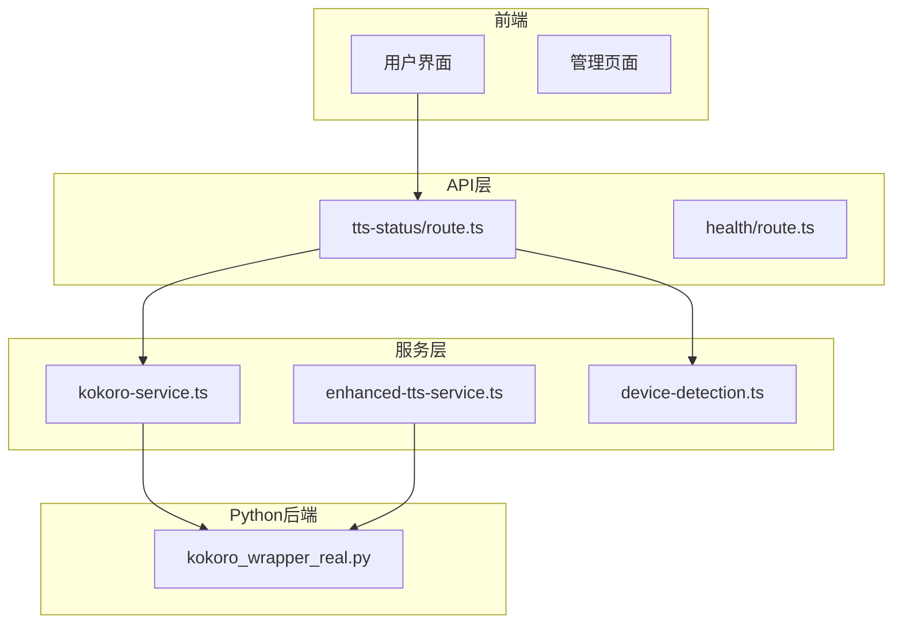
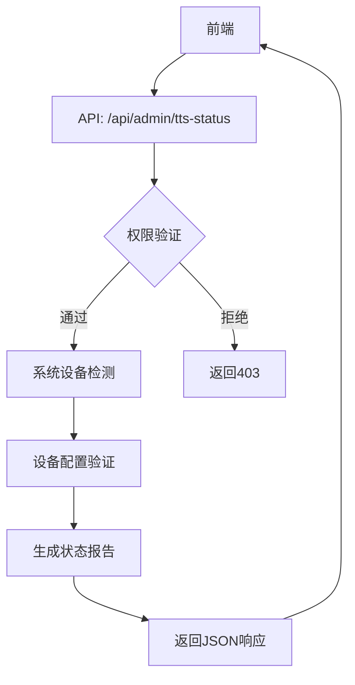
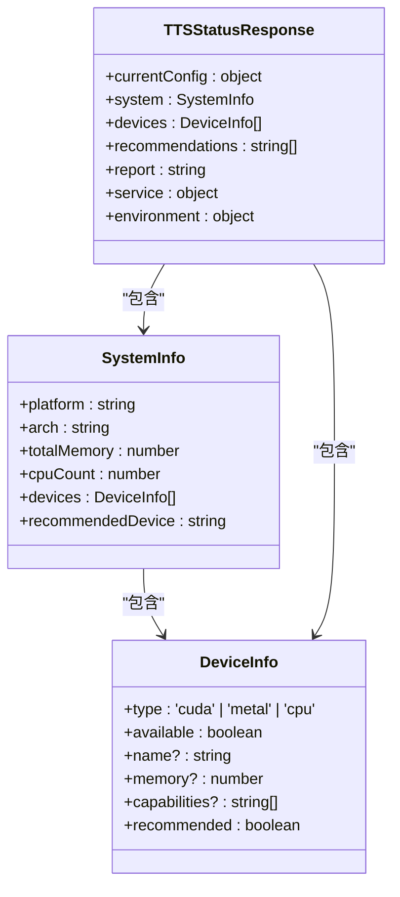
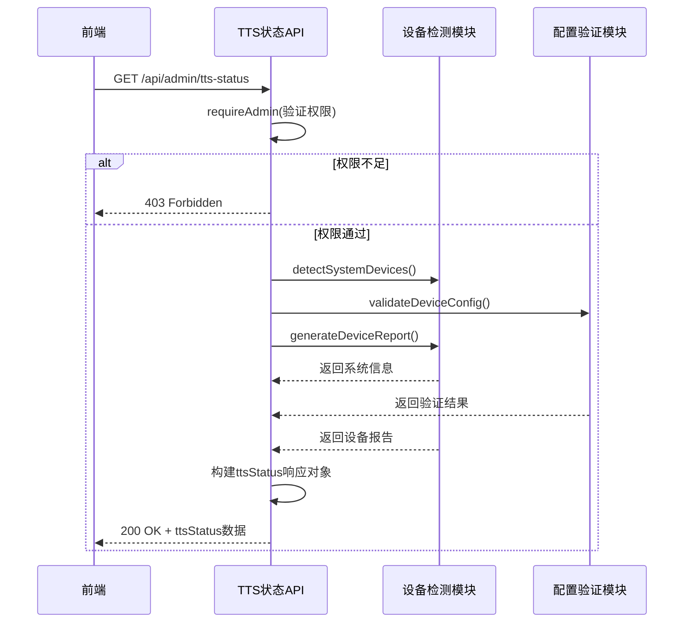
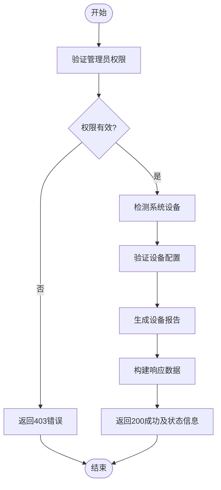
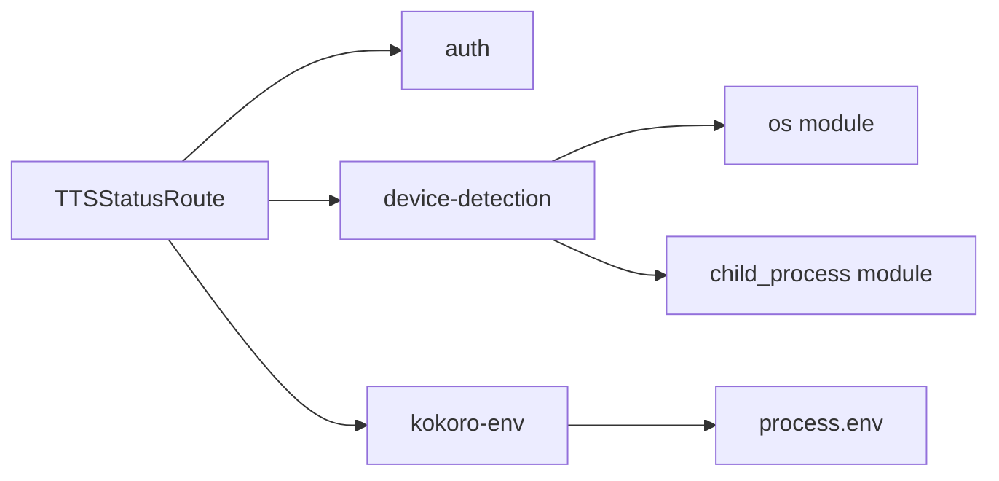

# TTS状态检查API

<cite>
**本文档引用的文件**   
- [tts-status/route.ts](file://app/api/admin/tts-status/route.ts)
- [kokoro-service.ts](file://lib/kokoro-service.ts)
- [device-detection.ts](file://lib/device-detection.ts)
- [enhanced-tts-service.ts](file://lib/enhanced-tts-service.ts)
- [kokoro_wrapper_real.py](file://kokoro-local/kokoro_wrapper_real.py)
</cite>

## 目录
1. [简介](#简介)
2. [项目结构](#项目结构)
3. [核心组件](#核心组件)
4. [架构概述](#架构概述)
5. [详细组件分析](#详细组件分析)
6. [依赖分析](#依赖分析)
7. [性能考量](#性能考量)
8. [故障排除指南](#故障排除指南)
9. [结论](#结论)

## 简介
TTS状态检查API是系统管理员用于监控本地Python驱动的Kokoro TTS引擎运行健康状况的核心接口。该API通过`/api/admin/tts-status`端点提供全面的系统设备检测、TTS服务状态和配置建议，帮助运维人员快速诊断语音合成服务的问题并采取相应措施。

## 项目结构
本项目的结构清晰地分离了前端界面、API路由、核心库和外部依赖。TTS相关功能主要集中在`app/api`目录下的API路由和`lib`目录中的服务实现，以及`kokoro-local`目录中的Python后端。

**图表来源**
- [tts-status/route.ts](file://app/api/admin/tts-status/route.ts)
- [kokoro-service.ts](file://lib/kokoro-service.ts)
- [device-detection.ts](file://lib/device-detection.ts)
- [kokoro_wrapper_real.py](file://kokoro-local/kokoro_wrapper_real.py)

**章节来源**
- [tts-status/route.ts](file://app/api/admin/tts-status/route.ts)
- [kokoro-service.ts](file://lib/kokoro-service.ts)
- [device-detection.ts](file://lib/device-detection.ts)

## 核心组件
TTS状态检查API的核心在于其对Kokoro TTS服务的深度集成和监控能力。通过调用`detectSystemDevices`、`validateDeviceConfig`等函数，API能够获取系统的硬件信息，并结合环境变量来判断当前TTS服务的最佳运行配置。

**章节来源**
- [tts-status/route.ts](file://app/api/admin/tts-status/route.ts#L25-L68)
- [device-detection.ts](file://lib/device-detection.ts#L233-L258)

## 架构概述
整个TTS状态检查系统的架构分为三层：前端展示层、Node.js服务层和Python后端处理层。前端通过API请求获取状态信息，Node.js服务层负责协调和聚合数据，而Python后端则执行实际的音频合成任务。

**图表来源**
- [tts-status/route.ts](file://app/api/admin/tts-status/route.ts#L6-L195)

**章节来源**
- [tts-status/route.ts](file://app/api/admin/tts-status/route.ts#L6-L195)

## 详细组件分析

### TTS状态检查组件分析
TTS状态检查组件的主要职责是收集和呈现关于Kokoro TTS服务的全面信息，包括当前配置、系统信息、可用设备列表、性能建议和服务状态。

#### 对于对象导向组件：

**图表来源**
- [device-detection.ts](file://lib/device-detection.ts#L233-L258)
- [tts-status/route.ts](file://app/api/admin/tts-status/route.ts#L25-L68)

#### 对于API/服务组件：

**图表来源**
- [tts-status/route.ts](file://app/api/admin/tts-status/route.ts#L6-L195)

**章节来源**
- [tts-status/route.ts](file://app/api/admin/tts-status/route.ts#L6-L195)

### 概念概述
TTS状态检查API的设计理念是提供一个全面的健康检查工具，不仅报告服务是否在线，还深入到硬件层面，为用户提供优化建议和故障诊断信息。

[无来源，因为此图表显示的是概念性工作流程，而非实际代码结构]

[无来源，因为此部分不分析特定源文件]

## 依赖分析
TTS状态检查API依赖于多个内部模块和外部资源。它直接依赖于`lib/auth`进行权限验证，`lib/device-detection`进行硬件检测，以及`lib/kokoro-env`来解析环境配置。

**图表来源**
- [tts-status/route.ts](file://app/api/admin/tts-status/route.ts#L1-L195)
- [device-detection.ts](file://lib/device-detection.ts#L1-L346)
- [kokoro-env.ts](file://lib/kokoro-env.ts#L1-L217)

**章节来源**
- [tts-status/route.ts](file://app/api/admin/tts-status/route.ts#L1-L195)
- [device-detection.ts](file://lib/device-detection.ts#L1-L346)
- [kokoro-env.ts](file://lib/kokoro-env.ts#L1-L217)

## 性能考量
在设计TTS状态检查API时，考虑了性能因素。例如，`detectSystemDevices`函数使用`Promise.all`并发执行CUDA和Metal设备的检测，以减少总体响应时间。此外，电路断路器模式的应用可以防止因频繁失败而导致的服务雪崩效应。

[无来源，因为此部分提供一般性指导]

## 故障排除指南
当TTS服务出现问题时，运维人员应遵循以下标准操作流程（SOP）：

1.  **检查API响应**：首先访问`/api/admin/tts-status`，查看返回的`isHealthy`字段。
2.  **分析关键字段**：
    *   `isHealthy`: 布尔值，表示服务整体健康状况。
    *   `pid`: 进程ID，如果为null或不存在，表明Python进程未运行。
    *   `memoryUsage`: 内存占用情况，过高可能预示内存泄漏。
    *   `lastHeartbeat`: 最后心跳时间，长时间未更新表明服务停滞。
3.  **诊断异常响应码**：
    *   **503 Service Unavailable**: 此错误码通常由`enhanced-tts-service.ts`中的`healthCheck`方法触发，当服务状态不是READY或存在其他问题时返回。这可能是由于Python进程崩溃、初始化超时或并发请求过多导致。
4.  **触发自动重启**：当`kokoroTTS`实例的`handleProcessExit`方法被调用时，会启动指数退避重试机制。系统会根据`restartAttempts`计数和`circuitBreaker`的状态决定何时以及如何重启Python进程。

**章节来源**
- [tts-status/route.ts](file://app/api/admin/tts-status/route.ts#L6-L195)
- [enhanced-tts-service.ts](file://lib/enhanced-tts-service.ts#L196-L764)
- [kokoro-service.ts](file://lib/kokoro-service.ts#L543-L552)

## 结论
TTS状态检查API是一个强大且全面的监控工具，它不仅提供了对Kokoro TTS服务的实时健康检查，还深入到了底层硬件和配置层面。通过集成电路断路器和自动重启机制，系统具备了良好的容错性和自愈能力，确保了语音合成服务的高可用性。

[无来源，因为此部分总结而不分析特定源文件]