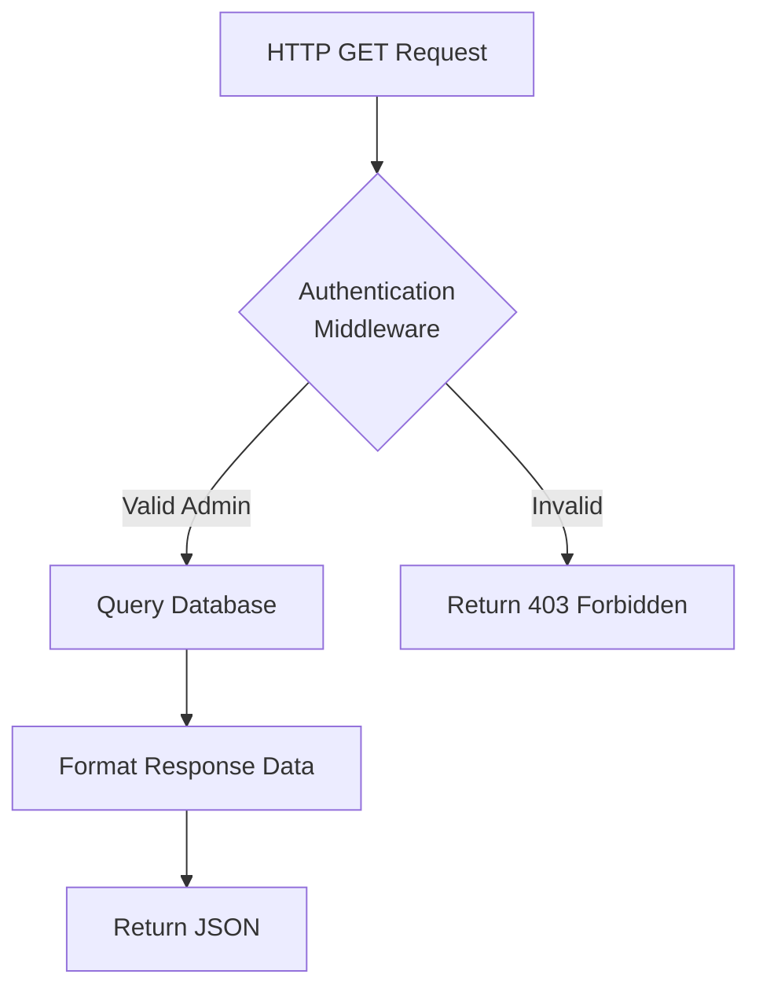
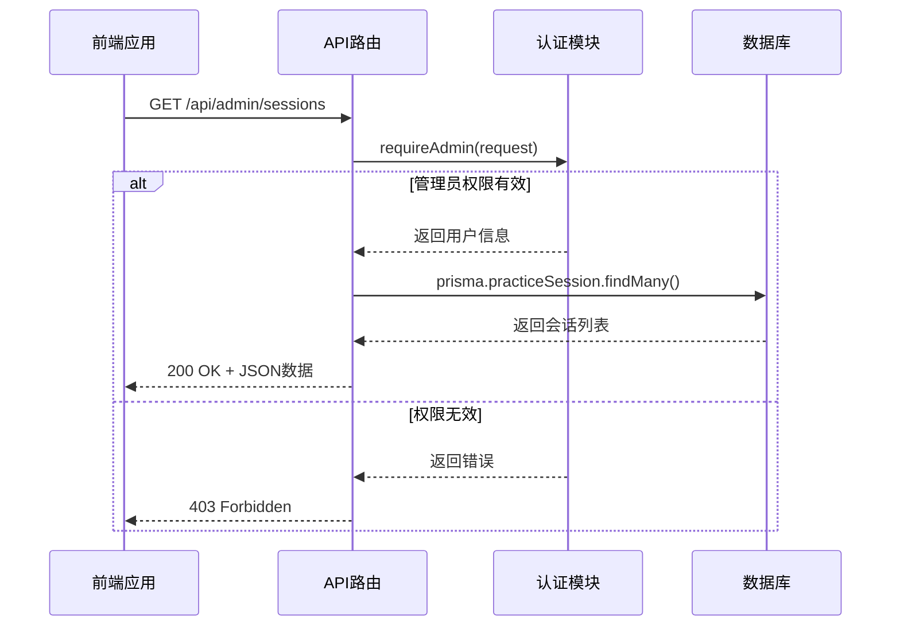
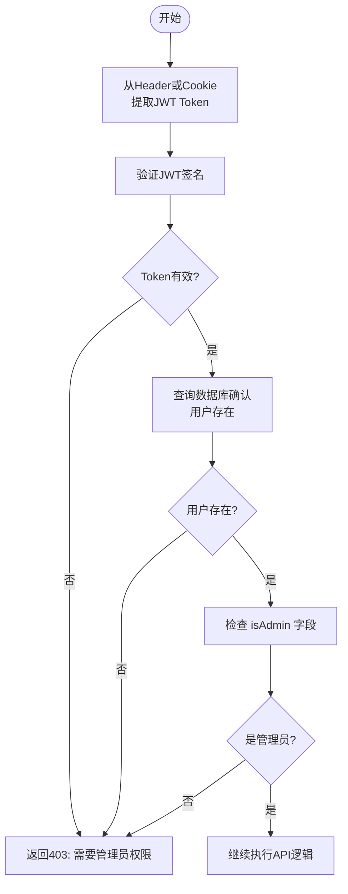
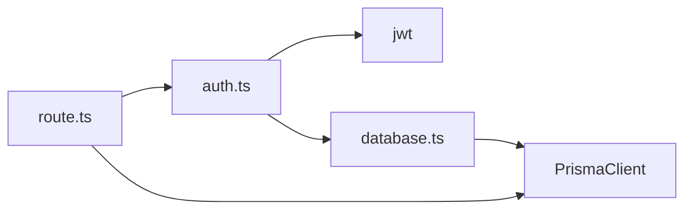

# 会话监控API

<cite>
**本文档引用文件**
- [route.ts](file://app/api/admin/sessions/route.ts)
- [auth.ts](file://lib/auth.ts)
- [database.ts](file://lib/database.ts)
- [types.ts](file://lib/types.ts)
- [migration.sql](file://prisma/migrations/20250927052831_add_wrong_answer_ai_models/migration.sql)
</cite>

## 目录
1. [简介](#简介)
2. [项目结构](#项目结构)
3. [核心组件](#核心组件)
4. [架构概述](#架构概述)
5. [详细组件分析](#详细组件分析)
6. [依赖关系分析](#依赖关系分析)
7. [性能考虑](#性能考虑)
8. [故障排除指南](#故障排除指南)
9. [结论](#结论)

## 简介
本技术文档详细阐述了`/api/admin/sessions`端点的实现机制，该接口为管理员提供了对用户登录会话进行实时监控与管理的能力。文档深入解析了该API如何查询当前活跃的练习会话，并返回包含会话ID、用户信息、IP地址、用户代理和最后活动时间戳等关键数据。同时，文档还说明了后端如何通过集成数据库和缓存策略来高效追踪会话状态。

## 项目结构
项目采用基于Next.js的API路由结构，会话监控功能位于`app/api/admin/sessions/route.ts`文件中。该端点是管理员后台系统的一部分，与`stats`、`users`等其他管理API并列。数据持久化由Prisma ORM管理，其模型定义在`prisma/migrations`目录下的SQL迁移文件中。核心业务逻辑和工具函数则分散在`lib`目录下，如认证、数据库连接和类型定义。

```mermaid
graph TB
subgraph "API Endpoints"
A[/api/admin/sessions]
B[/api/admin/stats]
C[/api/admin/users]
end
subgraph "Core Libraries"
D[lib/auth.ts]
E[lib/database.ts]
F[lib/types.ts]
end
subgraph "Data Layer"
G[Prisma Client]
H[SQLite Database]
end
A --> D
A --> E
D --> F
E --> G
G --> H
```

**Diagram sources**
- [route.ts](file://app/api/admin/sessions/route.ts)
- [auth.ts](file://lib/auth.ts)
- [database.ts](file://lib/database.ts)

**Section sources**
- [route.ts](file://app/api/admin/sessions/route.ts)
- [migration.sql](file://prisma/migrations/20250927052831_add_wrong_answer_ai_models/migration.sql)

## 核心组件
`/api/admin/sessions`端点的核心功能是为管理员提供一个查看最近练习会话的窗口。它首先通过`requireAdmin`中间件验证调用者的身份和权限，确保只有管理员才能访问此敏感信息。随后，它利用Prisma客户端从数据库中查询`practiceSession`表的记录，并将结果以JSON格式返回给前端。

**Section sources**
- [route.ts](file://app/api/admin/sessions/route.ts#L1-L53)
- [auth.ts](file://lib/auth.ts#L384-L396)

## 架构概述
整个会话监控功能遵循典型的分层架构。最上层是API路由处理HTTP请求；中间层是业务逻辑和安全控制，由`lib/auth.ts`中的函数实现；最底层是数据访问层，通过Prisma与SQLite数据库交互。这种分离确保了代码的可维护性和安全性。



**Diagram sources**
- [route.ts](file://app/api/admin/sessions/route.ts#L1-L53)
- [auth.ts](file://lib/auth.ts#L384-L396)

## 详细组件分析

### 会话查询分析
该组件负责执行数据库查询以获取最近的练习会话。它使用Prisma的`findMany`方法，并通过`select`选项精确指定需要返回的字段，包括会话的基本信息和关联的用户邮箱与姓名。查询结果按创建时间降序排列，并限制为最近的50条记录，以保证响应效率。

#### 对于API/服务组件：


**Diagram sources**
- [route.ts](file://app/api/admin/sessions/route.ts#L1-L53)
- [auth.ts](file://lib/auth.ts#L384-L396)

**Section sources**
- [route.ts](file://app/api/admin/sessions/route.ts#L1-L53)
- [types.ts](file://lib/types.ts#L100-L115)

### 认证与授权分析
`requireAdmin`函数是安全性的核心。它首先调用`requireAuth`来验证JWT令牌的有效性，并从中提取用户载荷（payload）。然后，它检查载荷中的`isAdmin`字段是否为`true`。如果任一检查失败，都会返回相应的错误信息和403状态码，阻止未授权的访问。

#### 对于复杂逻辑组件：


**Diagram sources**
- [auth.ts](file://lib/auth.ts#L384-L396)
- [auth.ts](file://lib/auth.ts#L345-L383)

**Section sources**
- [auth.ts](file://lib/auth.ts#L345-L396)

## 依赖关系分析
`/api/admin/sessions`端点直接依赖于`lib/auth.ts`提供的`requireAdmin`函数进行权限控制，并依赖于`@prisma/client`来执行数据库操作。`lib/auth.ts`本身又依赖于`jsonwebtoken`库进行JWT的签发和验证，并依赖于`lib/database.ts`提供的`withDatabase`包装器来安全地访问数据库。这些依赖关系形成了一个清晰的调用链。



**Diagram sources**
- [route.ts](file://app/api/admin/sessions/route.ts)
- [auth.ts](file://lib/auth.ts)
- [database.ts](file://lib/database.ts)

**Section sources**
- [route.ts](file://app/api/admin/sessions/route.ts)
- [auth.ts](file://lib/auth.ts)
- [database.ts](file://lib/database.ts)

## 性能考虑
为了优化性能，系统在多个层面进行了设计。数据库层面，`practice_sessions`表的关键字段（如`user_id`, `created_at`）都建立了索引，确保`findMany`查询能够快速执行。代码层面，`requireAdmin`函数内部的`findUserById`调用了带缓存的`getCachedUser`，减少了对数据库的重复查询压力。此外，API响应限制了返回的会话数量（`take: 50`），避免了大数据量传输带来的延迟。

## 故障排除指南
当管理员无法访问`/api/admin/sessions`时，应首先检查返回的状态码。
- **403 Forbidden**: