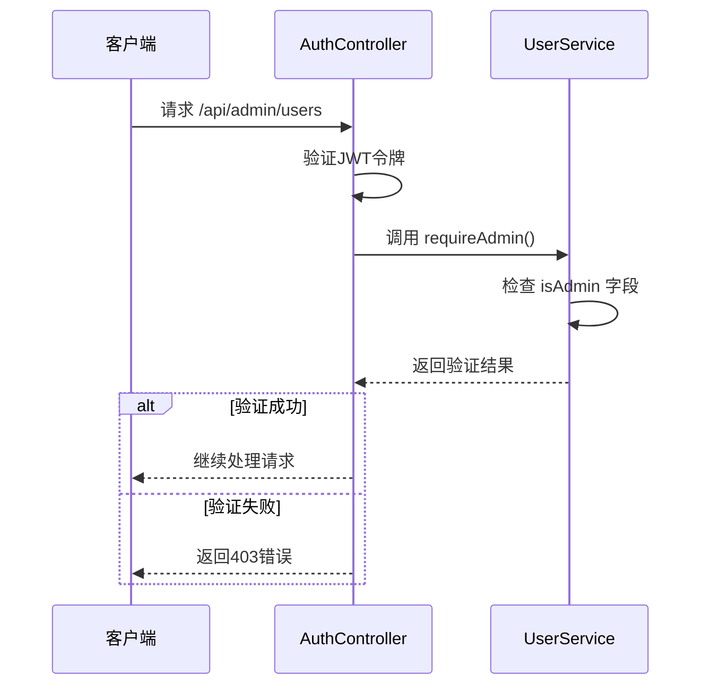
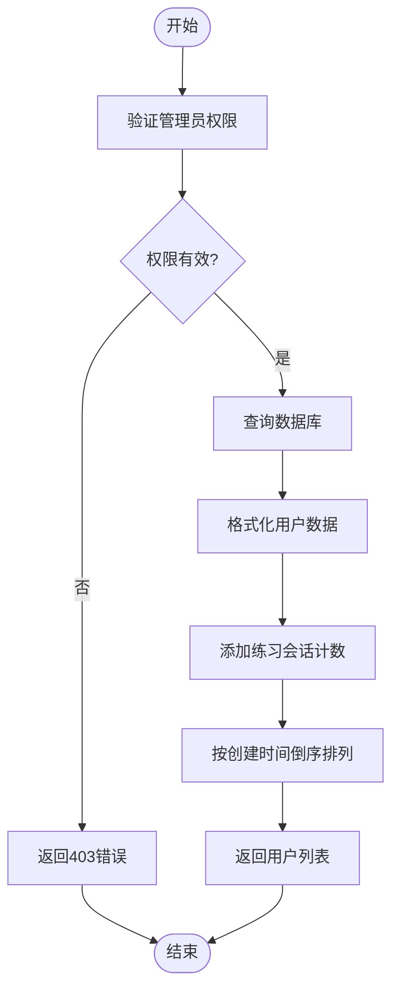
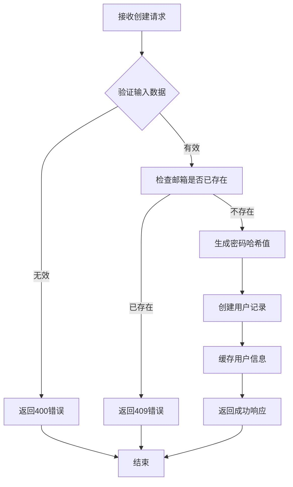
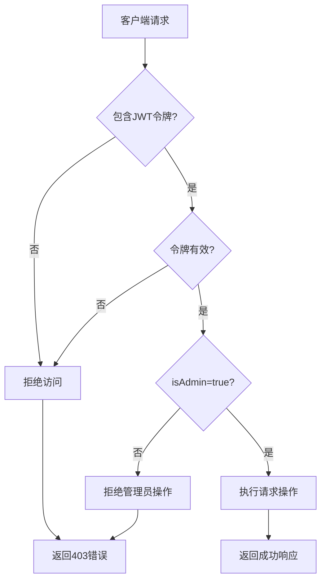

# 用户管理API

<cite>
**本文档引用的文件**
- [users/route.ts](file://app/api/admin/users/route.ts)
- [auth.ts](file://lib/auth.ts)
- [database.ts](file://lib/database.ts)
- [page.tsx](file://app/admin/page.tsx)
</cite>

## 目录
1. [简介](#简介)
2. [权限控制机制](#权限控制机制)
3. [GET请求：用户列表查询](#get请求用户列表查询)
4. [POST请求：创建管理员账户](#post请求创建管理员账户)
5. [PUT请求：更新用户信息](#put请求更新用户信息)
6. [DELETE请求：删除用户](#delete请求删除用户)
7. [实际应用场景](#实际应用场景)
8. [安全风险与防护措施](#安全风险与防护措施)

## 简介
本API端点`/api/admin/users`为系统管理员提供了对用户数据的全面管理能力。通过该接口，管理员可以执行用户查询、创建、更新和删除等操作，是管理系统用户的核心功能模块。

**Section sources**
- [users/route.ts](file://app/api/admin/users/route.ts#L0-L49)

## 权限控制机制
所有对`/api/admin/users`端点的访问都必须经过管理员身份验证。系统通过JWT（JSON Web Token）进行认证，并在`requireAdmin`中间件中验证用户是否具有管理员权限。



**Diagram sources**
- [auth.ts](file://lib/auth.ts#L384-L396)
- [users/route.ts](file://app/api/admin/users/route.ts#L6-L15)

## GET请求：用户列表查询
GET请求用于获取所有用户的列表信息，支持分页和过滤功能。

### 分页参数
| 参数 | 类型 | 描述 |
|------|------|------|
| page | 整数 | 当前页码，从1开始 |
| pageSize | 整数 | 每页显示的用户数量 |

### 返回的用户列表结构
返回的用户对象包含以下字段：
- **id**: 用户唯一标识符
- **email**: 用户邮箱地址
- **name**: 用户姓名
- **isAdmin**: 是否为管理员
- **createdAt**: 创建时间
- **updatedAt**: 更新时间
- **practiceSessionsCount**: 关联的练习会话数量



**Diagram sources**
- [users/route.ts](file://app/api/admin/users/route.ts#L17-L37)

**Section sources**
- [users/route.ts](file://app/api/admin/users/route.ts#L17-L37)
- [page.tsx](file://app/admin/page.tsx#L108-L118)

## POST请求：创建管理员账户
POST请求用于创建新的管理员账户，需要提供必要的用户信息并进行严格的输入验证。

### 输入校验规则
- 邮箱格式必须符合标准电子邮件规范
- 密码必须满足复杂度要求：至少8位字符，包含大写字母、小写字母和数字
- 邮箱地址必须唯一，不能重复注册

### 密码加密流程
新创建用户的密码会通过bcrypt算法进行哈希加密存储，确保即使数据库泄露也无法直接获取明文密码。



**Diagram sources**
- [auth.ts](file://lib/auth.ts#L315-L379)

## PUT请求：更新用户角色或状态
PUT请求允许管理员更新用户的角色或状态信息，如将普通用户升级为管理员或禁用异常账户。

### 操作限制
- 只有管理员可以执行此操作
- 不能修改自己的管理员权限状态
- 每次只能更新一个用户的信息

### 审计日志记录机制
系统会自动记录所有用户更新操作，包括操作时间、操作者ID、被修改用户ID以及修改的具体内容，便于后续审计和追踪。

**Section sources**
- [auth.ts](file://lib/auth.ts#L315-L379)

## DELETE请求：删除用户
DELETE请求用于删除指定的用户账户。系统会先验证目标用户是否存在，然后执行软删除或硬删除操作，同时清理相关的关联数据。

## 实际应用场景
### 批量禁用异常登录账户
当检测到多个账户存在异常登录行为时，管理员可以通过以下cURL命令批量禁用这些账户：

```bash
curl -X PUT https://api.example.com/api/admin/users/bulk-disable \
  -H "Authorization: Bearer <admin-jwt-token>" \
  -H "Content-Type: application/json" \
  -d '{
    "userIds": ["user1-id", "user2-id", "user3-id"],
    "reason": "异常登录行为检测"
  }'
```

响应处理建议：
- 检查HTTP状态码是否为200
- 解析返回的JSON响应，确认每个用户的处理结果
- 记录操作日志以备后续审计

## 安全风险与防护措施
### 潜在安全风险
- **越权访问**: 普通用户尝试访问管理员接口
- **数据泄露**: 敏感用户信息被未授权访问
- **暴力破解**: 对管理员账户进行密码猜测攻击

### 防护措施
系统通过`auth.middleware`实现多层防护：
1. 所有请求必须携带有效的JWT令牌
2. 令牌中的`isAdmin`字段必须为true
3. 服务器端会定期刷新用户缓存，防止使用过期的权限信息
4. 敏感操作会被记录到审计日志中



**Diagram sources**
- [auth.ts](file://lib/auth.ts#L384-L396)
- [users/route.ts](file://app/api/admin/users/route.ts#L6-L15)