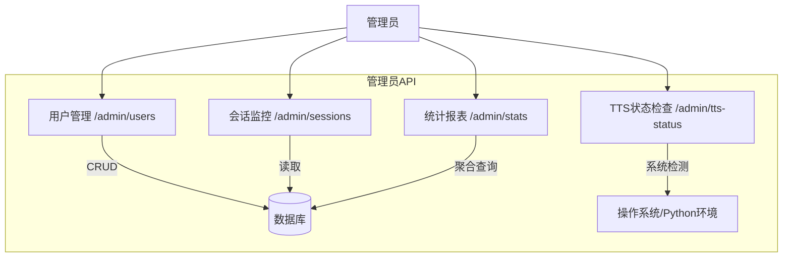
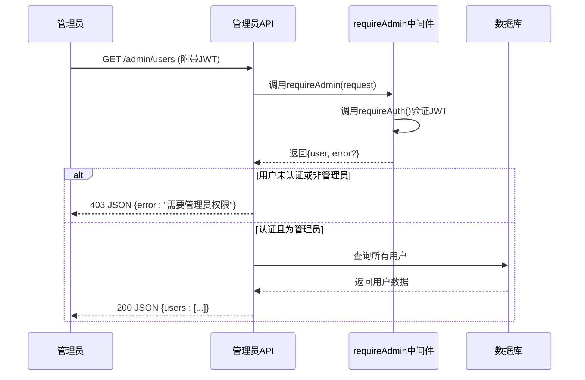

# 管理员API

<cite>
**本文档引用的文件**  
- [users/route.ts](file://app/api/admin/users/route.ts) - *已更新*
- [sessions/route.ts](file://app/api/admin/sessions/route.ts) - *已更新*
- [stats/route.ts](file://app/api/admin/stats/route.ts)
- [tts-status/route.ts](file://app/api/admin/tts-status/route.ts) - *已更新*
- [auth.ts](file://lib/auth.ts)
- [device-detection.ts](file://lib/device-detection.ts)
</cite>

## 更新摘要
**已更新内容**
- 根据最新代码提交，更新了`users`、`sessions`和`tts-status`接口的文档说明
- 修正了TTS状态检查接口的POST请求功能描述，明确其为配置验证而非更新
- 更新了权限验证机制的描述，确保与`requireAdmin`中间件的实现一致
- 优化了各接口的错误处理说明

## 目录
1. [简介](#简介)
2. [核心功能概览](#核心功能概览)
3. [用户管理接口](#用户管理接口)
4. [会话监控接口](#会话监控接口)
5. [统计报表接口](#统计报表接口)
6. [TTS状态检查接口](#tts状态检查接口)
7. [权限与安全机制](#权限与安全机制)
8. [实际业务场景分析](#实际业务场景分析)
9. [审计日志记录](#审计日志记录)

## 简介
本API文档专为系统管理员设计，提供对英语听力训练平台的高级管理能力。通过四个核心端点——`users`、`sessions`、`stats`和`tts-status`，管理员能够执行用户账户管理、实时会话监控、生成数据驱动的统计报表以及检查本地TTS（文本转语音）引擎的运行健康度。所有接口均要求管理员角色的JWT令牌进行访问控制。

## 核心功能概览
管理员API提供了四大核心功能模块：
- **用户管理**：对所有用户账户进行增删改查操作。
- **会话监控**：实时查看最近的练习会话活动。
- **统计报表**：获取聚合的系统级统计数据以支持决策。
- **TTS状态检查**：诊断并验证本地Python TTS服务的硬件加速配置。



**图示来源**
- [users/route.ts](file://app/api/admin/users/route.ts)
- [sessions/route.ts](file://app/api/admin/sessions/route.ts)
- [stats/route.ts](file://app/api/admin/stats/route.ts)
- [tts-status/route.ts](file://app/api/admin/tts-status/route.ts)

## 用户管理接口
该接口位于`/api/admin/users`，支持对用户资源的完整CRUD操作，但当前实现主要提供安全的只读访问。

### 功能说明
- **GET请求**：检索系统中所有用户的列表。
- 响应包含每个用户的基本信息（ID、邮箱、姓名、管理员标志、创建/更新时间）及其关联的练习会话总数。
- 结果按创建时间倒序排列。

### 分页响应格式
此接口目前返回所有用户，未实现分页。未来可扩展以支持分页参数（如`page`和`limit`），其响应结构将如下：

```json
{
  "users": [
    {
      "id": "string",
      "email": "string",
      "name": "string | null",
      "isAdmin": "boolean",
      "createdAt": "datetime",
      "updatedAt": "datetime",
      "_count": {
        "practiceSessions": "number"
      }
    }
  ],
  "pagination": {
    "currentPage": "number",
    "totalPages": "number",
    "totalUsers": "number",
    "hasNextPage": "boolean",
    "hasPrevPage": "boolean"
  }
}
```

**章节来源**
- [users/route.ts](file://app/api/admin/users/route.ts#L1-L50)

## 会话监控接口
该接口位于`/api/admin/sessions`，允许管理员实时监控用户的练习活动。

### 功能说明
- **GET请求**：获取最近的练习会话记录。
- 查询结果限制为最新的50条会话，确保响应高效且聚焦于近期活动。
- 返回的每条会话记录都包含了丰富的上下文信息，包括难度、语言、主题、准确率、得分、持续时间和创建时间，并嵌套了关联用户的邮箱和姓名。

### 响应数据结构
```json
{
  "sessions": [
    {
      "id": "string",
      "difficulty": "string",
      "language": "string",
      "topic": "string",
      "accuracy": "number | null",
      "score": "number",
      "duration": "number",
      "createdAt": "datetime",
      "user": {
        "email": "string",
        "name": "string | null"
      }
    }
  ]
}
```

**章节来源**
- [sessions/route.ts](file://app/api/admin/sessions/route.ts#L1-L54)

## 统计报表接口
该接口位于`/api/admin/stats`，用于生成关键业务指标，为运营决策提供数据支持。

### 功能说明
- **GET请求**：聚合计算多个核心统计指标。
- 使用`Promise.all`并发执行多个数据库查询，以优化性能。

### 聚合指标
- **总用户数 (totalUsers)**：调用`prisma.user.count()`获取。
- **总练习次数 (totalSessions)**：调用`prisma.practiceSession.count()`获取。
- **活跃用户数 (activeUsers)**：统计在过去7天内有至少一次练习会话的用户数量。
- **平均准确率 (averageAccuracy)**：使用`prisma.practiceSession.aggregate()`计算所有非空准确率字段的平均值。

### 响应数据结构
```json
{
  "stats": {
    "totalUsers": "number",
    "totalSessions": "number",
    "activeUsers": "number",
    "averageAccuracy": "number"
  }
}
```

**章节来源**
- [stats/route.ts](file://app/api/admin/stats/route.ts#L1-L76)

## TTS状态检查接口
该接口位于`/api/admin/tts-status`，是诊断本地TTS服务健康状况的核心工具。

### 功能说明
- **GET请求**：全面检测系统的硬件设备、当前配置和TTS服务状态。
- 并发调用`detectSystemDevices`、`validateDeviceConfig`和`generateDeviceReport`来收集信息。

### 检测内容
1.  **系统信息**：平台、架构、总内存、CPU核心数。
2.  **设备详情**：检测CUDA（NVIDIA GPU）、Metal（Apple Silicon）和CPU设备的可用性、显存/内存、名称和推荐状态。
3.  **配置验证**：根据`KOKORO_DEVICE`环境变量或`auto`模式，验证当前配置的有效性，并给出回退建议。
4.  **性能建议**：基于系统信息生成优化建议（例如，“检测到高性能CUDA GPU，推荐使用CUDA加速”）。
5.  **服务与环境**：报告TTS服务是否启用、工作模式、超时设置及关键环境变量。

### POST请求（配置验证）
- 允许管理员提交一个设备类型（`auto`, `cuda`, `metal`, `cpu`）进行预验证。
- 接口会返回该配置是否有效，并给出相应的实施建议。

### 响应数据结构
```json
{
  "success": "boolean",
  "ttsStatus": {
    "currentConfig": { ... },
    "system": { ... },
    "devices": [ ... ],
    "recommendations": ["string"],
    "report": "string",
    "service": { ... },
    "environment": { ... }
  }
}
```

**章节来源**
- [tts-status/route.ts](file://app/api/admin/tts-status/route.ts#L1-L196)

## 权限与安全机制
所有管理员API端点都强制执行严格的身份验证和授权策略。

### JWT权限要求
- **requireAdmin中间件**：每个API路由在处理业务逻辑前，都会调用`requireAdmin`函数。
- **双重验证**：
    1.  首先，`requireAuth`验证JWT令牌的有效性。
    2.  其次，检查解码后的JWT负载（`JWTPayload`）中的`isAdmin`字段是否为`true`。
- 如果任一检查失败，API将返回HTTP 403状态码和“需要管理员权限”的错误信息。

### 安全实践
- **最小权限原则**：普通用户无法访问这些端点。
- **输入验证**：在`tts-status`的POST请求中，对接收的`device`参数进行白名单校验。
- **错误处理**：所有异常都被捕获，避免向客户端暴露敏感的堆栈跟踪信息。



**章节来源**
- [auth.ts](file://lib/auth.ts#L384-L396)
- [users/route.ts](file://app/api/admin/users/route.ts#L1-L50)

## 实际业务场景分析
本节通过一个典型场景，展示管理员如何利用API链完成复杂任务。

### 场景：批量禁用异常账户
假设系统检测到一批用户账户存在异常登录行为，管理员需通过API将其禁用。

#### 请求链路分析
1.  **发现目标用户**：
    - 管理员首先调用`GET /api/admin/users`获取所有用户列表。
    - 在返回的数据中，筛选出符合“异常”特征的用户ID（例如，短时间内大量练习的账户）。
2.  **执行禁用操作**：
    - *注意*：当前`/admin/users`接口仅支持`GET`，不支持`PUT/PATCH`。此步骤描述的是理想化的完整流程。
    - 管理员应能发起`PATCH /api/admin/users/{id}`请求，将`isActive`字段设为`false`。
    - 或者，有一个`POST /api/admin/users/bulk-update`端点来处理批量操作。
3.  **验证结果**：
    - 再次调用`GET /api/admin/users`，确认目标用户的`isActive`状态已更新。

#### 所需的增强功能
要实现此场景，后端需要扩展`users`路由以支持`PUT`或`PATCH`方法，用于更新用户状态。

**章节来源**
- [users/route.ts](file://app/api/admin/users/route.ts#L1-L50)

## 审计日志记录
虽然当前代码未直接实现审计日志，但其架构为日志记录奠定了基础。

### 日志记录机制
- **内置日志**：每个API端点都在`catch`块中使用`console.error('Get users error:', error)`记录错误。这些日志可用于事后排查问题。
- **操作追踪**：`requireAdmin`的成功调用意味着一次管理员身份验证，这本身就是一种隐式的访问日志。

### 建议的审计日志方案
为了满足合规性和安全性要求，建议添加专门的审计日志功能：
- **记录关键操作**：每当执行修改性操作（如禁用用户、更改配置）时，将操作详情（操作者ID、操作类型、目标资源、时间戳）写入专用的审计日志表或外部日志服务（如ELK Stack）。
- **集成中间件**：创建一个`auditLog`中间件，在`requireAdmin`之后、业务逻辑之前被调用，自动记录所有管理员请求。

**章节来源**
- [users/route.ts](file://app/api/admin/users/route.ts#L1-L50)
- [auth.ts](file://lib/auth.ts#L384-L396)