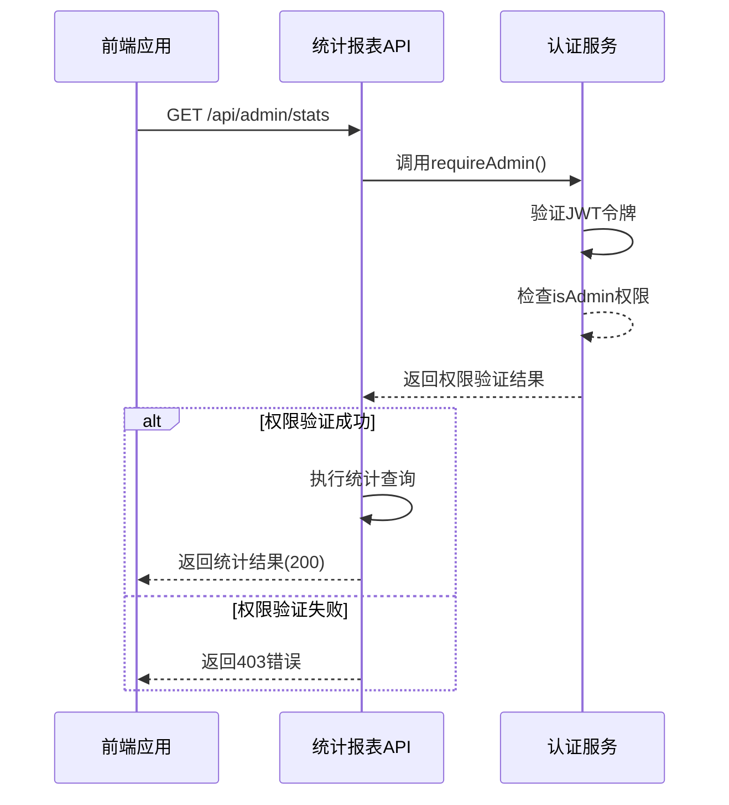
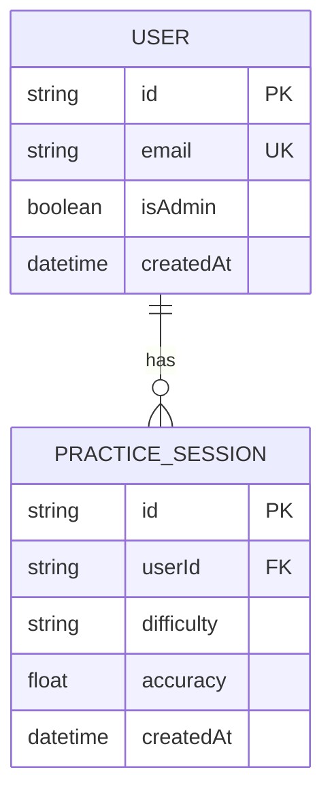

# 统计报表API

<cite>
**本文档中引用的文件**
- [route.ts](file://app/api/admin/stats/route.ts)
- [auth.ts](file://lib/auth.ts)
- [database.ts](file://lib/database.ts)
- [migration.sql](file://prisma/migrations/20250927060513_add_wrong_answers_filtering_indexes/migration.sql)
- [page.tsx](file://app/admin/page.tsx)
</cite>

## 目录
1. [简介](#简介)
2. [核心指标计算逻辑](#核心指标计算逻辑)
3. [API端点与权限控制](#api端点与权限控制)
4. [数据库查询优化](#数据库查询优化)
5. [返回数据结构设计](#返回数据结构设计)
6. [业务场景示例](#业务场景示例)
7. [性能优化措施](#性能优化措施)
8. [错误处理机制](#错误处理机制)

## 简介
统计报表API为管理员提供关键业务指标的聚合视图，支持对用户行为和学习效果进行数据分析。该API通过高效查询Prisma数据库，生成日活跃用户数（DAU）、平均练习得分、题目完成率等核心KPI，为前端可视化组件提供直接可用的数据源。

## 核心指标计算逻辑

统计报表API当前实现以下核心指标的计算：

- **总用户数**: 通过`prisma.user.count()`获取系统注册用户总数
- **总练习次数**: 使用`prisma.practiceSession.count()`统计所有练习会话记录
- **活跃用户数**: 计算最近7天内有练习记录的用户数量，使用嵌套查询条件`practiceSessions.some.createdAt.gte`
- **平均准确率**: 利用Prisma的聚合功能`aggregate`计算所有非空准确率字段的平均值

这些指标通过`Promise.all`并行执行，确保了统计查询的高效性。

**Section sources**
- [route.ts](file://app/api/admin/stats/route.ts#L0-L75)

## API端点与权限控制

### 端点信息
- **路径**: `/api/admin/stats`
- **方法**: GET
- **认证要求**: 管理员权限

### 权限验证流程
API使用`requireAdmin`中间件进行双重权限验证：
1. 首先通过`requireAuth`验证JWT令牌的有效性
2. 然后检查用户`isAdmin`标志位是否为true

权限验证失败时返回403状态码及相应错误消息。



**Diagram sources**
- [route.ts](file://app/api/admin/stats/route.ts#L0-L75)
- [auth.ts](file://lib/auth.ts#L384-L396)

**Section sources**
- [route.ts](file://app/api/admin/stats/route.ts#L0-L75)
- [auth.ts](file://lib/auth.ts#L384-L396)

## 数据库查询优化

### 查询策略
API采用并行查询策略，同时执行四个独立的数据库操作：
1. 用户总数统计
2. 练习会话总数统计  
3. 活跃用户数查询
4. 平均准确率聚合计算

这种并行化设计显著减少了总体响应时间。

### 数据库索引
系统已配置多个数据库索引以优化查询性能：

```sql
-- 用户活跃度查询优化
CREATE INDEX "practice_sessions_user_id_created_at_idx" ON "practice_sessions"("user_id", "created_at" DESC);

-- 练习会话按难度和创建时间查询
CREATE INDEX "practice_sessions_difficulty_created_at_idx" ON "practice_sessions"("difficulty", "created_at");

-- 准确率查询优化
CREATE INDEX "practice_sessions_accuracy_idx" ON "practice_sessions"("accuracy");
```

这些索引确保了在大数据量下的快速查询响应。



**Diagram sources**
- [migration.sql](file://prisma/migrations/20250927060513_add_wrong_answers_filtering_indexes/migration.sql#L0-L17)
- [route.ts](file://app/api/admin/stats/route.ts#L0-L75)

**Section sources**
- [route.ts](file://app/api/admin/stats/route.ts#L0-L75)
- [migration.sql](file://prisma/migrations/20250927060513_add_wrong_answers_filtering_indexes/migration.sql#L0-L17)

## 返回数据结构设计

### JSON响应格式
```json
{
  "stats": {
    "totalUsers": 1500,
    "totalSessions": 8423,
    "activeUsers": 327,
    "averageAccuracy": 0.785
  }
}
```

### 设计原则
1. **扁平化结构**: 所有指标位于同一层级，便于前端直接访问
2. **数值标准化**: 准确率以0-1之间的浮点数表示，方便图表组件处理
3. **命名一致性**: 使用小写下划线命名法，符合API设计规范
4. **可扩展性**: 外层包装`stats`对象，为未来添加其他数据类型预留空间

前端管理界面直接消费此数据结构，在仪表板中展示各项指标。

**Section sources**
- [route.ts](file://app/api/admin/stats/route.ts#L0-L75)
- [page.tsx](file://app/admin/page.tsx#L153-L211)

## 业务场景示例

### 节假日学习活跃度分析
管理员可通过定期调用此API，收集节假日期间的用户活跃数据，分析学习行为变化趋势。

#### 请求示例
```http
GET /api/admin/stats HTTP/1.1
Authorization: Bearer <admin-jwt-token>
Cookie: auth-token=<admin-session-cookie>
```

#### 响应示例
```json
{
  "stats": {
    "totalUsers": 1523,
    "totalSessions": 8761,
    "activeUsers": 412,
    "averageAccuracy": 0.812
  }
}
```

通过对比节假日前后`activeUsers`和`averageAccuracy`的变化，教育机构可以评估假期对学习效果的影响，并调整教学策略。

**Section sources**
- [route.ts](file://app/api/admin/stats/route.ts#L0-L75)

## 性能优化措施

### 连接池管理
系统使用全局单例模式管理Prisma客户端连接，避免重复创建连接带来的开销。

```typescript
export function getPrismaClient(): PrismaClient {
  if (!globalForPrisma.__eltPrisma) {
    globalForPrisma.__eltPrisma = initPrisma()
  }
  return globalForPrisma.__eltPrisma
}
```

### 查询优化
- **并行执行**: 四个统计查询通过`Promise.all`并行执行
- **索引利用**: 关键查询字段均已建立数据库索引
- **聚合函数**: 使用数据库原生聚合功能而非应用层计算

### 缓存策略
虽然当前API未实现响应缓存，但系统架构支持通过以下方式添加缓存层：
- Redis缓存高频访问的统计结果
- 设置合理的TTL（如5-10分钟）平衡数据新鲜度和性能
- 基于ETag的条件请求优化

**Section sources**
- [database.ts](file://lib/database.ts#L70-L75)
- [route.ts](file://app/api/admin/stats/route.ts#L0-L75)

## 错误处理机制

### 异常捕获
API使用try-catch块包裹整个处理流程，确保任何异常都不会导致服务器崩溃。

### 错误分类
- **权限错误**: 403状态码，提示"需要管理员权限"
- **服务器错误**: 500状态码，统一错误消息"服务器内部错误，请稍后重试"
- **数据库连接错误**: 在底层`withDatabase`工具函数中处理

### 日志记录
所有错误都会通过`console.error`记录到服务器日志，包含完整的错误堆栈，便于问题排查。

**Section sources**
- [route.ts](file://app/api/admin/stats/route.ts#L0-L75)
- [database.ts](file://lib/database.ts#L0-L329)