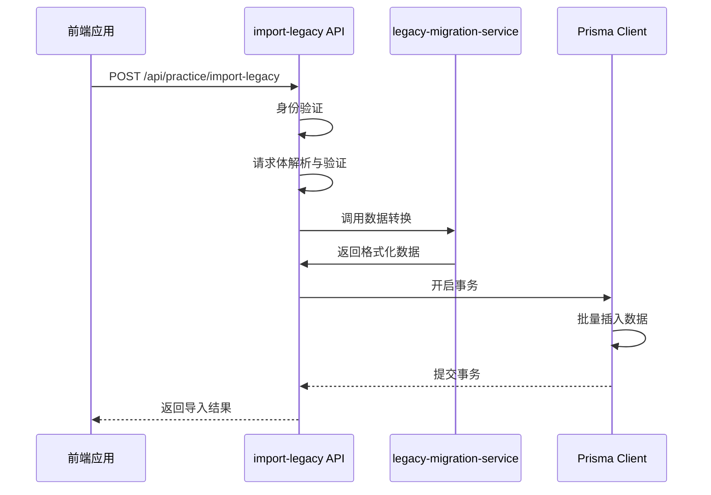
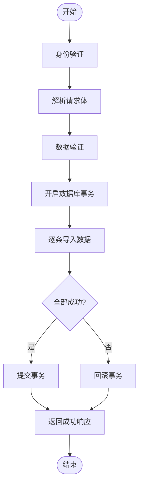
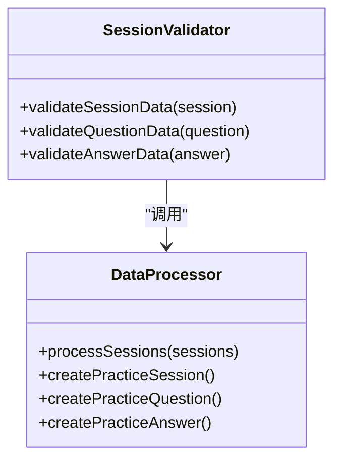
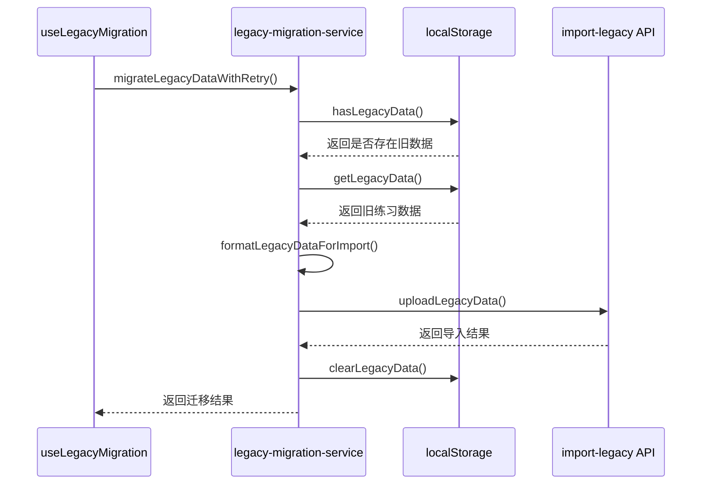
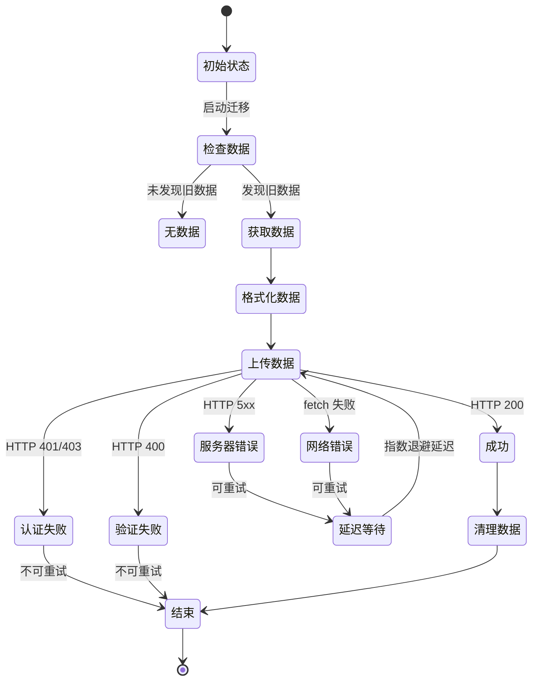
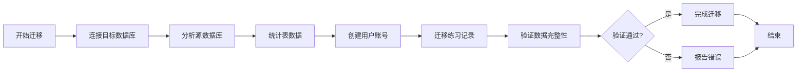

# 旧版数据迁移API

<cite>
**本文档引用文件**
- [import-legacy/route.ts](file://app/api/practice/import-legacy/route.ts)
- [legacy-migration-service.ts](file://lib/legacy-migration-service.ts)
- [database-migration.ts](file://scripts/database-migration.ts)
</cite>

## 目录
1. [简介](#简介)
2. [项目结构](#项目结构)
3. [核心组件](#核心组件)
4. [架构概述](#架构概述)
5. [详细组件分析](#详细组件分析)
6. [依赖分析](#依赖分析)
7. [性能考虑](#性能考虑)
8. [故障排除指南](#故障排除指南)
9. [结论](#结论)

## 简介
本技术文档深入解析了`/api/practice/import-legacy`端点的工作流程，该接口用于将旧系统的练习数据迁移到新系统。文档详细阐述了数据导入过程、格式转换机制、兼容性保障措施以及整体迁移策略。

## 项目结构
该功能涉及三个主要文件：API路由处理程序、数据迁移服务和数据库迁移脚本。这些文件协同工作以实现完整的数据迁移流程。

```mermaid
graph TD
A[前端] --> B[/api/practice/import-legacy]
B --> C[legacy-migration-service.ts]
C --> D[database-migration.ts]
B --> E[Prisma Client]
```

**图示来源**
- [import-legacy/route.ts](file://app/api/practice/import-legacy/route.ts)
- [legacy-migration-service.ts](file://lib/legacy-migration-service.ts)
- [database-migration.ts](file://scripts/database-migration.ts)

**章节来源**
- [import-legacy/route.ts](file://app/api/practice/import-legacy/route.ts)
- [legacy-migration-service.ts](file://lib/legacy-migration-service.ts)
- [database-migration.ts](file://scripts/database-migration.ts)

## 核心组件
核心组件包括API端点`/api/practice/import-legacy`，它负责接收批量练习数据并进行处理；`legacy-migration-service.ts`提供数据格式转换和上传功能；以及`database-migration.ts`脚本用于数据库级别的迁移操作。

**章节来源**
- [import-legacy/route.ts](file://app/api/practice/import-legacy/route.ts#L1-L486)
- [legacy-migration-service.ts](file://lib/legacy-migration-service.ts#L1-L442)

## 架构概述
系统采用分层架构设计，从前端触发到后端处理再到数据库持久化。整个流程确保了数据的一致性和完整性。



**图示来源**
- [import-legacy/route.ts](file://app/api/practice/import-legacy/route.ts#L1-L486)
- [legacy-migration-service.ts](file://lib/legacy-migration-service.ts#L1-L442)

## 详细组件分析

### API端点分析
`/api/practice/import-legacy`端点实现了完整的请求处理流程，包括身份验证、数据验证、事务处理和错误恢复。

#### 请求处理流程


**图示来源**
- [import-legacy/route.ts](file://app/api/practice/import-legacy/route.ts#L1-L486)

#### 数据验证机制
API实现了多层级的数据验证，确保输入数据的完整性和正确性。



**图示来源**
- [import-legacy/route.ts](file://app/api/practice/import-legacy/route.ts#L67-L141)
- [import-legacy/route.ts](file://app/api/practice/import-legacy/route.ts#L239-L266)

**章节来源**
- [import-legacy/route.ts](file://app/api/practice/import-legacy/route.ts#L1-L486)

### 迁移服务分析
`legacy-migration-service.ts`提供了客户端数据迁移的核心功能。

#### 迁移服务工作流


**图示来源**
- [legacy-migration-service.ts](file://lib/legacy-migration-service.ts#L1-L442)
- [use-legacy-migration.ts](file://hooks/use-legacy-migration.ts#L1-L142)

#### 错误处理与重试机制
服务实现了完善的错误分类和重试策略。



**图示来源**
- [legacy-migration-service.ts](file://lib/legacy-migration-service.ts#L187-L237)
- [legacy-migration-service.ts](file://lib/legacy-migration-service.ts#L266-L317)

**章节来源**
- [legacy-migration-service.ts](file://lib/legacy-migration-service.ts#L1-L442)

### 数据库迁移分析
`database-migration.ts`脚本定义了数据库级别的迁移策略。

#### 数据库迁移流程


**图示来源**
- [database-migration.ts](file://scripts/database-migration.ts#L1-L41)
- [migrate-to-postgres.ts](file://scripts/migrate-to-postgres.ts#L64-L100)

**章节来源**
- [database-migration.ts](file://scripts/database-migration.ts#L1-L41)

## 依赖分析
各组件之间存在明确的依赖关系，形成了一个完整的迁移链条。

```mermaid
graph LR
A[前端界面] --> B[useLegacyMigration Hook]
B --> C[legacy-migration-service]
C --> D[localStorage]
C --> E[/api/practice/import-legacy]
E --> F[Prisma Client]
F --> G[PostgreSQL Database]
H[database-migration.ts] --> F
I[migrate-to-postgres.ts] --> H
```

**图示来源**
- [import-legacy/route.ts](file://app/api/practice/import-legacy/route.ts)
- [legacy-migration-service.ts](file://lib/legacy-migration-service.ts)
- [database-migration.ts](file://scripts/database-migration.ts)

**章节来源**
- [import-legacy/route.ts](file://app/api/practice/import-legacy/route.ts#L1-L486)
- [legacy-migration-service.ts](file://lib/legacy-migration-service.ts#L1-L442)
- [database-migration.ts](file://scripts/database-migration.ts#L1-L41)

## 性能考虑
系统在设计时考虑了多种性能优化措施：

1. **批量处理**：支持批量导入练习数据，减少网络往返次数
2. **事务管理**：使用数据库事务确保数据一致性，避免部分导入导致的数据不一致
3. **超时设置**：为大型导入操作设置了30秒的超时限制
4. **指数退避**：在重试机制中采用指数退避算法，避免对服务器造成过大压力
5. **数据验证**：在服务端进行多层次数据验证，防止无效数据进入数据库

## 故障排除指南
当迁移过程中出现问题时，可根据以下指引进行排查：

**章节来源**
- [import-legacy/route.ts](file://app/api/practice/import-legacy/route.ts#L455-L485)
- [legacy-migration-service.ts](file://lib/legacy-migration-service.ts#L266-L317)

### 常见错误及解决方案
| 错误代码 | 错误类型 | 解决方案 |
|---------|--------|--------|
| UNAUTHORIZED | 未授权 | 确保用户已登录并具有相应权限 |
| INVALID_REQUEST | 无效请求 | 检查JSON格式是否正确 |
| VALIDATION_ERROR | 验证错误 | 检查请求体结构和字段类型 |
| DATABASE_ERROR | 数据库错误 | 检查数据库连接和超时设置 |
| DUPLICATE_DATA | 重复数据 | 检查是否已导入过相同数据 |

### 部分失败处理
系统采用"全部成功或全部失败"的策略，如果任何一条记录导入失败，整个事务将被回滚，确保数据一致性。

## 结论
`/api/practice/import-legacy`端点及其相关组件构成了一个健壮的数据迁移系统。通过严格的验证、事务管理和错误处理机制，确保了旧版练习数据能够安全、准确地迁移到新系统中。该系统支持一次性导入模式，并具备完善的错误恢复能力，为用户提供可靠的迁移体验。