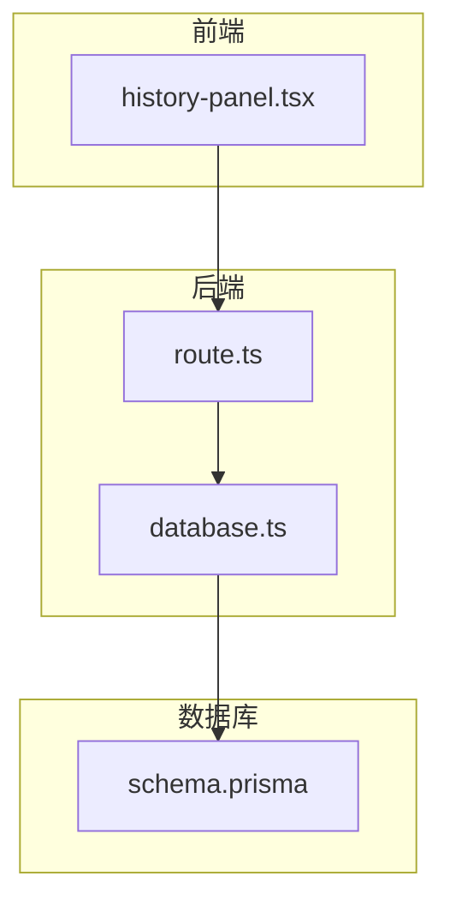
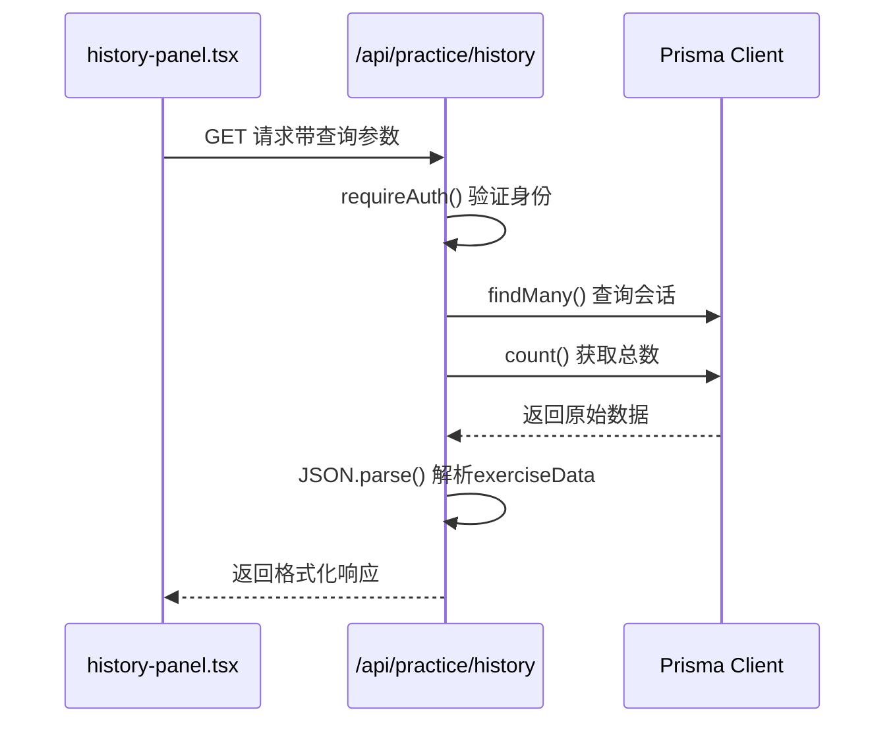
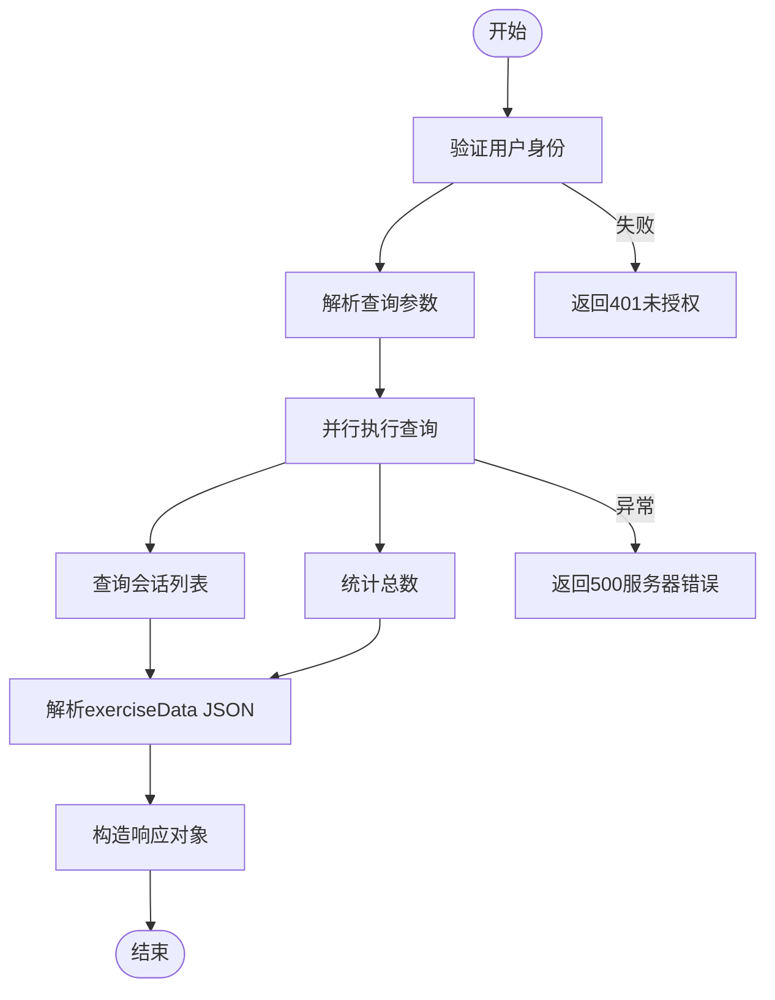
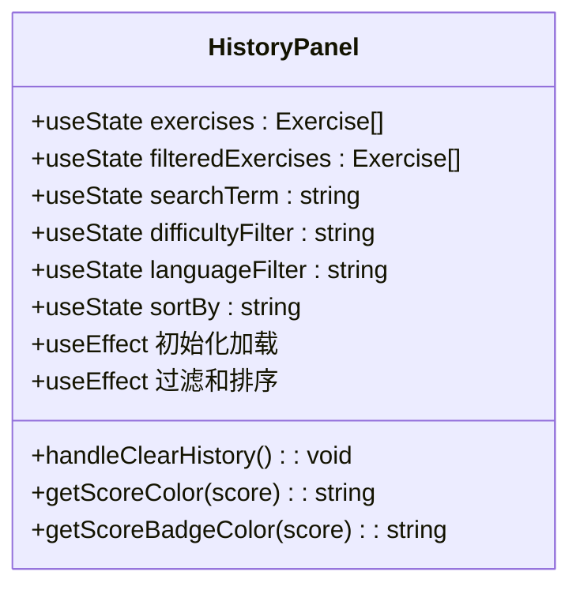
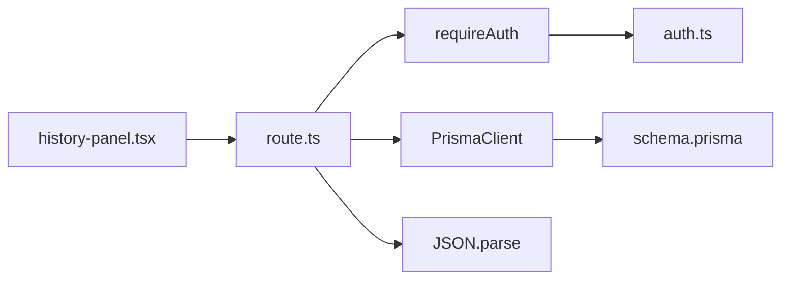

# 练习历史查询API

<cite>
**本文档引用的文件**   
- [route.ts](file://app/api/practice/history/route.ts)
- [history-panel.tsx](file://components/history-panel.tsx)
- [schema.prisma](file://prisma/schema.prisma)
- [type-utils.ts](file://lib/type-utils.ts)
- [database.ts](file://lib/database.ts)
</cite>

## 目录
1. [简介](#简介)
2. [项目结构](#项目结构)
3. [核心组件](#核心组件)
4. [架构概述](#架构概述)
5. [详细组件分析](#详细组件分析)
6. [依赖分析](#依赖分析)
7. [性能考虑](#性能考虑)
8. [故障排除指南](#故障排除指南)
9. [结论](#结论)

## 简介
本技术文档详细说明了英语听力训练应用中 `/api/practice/history` GET 接口的设计与实现。该接口用于查询用户的练习历史记录，支持分页、时间范围和准确率过滤等查询参数，并返回格式化的会话列表数据。

## 项目结构
该项目采用 Next.js 应用路由器架构，主要目录包括：
- `app/`：包含所有路由处理程序和页面组件
- `components/`：可复用的UI组件
- `lib/`：业务逻辑库和工具函数
- `prisma/`：数据库模式定义和迁移文件

练习历史相关功能分布在多个模块中，API 路由位于 `app/api/practice/history/route.ts`，前端展示组件为 `components/history-panel.tsx`，数据库模型定义在 `prisma/schema.prisma` 中。

**Diagram sources**
- [history-panel.tsx](file://components/history-panel.tsx)
- [route.ts](file://app/api/practice/history/route.ts)
- [database.ts](file://lib/database.ts)
- [schema.prisma](file://prisma/schema.prisma)

**Section sources**
- [app/api/practice/history/route.ts](file://app/api/practice/history/route.ts)
- [components/history-panel.tsx](file://components/history-panel.tsx)
- [prisma/schema.prisma](file://prisma/schema.prisma)

## 核心组件
练习历史查询功能的核心组件包括 API 路由处理器、Prisma 数据库客户端、前端历史面板组件以及相关的类型定义。系统通过标准化的响应格式返回数据，包含会话列表和分页信息。

**Section sources**
- [route.ts](file://app/api/practice/history/route.ts)
- [type-utils.ts](file://lib/type-utils.ts)

## 架构概述
系统采用典型的三层架构：表现层（前端组件）、应用层（API 路由）和数据访问层（Prisma ORM）。用户请求经过身份验证后，API 层构建动态查询语句从数据库获取数据，经过格式化处理后返回给前端。

**Diagram sources**
- [route.ts](file://app/api/practice/history/route.ts)
- [history-panel.tsx](file://components/history-panel.tsx)

## 详细组件分析

### API 路由分析
`/api/practice/history/route.ts` 文件实现了练习历史查询的主要逻辑，包括身份验证、参数解析、数据库查询和响应格式化。

#### 功能流程

**Diagram sources**
- [route.ts](file://app/api/practice/history/route.ts)

#### 查询参数支持
| 参数 | 类型 | 默认值 | 描述 |
|------|------|--------|------|
| page | 整数 | 1 | 当前页码 |
| limit | 整数 | 10 | 每页条目数 |
| userId | 字符串 | 当前用户 | 用户ID（自动填充） |

**Section sources**
- [route.ts](file://app/api/practice/history/route.ts)

### 前端组件分析
`history-panel.tsx` 是一个客户端组件，负责展示练习历史记录并提供交互式过滤功能。

#### 组件状态管理

**Diagram sources**
- [history-panel.tsx](file://components/history-panel.tsx)

#### 数据流分析
前端组件通过本地存储获取历史数据，支持多种过滤条件（搜索词、难度等级、语言类型）和排序方式（最新、最旧、得分高低）。虽然当前使用本地存储，但设计上与API查询保持一致的数据结构。

**Section sources**
- [history-panel.tsx](file://components/history-panel.tsx)

## 依赖分析
系统各组件之间存在明确的依赖关系，形成了清晰的调用链路。

**Diagram sources**
- [history-panel.tsx](file://components/history-panel.tsx)
- [route.ts](file://app/api/practice/history/route.ts)
- [schema.prisma](file://prisma/schema.prisma)

## 性能考虑
系统在多个层面进行了性能优化，确保快速响应和良好用户体验。

### 数据库优化
根据 `prisma/schema.prisma` 文件，系统为 `PracticeSession` 模型创建了多个复合索引：
- `@@index([userId, createdAt(sort: Desc)])`：用户练习历史查询
- `@@index([difficulty, createdAt])`：按难度统计分析
- `@@index([language, createdAt])`：按语言统计分析
- `@@index([accuracy])`：按准确率统计

这些索引显著提升了常见查询模式的执行效率。

### 分页策略
采用标准的偏移量分页策略（offset-based pagination），通过 `skip` 和 `take` 参数实现。对于大规模数据集，建议未来考虑游标分页（cursor-based pagination）以避免深度分页性能问题。

### 缓存建议
当前系统未实现响应缓存，建议添加以下缓存策略：
1. 在 Redis 或内存中缓存最近的练习历史查询结果
2. 设置合理的 TTL（如 5 分钟）
3. 当用户新增练习记录时使相关缓存失效

**Section sources**
- [schema.prisma](file://prisma/schema.prisma)
- [route.ts](file://app/api/practice/history/route.ts)

## 故障排除指南
### 错误响应码说明
| 状态码 | 原因 | 解决方案 |
|-------|------|---------|
| 401 | 未登录或身份验证失败 | 检查认证令牌有效性 |
| 400 | 参数无效 | 验证查询参数格式和范围 |
| 500 | 服务器内部错误 | 检查服务日志，联系技术支持 |

### 常见问题
1. **空响应**：确认用户ID正确且存在相关练习记录
2. **性能缓慢**：检查数据库索引是否已正确应用
3. **JSON解析错误**：验证 `exerciseData` 字段的JSON格式完整性

**Section sources**
- [route.ts](file://app/api/practice/history/route.ts)
- [type-utils.ts](file://lib/type-utils.ts)

## 结论
练习历史查询API实现了高效、安全的用户练习记录检索功能。通过合理的数据库索引设计和分页策略，系统能够快速响应查询请求。前端组件提供了丰富的过滤和排序选项，增强了用户体验。未来可进一步优化缓存机制和查询性能，特别是在处理大量历史数据时。