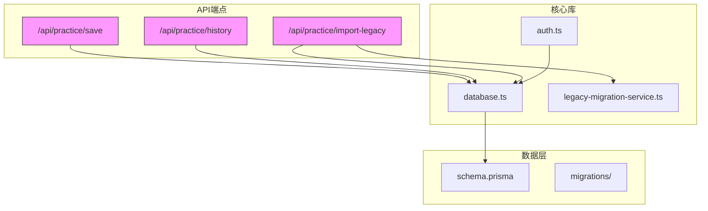
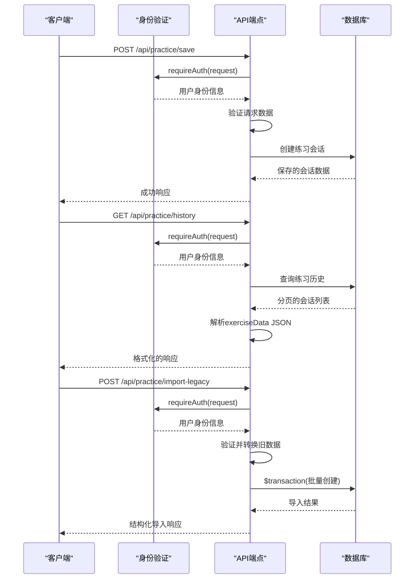
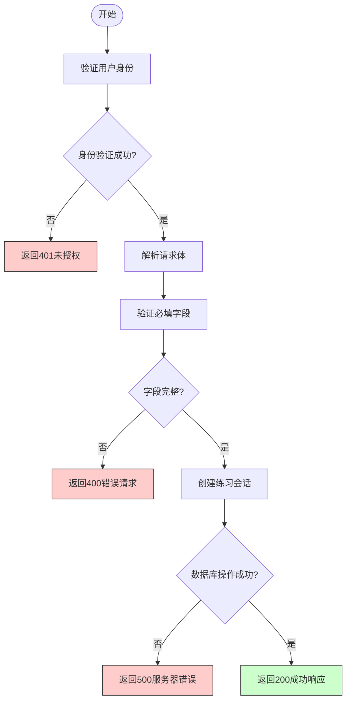
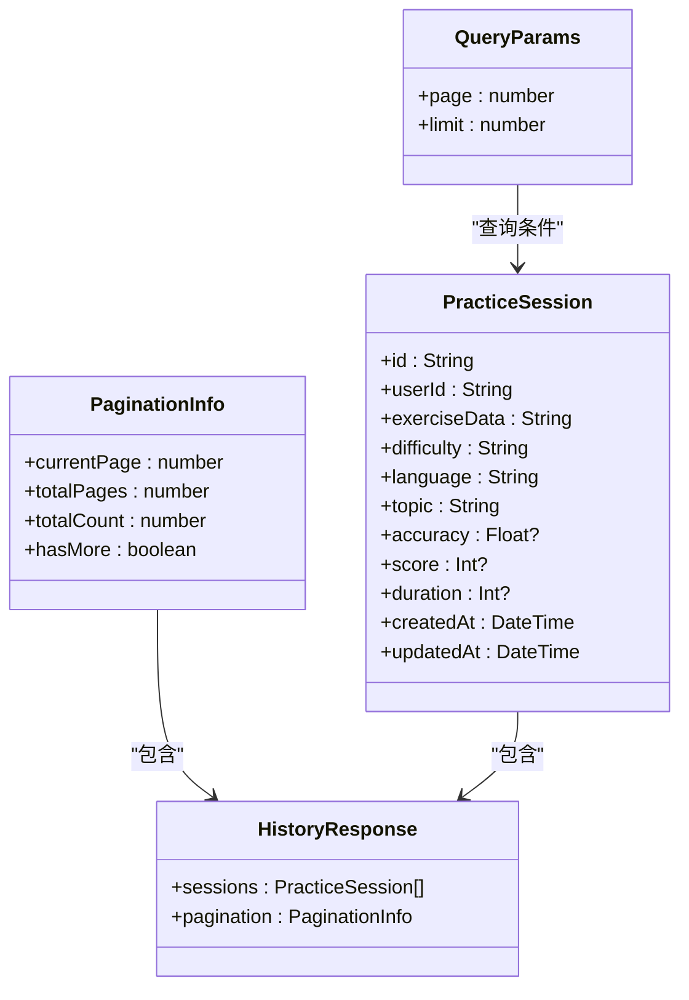
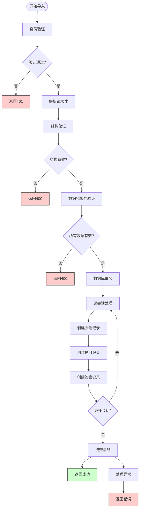
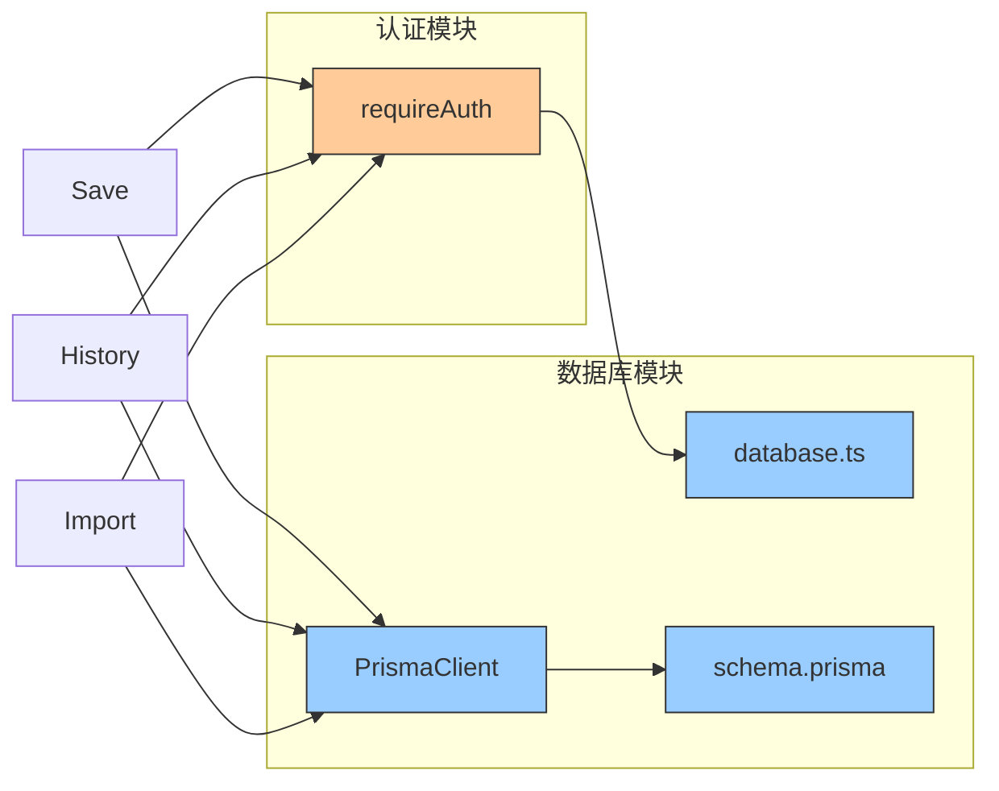

# 练习管理API

<cite>
**本文档引用的文件**
- [save/route.ts](file://app/api/practice/save/route.ts)
- [history/route.ts](file://app/api/practice/history/route.ts)
- [import-legacy/route.ts](file://app/api/practice/import-legacy/route.ts)
- [database.ts](file://lib/database.ts)
- [schema.prisma](file://prisma/schema.prisma)
</cite>

## 目录
1. [简介](#简介)
2. [项目结构](#项目结构)
3. [核心组件](#核心组件)
4. [架构概述](#架构概述)
5. [详细组件分析](#详细组件分析)
6. [依赖分析](#依赖分析)
7. [性能考虑](#性能考虑)
8. [故障排除指南](#故障排除指南)
9. [结论](#结论)

## 简介
本API文档全面描述了英语听力训练应用中的练习管理功能，涵盖练习结果保存、历史记录查询和旧数据迁移三大核心功能。系统采用Next.js API路由与Prisma ORM构建，实现了安全的身份验证、可靠的数据持久化和高效的数据库操作。

## 项目结构



**图示来源**
- [save/route.ts](file://app/api/practice/save/route.ts)
- [history/route.ts](file://app/api/practice/history/route.ts)
- [import-legacy/route.ts](file://app/api/practice/import-legacy/route.ts)
- [database.ts](file://lib/database.ts)
- [schema.prisma](file://prisma/schema.prisma)

**节来源**
- [save/route.ts](file://app/api/practice/save/route.ts)
- [history/route.ts](file://app/api/practice/history/route.ts)
- [import-legacy/route.ts](file://app/api/practice/import-legacy/route.ts)

## 核心组件

练习管理API由三个主要端点组成：`save`用于保存用户练习数据，`history`提供分页的历史记录查询，`import-legacy`支持从旧版本系统迁移数据。所有端点均通过统一的身份验证机制保护，并使用Prisma ORM与底层数据库交互。

**节来源**
- [save/route.ts](file://app/api/practice/save/route.ts#L1-L58)
- [history/route.ts](file://app/api/practice/history/route.ts#L1-L72)
- [import-legacy/route.ts](file://app/api/practice/import-legacy/route.ts#L1-L487)

## 架构概述



**图示来源**
- [save/route.ts](file://app/api/practice/save/route.ts#L1-L58)
- [history/route.ts](file://app/api/practice/history/route.ts#L1-L72)
- [import-legacy/route.ts](file://app/api/practice/import-legacy/route.ts#L1-L487)
- [database.ts](file://lib/database.ts#L1-L330)

## 详细组件分析

### 保存端点分析

`save`端点接收用户完成的练习数据，验证完整性后持久化到数据库。该端点确保只有经过身份验证的用户才能提交数据，并对输入进行基本验证。



**图示来源**
- [save/route.ts](file://app/api/practice/save/route.ts#L1-L58)

**节来源**
- [save/route.ts](file://app/api/practice/save/route.ts#L1-L58)

### 历史记录端点分析

`history`接口支持分页查询和基础过滤，允许客户端获取用户的练习历史记录。系统自动处理JSON数据的序列化和反序列化。



**图示来源**
- [history/route.ts](file://app/api/practice/history/route.ts#L1-L72)
- [schema.prisma](file://prisma/schema.prisma#L40-L60)

**节来源**
- [history/route.ts](file://app/api/practice/history/route.ts#L1-L72)

### 迁移接口分析

`import-legacy`迁移接口实现了复杂的数据转换逻辑，确保与旧版系统的兼容性。该接口采用严格的验证流程和数据库事务来保证数据一致性。



**图示来源**
- [import-legacy/route.ts](file://app/api/practice/import-legacy/route.ts#L1-L487)

**节来源**
- [import-legacy/route.ts](file://app/api/practice/import-legacy/route.ts#L1-L487)

## 依赖分析



**图示来源**
- [save/route.ts](file://app/api/practice/save/route.ts)
- [history/route.ts](file://app/api/practice/history/route.ts)
- [import-legacy/route.ts](file://app/api/practice/import-legacy/route.ts)
- [database.ts](file://lib/database.ts)
- [schema.prisma](file://prisma/schema.prisma)

**节来源**
- [database.ts](file://lib/database.ts#L1-L330)
- [schema.prisma](file://prisma/schema.prisma#L1-L120)

## 性能考虑

### 请求/响应模型定义

#### 保存端点
**请求模型 (POST /api/practice/save)**
```json
{
  "exerciseData": {},
  "difficulty": "string",
  "language": "string",
  "topic": "string",
  "accuracy": "number",
  "score": "number",
  "duration": "number"
}
```

**响应模型**
```json
{
  "message": "string",
  "session": {
    "id": "string",
    "createdAt": "datetime"
  }
}
```

#### 历史记录端点
**请求参数 (GET /api/practice/history)**
- page: 当前页码
- limit: 每页数量

**响应模型**
```json
{
  "sessions": [
    {
      "id": "string",
      "difficulty": "string",
      "language": "string",
      "topic": "string",
      "accuracy": "number",
      "score": "number",
      "duration": "number",
      "createdAt": "datetime",
      "exerciseData": {}
    }
  ],
  "pagination": {
    "currentPage": "number",
    "totalPages": "number",
    "totalCount": "number",
    "hasMore": "boolean"
  }
}
```

#### 迁移接口
**请求模型 (POST /api/practice/import-legacy)**
```json
{
  "sessions": [
    {
      "sessionId": "string",
      "topic": "string",
      "difficulty": "string",
      "language": "string",
      "transcript": "string",
      "score": "number",
      "createdAt": "string",
      "questions": [
        {
          "index": "number",
          "type": "string",
          "question": "string",
          "options": ["string"],
          "correctAnswer": "string",
          "explanation": "string",
          "answers": [
            {
              "userAnswer": "string",
              "isCorrect": "boolean",
              "attemptedAt": "string"
            }
          ]
        }
      ]
    }
  ]
}
```

**响应模型**
```json
{
  "success": "boolean",
  "message": "string",
  "imported": {
    "sessions": "number",
    "questions": "number",
    "answers": "number"
  }
}
```

### 潜在性能瓶颈及优化建议

根据数据库模式和实现代码，识别出以下潜在性能瓶颈：

1. **JSON字段查询效率**: `exerciseData`字段存储为JSON字符串，在`history`端点中需要在应用层解析，无法在数据库层面进行高效查询。
   - *建议*: 对于频繁查询的字段，考虑将其提取为独立的数据库列。

2. **大容量数据导入**: `import-legacy`接口在单个事务中处理所有数据，对于大量数据可能导致超时。
   - *建议*: 实现分批导入机制，每批数据使用独立事务处理。

3. **缺少复合索引**: 虽然已有多个索引，但某些组合查询可能仍不够优化。
   - *建议*: 添加以下复合索引：
     ```prisma
     // 在PracticeSession模型中
     @@index([userId, difficulty, language, topic])
     ```

4. **N+1