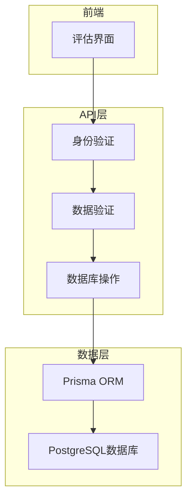
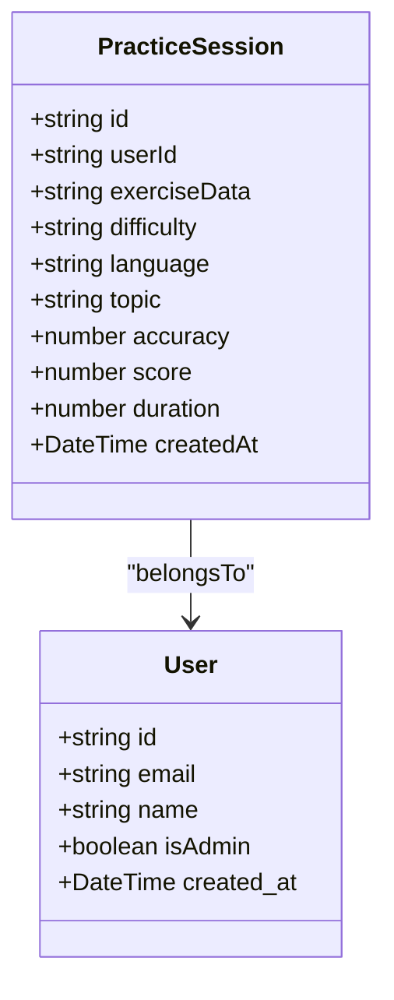
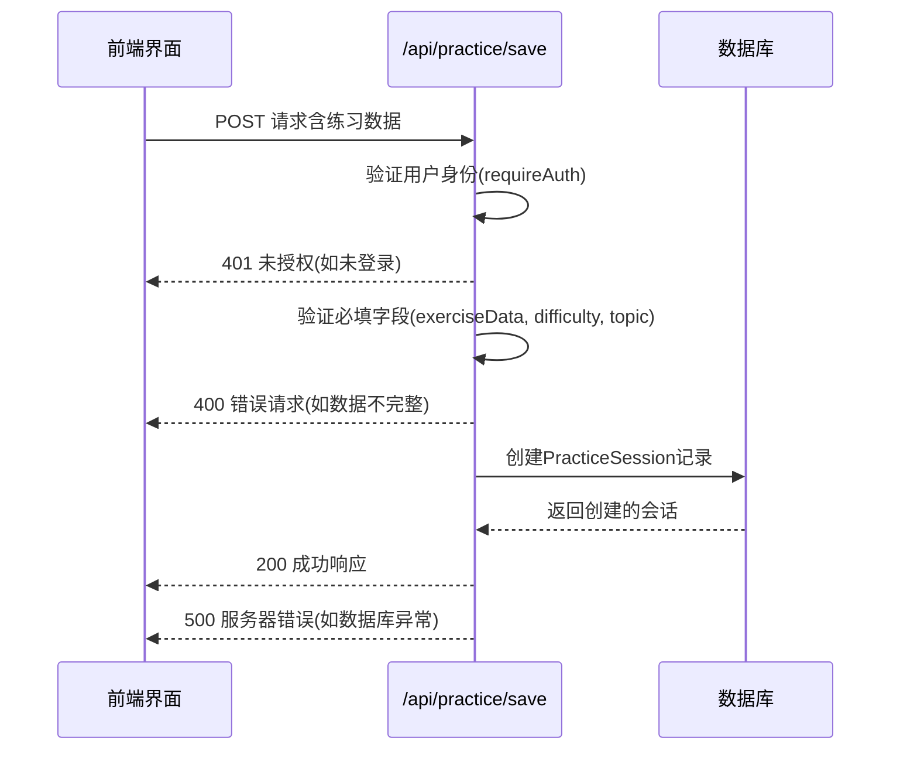
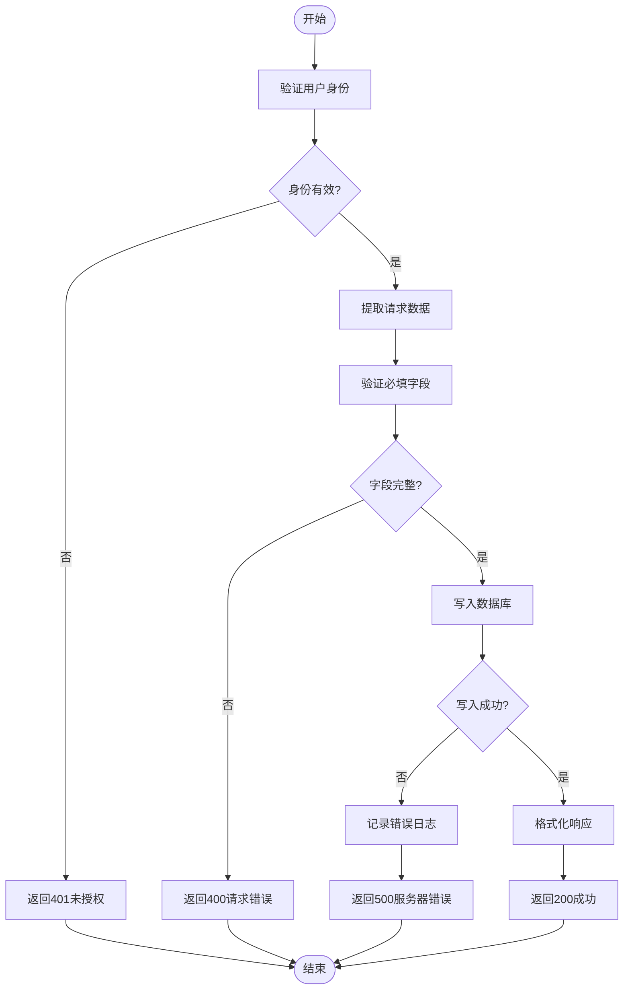

# 练习结果保存API

<cite>
**本文档引用的文件**
- [route.ts](file://app/api/practice/save/route.ts)
- [assessment-interface.tsx](file://components/assessment-interface.tsx)
- [migration.sql](file://prisma/migrations/20250927052831_add_wrong_answer_ai_models/migration.sql)
- [WRONG-ANSWERS-AI-SPEC.md](file://documents/WRONG-ANSWERS-AI-SPEC.md)
</cite>

## 目录
1. [简介](#简介)
2. [项目结构](#项目结构)
3. [核心组件](#核心组件)
4. [架构概述](#架构概述)
5. [详细组件分析](#详细组件分析)
6. [依赖关系分析](#依赖关系分析)
7. [性能考虑](#性能考虑)
8. [故障排除指南](#故障排除指南)
9. [结论](#结论)

## 简介
本API端点 `/api/practice/save` 用于保存用户的练习会话数据。它接收包含用户答题记录的POST请求，验证数据完整性，并将练习会话信息写入数据库。该接口与前端评估界面紧密集成，支持英语听力能力评估流程。

## 项目结构
练习结果保存功能位于 `app/api/practice/save/route.ts` 文件中，是Next.js API路由的一部分。该端点处理来自前端评估界面的数据提交请求。

```mermaid
graph TD
A[前端评估界面] --> B[/api/practice/save]
B --> C[身份验证]
C --> D[数据验证]
D --> E[数据库写入]
E --> F[响应返回]
```

**图示来源**
- [route.ts](file://app/api/practice/save/route.ts)
- [assessment-interface.tsx](file://components/assessment-interface.tsx)

**章节来源**
- [route.ts](file://app/api/practice/save/route.ts)
- [assessment-interface.tsx](file://components/assessment-interface.tsx)

## 核心组件
`/api/practice/save` 端点实现了完整的练习会话保存流程，包括身份验证、数据验证和数据库持久化。该功能与Prisma ORM集成，确保数据一致性。

**章节来源**
- [route.ts](file://app/api/practice/save/route.ts)

## 架构概述
该API采用分层架构设计，从前端到后端再到数据库形成清晰的数据流。系统通过中间件进行身份验证，业务逻辑层处理数据验证，数据访问层负责数据库操作。



**图示来源**
- [route.ts](file://app/api/practice/save/route.ts)
- [WRONG-ANSWERS-AI-SPEC.md](file://documents/WRONG-ANSWERS-AI-SPEC.md)

## 详细组件分析
### 练习会话保存分析
该组件处理用户完成听力评估后的数据提交。前端收集用户对各个音频片段的理解评分，然后通过此API端点批量提交。

#### 对象导向组件：


**图示来源**
- [route.ts](file://app/api/practice/save/route.ts)
- [WRONG-ANSWERS-AI-SPEC.md](file://documents/WRONG-ANSWERS-AI-SPEC.md)

#### API/服务组件：


**图示来源**
- [route.ts](file://app/api/practice/save/route.ts)
- [assessment-interface.tsx](file://components/assessment-interface.tsx)

#### 复杂逻辑组件：


**图示来源**
- [route.ts](file://app/api/practice/save/route.ts)

**章节来源**
- [route.ts](file://app/api/practice/save/route.ts)

## 依赖关系分析
该API端点依赖于多个核心模块：身份验证系统、Prisma ORM和数据库。这些依赖关系确保了数据的安全性和一致性。

```mermaid
graph LR
A[/api/practice/save] --> B[requireAuth]
A --> C[PrismaClient]
B --> D[认证系统]
C --> E[PostgreSQL数据库]
A --> F[NextRequest/NextResponse]
```

**图示来源**
- [route.ts](file://app/api/practice/save/route.ts)

**章节来源**
- [route.ts](file://app/api/practice/save/route.ts)

## 性能考虑
当前实现中，`exerciseData`字段以JSON字符串形式存储在数据库中。对于高频查询场景，建议对常用查询字段建立索引。根据迁移文件显示，系统已为关键字段创建了多个索引以优化查询性能。

潜在性能瓶颈包括：
- 大量练习数据的序列化和反序列化开销
- 缺少对accuracy等数值字段的索引（尽管已有practice_sessions_accuracy_idx）
- 并发写入时的数据库压力

建议措施：
1. 确保所有查询频繁使用的字段都有适当的数据库索引
2. 考虑对大型exerciseData进行压缩存储
3. 实现适当的缓存策略以减少数据库负载

**章节来源**
- [migration.sql](file://prisma/migrations/20250927052831_add_wrong_answer_ai_models/migration.sql)
- [route.ts](file://app/api/practice/save/route.ts)

## 故障排除指南
常见问题及解决方案：

1. **401未授权错误**：确保请求包含有效的身份验证凭据。前端应先完成登录流程。
2. **400请求错误**：检查请求体是否包含必需的exerciseData、difficulty和topic字段。
3. **500服务器错误**：查看服务器日志中的"Save practice session error"条目，通常是数据库连接问题或数据完整性约束冲突。
4. **数据丢失问题**：确认exerciseData被正确JSON.stringify()处理后再存储。

**章节来源**
- [route.ts](file://app/api/practice/save/route.ts)

## 结论
`/api/practice/save` 端点提供了一个可靠的机制来保存用户练习会话数据。通过严格的身份验证和数据验证流程，确保了数据的质量和安全性。与前端评估界面的无缝集成使得用户体验流畅，而合理的数据库设计支持了后续的数据分析和AI辅助学习功能。