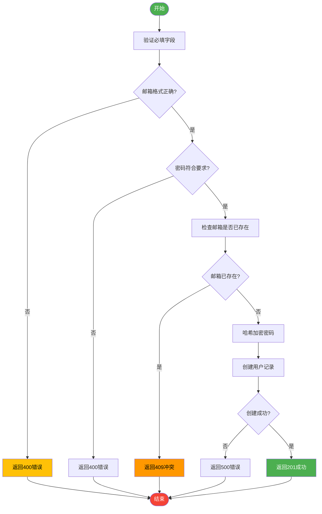

# 注册接口

<cite>
**本文档中引用的文件**
- [register/route.ts](file://app/api/auth/register/route.ts)
- [auth.ts](file://lib/auth.ts)
- [database.ts](file://lib/database.ts)
</cite>

## 目录
1. [简介](#简介)
2. [请求参数与验证逻辑](#请求参数与验证逻辑)
3. [用户创建流程](#用户创建流程)
4. [错误处理机制](#错误处理机制)
5. [安全设计](#安全设计)
6. [响应结构](#响应结构)
7. [前端集成建议](#前端集成建议)
8. [结论](#结论)

## 简介

注册接口 `POST /api/auth/register` 是系统用户身份认证体系的核心组成部分，负责新用户的注册流程。该接口实现了完整的输入验证、密码安全处理和数据库持久化机制，确保用户数据的安全性和完整性。

本接口位于 `/app/api/auth/register/route.ts`，通过调用 `lib/auth.ts` 中的工具函数完成核心业务逻辑，并依赖 Prisma ORM 与底层数据库交互。整个流程遵循 RESTful 设计原则，使用标准 HTTP 状态码提供清晰的反馈。

**Section sources**
- [register/route.ts](file://app/api/auth/register/route.ts#L1-L72)

## 请求参数与验证逻辑

注册接口接受 JSON 格式的 POST 请求体，包含以下参数：

| 参数名 | 类型 | 是否必填 | 说明 |
|-------|------|---------|------|
| email | string | 是 | 用户邮箱地址 |
| password | string | 是 | 用户密码 |
| name | string | 否 | 用户昵称 |

### 邮箱格式验证

系统使用正则表达式对邮箱进行格式校验：
```typescript
const emailRegex = /^[^\s@]+@[^\s@]+\.[^\s@]+$/
```
此正则确保邮箱包含基本的用户名、@符号和域名结构。所有邮箱在存储前会被转换为小写形式以保证唯一性。

### 密码强度要求

密码必须满足以下复杂度要求：
- 至少 8 位字符
- 包含至少一个大写字母（A-Z）
- 包含至少一个小写字母（a-z）
- 包含至少一个数字（0-9）

当密码不符合要求时，接口会返回详细的错误信息数组，帮助用户了解具体问题。

**Section sources**
- [auth.ts](file://lib/auth.ts#L166-L192)
- [auth.ts](file://lib/auth.ts#L357-L360)
- [register/route.ts](file://app/api/auth/register/route.ts#L15-L30)

## 用户创建流程

注册流程遵循严格的顺序执行模式，确保数据一致性和安全性。

### 流程概述



**Diagram sources**
- [register/route.ts](file://app/api/auth/register/route.ts#L1-L72)

### 密码哈希化处理

系统使用 `bcryptjs` 库对密码进行单向哈希加密，盐值轮数设置为 12，提供高强度的安全保护：

```typescript
export async function hashPassword(password: string): Promise<string> {
  const saltRounds = 12
  return await bcrypt.hash(password, saltRounds)
}
```

此过程在用户创建前异步执行，确保明文密码永远不会被存储。

### 数据库持久化

用户数据通过 Prisma Client 持久化到数据库，采用事务安全的操作包装器 `withDatabase` 处理连接和错误：

```typescript
await withDatabase(
  (client) => client.user.create({
    data: {
      email: email.toLowerCase(),
      password: hashedPassword,
      name: name || null,
      isAdmin
    }
  }),
  'create user'
)
```

操作失败时会自动重试最多 3 次，每次间隔 1 秒，提高系统容错能力。

**Section sources**
- [auth.ts](file://lib/auth.ts#L321-L352)
- [database.ts](file://lib/database.ts#L81-L111)
- [register/route.ts](file://app/api/auth/register/route.ts#L35-L45)

## 错误处理机制

接口实现了精细化的错误分类和状态码映射，便于客户端准确识别问题原因。

### HTTP 状态码语义

| 状态码 | 含义 | 触发条件 |
|-------|------|---------|
| 400 Bad Request | 请求参数无效 | 缺失必填字段、邮箱格式错误、密码强度不足 |
| 409 Conflict | 资源冲突 | 邮箱已被注册 |
| 500 Internal Server Error | 服务器内部错误 | 用户创建失败、数据库异常 |

### 冲突检测实现

当检测到重复邮箱时，系统返回 409 状态码而非 400，明确区分"请求无效"和"资源已存在"两种场景：

```typescript
if (existingUser) {
  return NextResponse.json(
    { error: '该邮箱已被注册' },
    { status: 409 }
  )
}
```

这种设计使前端能针对性地提示用户"该邮箱已被注册"，提升用户体验。

**Section sources**
- [register/route.ts](file://app/api/auth/register/route.ts#L31-L34)
- [register/route.ts](file://app/api/auth/register/route.ts#L40)

## 安全设计

注册接口在多个层面实施了安全措施，防止敏感信息泄露和滥用。

### 敏感信息过滤

成功响应中仅包含必要的用户信息，排除密码等敏感字段：

```json
{
  "message": "注册成功",
  "user": {
    "id": "user123",
    "email": "user@example.com",
    "name": "用户名",
    "isAdmin": false,
    "createdAt": "2025-01-01T00:00:00Z"
  }
}
```

即使后端模型包含更多字段，也不会暴露给客户端。

### 自动登录策略

当前实现中，注册成功后**不会自动登录**。用户需要跳转至登录页面手动登录。这一设计基于以下考虑：
- 符合常规安全实践，避免隐式会话创建
- 明确区分注册和认证两个独立操作
- 减少攻击面，防止会话固定攻击

如需实现自动登录，可参考 `/api/auth/login` 接口的 cookie 设置逻辑。

**Section sources**
- [register/route.ts](file://app/api/auth/register/route.ts#L47-L52)

## 响应结构

接口使用统一的 JSON 响应格式，便于前端解析和处理。

### 成功响应 (201 Created)

```json
{
  "message": "注册成功",
  "user": {
    "id": "string",
    "email": "string", 
    "name": "string|null",
    "isAdmin": "boolean",
    "createdAt": "datetime"
  }
}
```

### 错误响应 (400/409/500)

```json
{
  "error": "错误描述信息"
}
```

对于密码验证失败，还包含详细错误列表：

```json
{
  "error": "密码不符合要求",
  "details": [
    "密码至少需要8位字符",
    "密码必须包含至少一个大写字母"
  ]
}
```

**Section sources**
- [register/route.ts](file://app/api/auth/register/route.ts#L47-L52)

## 前端集成建议

为了提供最佳用户体验，建议前后端协同实施多层次验证。

### 表单验证协同策略

| 验证层级 | 实现方式 | 目的 |
|--------|--------|-----|
| 前端即时验证 | 输入时实时校验 | 提供即时反馈，减少无效请求 |
| 前端提交验证 | 提交前整体校验 | 防止明显错误发送到服务器 |
| 后端强制验证 | 接口层最终校验 | 确保数据完整性和安全性 |

### 具体实施建议

1. **邮箱验证**：前端使用相同正则表达式进行初步校验
2. **密码强度指示器**：根据后端规则显示进度条或检查清单
3. **错误映射**：将后端返回的错误信息映射到对应表单项
4. **加载状态**：注册过程中显示加载指示器，防止重复提交
5. **成功引导**：注册成功后跳转至登录页或显示欢迎信息

**Section sources**
- [register/route.ts](file://app/api/auth/register/route.ts#L1-L72)

## 结论

注册接口 `POST /api/auth/register` 实现了一个安全、可靠且用户友好的用户注册系统。通过严格的输入验证、bcrypt 密码哈希、Prisma 数据库操作和清晰的错误反馈，确保了用户数据的安全性和系统的稳定性。

关键特性包括：
- 多层次的请求参数验证
- 安全的密码处理机制
- 精确的 HTTP 状态码语义
- 敏感信息保护
- 可预测的响应结构

该接口设计符合现代 Web 应用的安全最佳实践，为系统的用户管理体系奠定了坚实基础。