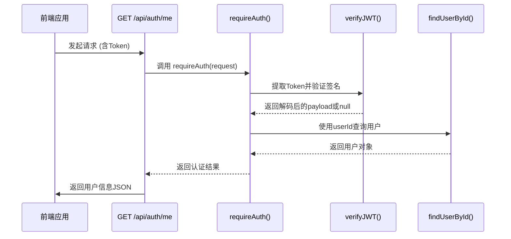
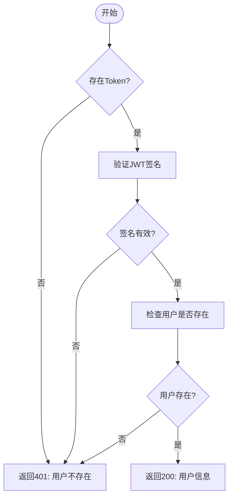
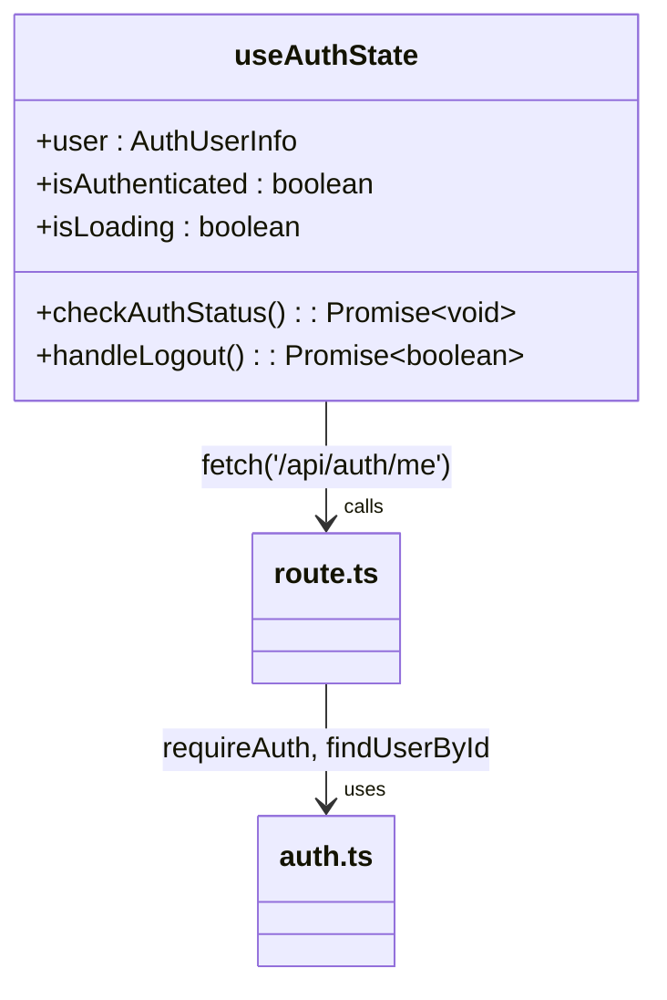

# 用户信息获取接口

<cite>
**本文档引用文件**
- [route.ts](file://app/api/auth/me/route.ts)
- [auth.ts](file://lib/auth.ts)
- [use-auth-state.ts](file://hooks/use-auth-state.ts)
</cite>

## 目录
1. [简介](#简介)
2. [核心功能与流程](#核心功能与流程)
3. [成功响应结构](#成功响应结构)
4. [错误处理机制](#错误处理机制)
5. [认证中间件分析](#认证中间件分析)
6. [前端集成建议](#前端集成建议)
7. [缓存优化策略](#缓存优化策略)

## 简介
`GET /api/auth/me` 接口是系统中的受保护端点，用于在用户会话期间恢复其身份和配置信息。该接口通过验证JWT令牌来确认用户身份，并从数据库加载完整的用户资料，包括基础信息和权限状态。

**Section sources**
- [route.ts](file://app/api/auth/me/route.ts#L1-L60)

## 核心功能与流程
该接口的执行流程如下：
1. 通过 `requireAuth` 中间件验证请求中的JWT令牌
2. 解析并提取用户身份（userId）
3. 查询数据库获取最新用户信息
4. 返回包含用户数据及元信息的JSON响应

此过程确保了只有经过身份验证的用户才能访问其个人信息，同时保证数据的新鲜度和安全性。

**Diagram sources**
- [route.ts](file://app/api/auth/me/route.ts#L1-L60)
- [auth.ts](file://lib/auth.ts#L365-L379)

**Section sources**
- [route.ts](file://app/api/auth/me/route.ts#L1-L60)
- [auth.ts](file://lib/auth.ts#L365-L379)

## 成功响应结构
当认证成功时，接口返回以下结构的数据：

| 字段 | 类型 | 描述 |
|------|------|------|
| user.id | string | 用户唯一标识符 |
| user.email | string | 用户注册邮箱 |
| user.name | string? | 用户昵称（可选） |
| user.isAdmin | boolean | 是否为管理员角色 |
| user.createdAt | string | 账户创建时间（ISO格式） |
| user.updatedAt | string | 最后更新时间（ISO格式） |
| metadata.cacheVersion | number | 缓存版本号，用于检测变更 |
| metadata.lastModified | string | 最后修改时间戳 |

响应头中还包含ETag和禁止缓存指令，以增强安全性和一致性。

**Section sources**
- [route.ts](file://app/api/auth/me/route.ts#L40-L58)

## 错误处理机制
接口在以下情况下返回401未授权错误：
- 请求未携带有效Token
- Token签名无效或已篡改
- Token已过期（非"记住我"会话）
- 用户账户已被删除或禁用

此外，系统还会处理数据库异常等内部错误，返回500状态码。

**Diagram sources**
- [auth.ts](file://lib/auth.ts#L365-L379)
- [auth.ts](file://lib/auth.ts#L212-L220)

**Section sources**
- [auth.ts](file://lib/auth.ts#L365-L379)

## 认证中间件分析
`requireAuth` 函数是核心认证逻辑的实现，它调用 `getUserFromRequest` 来解析请求中的Token，并通过 `verifyJWT` 进行验证。若验证失败，则直接返回错误；否则进一步确认用户在数据库中的存在性。

异常传播路径为：`verifyJWT` → `getUserFromRequest` → `requireAuth` → API处理器，形成完整的错误处理链条。

**Section sources**
- [auth.ts](file://lib/auth.ts#L365-L379)
- [auth.ts](file://lib/auth.ts#L212-L220)
- [auth.ts](file://lib/auth.ts#L283-L316)

## 前端集成建议
建议前端在每次页面加载或刷新时调用此接口恢复用户会话状态。典型使用场景包括：
- 应用初始化时检查登录状态
- 页面跳转后验证权限
- 定期刷新用户信息（如每小时一次）

示例代码可在 `useAuthState` Hook 中找到，该Hook封装了对 `/api/auth/me` 的调用逻辑，并处理超时和网络异常。

**Diagram sources**
- [use-auth-state.ts](file://hooks/use-auth-state.ts#L85-L257)
- [route.ts](file://app/api/auth/me/route.ts#L1-L60)

**Section sources**
- [use-auth-state.ts](file://hooks/use-auth-state.ts#L85-L257)

## 缓存优化策略
为减少重复请求，客户端可采用版本化缓存机制：
1. 存储 `cacheVersion` 和 `lastModified` 元数据
2. 下次请求前比较本地与服务器版本
3. 仅当版本不一致时更新UI

服务端通过设置 `Cache-Control: no-store` 防止代理缓存敏感信息，同时利用ETag实现高效的条件请求验证。

**Section sources**
- [route.ts](file://app/api/auth/me/route.ts#L50-L58)
- [use-auth-state.ts](file://hooks/use-auth-state.ts#L142-L165)