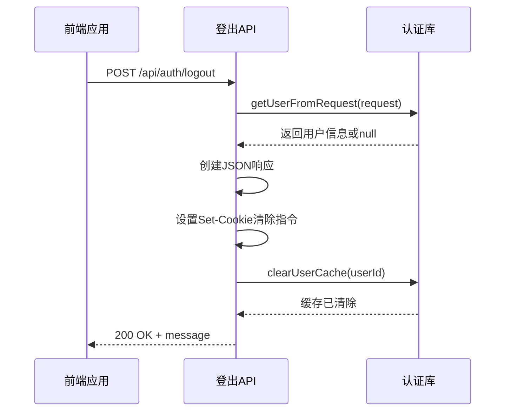
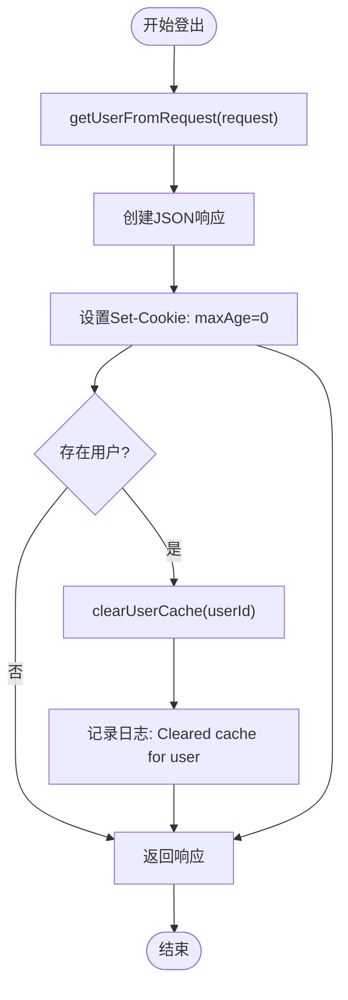

# 登出接口

<cite>
**本文档引用的文件**
- [route.ts](file://app/api/auth/logout/route.ts)
- [auth.ts](file://lib/auth.ts)
- [use-auth-state.ts](file://hooks/use-auth-state.ts)
</cite>

## 目录
1. [简介](#简介)
2. [接口设计与工作原理](#接口设计与工作原理)
3. [幂等性与响应处理](#幂等性与响应处理)
4. [Cookie 清除机制](#cookie-清除机制)
5. [用户缓存清理](#用户缓存清理)
6. [前端调用示例与集成逻辑](#前端调用示例与集成逻辑)
7. [注意事项与最佳实践](#注意事项与最佳实践)

## 简介
本接口用于安全终止用户的当前会话。通过向 `DELETE /api/auth/logout` 发送请求，服务器将清除客户端的认证 Cookie 并使相关缓存失效，从而实现登出功能。该接口设计为幂等操作，无论用户是否已登录，均返回 200 OK 状态码。

**Section sources**
- [route.ts](file://app/api/auth/logout/route.ts#L1-L38)

## 接口设计与工作原理
登出接口位于 `/app/api/auth/logout/route.ts`，采用 Next.js 的路由处理器（Route Handler）实现。该端点接受 POST 请求（尽管语义上 DELETE 更合适，但出于兼容性考虑使用 POST），不依赖任何请求体数据。

当请求到达时，系统首先尝试从请求中提取用户身份信息，以便进行后续的资源清理。随后构造 JSON 响应，并在响应头中设置特殊的 `Set-Cookie` 指令来清除客户端的认证 Cookie。



**Diagram sources**
- [route.ts](file://app/api/auth/logout/route.ts#L1-L38)

**Section sources**
- [route.ts](file://app/api/auth/logout/route.ts#L1-L38)

## 幂等性与响应处理
该接口具有幂等性，即多次调用不会产生额外副作用。无论用户是否已登录，接口都返回 HTTP 200 状态码和成功消息 `{ "message": "登出成功" }`。

这种设计确保了前端逻辑的一致性：无需根据登出结果判断用户状态，简化了错误处理流程。即使在用户未登录状态下调用此接口，也不会抛出异常或返回错误状态。

若发生服务端内部错误（如数据库连接失败），则返回 500 错误及相应提示信息。

**Section sources**
- [route.ts](file://app/api/auth/logout/route.ts#L1-L38)

## Cookie 清除机制
接口通过设置响应中的 `Set-Cookie` 头部来清除客户端的认证 Cookie：

```typescript
response.cookies.set('auth-token', '', {
  httpOnly: true,
  secure: process.env.NODE_ENV === 'production',
  sameSite: 'lax',
  maxAge: 0,
  path: '/'
})
```

关键参数说明：
- **名称与值**：将 `auth-token` 的值设为空字符串 `''`
- **maxAge: 0**：设置过期时间为过去，强制浏览器立即删除 Cookie
- **httpOnly: true**：防止 JavaScript 访问，抵御 XSS 攻击
- **secure**：仅在 HTTPS 环境下传输（生产环境启用）
- **sameSite: 'lax'**：缓解 CSRF 攻击风险
- **path: '/'**：确保匹配所有路径下的同名 Cookie

**Section sources**
- [route.ts](file://app/api/auth/logout/route.ts#L14-L20)

## 用户缓存清理
为了防止用户信息在服务端缓存中滞留，登出时会调用 `clearUserCache()` 函数清除相关缓存数据。

该函数定义于 `lib/auth.ts` 中，其行为包括：
- 增加全局缓存版本号，使所有现有缓存失效
- 删除特定用户的缓存条目
- 清理正在进行的用户获取请求队列

如果请求中包含有效用户信息（即用户确实处于登录状态），则执行基于用户 ID 的精准清理；否则仅执行 Cookie 清除操作。



**Diagram sources**
- [route.ts](file://app/api/auth/logout/route.ts#L1-L38)
- [auth.ts](file://lib/auth.ts#L131-L141)

**Section sources**
- [route.ts](file://app/api/auth/logout/route.ts#L23-L29)
- [auth.ts](file://lib/auth.ts#L131-L141)

## 前端调用示例与集成逻辑
在浏览器环境中，可通过以下方式调用登出接口：

```javascript
fetch('/api/auth/logout', {
  method: 'POST',
  credentials: 'include'
}).then(() => {
  // 登出成功后跳转至首页或登录页
  window.location.href = '/'
})
```

前端状态管理钩子 `use-auth-state.ts` 提供了封装好的 `handleLogout` 方法，自动处理本地状态清理与接口调用：

```typescript
const { handleLogout } = useAuthState()
// ...
<button onClick={handleLogout}>登出</button>
```

注意：`handleLogout` 会在调用 API 后同步清除 Redux 或 Context 中的用户状态，但这一行为属于前端职责，而非本接口的功能范围。

**Section sources**
- [use-auth-state.ts](file://hooks/use-auth-state.ts#L230-L250)

## 注意事项与最佳实践
- 本接口仅负责清除服务端可访问的 Cookie 和服务端缓存，**不负责清理前端本地存储**（如 localStorage、Redux store、Context 状态等）。这些清理工作需由前端代码自行完成。
- 推荐在登出后立即重定向页面，避免用户继续操作已失效的界面。
- 生产环境中应确保 `secure: true` 生效，即部署在 HTTPS 协议下。
- 不应在请求体中传递任何数据，该接口忽略所有请求体内容。
- 虽然接口路径为 `/logout` 且使用 POST 方法，但从 RESTful 设计角度看，未来可考虑迁移到 `DELETE /session` 以更准确表达语义。

**Section sources**
- [route.ts](file://app/api/auth/logout/route.ts#L1-L38)
- [use-auth-state.ts](file://hooks/use-auth-state.ts#L230-L250)