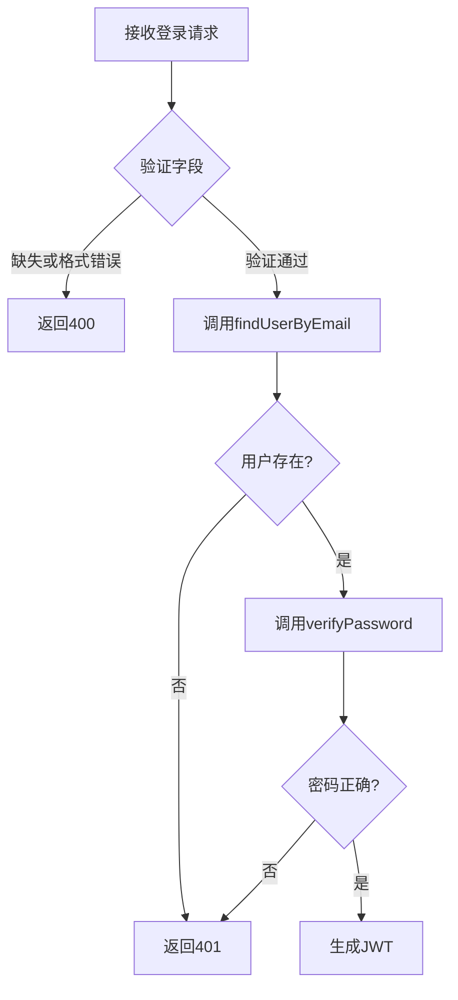
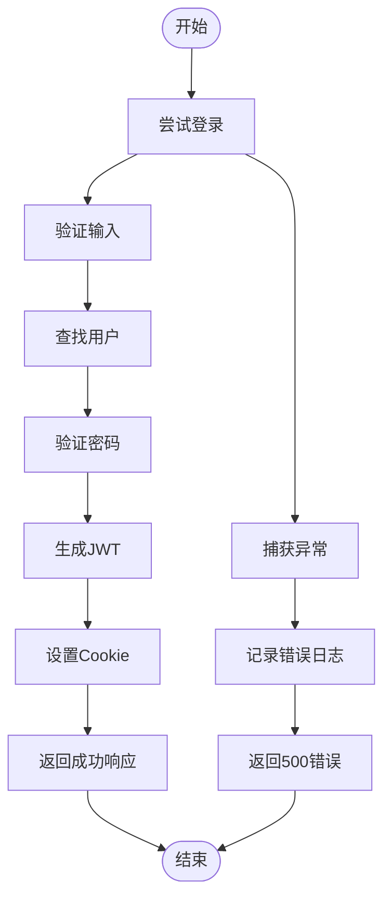

# 登录接口

<cite>
**本文档中引用的文件**  
- [route.ts](file://app/api/auth/login/route.ts)
- [auth.ts](file://lib/auth.ts)
- [README-AUTH.md](file://documents/README-AUTH.md)
</cite>

## 目录
1. [简介](#简介)
2. [请求体结构与验证规则](#请求体结构与验证规则)
3. [认证逻辑实现机制](#认证逻辑实现机制)
4. [JWT令牌生成与安全返回](#jwt令牌生成与安全返回)
5. [错误处理流程](#错误处理流程)
6. [调用示例](#调用示例)
7. [与Next.js中间件的身份验证集成](#与nextjs中间件的身份验证集成)

## 简介
本接口用于用户登录，通过邮箱和密码进行身份验证，并在成功后返回JWT令牌。该令牌以httpOnly Cookie的形式安全存储，防止XSS攻击，并支持“记住我”功能以延长会话有效期。

**Section sources**
- [README-AUTH.md](file://documents/README-AUTH.md#L1-L10)

## 请求体结构与验证规则
POST `/api/auth/login` 接收以下JSON格式的请求体：

```json
{
  "email": "user@example.com",
  "password": "SecurePass123",
  "rememberMe": true
}
```

### 字段说明
- **email**: 用户注册时使用的邮箱地址，必须符合标准邮箱格式（如 `^[^\s@]+@[^\s@]+\.[^\s@]+$`）。
- **password**: 用户密码，需满足复杂度要求：至少8位字符，包含大写字母、小写字母和数字。
- **rememberMe**（可选）: 布尔值，默认为 `false`。若为 `true`，则生成的JWT令牌将永不过期；否则有效期为24小时。

### 验证规则
- 若 `email` 或 `password` 缺失，返回状态码 `400`，错误信息为“邮箱和密码不能为空”。
- 若 `email` 格式不正确，返回状态码 `400`，错误信息为“邮箱格式不正确”。
- 若用户不存在或密码错误，统一返回状态码 `401`，错误信息为“邮箱或密码错误”，避免泄露账户存在性。

**Section sources**
- [route.ts](file://app/api/auth/login/route.ts#L4-L29)
- [auth.ts](file://lib/auth.ts#L358-L362)

## 认证逻辑实现机制
登录过程由 `route.ts` 调用 `lib/auth.ts` 中的多个工具函数协同完成，具体流程如下：

1. **解析请求体**：从请求中提取 `email`、`password` 和 `rememberMe` 参数。
2. **字段验证**：检查必填字段是否存在并验证邮箱格式。
3. **查找用户**：调用 `findUserByEmail(email)` 函数根据邮箱查询数据库中的用户记录。此函数会对邮箱进行标准化处理（转为小写并去除首尾空格），然后使用Prisma客户端执行唯一查询。
4. **密码比对**：使用 `verifyPassword(password, hashedPassword)` 函数对比明文密码与数据库中bcrypt哈希后的密码是否匹配。
5. **缓存机制**：成功查找到用户后，其基本信息会被缓存到内存中，TTL为1分钟，提升后续访问性能。



**Diagram sources**
- [route.ts](file://app/api/auth/login/route.ts#L1-L75)
- [auth.ts](file://lib/auth.ts#L254-L278)

**Section sources**
- [route.ts](file://app/api/auth/login/route.ts#L30-L47)
- [auth.ts](file://lib/auth.ts#L158-L160)

## JWT令牌生成与安全返回
当用户凭证验证通过后，系统将生成JWT令牌并通过安全的Cookie返回给客户端。

### JWT生成
调用 `generateJWT(payload, rememberMe)` 函数生成令牌：
- **payload** 包含 `userId`、`email` 和 `isAdmin` 字段。
- 若 `rememberMe` 为 `true`，则令牌无过期时间；否则设置 `expiresIn: '24h'`。

### 安全Cookie设置
使用 `getAuthCookieOptions(rememberMe)` 获取Cookie选项，并通过 `response.cookies.set()` 将令牌写入名为 `auth-token` 的Cookie中。Cookie具有以下安全属性：
- **httpOnly**: 防止JavaScript访问，抵御XSS攻击。
- **secure**: 当前设为 `false`，允许HTTP连接使用Cookie（开发环境）。生产环境应设为 `true` 并配合HTTPS使用。
- **sameSite**: 设置为 `'lax'`，防止CSRF攻击。
- **maxAge**: 根据 `rememberMe` 决定，分别为1年或1天。

```mermaid
sequenceDiagram
participant Client as 客户端
participant Route as route.ts
participant AuthLib as auth.ts
Client->>Route : POST /api/auth/login
Route->>AuthLib : findUserByEmail(email)
AuthLib-->>Route : UserWithPassword | null
Route->>AuthLib : verifyPassword(password, hashedPassword)
AuthLib-->>Route : boolean
Route->>AuthLib : generateJWT(payload, rememberMe)
AuthLib-->>Route : token (string)
Route->>Client : Set-Cookie : auth-token=token; HttpOnly; Secure=False; SameSite=Lax; Max-Age=...
Route-->>Client : JSON响应
```

**Diagram sources**
- [route.ts](file://app/api/auth/login/route.ts#L49-L75)
- [auth.ts](file://lib/auth.ts#L201-L207)
- [auth.ts](file://lib/auth.ts#L405-L415)

**Section sources**
- [route.ts](file://app/api/auth/login/route.ts#L49-L75)
- [auth.ts](file://lib/auth.ts#L201-L207)
- [auth.ts](file://lib/auth.ts#L405-L415)

## 错误处理流程
系统对各种异常情况进行了全面的错误处理，确保API响应的一致性和安全性。

### 错误类型与响应
| 错误场景 | HTTP状态码 | 响应体 |
|--------|----------|-------|
| 缺少邮箱或密码 | 400 | `{ "error": "邮箱和密码不能为空" }` |
| 邮箱格式错误 | 400 | `{ "error": "邮箱格式不正确" }` |
| 用户不存在或密码错误 | 401 | `{ "error": "邮箱或密码错误" }` |
| 服务器内部错误 | 500 | `{ "error": "服务器内部错误，请稍后重试" }` |

### 异常捕获
整个登录流程被包裹在 `try-catch` 块中。任何未预期的异常（如数据库连接失败）都会被捕获，记录到日志，并返回通用的500错误，避免暴露敏感信息。



**Diagram sources**
- [route.ts](file://app/api/auth/login/route.ts#L3-L75)

**Section sources**
- [route.ts](file://app/api/auth/login/route.ts#L3-L75)

## 调用示例
### 使用curl调用
#### 成功登录（记住我）
```bash
curl -X POST https://your-domain.com/api/auth/login \
  -H "Content-Type: application/json" \
  -d '{
    "email": "user@example.com",
    "password": "SecurePass123",
    "rememberMe": true
  }'
```
**成功响应 (200):**
```json
{
  "message": "登录成功",
  "user": {
    "id": "cmveghbn10000qe36pv1rbvoc",
    "email": "user@example.com",
    "name": "User Name",
    "isAdmin": false,
    "createdAt": "2025-09-27T05:28:31.000Z"
  },
  "token": "eyJhbGciOiJIUzI1NiIsInR5cCI6IkpXVCJ9..."
}
```
Cookie头:
```
Set-Cookie: auth-token=eyJhbGciOiJIUzI1NiIsInR5cCI6IkpXVCJ9...; HttpOnly; Path=/; Max-Age=31536000; SameSite=Lax
```

#### 失败登录（密码错误）
```bash
curl -X POST https://your-domain.com/api/auth/login \
  -H "Content-Type: application/json" \
  -d '{
    "email": "user@example.com",
    "password": "WrongPass123"
  }'
```
**失败响应 (401):**
```json
{
  "error": "邮箱或密码错误"
}
```

### 使用Postman调用
1. 设置请求方法为 `POST`，URL为 `/api/auth/login`。
2. 在 **Body** -> **raw** -> **JSON** 中输入请求数据。
3. 发送请求。
4. 在 **Cookies** 标签页中查看返回的 `auth-token`。

**Section sources**
- [README-AUTH.md](file://documents/README-AUTH.md#L129-L153)

## 与Next.js中间件的身份验证集成
该登录接口与应用的认证体系深度集成，主要体现在以下几个方面：

1. **Cookie读取**：其他API路由（如 `/api/auth/me`）可通过 `getUserFromRequest(request)` 函数从Cookie中提取JWT令牌并验证其有效性。
2. **权限控制**：`requireAuth` 和 `requireAdmin` 中间件可用于保护需要认证或管理员权限的路由。它们会自动检查请求中的Cookie或Authorization头。
3. **前端状态管理**：前端组件（如 `use-auth-state.ts`）会在页面加载时调用 `/api/auth/me` 来恢复用户登录状态，该调用依赖于浏览器自动发送的 `auth-token` Cookie。
4. **登出操作**：`/api/auth/logout` 接口会清除 `auth-token` Cookie，使JWT失效。

这种设计实现了无状态的会话管理，同时利用了Cookie的安全优势，是现代Web应用推荐的认证模式。

**Section sources**
- [auth.ts](file://lib/auth.ts#L222-L248)
- [auth.ts](file://lib/auth.ts#L364-L379)
- [use-auth-state.ts](file://hooks/use-auth-state.ts#L96-L144)