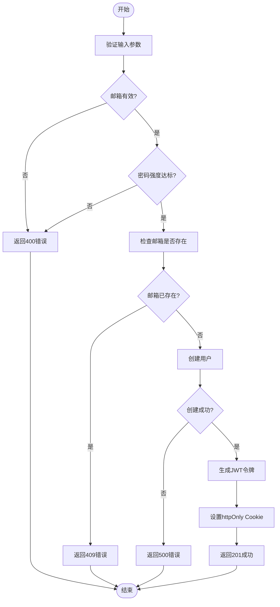

# 认证API

<cite>
**本文档引用的文件**
- [login/route.ts](file://app/api/auth/login/route.ts)
- [register/route.ts](file://app/api/auth/register/route.ts) - *在提交 bdaac45d8d7de25065e4ecd35704f3fd014d0248 中更新*
- [logout/route.ts](file://app/api/auth/logout/route.ts)
- [me/route.ts](file://app/api/auth/me/route.ts)
- [auth.ts](file://lib/auth.ts)
</cite>

## 更新摘要
**变更内容**
- 更新了注册流程分析，以反映注册后自动登录的新功能
- 在架构概述和详细组件分析中添加了对自动登录流程的说明
- 更新了注册端点的序列图，包含JWT令牌生成和Cookie设置步骤
- 修正了`getAuthCookieOptions`函数的`secure`选项说明，反映其当前设置为`false`
- 移除了对不存在的`README-AUTH.md`文件的引用

**文档来源更新**
- 添加了对`register/route.ts`文件的更新标注
- 移除了对`README-AUTH.md`的引用，因为该文件不存在
- 确保所有文件引用都指向实际存在的文件

## 目录
1. [简介](#简介)
2. [项目结构](#项目结构)
3. [核心组件](#核心组件)
4. [架构概述](#架构概述)
5. [详细组件分析](#详细组件分析)
6. [依赖分析](#依赖分析)
7. [性能考虑](#性能考虑)
8. [故障排除指南](#故障排除指南)
9. [结论](#结论)

## 简介
本认证系统为英语听力训练应用提供安全可靠的用户身份验证功能，涵盖登录、注册、登出和用户信息获取等核心接口。系统采用JWT令牌结合httpOnly Cookie实现会话管理，确保认证信息安全传输。通过bcryptjs进行密码哈希处理，强制实施密码复杂度策略，并利用缓存机制优化用户数据访问性能。所有API端点均具备完善的输入验证、错误处理和安全防护机制。**新增功能**：注册后自动登录，用户完成注册后将自动获得认证状态，无需再次手动登录。

## 项目结构
认证相关API位于`app/api/auth/`目录下，每个功能模块独立成子目录并包含各自的路由文件。核心认证逻辑封装在`lib/auth.ts`工具库中，供各API端点调用。前端使用自定义Hook `use-auth-state.ts`管理认证状态，与后端API协同工作。

**图示来源**
- [login/route.ts](file://app/api/auth/login/route.ts)
- [register/route.ts](file://app/api/auth/register/route.ts)
- [logout/route.ts](file://app/api/auth/logout/route.ts)
- [me/route.ts](file://app/api/auth/me/route.ts)
- [auth.ts](file://lib/auth.ts)
- [use-auth-state.ts](file://hooks/use-auth-state.ts)

**章节来源**
- [app/api/auth](file://app/api/auth)

## 核心组件
认证系统由四个主要API端点构成：登录（POST /api/auth/login）、注册（POST /api/auth/register）、登出（POST /api/auth/logout）和用户信息获取（GET /api/auth/me）。这些端点共享`lib/auth.ts`中的认证工具函数，包括密码哈希、JWT生成与验证、用户查找等。系统通过httpOnly Cookie安全传输JWT令牌，并在后续请求中自动携带，实现无状态会话管理。**关键变更**：注册端点现在在用户成功创建后自动生成JWT令牌并设置认证Cookie，实现注册后自动登录的用户体验。

## 架构概述
系统采用分层架构设计，前端通过fetch API调用后端认证端点。后端API接收请求后，经由`lib/auth.ts`中的工具函数处理业务逻辑，与数据库交互完成用户认证操作。成功认证后，服务器将JWT令牌写入httpOnly Cookie返回给客户端，客户端在后续请求中自动包含该Cookie以维持会话状态。**新增流程**：注册成功后，系统会立即执行与登录相同的认证流程，为新用户生成令牌并设置Cookie。

**图示来源**
- [login/route.ts](file://app/api/auth/login/route.ts)
- [auth.ts](file://lib/auth.ts)

## 详细组件分析

### 登录流程分析
登录端点验证邮箱格式和必填字段后，查找用户记录并验证密码。成功认证后生成JWT令牌并通过httpOnly Cookie返回，同时在响应体中包含用户基本信息。

**图示来源**
- [login/route.ts](file://app/api/auth/login/route.ts)
- [auth.ts](file://lib/auth.ts)

**章节来源**
- [login/route.ts](file://app/api/auth/login/route.ts)

### 注册流程分析
注册端点执行严格的输入验证，包括邮箱格式检查和密码复杂度验证。系统还会检查邮箱是否已被注册，防止重复账户创建。**关键更新**：注册成功后，系统会调用`generateJWT`函数为新用户生成JWT令牌，并通过`getAuthCookieOptions`设置httpOnly Cookie，实现自动登录功能。

**图示来源**
- [register/route.ts](file://app/api/auth/register/route.ts) - *在提交 bdaac45d8d7de25065e4ecd35704f3fd014d0248 中更新*
- [auth.ts](file://lib/auth.ts)

**章节来源**
- [register/route.ts](file://app/api/auth/register/route.ts) - *在提交 bdaac45d8d7de25065e4ecd35704f3fd014d0248 中更新*

### 登出流程分析
登出端点清除认证Cookie，并调用`clearUserCache`函数清理用户缓存，确保会话完全终止。

**图示来源**
- [logout/route.ts](file://app/api/auth/logout/route.ts)
- [auth.ts](file://lib/auth.ts)

**章节来源**
- [logout/route.ts](file://app/api/auth/logout/route.ts)

### 用户信息获取分析
`/me`端点首先验证JWT令牌有效性，然后从数据库获取最新用户信息，返回包含缓存版本号的元数据用于客户端状态同步。

**图示来源**
- [me/route.ts](file://app/api/auth/me/route.ts)
- [auth.ts](file://lib/auth.ts)

**章节来源**
- [me/route.ts](file://app/api/auth/me/route.ts)

## 依赖分析
认证系统依赖多个关键库和配置文件。`jsonwebtoken`用于JWT令牌的生成与验证，`bcryptjs`负责密码哈希处理，`prisma`作为数据库ORM层。环境变量`JWT_SECRET`必须在生产环境中配置强随机密钥。

**图示来源**
- [package-lock.json](file://package-lock.json)
- [lib/auth.ts](file://lib/auth.ts)
- [.env.example](file://.env.example)

**章节来源**
- [package-lock.json](file://package-lock.json)
- [lib/auth.ts](file://lib/auth.ts)

## 性能考虑
系统实现了多层缓存机制，在内存中缓存用户数据（TTL 1分钟），减少数据库查询压力。同时采用"refresh-once"模式防止并发重复查询，通过定期清理任务维护缓存健康状态。对于高并发场景，建议监控缓存命中率并根据需要调整TTL。

## 故障排除指南
常见问题包括JWT令牌过期、Cookie未正确发送、密码验证失败等。开发时应确保`credentials: 'include'`选项被正确设置以包含Cookie。生产环境中必须使用HTTPS以保证Cookie传输安全。若遇到认证问题，可检查`JWT_SECRET`是否一致，并验证数据库连接状态。**注意**：`getAuthCookieOptions`函数中的`secure`选项当前设置为`false`，允许在HTTP连接上传输Cookie，这在开发环境中是必要的，但在生产环境中应确保使用HTTPS。

**章节来源**
- [use-auth-state.ts](file://hooks/use-auth-state.ts)