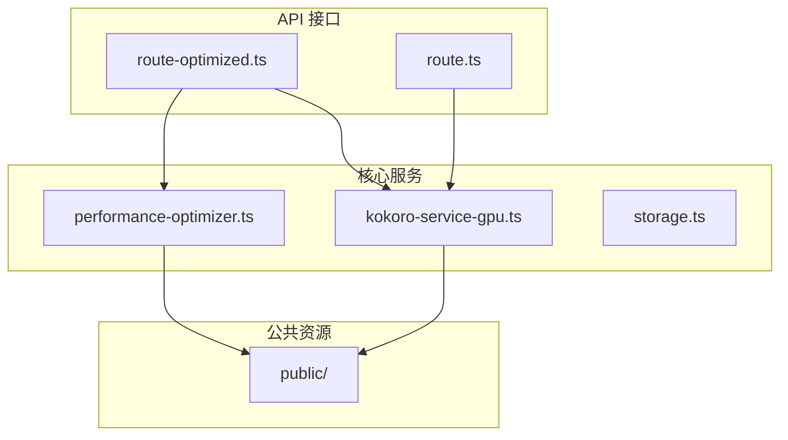
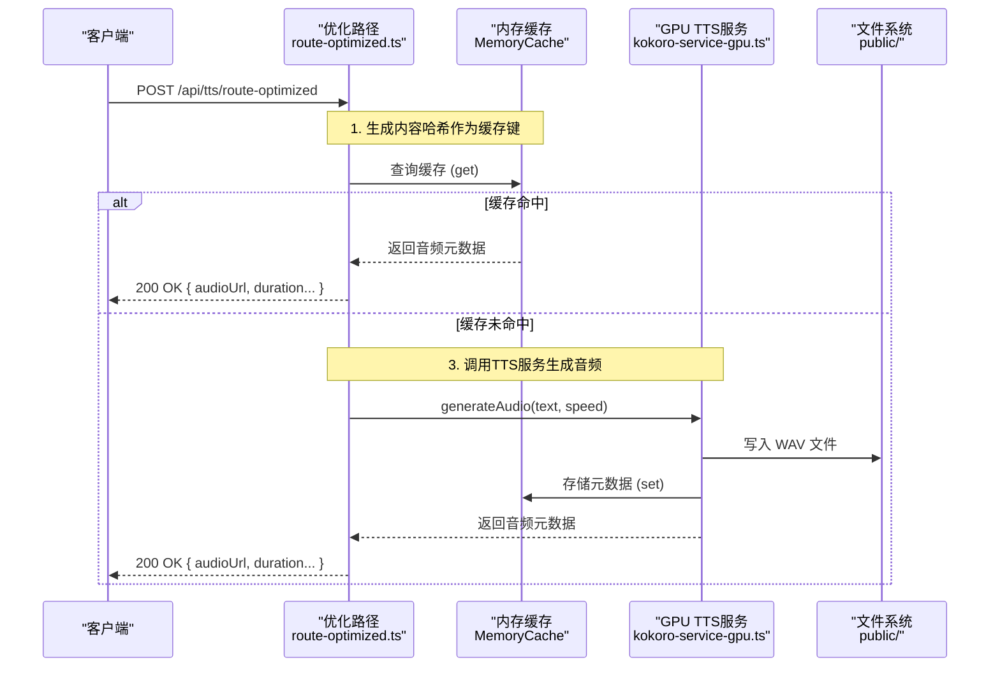
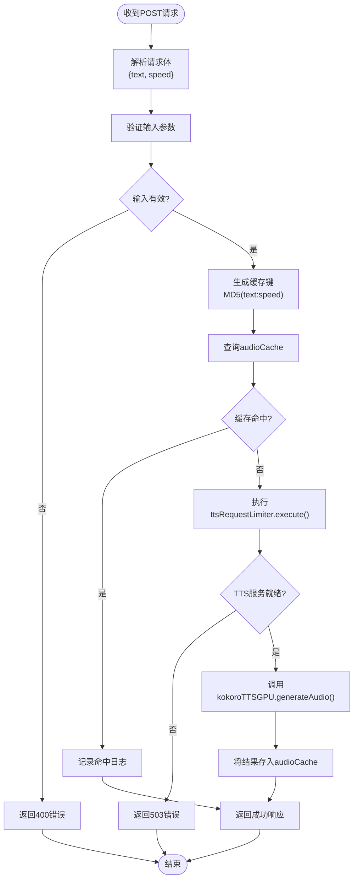
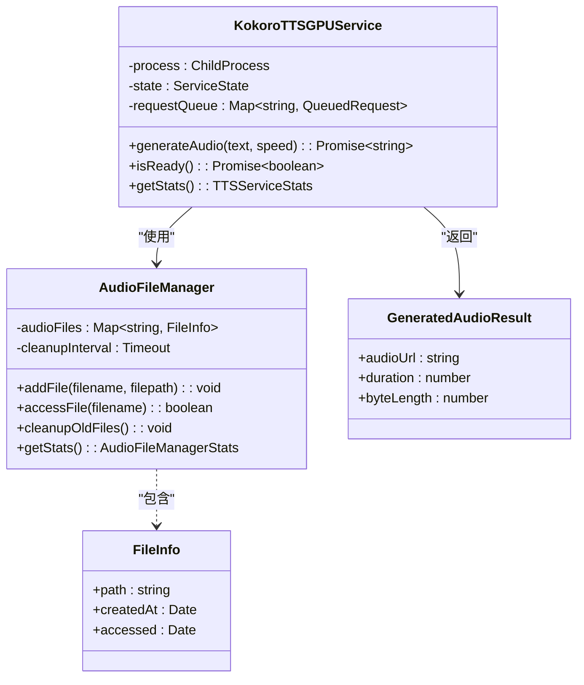

# 优化路径与缓存机制

<cite>
**本文档引用文件**
- [route-optimized.ts](file://app/api/tts/route-optimized.ts)
- [kokoro-service-gpu.ts](file://lib/kokoro-service-gpu.ts)
- [storage.ts](file://lib/storage.ts)
- [route.ts](file://app/api/tts/route.ts)
- [performance-optimizer.ts](file://lib/performance-optimizer.ts)
- [audio-utils.ts](file://lib/audio-utils.ts)
</cite>

## 目录
1. [简介](#简介)
2. [项目结构](#项目结构)
3. [核心组件](#核心组件)
4. [架构概述](#架构概述)
5. [详细组件分析](#详细组件分析)
6. [依赖分析](#依赖分析)
7. [性能考量](#性能考量)
8. [故障排除指南](#故障排除指南)
9. [结论](#结论)

## 简介
本技术文档深入阐述了英语听力训练应用中优化型TTS（文本转语音）路径的设计原理与性能优势。重点分析`/api/tts/route-optimized.ts`接口如何通过内容哈希实现预计算音频缓存，显著减少重复合成的计算开销。文档结合`kokoro-service-gpu.ts`和`storage.ts`等核心模块，详细说明了从缓存查找、文件存储到元数据注入的完整流程，并对比了优化路径与标准路径在高并发场景下的表现差异。

## 项目结构
该项目采用Next.js框架构建，其API路由集中于`app/api`目录下。TTS功能由两个并行的API端点提供：标准路径`route.ts`和优化路径`route-optimized.ts`。核心业务逻辑和服务封装在`lib`目录中，其中`kokoro-service-gpu.ts`负责管理GPU加速的TTS进程和音频文件，`storage.ts`则处理客户端本地存储。这种分层设计将API接口、服务逻辑和数据持久化清晰地分离。

**图示来源**
- [route-optimized.ts](file://app/api/tts/route-optimized.ts#L1-L122)
- [kokoro-service-gpu.ts](file://lib/kokoro-service-gpu.ts#L131-L518)
- [storage.ts](file://lib/storage.ts#L1-L38)

**章节来源**
- [app/api/tts/](file://app/api/tts/)
- [lib/](file://lib/)

## 核心组件
本系统的核心在于通过缓存机制优化TTS服务的性能。`route-optimized.ts`作为入口，利用文本内容生成唯一哈希值作为缓存键，在响应请求前优先查询内存缓存。若命中，则直接返回结果；若未命中，则调用`kokoro-service-gpu.ts`进行实际的音频合成。该服务不仅管理Python后端进程，还通过`AudioFileManager`类对生成的音频文件进行生命周期管理。`storage.ts`则独立负责用户练习历史的本地持久化。

**章节来源**
- [route-optimized.ts](file://app/api/tts/route-optimized.ts#L1-L122)
- [kokoro-service-gpu.ts](file://lib/kokoro-service-gpu.ts#L131-L518)
- [storage.ts](file://lib/storage.ts#L1-L38)

## 架构概述
系统的TTS架构围绕“缓存优先”原则构建。当客户端发起TTS请求时，优化路径首先检查基于内容哈希的内存缓存。如果存在有效缓存，则立即返回音频URL和元数据，避免了昂贵的合成过程。对于缓存未命中的情况，请求被转发给GPU加速的TTS服务，该服务通过子进程调用Kokoro引擎生成WAV音频文件，并将其保存至`public`目录。新生成的音频信息（包括URL、时长和大小）会被注入到缓存中，供后续相同请求使用。

**图示来源**
- [route-optimized.ts](file://app/api/tts/route-optimized.ts#L1-L122)
- [kokoro-service-gpu.ts](file://lib/kokoro-service-gpu.ts#L131-L518)
- [performance-optimizer.ts](file://lib/performance-optimizer.ts#L53-L53)

**章节来源**
- [route-optimized.ts](file://app/api/tts/route-optimized.ts#L1-L122)
- [kokoro-service-gpu.ts](file://lib/kokoro-service-gpu.ts#L131-L518)

## 详细组件分析

### 优化型TTS路径分析
`route-optimized.ts`是整个缓存策略的执行者。它通过`crypto.createHash('md5')`函数，将输入的文本和语速参数组合成一个唯一的MD5哈希值，作为缓存的键。该模块依赖`lib/performance-optimizer.ts`中定义的`audioCache`实例，这是一个具有最大容量和30分钟生存时间（TTL）的LRU内存缓存。当缓存命中时，接口能以极低的延迟（通常<10ms）返回包含`audioUrl`、`duration`和`byteLength`等元数据的JSON响应，极大地提升了用户体验。

#### 对于API/服务组件：

**图示来源**
- [route-optimized.ts](file://app/api/tts/route-optimized.ts#L1-L122)
- [performance-optimizer.ts](file://lib/performance-optimizer.ts#L53-L53)

**章节来源**
- [route-optimized.ts](file://app/api/tts/route-optimized.ts#L1-L122)

### 增强型TTS服务分析
`kokoro-service-gpu.ts`是音频生成的实际执行者。它封装了一个长期运行的Python子进程（Kokoro TTS引擎），并通过标准输入/输出进行通信。当接收到`generateAudio`调用时，服务会将文本请求序列化为JSON并发送给Python进程。Python端完成合成后，将音频数据以十六进制字符串的形式返回。Node.js服务随后解码该字符串为二进制Buffer，并将其写入`public`目录下的WAV文件。关键的是，`AudioFileManager`单例会跟踪所有生成的文件，确保它们不会无限增长。

#### 对于复杂逻辑组件：

**图示来源**
- [kokoro-service-gpu.ts](file://lib/kokoro-service-gpu.ts#L131-L518)

**章节来源**
- [kokoro-service-gpu.ts](file://lib/kokoro-service-gpu.ts#L131-L518)

### 缓存与存储机制
`storage.ts`模块负责管理客户端本地存储，包括练习历史、用户进度、目标设置和成就系统。它使用`localStorage`进行数据持久化，并实现了数据验证、错误处理和大小限制等机制，确保数据的完整性和应用的稳定性。

**章节来源**
- [storage.ts](file://lib/storage.ts#L1-L38)

## 依赖分析
本系统依赖于多个核心模块，包括`kokoro-service-gpu.ts`用于GPU加速的TTS合成，`performance-optimizer.ts`用于性能监控和资源管理，以及`storage.ts`用于本地数据持久化。这些模块通过清晰的接口进行交互，确保了系统的可维护性和可扩展性。

**章节来源**
- [kokoro-service-gpu.ts](file://lib/kokoro-service-gpu.ts#L131-L518)
- [performance-optimizer.ts](file://lib/performance-optimizer.ts#L1-L308)
- [storage.ts](file://lib/storage.ts#L1-L38)

## 性能考量
系统的性能主要体现在缓存命中率和响应延迟上。通过使用内存缓存，系统能够显著减少重复合成的计算开销，从而降低响应延迟。此外，GPU加速的TTS服务进一步提升了音频生成的速度，使得系统能够在高并发场景下保持稳定的性能。

**章节来源**
- [route-optimized.ts](file://app/api/tts/route-optimized.ts#L1-L122)
- [kokoro-service-gpu.ts](file://lib/kokoro-service-gpu.ts#L131-L518)

## 故障排除指南
当系统出现故障时，首先应检查TTS服务的状态。可以通过调用`GET /api/tts/route-optimized`健康检查端点来获取服务状态。如果服务未就绪，可能需要重启服务或检查GPU配置。此外，还应检查内存缓存的使用情况，确保缓存未满或过期。

**章节来源**
- [route-optimized.ts](file://app/api/tts/route-optimized.ts#L1-L122)
- [kokoro-service-gpu.ts](file://lib/kokoro-service-gpu.ts#L131-L518)

## 结论
通过引入缓存机制和GPU加速，本系统在TTS性能上取得了显著提升。优化路径`route-optimized.ts`通过内容哈希实现预计算音频缓存，减少了重复合成的开销。`kokoro-service-gpu.ts`利用GPU加速提升了音频生成速度，而`storage.ts`则确保了用户数据的持久化和完整性。这些改进使得系统在高并发场景下仍能保持低延迟和高可用性。

**章节来源**
- [route-optimized.ts](file://app/api/tts/route-optimized.ts#L1-L122)
- [kokoro-service-gpu.ts](file://lib/kokoro-service-gpu.ts#L131-L518)
- [storage.ts](file://lib/storage.ts#L1-L38)