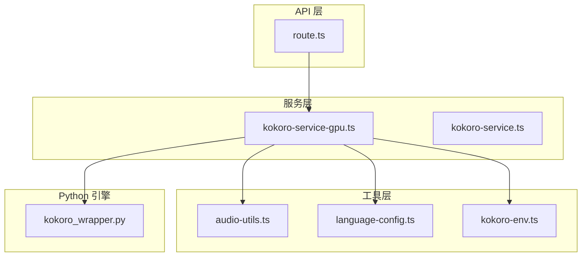
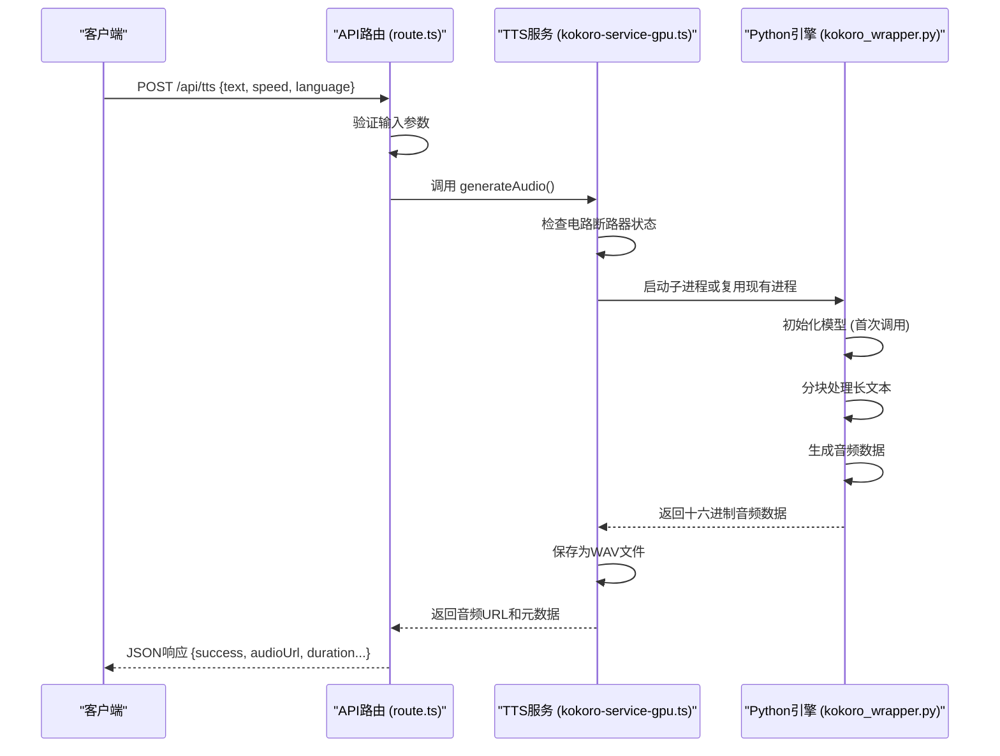
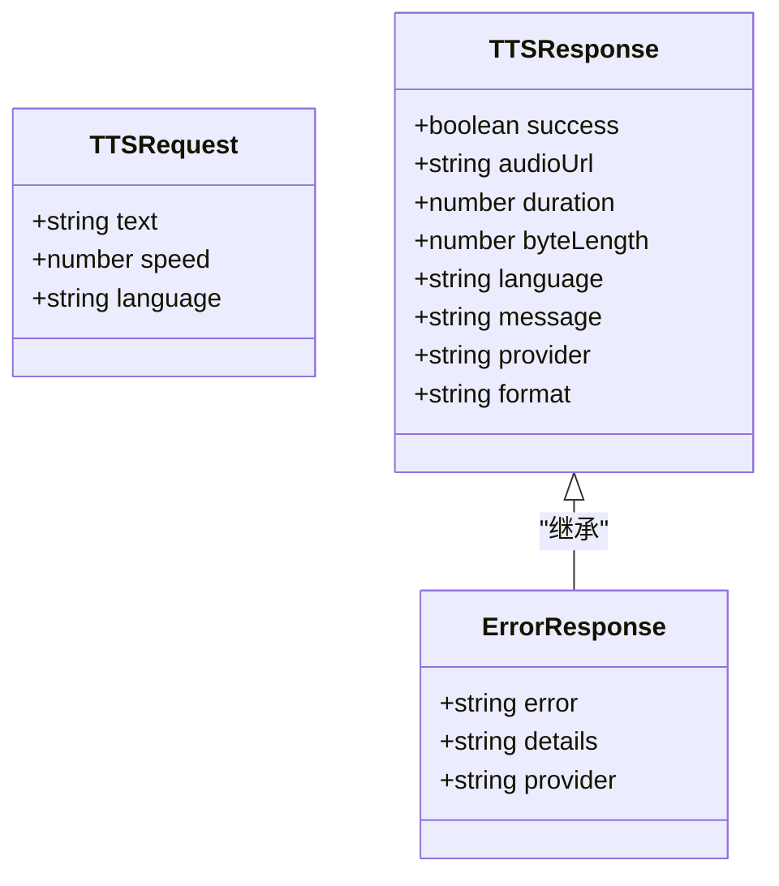
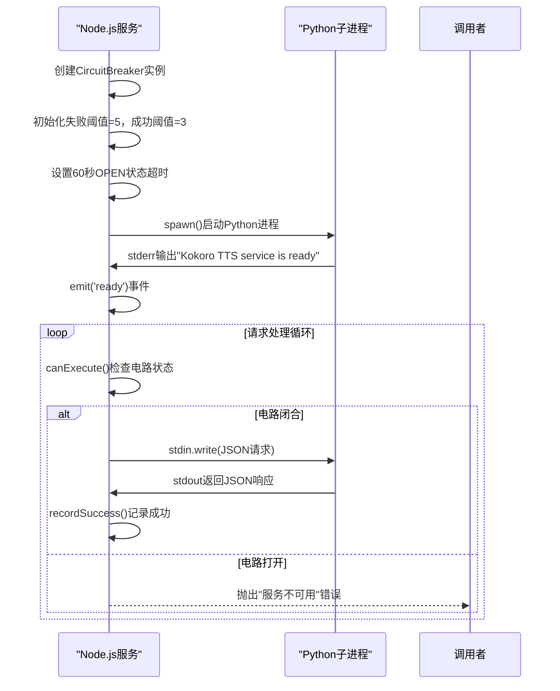
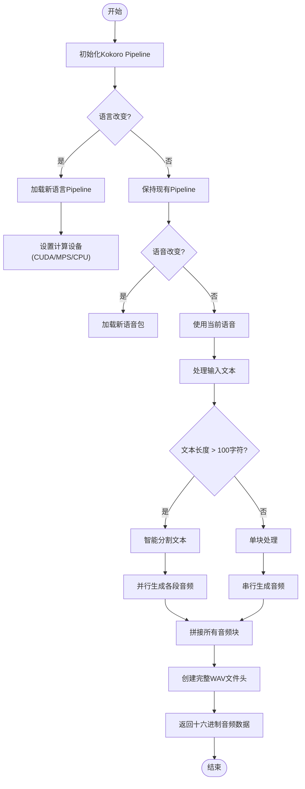
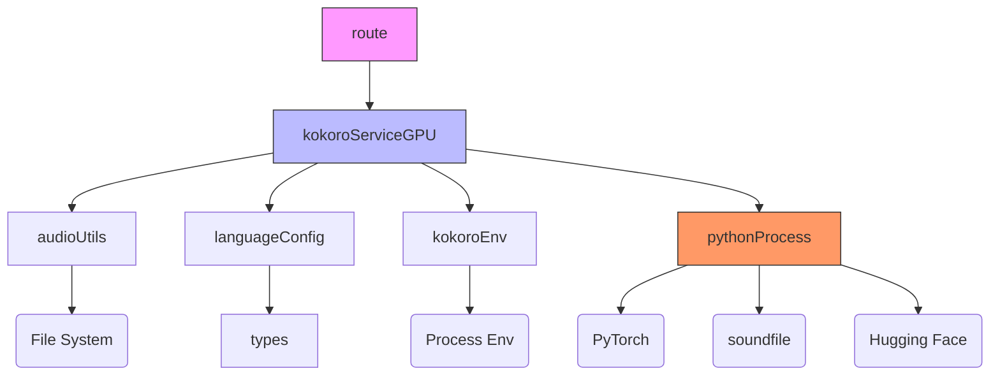

# 核心语音合成接口

<cite>
**本文档中引用的文件**   
- [route.ts](file://app/api/tts/route.ts)
- [kokoro-service-gpu.ts](file://lib/kokoro-service-gpu.ts)
- [kokoro_wrapper.py](file://kokoro-local/kokoro_wrapper.py)
- [language-config.ts](file://lib/language-config.ts)
- [audio-utils.ts](file://lib/audio-utils.ts)
- [kokoro-env.ts](file://lib/kokoro-env.ts)
</cite>

## 目录
1. [简介](#简介)
2. [项目结构](#项目结构)
3. [核心组件](#核心组件)
4. [架构概述](#架构概述)
5. [详细组件分析](#详细组件分析)
6. [依赖分析](#依赖分析)
7. [性能考虑](#性能考虑)
8. [故障排除指南](#故障排除指南)
9. [结论](#结论)

## 简介
本技术文档深入解析了英语听力训练应用中的核心语音合成（TTS）API实现。该系统通过 `/api/tts` 接口接收文本和语音参数，利用本地Kokoro TTS引擎生成高质量音频。文档重点阐述了Node.js后端与Python语音引擎之间的通信机制、服务容错设计以及在不同硬件环境下的优化策略。

## 项目结构
语音合成功能由多个协同工作的模块构成，主要分布在 `app/api/tts` 和 `lib` 目录下。`kokoro-local` 目录包含Python端的语音合成逻辑。

**Diagram sources**
- [app/api/tts/route.ts](file://app/api/tts/route.ts)
- [lib/kokoro-service-gpu.ts](file://lib/kokoro-service-gpu.ts)
- [kokoro-local/kokoro_wrapper.py](file://kokoro-local/kokoro_wrapper.py)
- [lib/audio-utils.ts](file://lib/audio-utils.ts)
- [lib/language-config.ts](file://lib/language-config.ts)
- [lib/kokoro-env.ts](file://lib/kokoro-env.ts)

**Section sources**
- [app/api/tts/route.ts](file://app/api/tts/route.ts)
- [lib/kokoro-service-gpu.ts](file://lib/kokoro-service-gpu.ts)
- [kokoro-local/kokoro_wrapper.py](file://kokoro-local/kokoro_wrapper.py)

## 核心组件
核心语音合成功能由三个主要部分组成：API路由处理、Node.js服务封装和Python语音引擎。`route.ts` 负责接收HTTP请求并进行初步验证；`kokoro-service-gpu.ts` 封装了与Python进程的复杂交互；`kokoro_wrapper.py` 实现了实际的语音合成逻辑。

**Section sources**
- [app/api/tts/route.ts](file://app/api/tts/route.ts#L1-L85)
- [lib/kokoro-service-gpu.ts](file://lib/kokoro-service-gpu.ts#L1-L533)
- [kokoro-local/kokoro_wrapper.py](file://kokoro-local/kokoro_wrapper.py#L1-L587)

## 架构概述
整个语音合成系统采用分层架构，实现了清晰的关注点分离。前端通过REST API发起请求，Node.js服务器作为中间层协调工作，最终调用Python编写的Kokoro TTS引擎完成语音生成任务。

**Diagram sources**
- [app/api/tts/route.ts](file://app/api/tts/route.ts#L1-L85)
- [lib/kokoro-service-gpu.ts](file://lib/kokoro-service-gpu.ts#L1-L533)
- [kokoro-local/kokoro_wrapper.py](file://kokoro-local/kokoro_wrapper.py#L1-L587)

## 详细组件分析
### API路由处理分析
`route.ts` 文件定义了 `/api/tts` 的POST端点，负责处理所有传入的语音合成请求。它首先解析JSON请求体，然后对文本内容和语言参数进行验证。

#### 对象导向组件：

**Diagram sources**
- [app/api/tts/route.ts](file://app/api/tts/route.ts#L1-L85)

**Section sources**
- [app/api/tts/route.ts](file://app/api/tts/route.ts#L1-L85)

### 服务封装逻辑分析
`kokoro-service-gpu.ts` 实现了高级别的服务封装，包括错误捕获、超时控制和电路断路器模式。该服务通过子进程与Python引擎通信，并管理整个生命周期。

#### API/服务组件：

**Diagram sources**
- [lib/kokoro-service-gpu.ts](file://lib/kokoro-service-gpu.ts#L1-L533)

**Section sources**
- [lib/kokoro-service-gpu.ts](file://lib/kokoro-service-gpu.ts#L1-L533)

### Python语音引擎分析
`kokoro_wrapper.py` 是语音合成的核心，它使用PyTorch和Hugging Face的Kokoro模型将文本转换为语音。该脚本能够智能地处理长文本，将其分割成适合模型处理的小块。

#### 复杂逻辑组件：

**Diagram sources**
- [kokoro-local/kokoro_wrapper.py](file://kokoro-local/kokoro_wrapper.py#L1-L587)

**Section sources**
- [kokoro-local/kokoro_wrapper.py](file://kokoro-local/kokoro_wrapper.py#L1-L587)

## 依赖分析
语音合成系统依赖于多个内部和外部组件，形成了复杂的依赖网络。这些依赖关系确保了系统的可扩展性和维护性。

**Diagram sources**
- [app/api/tts/route.ts](file://app/api/tts/route.ts)
- [lib/kokoro-service-gpu.ts](file://lib/kokoro-service-gpu.ts)
- [kokoro-local/kokoro_wrapper.py](file://kokoro-local/kokoro_wrapper.py)
- [lib/audio-utils.ts](file://lib/audio-utils.ts)
- [lib/language-config.ts](file://lib/language-config.ts)
- [lib/kokoro-env.ts](file://lib/kokoro-env.ts)

**Section sources**
- [app/api/tts/route.ts](file://app/api/tts/route.ts)
- [lib/kokoro-service-gpu.ts](file://lib/kokoro-service-gpu.ts)
- [kokoro-local/kokoro_wrapper.py](file://kokoro-local/kokoro_wrapper.py)

## 性能考虑
系统在设计时充分考虑了性能因素。对于长文本，Python端会将其智能分割并在多线程中并行处理，显著提高了生成速度。Node.js端通过电路断路器模式防止了因单个失败请求导致的服务雪崩。此外，系统支持CUDA和Metal硬件加速，能够在具备相应硬件的服务器上获得最佳性能表现。

## 故障排除指南
当遇到语音合成问题时，可以按照以下步骤进行排查：

**Section sources**
- [app/api/tts/route.ts](file://app/api/tts/route.ts#L50-L85)
- [lib/kokoro-service-gpu.ts](file://lib/kokoro-service-gpu.ts#L300-L350)
- [kokoro-local/kokoro_wrapper.py](file://kokoro-local/kokoro_wrapper.py#L100-L150)

### 常见故障场景及解决方案
| 故障现象 | 可能原因 | 解决方案 |
|--------|--------|--------|
| "GPU TTS服务未就绪" | Python环境缺失或初始化失败 | 检查服务器Python依赖是否安装完整 |
| "文本内容不能为空" | 客户端未提供有效文本 | 确保请求体包含非空的text字段 |
| "不支持的语言" | 使用了无效的语言代码 | 检查language参数是否在支持列表中 |
| "音频生成超时" | 文本过长或服务器负载过高 | 减少单次请求的文本长度 |
| "Kokoro模块不可用" | Kokoro相关模块未正确安装 | 运行setup-kokoro.sh脚本重新安装 |

## 结论
核心语音合成接口通过精心设计的分层架构和健壮的错误处理机制，为英语听力训练应用提供了稳定可靠的语音生成功能。系统不仅支持多种语言和语音风格，还针对不同硬件环境进行了优化。通过电路断路器、超时控制和自动重启等机制，确保了服务的高可用性。未来可以通过增加缓存机制进一步提升性能，减少重复文本的生成时间。