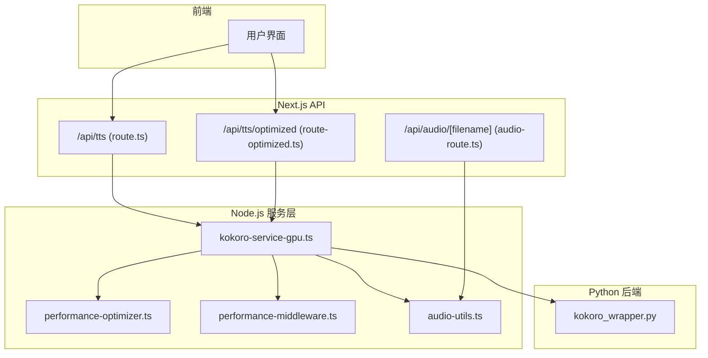
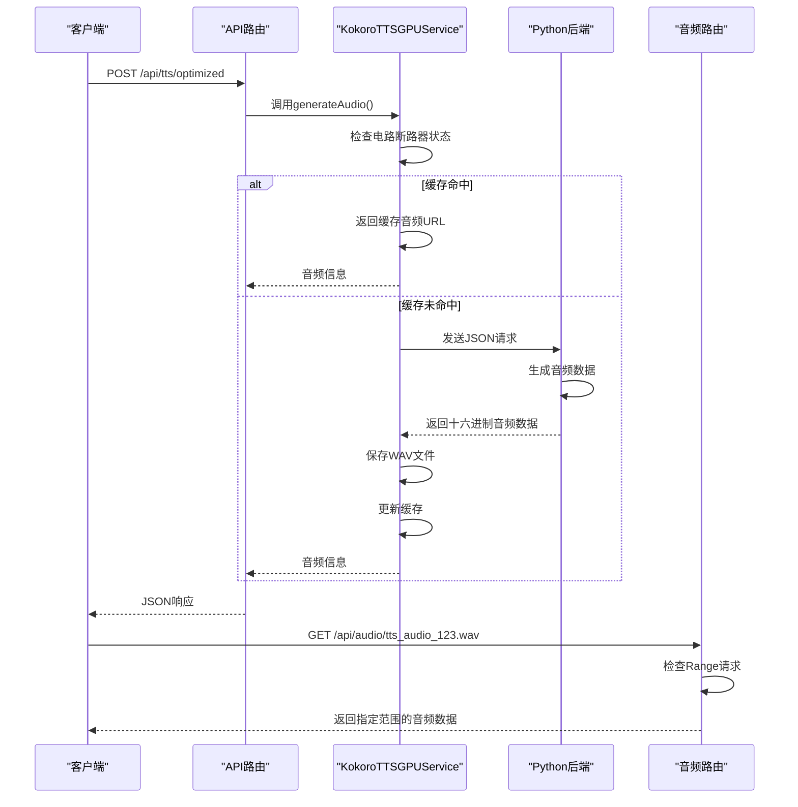
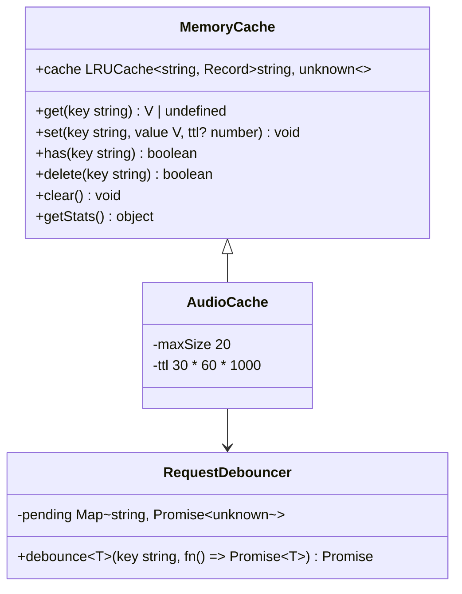
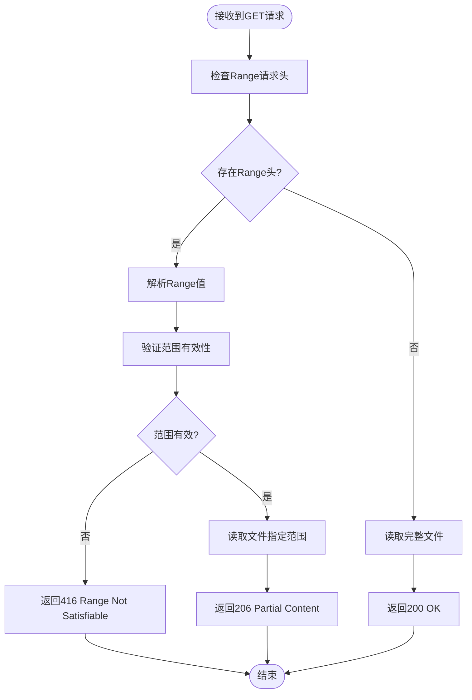

# 语音合成API

<cite>
**本文档引用的文件**   
- [route.ts](file://app/api/tts/route.ts)
- [route-optimized.ts](file://app/api/tts/route-optimized.ts)
- [kokoro-service-gpu.ts](file://lib/kokoro-service-gpu.ts)
- [kokoro_wrapper.py](file://kokoro_local/kokoro_wrapper.py)
- [performance-optimizer.ts](file://lib/performance-optimizer.ts)
- [audio-utils.ts](file://lib/audio-utils.ts)
- [performance-middleware.ts](file://lib/performance-middleware.ts)
- [app/api/audio/[filename]/route.ts](file://app/api/audio/[filename]/route.ts)
</cite>

## 更新摘要
**已做更改**   
- 新增了对音频文件HTTP Range请求的支持，以优化播放体验
- 更新了相关组件分析部分，包含新的音频流处理功能
- 增加了对音频断点续播功能的说明
- 更新了文档来源列表，包含新增的音频路由文件

## 目录
1. [简介](#简介)
2. [项目结构](#项目结构)
3. [核心组件](#核心组件)
4. [架构概述](#架构概述)
5. [详细组件分析](#详细组件分析)
6. [依赖关系分析](#依赖关系分析)
7. [性能考量](#性能考量)
8. [故障排除指南](#故障排除指南)
9. [结论](#结论)

## 简介
本技术文档详细介绍了英语听力训练应用中的TTS（文本转语音）服务。该系统提供两种实现路径：标准合成端点和优化路径端点，分别满足不同场景下的语音生成需求。文档涵盖API请求参数、响应格式、缓存机制、进程通信及错误处理策略等关键内容。新增了对音频文件HTTP Range请求的支持，实现了音频断点续播功能，提升了用户体验。

## 项目结构
TTS功能主要由API路由、Node.js服务层和Python后端三部分构成。API路由位于`app/api/tts/`目录下，包含`route.ts`和`route-optimized.ts`两个文件，分别对应GPU加速和CPU优化的TTS接口。服务逻辑分布在`lib/`目录中，其中`kokoro-service-gpu.ts`负责Node.js与Python进程的通信管理。Python后端实现位于`kokoro_local/`目录，通过`kokoro_wrapper.py`提供实际的语音合成功能。音频流服务由`app/api/audio/[filename]/route.ts`提供支持，实现了HTTP Range请求处理。

**图示来源**
- [route.ts](file://app/api/tts/route.ts#L1-L85)
- [route-optimized.ts](file://app/api/tts/route-optimized.ts#L1-L122)
- [kokoro-service-gpu.ts](file://lib/kokoro-service-gpu.ts#L1-L533)
- [kokoro_wrapper.py](file://kokoro_local/kokoro_wrapper.py#L1-L515)
- [app/api/audio/[filename]/route.ts](file://app/api/audio/[filename]/route.ts)

**章节来源**
- [app/api/tts/route.ts](file://app/api/tts/route.ts#L1-L85)
- [app/api/tts/route-optimized.ts](file://app/api/tts/route-optimized.ts#L1-L122)
- [lib/kokoro-service-gpu.ts](file://lib/kokoro-service-gpu.ts#L1-L533)
- [kokoro_local/kokoro_wrapper.py](file://kokoro_local/kokoro_wrapper.py#L1-L515)
- [app/api/audio/[filename]/route.ts](file://app/api/audio/[filename]/route.ts)

## 核心组件
TTS系统的核心组件包括两个API端点：标准合成端点(`/api/tts`)使用GPU加速进行实时语音生成，优化路径端点(`/api/tts/optimized`)则利用预计算缓存提升性能。两者均通过`kokoro-service-gpu.ts`中的`KokoroTTSGPUService`类与Python后端通信，并采用电路断路器模式进行故障保护。音频流服务通过`app/api/audio/[filename]/route.ts`提供HTTP Range请求支持，实现断点续播功能。

**章节来源**
- [route.ts](file://app/api/tts/route.ts#L1-L85)
- [route-optimized.ts](file://app/api/tts/route-optimized.ts#L1-L122)
- [kokoro-service-gpu.ts](file://lib/kokoro-service-gpu.ts#L1-L533)

## 架构概述
系统采用混合架构，结合了Node.js的高并发处理能力和Python在深度学习推理方面的优势。Node.js作为主服务进程，通过子进程方式启动并管理Python TTS服务。API请求首先经过性能优化中间件处理，然后转发给相应的TTS服务实例。对于重复性请求，系统优先从内存缓存中返回结果，避免不必要的计算开销。生成的音频文件通过专门的音频路由处理，支持HTTP Range请求，实现断点续播功能。

**图示来源**
- [route-optimized.ts](file://app/api/tts/route-optimized.ts#L1-L122)
- [kokoro-service-gpu.ts](file://lib/kokoro-service-gpu.ts#L1-L533)
- [kokoro_wrapper.py](file://kokoro_local/kokoro_wrapper.py#L1-L515)
- [app/api/audio/[filename]/route.ts](file://app/api/audio/[filename]/route.ts)

## 详细组件分析

### 标准合成端点分析
标准合成端点(`/api/tts`)专为GPU环境设计，提供低延迟的语音生成功能。它通过`kokoroTTSGPU`实例与Python后端通信，支持多种语言和音色配置。该端点适用于需要高质量、快速响应的实时应用场景。

#### 请求处理流程

**图示来源**
- [route.ts](file://app/api/tts/route.ts#L1-L85)
- [kokoro-service-gpu.ts](file://lib/kokoro-service-gpu.ts#L131-L518)

**章节来源**
- [route.ts](file://app/api/tts/route.ts#L1-L85)
- [kokoro-service-gpu.ts](file://lib/kokoro-service-gpu.ts#L131-L518)

### 优化路径端点分析
优化路径端点(`/api/tts/optimized`)采用缓存优先策略，显著提升了系统性能和资源利用率。当收到TTS请求时，系统首先检查是否存在匹配的缓存条目，若存在则直接返回缓存结果；否则才进行实际的语音生成过程。

#### 缓存机制实现

**图示来源**
- [route-optimized.ts](file://app/api/tts/route-optimized.ts#L1-L122)
- [performance-optimizer.ts](file://lib/performance-optimizer.ts)
- [performance-middleware.ts](file://lib/performance-middleware.ts#L181-L193)

**章节来源**
- [route-optimized.ts](file://app/api/tts/route-optimized.ts#L1-L122)
- [performance-optimizer.ts](file://lib/performance-optimizer.ts)
- [performance-middleware.ts](file://lib/performance-middleware.ts#L181-L193)

### 音频流服务分析
音频流服务通过`app/api/audio/[filename]/route.ts`实现，支持HTTP Range请求，允许客户端进行断点续播。该服务能够解析Range头信息，返回指定字节范围的音频数据，提升大文件播放体验。

#### Range请求处理流程

**章节来源**
- [app/api/audio/[filename]/route.ts](file://app/api/audio/[filename]/route.ts)
- [lib/audio-utils.ts](file://lib/audio-utils.ts)

## 依赖关系分析
TTS系统各组件之间存在明确的依赖关系。API路由依赖于`kokoro-service-gpu.ts`提供的服务实例，而`kokoro-service-gpu.ts`又依赖于`kokoro_wrapper.py`进行实际的语音合成。性能优化功能依赖于`performance-optimizer.ts`和`performance-middleware.ts`提供的缓存和防抖机制。音频流服务依赖于`audio-utils.ts`提供的音频格式检测和元数据解析功能。

## 性能考量
系统在性能方面进行了多层优化。首先，通过电路断路器模式防止级联故障，确保系统稳定性。其次，采用LRU缓存策略存储已生成的音频，避免重复计算。再者，通过请求防抖机制减少对后端服务的重复调用。最后，支持HTTP Range请求，减少网络传输开销，提升大音频文件的播放体验。`kokoro_wrapper.py`还实现了文本分块并行处理，充分利用多核CPU性能。

## 故障排除指南
当TTS服务出现问题时，可按以下步骤进行排查：
1. 检查`kokoro-service-gpu.ts`中的电路断路器状态
2. 查看Python后端日志，确认模型加载是否成功
3. 验证环境变量配置，特别是设备选择和代理设置
4. 检查缓存状态，确认是否因缓存问题导致重复生成
5. 查看音频路由日志，确认Range请求处理是否正常

## 结论
本TTS系统通过混合架构实现了高性能的语音合成功能。标准路径提供实时GPU加速合成，优化路径通过缓存机制提升效率。新增的HTTP Range请求支持进一步优化了音频播放体验。系统采用电路断路器、缓存、防抖等多种技术确保稳定性和性能，为英语听力训练应用提供了可靠的语音合成服务。