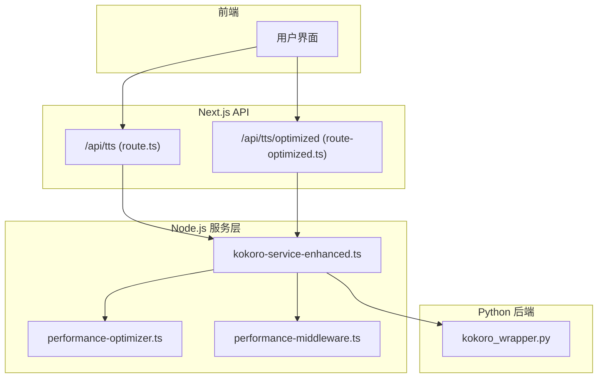
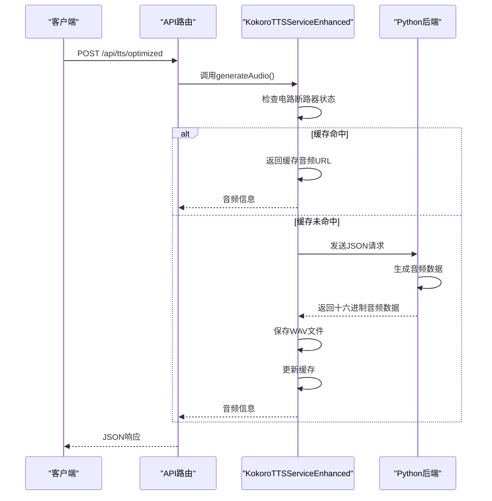
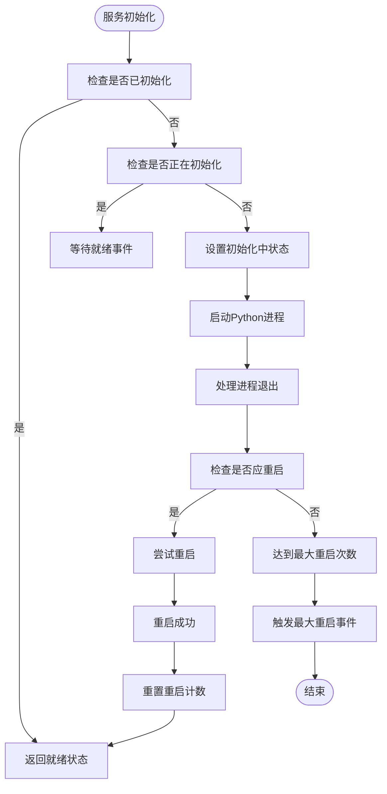
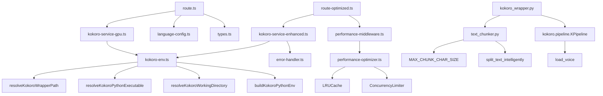

# 语音合成API

<cite>
**本文档引用的文件**   
- [route.ts](file://app/api/tts/route.ts)
- [route-optimized.ts](file://app/api/tts/route-optimized.ts)
- [kokoro-service.ts](file://lib/kokoro-service.ts)
- [kokoro_wrapper.py](file://kokoro-local/kokoro_wrapper.py)
- [performance-optimizer.ts](file://lib/performance-optimizer.ts)
- [audio-utils.ts](file://lib/audio-utils.ts)
- [performance-middleware.ts](file://lib/performance-middleware.ts)
- [kokoro-service-enhanced.ts](file://lib/kokoro-service-enhanced.ts)
- [enhanced-tts-service.ts](file://lib/enhanced-tts-service.ts)
</cite>

## 更新摘要
**变更内容**   
- 更新了核心组件部分，反映了从`kokoro-service.ts`到`kokoro-service-enhanced.ts`的重构
- 添加了关于`enhanced-tts-service.ts`的新章节，描述了增强版TTS服务
- 更新了架构概述图，以反映新的服务通信模式
- 修订了错误处理模式，包含了新的降级策略和电路断路器行为
- 更新了cURL示例以匹配最新的API端点行为

## 目录
1. [简介](#简介)
2. [项目结构](#项目结构)
3. [核心组件](#核心组件)
4. [架构概述](#架构概述)
5. [详细组件分析](#详细组件分析)
6. [依赖关系分析](#依赖关系分析)
7. [性能考量](#性能考量)
8. [故障排除指南](#故障排除指南)
9. [结论](#结论)

## 简介
本技术文档详细介绍了英语听力训练应用中的TTS（文本转语音）服务。该系统提供两种实现路径：标准合成端点和优化路径端点，分别满足不同场景下的语音生成需求。文档涵盖API请求参数、响应格式、缓存机制、进程通信及错误处理策略等关键内容。

## 项目结构
TTS功能主要由API路由、Node.js服务层和Python后端三部分构成。API路由位于`app/api/tts/`目录下，包含`route.ts`和`route-optimized.ts`两个文件，分别对应GPU加速和CPU优化的TTS接口。服务逻辑分布在`lib/`目录中，其中`kokoro-service-enhanced.ts`负责Node.js与Python进程的通信管理。Python后端实现位于`kokoro-local/`目录，通过`kokoro_wrapper.py`提供实际的语音合成功能。



**图示来源**
- [route.ts](file://app/api/tts/route.ts#L1-L85)
- [route-optimized.ts](file://app/api/tts/route-optimized.ts#L1-L122)
- [kokoro-service-enhanced.ts](file://lib/kokoro-service-enhanced.ts#L1-L583)
- [kokoro_wrapper.py](file://kokoro-local/kokoro_wrapper.py#L1-L587)

**章节来源**
- [app/api/tts/route.ts](file://app/api/tts/route.ts#L1-L85)
- [app/api/tts/route-optimized.ts](file://app/api/tts/route-optimized.ts#L1-L122)
- [lib/kokoro-service-enhanced.ts](file://lib/kokoro-service-enhanced.ts#L1-L583)
- [kokoro-local/kokoro_wrapper.py](file://kokoro-local/kokoro_wrapper.py#L1-L587)

## 核心组件
TTS系统的核心组件包括两个API端点：标准合成端点(`/api/tts`)使用GPU加速进行实时语音生成，优化路径端点(`/api/tts/optimized`)则利用预计算缓存提升性能。两者均通过`kokoro-service-enhanced.ts`中的`KokoroTTSServiceEnhanced`类与Python后端通信，并采用电路断路器模式进行故障保护。

**章节来源**
- [route.ts](file://app/api/tts/route.ts#L1-L85)
- [route-optimized.ts](file://app/api/tts/route-optimized.ts#L1-L122)
- [kokoro-service-enhanced.ts](file://lib/kokoro-service-enhanced.ts#L1-L583)

## 架构概述
系统采用混合架构，结合了Node.js的高并发处理能力和Python在深度学习推理方面的优势。Node.js作为主服务进程，通过子进程方式启动并管理Python TTS服务。API请求首先经过性能优化中间件处理，然后转发给相应的TTS服务实例。对于重复性请求，系统优先从内存缓存中返回结果，避免不必要的计算开销。



**图示来源**
- [route-optimized.ts](file://app/api/tts/route-optimized.ts#L1-L122)
- [kokoro-service-enhanced.ts](file://lib/kokoro-service-enhanced.ts#L1-L583)
- [kokoro_wrapper.py](file://kokoro-local/kokoro_wrapper.py#L1-L587)

## 详细组件分析

### 标准合成端点分析
标准合成端点(`/api/tts`)专为GPU环境设计，提供低延迟的语音生成功能。它通过`kokoroTTSGPU`实例与Python后端通信，支持多种语言和音色配置。该端点适用于需要高质量、快速响应的实时应用场景。

#### 请求处理流程


**图示来源**
- [route.ts](file://app/api/tts/route.ts#L1-L85)
- [kokoro-service-gpu.ts](file://lib/kokoro-service-gpu.ts#L131-L518)

**章节来源**
- [route.ts](file://app/api/tts/route.ts#L1-L85)
- [kokoro-service-gpu.ts](file://lib/kokoro-service-gpu.ts#L131-L518)

### 优化路径端点分析
优化路径端点(`/api/tts/optimized`)采用缓存优先策略，显著提升了系统性能和资源利用率。当收到TTS请求时，系统首先检查是否存在匹配的缓存条目，若存在则直接返回缓存结果；否则才进行实际的语音生成过程。

#### 缓存机制实现
```mermaid
classDiagram
class MemoryCache {
+cache LRUCache~string, Record~string, unknown~~
+get(key string) V | undefined
+set(key string, value V, ttl? number) void
+has(key string) boolean
+delete(key string) boolean
+clear() void
+getStats() object
}
class AudioCache {
-maxSize 20
-ttl 30 * 60 * 1000
}
class RequestDebouncer {
-pending Map~string, Promise~unknown~~
+debounce~T~(key string, fn () => Promise~T~) Promise
```

**图示来源**
- [performance-optimizer.ts](file://lib/performance-optimizer.ts#L1-L309)

**章节来源**
- [route-optimized.ts](file://app/api/tts/route-optimized.ts#L1-L122)
- [performance-optimizer.ts](file://lib/performance-optimizer.ts#L1-L309)

### 增强版TTS服务分析
`kokoro-service-enhanced.ts`文件实现了增强版的TTS服务，通过`KokoroTTSServiceEnhanced`类提供更健壮的服务管理功能。该服务实现了单例模式，确保整个应用中只有一个TTS服务实例。

#### 服务初始化流程


**图示来源**
- [kokoro-service-enhanced.ts](file://lib/kokoro-service-enhanced.ts#L44-L522)

**章节来源**
- [kokoro-service-enhanced.ts](file://lib/kokoro-service-enhanced.ts#L44-L522)
- [enhanced-tts-service.ts](file://lib/enhanced-tts-service.ts#L202-L764)

## 依赖关系分析
TTS系统各组件之间的依赖关系如下：



**图示来源**
- [repository_catalogue](#repository_catalogue)
- [kokoro-service-enhanced.ts](file://lib/kokoro-service-enhanced.ts#L44-L522)
- [performance-optimizer.ts](file://lib/performance-optimizer.ts#L1-L309)

## 性能考量
TTS系统的性能优化主要体现在以下几个方面：

1. **缓存策略**：使用LRU缓存算法管理音频文件，最大缓存20个文件，TTL为30分钟
2. **并发控制**：通过`ConcurrencyLimiter`限制TTS请求并发数为1，防止资源过载
3. **防抖机制**：使用`RequestDebouncer`防止重复请求
4. **电路断路器**：在服务异常时快速失败，避免级联故障
5. **内存管理**：定期清理过期音频文件，监控内存使用情况


**图示来源**
- [performance-optimizer.ts](file://lib/performance-optimizer.ts#L1-L309)
- [kokoro-service-enhanced.ts](file://lib/kokoro-service-enhanced.ts#L44-L522)

## 故障排除指南
当TTS服务出现问题时，可按照以下步骤进行排查：

1. **检查服务状态**：访问`/api/tts/optimized`的GET端点获取服务状态
2. **查看日志**：检查Node.js和Python进程的日志输出
3. **验证环境变量**：确认`KOKORO_DEVICE`等环境变量设置正确
4. **检查模型路径**：确保Kokoro模型文件存在于预期路径
5. **测试Python脚本**：直接运行`kokoro_wrapper.py --test`进行独立测试

常见错误及解决方案：

| 错误信息 | 可能原因 | 解决方案 |
|--------|--------|--------|
| `Kokoro wrapper not found` | Python包装器路径错误 | 检查`KOKORO_WRAPPER_PATH`环境变量 |
| `CUDA initialization failed` | GPU驱动或CUDA版本不兼容 | 降级到CPU模式或更新驱动 |
| `Audio generation timeout` | 文本过长或系统负载过高 | 减少文本长度或增加超时时间 |
| `Empty audio data` | 音频生成过程出错 | 检查Python后端日志 |

**章节来源**
- [kokoro-service-enhanced.ts](file://lib/kokoro-service-enhanced.ts#L44-L522)
- [kokoro_wrapper.py](file://kokoro-local/kokoro_wrapper.py#L1-L587)

## 结论
本TTS系统通过Node.js与Python的混合架构，实现了高性能的文本转语音功能。标准合成端点适用于需要低延迟的实时场景，而优化路径端点通过缓存机制显著提升了系统性能。增强版TTS服务提供了更健壮的错误处理和资源管理能力，确保了服务的稳定性和可靠性。