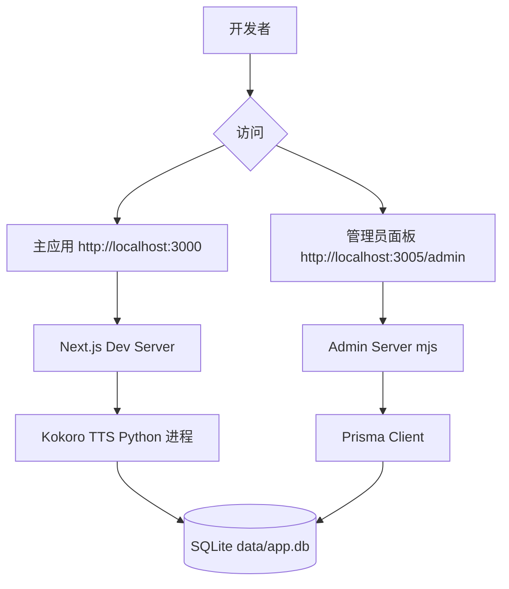

# 快速开始指南

<cite>
**本文档中引用的文件**
- [README.md](file://README.md)
- [scripts/setup-kokoro.sh](file://scripts/setup-kokoro.sh)
- [scripts/database-migration.ts](file://scripts/database-migration.ts)
- [lib/config-manager.ts](file://lib/config-manager.ts)
- [lib/kokoro-env.ts](file://lib/kokoro-env.ts)
- [lib/enhanced-tts-service.ts](file://lib/enhanced-tts-service.ts)
- [.env.example](file://.env.example)
</cite>

## 目录
1. [简介](#简介)
2. [开发环境准备](#开发环境准备)
3. [项目克隆与依赖安装](#项目克隆与依赖安装)
4. [环境变量配置](#环境变量配置)
5. [Kokoro TTS引擎初始化](#kokoro-tts引擎初始化)
6. [数据库设置与迁移](#数据库设置与迁移)
7. [启动开发服务器与访问应用](#启动开发服务器与访问应用)
8. [常见初始化问题解决方案](#常见初始化问题解决方案)

## 简介
本指南旨在帮助开发者快速搭建 `english-listening-trainer` 项目的本地开发环境。通过逐步说明，您将学会如何克隆仓库、安装必要的Node.js和Python依赖、配置环境变量、初始化TTS引擎、运行数据库并启动服务容器。最终，您将能够成功运行开发服务器，并访问主应用页面及管理员面板。

**Section sources**
- [README.md](file://README.md#L0-L103)

## 开发环境准备
在开始之前，请确保您的系统满足以下先决条件：
- **Node.js 18+**：建议使用最新稳定版本。
- **Python 3.8-3.12**：注意，Kokoro TTS不支持Python 3.13及以上版本。
- **操作系统**：推荐使用macOS（支持Apple Silicon）。
- **包管理器**：`npm`（可通过 `npm install -g npm` 全局安装）。

验证安装：
```bash
node --version
npm --version
python3 --version
```

**Section sources**
- [README.md](file://README.md#L20-L24)

## 项目克隆与依赖安装
1. **克隆项目仓库**：
   ```bash
   git clone https://github.com/your-repo/english-listening-trainer.git
   cd english-listening-trainer
   ```

2. **安装Node.js依赖**：
   ```bash
   npm install
   ```
   此命令将根据 `package.json` 安装所有前端和后端所需的JavaScript/TypeScript依赖。

**Section sources**
- [README.md](file://README.md#L27-L30)

## 环境变量配置
项目使用 `.env.local` 文件来管理环境变量。

1. **创建环境变量文件**：
   ```bash
   cp .env.example .env.local
   ```

2. **编辑 `.env.local` 文件**，至少需要配置以下关键变量：
   - `CEREBRAS_API_KEY`: 用于AI内容生成的API密钥。
   - `JWT_SECRET`: 用于生成安全JWT令牌的密钥，应设置为一个强随机字符串。
   - `DATABASE_URL`: 数据库连接字符串，默认指向SQLite数据库 `data/app.db`。

   更多配置项请参考 `CLAUDE.md` 或 `documents/CODEX.md` 文档。

**Section sources**
- [README.md](file://README.md#L32-L36)
- [.env.example](file://.env.example)

## Kokoro TTS引擎初始化
Kokoro是本项目使用的本地文本转语音（TTS）引擎。

1. **首次初始化**：
   ```bash
   npm run setup-kokoro
   ```
   该脚本会执行以下操作：
   - 在 `kokoro_local/` 目录下创建Python虚拟环境。
   - 安装PyTorch及相关Python依赖。
   - 复制所需的语音模型文件。

2. **高级配置**（可选）：
   您可以通过环境变量自定义安装过程，例如指定CUDA路径或PyTorch变体：
   ```bash
   KOKORO_TORCH_VARIANT=cuda KOKORO_CUDA_HOME=/usr/local/cuda-12.2 npm run setup-kokoro
   ```

   脚本会自动检测Python版本，并在必要时尝试切换到兼容版本（如python3.12）。

**Section sources**
- [README.md](file://README.md#L38-L49)
- [scripts/setup-kokoro.sh](file://scripts/setup-kokoro.sh#L0-L198)

## 数据库设置与迁移
项目使用Prisma ORM和SQLite作为默认数据库。

1. **运行数据库迁移**：
   ```bash
   npm exec ts-node scripts/database-migration.ts
   ```
   此脚本负责同步数据库模式，创建必要的表结构。

2. **数据库位置**：
   SQLite数据库文件位于 `data/app.db`。如果遇到数据库模式问题，可以删除此文件以重新初始化数据库。

**Section sources**
- [README.md](file://README.md#L51-L53)
- [scripts/database-migration.ts](file://scripts/database-migration.ts#L0-L41)

## 启动开发服务器与访问应用
完成以上步骤后，即可启动开发服务器。

1. **启动主应用**：
   ```bash
   npm run dev
   ```
   应用将在 `http://localhost:3000` 上可用。

2. **启动管理员面板**：
   ```bash
   npm run admin
   ```
   管理员面板将在 `http://localhost:3005/admin` 上可用。默认登录密码为 `admin123`。

3. **服务架构**：
   - 主应用使用Next.js框架，监听端口3000。
   - 管理员面板由独立的Node.js服务（`admin-server.mjs`）提供，监听端口3005。
   - Kokoro TTS服务作为后台Python进程运行，由 `lib/enhanced-tts-service.ts` 管理。



**Diagram sources**
- [README.md](file://README.md#L55-L60)
- [lib/enhanced-tts-service.ts](file://lib/enhanced-tts-service.ts#L196-L764)

**Section sources**
- [README.md](file://README.md#L55-L60)
- [admin-server.mjs](file://admin-server.mjs)

## 常见初始化问题解决方案
以下是新手在初始化过程中可能遇到的常见问题及其解决方法。

### 端口冲突
**问题**：`Error: listen EADDRINUSE: address already in use :::3000`
**解决方案**：
1. 查找占用端口的进程：
   ```bash
   lsof -i :3000
   ```
2. 终止该进程：
   ```bash
   kill -9 <PID>
   ```
3. 或修改 `next.config.mjs` 中的端口号。

### 依赖缺失
**问题**：Python模块导入错误或Node.js模块未找到。
**解决方案**：
- 确保已运行 `npm install` 和 `npm run setup-kokoro`。
- 检查Python版本是否在3.8-3.12范围内。
- 如果问题持续，尝试清除缓存并重新安装：
  ```bash
  rm -rf node_modules package-lock.json kokoro_local/venv
  npm install
  npm run setup-kokoro
  ```

### 权限错误
**问题**：在Linux/macOS上出现权限不足错误。
**解决方案**：
- 避免使用 `sudo` 运行 `npm` 命令。应修复npm的目录权限：
  ```bash
  sudo chown -R $(whoami) ~/.npm
  ```
- 确保项目目录有正确的读写权限。

### TTS引擎初始化失败
**问题**：Kokoro无法启动或找不到Python解释器。
**解决方案**：
1. 显式指定Python路径：
   ```bash
   KOKORO_PYTHON=python3.12 npm run setup-kokoro
   ```
2. 手动检查并重建虚拟环境：
   ```bash
   cd kokoro_local && rm -rf venv && python3.12 -m venv venv
   npm run setup-kokoro
   ```
3. 确认语音文件存在于 `kokoro_local/voices/` 目录下。

**Section sources**
- [README.md](file://README.md#L88-L97)
- [scripts/setup-kokoro.sh](file://scripts/setup-kokoro.sh#L0-L198)
- [lib/kokoro-env.ts](file://lib/kokoro-env.ts#L145-L211)